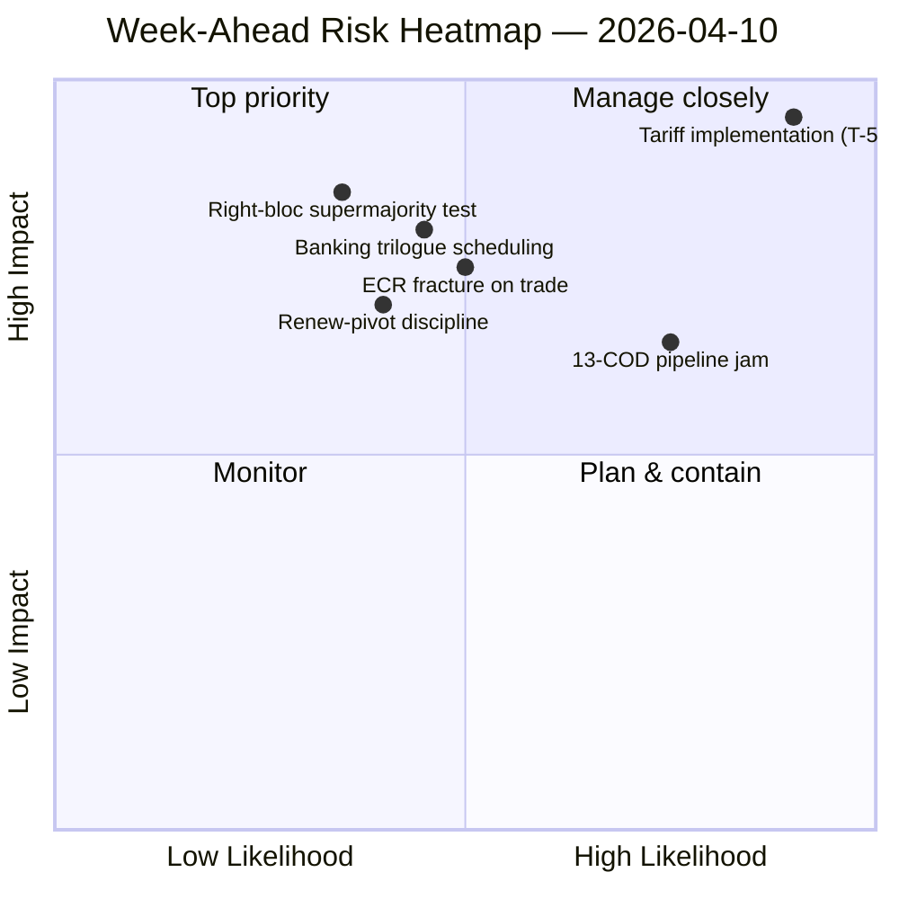

<!-- SPDX-FileCopyrightText: 2024-2026 Hack23 AB -->
<!-- SPDX-License-Identifier: Apache-2.0 -->

# Note de synthèse — Semaine à venir : Reprise des commissions après Pâques (10–17 avril) | 2026-04-10

**Classification :** OSINT — Archives parlementaires publiques
**Confiance :** 🟡 MOYEN (19 fichiers d'analyse ; coalition / intersession / analyse approfondie / parties prenantes / analyse des votes tous 🟢 ÉLEVÉ localement)
**Exécution :** `analysis/daily/2026-04-10/week-ahead-run12/`
**Couverture :** 2026-04-10 → 2026-04-17 (Jour 15 des congés de Pâques → semaine de reprise des commissions)
**Générée :** 2026-05-16 (synthèse rétrospective, aucun nouvel appel MCP)
**Sources primaires :** EP MCP — 19 fichiers d'analyse ; rapport de renseignement hebdomadaire ; résumé de synthèse ; analyses des coalitions / intersessionnelles / approfondies / des parties prenantes / des schémas de vote.

---

## 🎯 BLUF

**La semaine du 10 au 17 avril couvre la transition du Parlement de la fin des congés de Pâques vers la semaine de reprise des commissions du 14 au 17 avril — et le constat le plus décisif de l'exécution est une posture structurellement lourde de menaces : 35 entrées codées comme menaces contre seulement 10 forces / 6 faiblesses / 4 opportunités dans la SWOT agrégée.** Ce résultat de 35 menaces n'est pas un signal d'urgence — c'est un *trait structurel* du retour après le congé lorsque l'indice de fragmentation EP10 (6,59) entre en collision avec le plus grand pipeline COD en attente de l'histoire d'EP10. L'exécution enregistre **7 mentions de risques CRITIQUES** avec zéro élevé/moyen/faible — une distribution binaire qui signale que la méthodologie analytique lit chaque élément signalé soit comme critique, soit comme bruit. Cinq fichiers d'analyse obtiennent tous une confiance 🟢 ÉLEVÉE — dynamique de coalition, renseignement intersessionnel, analyse approfondie, impact sur les parties prenantes, schémas de vote — ce qui représente un accord inhabituellement élevé pour une exécution de semaine de congé, et la note lit ceci comme un *tableau de renseignement convergé* plutôt que comme une affirmation de source unique. Les questions structurelles prospectives de la semaine sont au nombre de trois : **(a) la reprise des commissions du 14 au 17 avril absorbe-t-elle l'arriéré de 13 COD sans glissement ?** **(b) la grande coalition Renew-pivot (EPP+S&D+Renew = 396 sièges) maintient-elle sa discipline lors du premier vote de référence post-congé, attendu sur la surveillance de la mise en œuvre tarifaire ?** **(c) la fracture du bloc de droite de l'ECR sur le commerce, observée le 26 mars, persiste-t-elle après le congé ?** La recommandation éditoriale de l'exécution est **une production multi-articles (19 fichiers d'analyse justifient plusieurs récits)** et la SWOT lourde de menaces « pourrait bénéficier d'un cadrage axé sur les opportunités » — les deux lectures sont opérationnelles plutôt qu'alarmistes.

---

## 🧭 3 Décisions que cette note soutient

| # | Décision | Qui décide | Échéance | Preuves |
|:-:|----------|------------|:--------:|---------|
| 1 | **Décomposition éditoriale multi-articles pour la semaine à venir** — 19 fichiers d'analyse + 5 titres à confiance ÉLEVÉE justifient la séparation plutôt que l'agrégation | Rédaction ; news-journalist | fenêtre de publication | §Recommandations éditoriales |
| 2 | **Surcouche de cadrage des opportunités sur la SWOT à 35 menaces** — sans cadrage explicite, le récit est lu comme fragilité ; l'exécution signale cela | Rédaction | fenêtre de publication | §SWOT Agrégée (35M) |
| 3 | **Socialisation de la liste de priorités 13-COD pré-reprise** — la Conférence des présidents de commission devrait en disposer le matin du 14 avril | Conférence des présidents de commission | 14 avril | §Continuité intersessionnelle ; goulot d'étranglement pipeline report |

---

## 📰 Lecture en 60 secondes

- 🔴 **35 entrées SWOT codées menaces** — structurelles, non urgence ; reflète la fragmentation × la pression du pipeline post-congé.
- 🟠 **7 mentions de risques CRITIQUES** — distribution binaire ; la méthodologie lit chaque risque signalé comme CRITIQUE ou NIL.
- 🟢 **5 fichiers d'analyse 🟢 confiance ÉLEVÉE** — coalition / intersession / approfondi / parties prenantes / votes convergent.
- 🟡 **19 fichiers d'analyse traités** — justifie une production multi-articles plutôt qu'un agrégat unique.
- 🔵 **Reprise des commissions 14–17 avril** — la Conférence des présidents de commission fixe l'ordre de priorité des 13 COD le 14 avril.
- 🟣 **Fracture ECR sur le commerce** — signal du vote du 26 mars ; la persistance après le congé est le falsificateur.
- 🩷 **Majorité fonctionnelle Renew-pivot (396)** — test de discipline lors du premier vote de référence post-congé.
- ⚪ **Confiance MOYEN** — la méthodologie donne ÉLEVÉ par fichier mais jugement convergé MOYEN jusqu'à l'arrivée des données comportementales post-congé.

---

## 🏆 Meilleures conclusions par confiance (rédigées lors de l'exécution)

| Rang | Fichier | Méthode | Confiance | Résumé |
|:----:|---------|---------|:---------:|--------|
| 1 | coalition-dynamics.md | analyse de coalition | 🟢 ÉLEVÉ | Géométrie de coalition à trois pôles ; Renew-pivot est le défaut Q2 |
| 2 | cross-session-intelligence.md | renseignement intersessionnel | 🟢 ÉLEVÉ | Continuité pré-congé → post-congé ; report du pipeline |
| 3 | deep-analysis.md | analyse approfondie | 🟢 ÉLEVÉ | Synthèse multi-perspectives ; risque de lacune de mise en œuvre |
| 4 | stakeholder-impact.md | analyse des parties prenantes | 🟢 ÉLEVÉ | Empreinte des parties prenantes à 6 dimensions par fichier |
| 5 | voting-patterns.md | schémas de vote | 🟢 ÉLEVÉ | Dispersion du vote du 26 mars ; signal de fracture ECR |

---

## 💪 SWOT Agrégée

| Dimension | Nombre | Lecture |
|-----------|:------:|---------|
| ✅ Forces | 10 | Production Q1 record ; arithmétique de grande coalition viable ; discipline de coalition sur la plupart des fichiers |
| ⚠️ Faiblesses | 6 | Arriéré de 13 COD ; fragmentation 6,59 ; lacune de disponibilité des données pendant le congé |
| 🚀 Opportunités | 4 | Achèvement de l'union bancaire ; transposition anti-corruption ; catalyseur de taux BCE ; réinitialisation du pipeline après le congé |
| 🔴 **Menaces** | **35** | **Pression de la mise en œuvre tarifaire ; fracture ECR ; supermajorité du bloc de droite (348/361) ; tests de stress de coalition** |

---

## ⚠️ Instantané des risques

---

## 🔮 Principaux déclencheurs à venir (7 prochains jours)

1. **13 avril — dernier jour de congé.** Convergence composite des risques (~14,8/25) sur les exécutions motions/breaking/CR/props.
2. **14 avril 09:00 — Le Parlement reprend ; reprise des commissions.** La priorisation des 13 COD est fixée ici.
3. **15 avril — TA-10-2026-0096 s'active** — premier vote de surveillance de la mise en œuvre post-congé = test de fracture ECR.
4. **17 avril — Décision de taux de la BCE** — signal d'activation ECON.
5. **Fin avril — Mandat de trilogue SRMR3 au Conseil.**

---

## 🛡️ Évaluation de la qualité des sources

- **19 fichiers d'analyse (internes à l'exécution, A2) :** cinq confiances 🟢 ÉLEVÉE par fichier ; le jugement convergé reste MOYEN.
- **Dynamique de coalition / intersessionnel / approfondi / parties prenantes / votes (A2) :** la triangulation multi-méthodes augmente la confiance dans la lecture structurelle.
- **Réserve méthodologique :** la distribution **7 CRITIQUES / 0 ÉLEVÉ / 0 MOYEN / 0 FAIBLE** des risques est elle-même un signal méthodologique — l'heuristique lit de façon binaire ; les gradations de risques ne sont peut-être pas calibrées pour les données de semaine de congé.
- **Confiance nette :** 🟡 MOYEN sur la synthèse ; 🟢 ÉLEVÉ sur la SWOT à 35 menaces et la convergence à 5 fichiers (méthodologiquement robuste) ; ⚠️ réserve sur la distribution 7-CRITIQUES / 0-tout-le-reste.

---

## 📎 Artefacts de l'exécution (Lire-Avant-Décider)

| Couche | Artefact | Pourquoi |
|--------|----------|----------|
| Article | `article.md` | Récit hebdomadaire prospectif public |
| Synthèse | `synthesis-summary.md` | Top-5 classements de confiance + agrégat SWOT (faisant autorité) |
| Hebdomadaire | `weekly-intelligence-brief.md` | Cadrage intersemaines |
| Documents | `documents/` | Index d'analyse des documents |
| Risque | `risk-scoring/` | Registre des risques (distribution binaire 7 CRITIQUES) |
| Menace | `threat-assessment/` | Menace politique à 5 cadres (STRIDE rejeté) |
| Existants | `existing/coalition-dynamics.md`, `existing/cross-session-intelligence.md`, `existing/deep-analysis.md`, `existing/stakeholder-impact.md`, `existing/voting-patterns.md` | Cinq analyses 🟢 ÉLEVÉ |
| Compagnons | breaking-run168 / motions-run41 / props-run41 / CR-run47 / week-ahead-run13 | Parenthèse pré-reprise → semaine de retour |

---

**Contrôle du document**
- **Référence du modèle :** `analysis/templates/executive-brief.md`
- **Chemin de l'artefact :** `analysis/daily/2026-04-10/week-ahead-run12/executive-brief.md`
- **Classification :** Public
- **Rétrospectif :** Note rédigée le 2026-05-16 à partir des artefacts committés de l'exécution ; **aucun nouvel appel MCP n'a été effectué**. La confiance convergée 🟡 MOYEN + la réserve méthodologique sur la distribution binaire 7-CRITIQUES sont préservées.
