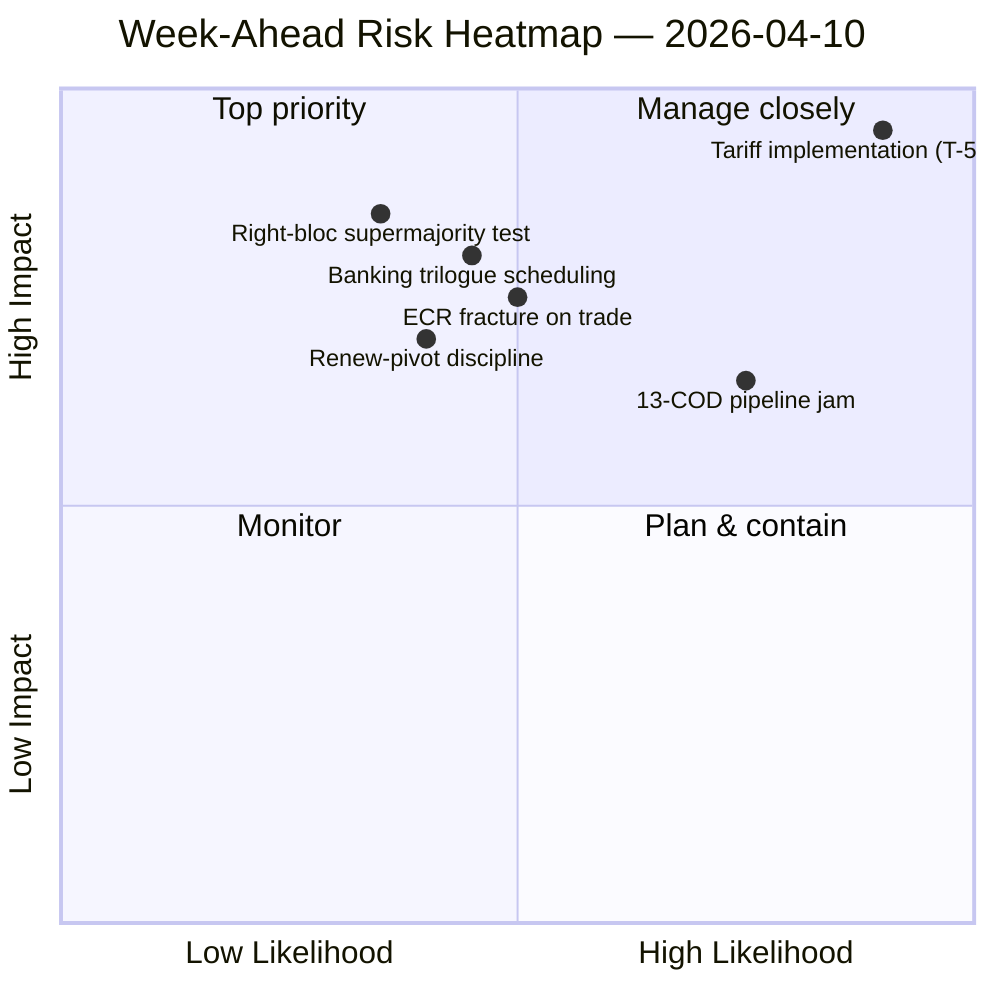

<!-- SPDX-FileCopyrightText: 2024-2026 Hack23 AB -->
<!-- SPDX-License-Identifier: Apache-2.0 -->

# תקציר מנהלים — השבוע הקרוב: חידוש ועדות לאחר חג הפסחא (10–17 באפריל) | 2026-04-10

**סיווג:** OSINT — רשומה פרלמנטרית ציבורית
**רמת אמינות:** 🟡 בינוני (19 קבצי ניתוח; קואליציה / בין-מושבית / ניתוח מעמיק / בעלי עניין / דפוסי הצבעה — כולם 🟢 גבוהה מקומית)
**הרצה:** `analysis/daily/2026-04-10/week-ahead-run12/`
**כיסוי:** 2026-04-10 → 2026-04-17 (יום 15 של חופשת הפסחא → שבוע חידוש הוועדות)
**נוצר:** 2026-05-16 (תקציר רטרוספקטיבי, ללא קריאות MCP חדשות)
**מקורות ראשוניים:** EP MCP — 19 קבצי ניתוח; דו"ח מודיעין שבועי; סיכום תרכובתי; ניתוחי קואליציות / בין-מושבי / מעמיק / בעלי עניין / דפוסי הצבעה.

---

## 🎯 תמצית מנהלים

**השבוע 10–17 באפריל מכסה את המעבר של הפרלמנט מסיום חופשת הפסחא לשבוע חידוש הוועדות 14–17 באפריל — והממצא המכריע ביותר של ההרצה הוא עמדה עמוסה-איומים מבנית: 35 ערכים מקודדים כאיומים לעומת 10 חוזקות בלבד / 6 חולשות / 4 הזדמנויות ב-SWOT המצטבר.** תוצאת 35 האיומים אינה אות חירום — היא *מאפיין מבני* של חזרה אחרי חופשה כאשר מדד הפיצול של EP10 (6.59) מתנגש עם צינור COD הממתין הגדול ביותר בהיסטוריה של EP10. ההרצה מתעדת **7 אזכורי סיכון קריטיים** עם אפס גבוה/בינוני/נמוך — התפלגות בינארית המצביעה על כך שהמתודולוגיה האנליטית קוראת כל פריט מסומן כקריטי או כרעש. חמישה קבצי ניתוח מקבלים כולם אמינות 🟢 גבוהה — דינמיקת קואליציה, מודיעין בין-מושבי, ניתוח מעמיק, השפעת בעלי עניין, דפוסי הצבעה — מה שמהווה הסכמה גבוהה בצורה יוצאת דופן להרצה של שבוע חופשה, והתקציר קורא זאת כ*תמונת מודיעין מתכנסת* ולא כטענת מקור יחיד. השאלות המבניות הפרוספקטיביות של השבוע הן שלוש: **(א) האם חידוש הוועדות 14–17 באפריל סופג את הפיגור של 13 COD ללא החלקה?** **(ב) האם הקואליציה הגדולה של ציר Renew (EPP+S&D+Renew = 396 מושבים) שומרת על משמעת בהצבעת הייחוס הראשונה לאחר החופשה, המצופה על ניטור יישום מכסים?** **(ג) האם שבירת גוש הימין של ECR בסחר, שנצפתה ב-26 במרץ, נמשכת לאחר החופשה?** ההמלצה העריכתית של ההרצה היא **הפקה רב-מאמרית (19 קבצי ניתוח מצדיקים נרטיבים מרובים)** וה-SWOT העמוס-איומים "עשוי להרוויח מניסוח מסגרת ההזדמנויות" — שתי הקריאות הן תפעוליות ולא מאיימות.

---

## 🧭 3 החלטות שתקציר זה תומך בהן

| # | החלטה | מי מחליט | מועד אחרון | ראיות |
|:-:|-------|---------|:---------:|-------|
| 1 | **פירוק עריכה רב-מאמרי לשבוע הקרוב** — 19 קבצי ניתוח + 5 כותרות בעלות אמינות גבוהה מצדיקות הפרדה במקום צבירה | מערכת החדשות; news-journalist | חלון פרסום | §המלצות עריכה |
| 2 | **שכבת מסגרת הזדמנויות על ה-SWOT עם 35 האיומים** — ללא מסגרת מפורשת הנרטיב נקרא כשבריריות; ההרצה מאותתת על כך | מערכת החדשות | חלון פרסום | §SWOT מצטבר (35T) |
| 3 | **סוציאליזציה של רשימת עדיפויות 13 COD לפני חידוש** — ועידת יושבי-ראש הוועדות צריכה לקבל אותה בבוקר 14 באפריל | ועידת יושבי-ראש הוועדות | 14 באפריל | §המשכיות בין-מושבית; פקק צינור מועבר |

---

## 📰 קריאת 60 שניות

- 🔴 **35 ערכי SWOT מקודדים כאיומים** — מבני, לא חירום; משקף פיצול × לחץ צינור לאחר החופשה.
- 🟠 **7 אזכורי סיכון קריטיים** — התפלגות בינארית; מתודולוגיה קוראת כל סיכון מסומן כקריטי או אפס.
- 🟢 **5 קבצי ניתוח 🟢 אמינות גבוהה** — קואליציה / בין-מושבי / מעמיק / בעלי עניין / הצבעות מתכנסים.
- 🟡 **19 קבצי ניתוח עובדו** — מצדיק הפקה רב-מאמרית במקום צבירה יחידה.
- 🔵 **חידוש ועדות 14–17 באפריל** — ועידת יושבי-ראש הוועדות קובעת סדר עדיפויות 13 COD ב-14 באפריל.
- 🟣 **שבירת ECR בסחר** — אות הצבעה מ-26 במרץ; המשכיות לאחר החופשה היא המפריך.
- 🩷 **רוב עובד ציר Renew (396)** — מבחן משמעת בהצבעת הייחוס הראשונה לאחר החופשה.
- ⚪ **אמינות בינונית** — המתודולוגיה נותנת גבוהה לכל קובץ אבל שיפוט מתכנס בינוני עד שנתוני התנהגות לאחר החופשה יגיעו.

---

## 🏆 ממצאים מובילים לפי אמינות (נכתבו בהרצה)

| דירוג | קובץ | שיטה | אמינות | סיכום |
|:-----:|------|------|:------:|-------|
| 1 | coalition-dynamics.md | ניתוח קואליציה | 🟢 גבוהה | גיאומטריית קואליציה תלת-קוטבית; ציר Renew הוא ברירת המחדל של Q2 |
| 2 | cross-session-intelligence.md | מודיעין בין-מושבי | 🟢 גבוהה | המשכיות לפני-חופשה → לאחר-חופשה; העברת צינור |
| 3 | deep-analysis.md | ניתוח מעמיק | 🟢 גבוהה | סינתזה רב-פרספקטיבית; סיכון פער יישום |
| 4 | stakeholder-impact.md | ניתוח בעלי עניין | 🟢 גבוהה | טביעת רגל בעלי עניין 6-ממדית לכל קובץ |
| 5 | voting-patterns.md | דפוסי הצבעה | 🟢 גבוהה | פיזור הצבעה 26 במרץ; אות שבירת ECR |

---

## 💪 SWOT מצטבר

| מימד | ספירה | קריאה |
|------|:-----:|-------|
| ✅ חוזקות | 10 | תפוקת Q1 שיא; חשבון קואליציה גדולה בת-קיימא; משמעת קואליציה ברוב הקבצים |
| ⚠️ חולשות | 6 | פיגור 13 COD; פיצול 6.59; פער זמינות נתונים בחופשה |
| 🚀 הזדמנויות | 4 | השלמת האיחוד הבנקאי; השתלת מאבק שחיתות; זרז שיעורי ה-ECB; אתחול מחדש של הצינור לאחר החופשה |
| 🔴 **איומים** | **35** | **לחץ יישום מכסים; שבירת ECR; רוב מוחלט גוש ימין (348/361); מבחני לחץ קואליציה** |

---

## ⚠️ תמונת מצב סיכונים

---

## 🔮 טריגרים עתידיים מובילים (7 הימים הקרובים)

1. **13 באפריל — יום חופשה אחרון.** התכנסות סיכון מורכבת (~14.8/25) על פני הרצות motions/breaking/CR/props.
2. **14 באפריל 09:00 — הפרלמנט חוזר; חידוש ועדות.** תעדוף 13 COD נקבע כאן.
3. **15 באפריל — TA-10-2026-0096 מופעל** — הצבעת ניטור יישום ראשונה לאחר החופשה = מבחן שבירת ECR.
4. **17 באפריל — החלטת ריבית ECB** — אות הפעלת ECON.
5. **סוף אפריל — מנדט משא ומתן של מועצת SRMR3.**

---

## 🛡️ הערכת איכות מקורות

- **19 קבצי ניתוח (פנימי להרצה, A2):** חמש אמינויות 🟢 גבוהה לכל קובץ; השיפוט המתכנס נשאר בינוני.
- **דינמיקת קואליציה / בין-מושבי / מעמיק / בעלי עניין / הצבעות (A2):** משולש רב-שיטתי מגדיל את האמון בקריאה המבנית.
- **הסתייגות מתודולוגית:** ההתפלגות **7 קריטי / 0 גבוה / 0 בינוני / 0 נמוך** של הסיכונים היא עצמה אות מתודולוגי — ה-heuristic קורא בינארי; הדרגות הסיכון עשויות לא להיות מכוילות לנתוני שבוע חופשה.
- **אמינות נטו:** 🟡 בינוני בסינתזה; 🟢 גבוה ב-SWOT 35 האיומים והתכנסות 5 הקבצים (חזקה מתודולוגית); ⚠️ הסתייגות על התפלגות 7-קריטי / 0-הכל-האחר.

---

## 📎 תוצרי ההרצה (קרא-לפני-החלטה)

| שכבה | תוצר | מדוע |
|------|------|------|
| מאמר | `article.md` | נרטיב שבועי פרוספקטיבי ציבורי |
| סינתזה | `synthesis-summary.md` | דירוגי אמינות טופ-5 + SWOT מצטבר (סמכותי) |
| שבועי | `weekly-intelligence-brief.md` | מסגרת בין-שבועות |
| מסמכים | `documents/` | אינדקס ניתוח מסמכים |
| סיכון | `risk-scoring/` | רשימון סיכונים (7 קריטי התפלגות בינארית) |
| איום | `threat-assessment/` | איום פוליטי 5-מסגרות (STRIDE נדחה) |
| קיימים | `existing/coalition-dynamics.md`، `existing/cross-session-intelligence.md`، `existing/deep-analysis.md`، `existing/stakeholder-impact.md`، `existing/voting-patterns.md` | חמישה ניתוחים 🟢 גבוהה |
| מלווים | breaking-run168 / motions-run41 / props-run41 / CR-run47 / week-ahead-run13 | סוגריים לפני-חידוש → שבוע חזרה |

---

**בקרת מסמך**
- **הפניה לתבנית:** `analysis/templates/executive-brief.md`
- **נתיב תוצר:** `analysis/daily/2026-04-10/week-ahead-run12/executive-brief.md`
- **סיווג:** ציבורי
- **רטרוספקטיבי:** תקציר נכתב ב-2026-05-16 מתוצרי ההרצה המחויבים; **לא בוצעו קריאות MCP חדשות**. האמינות המתכנסת 🟡 בינונית + ההסתייגות המתודולוגית על ההתפלגות הבינארית של 7-קריטי נשמרות.
