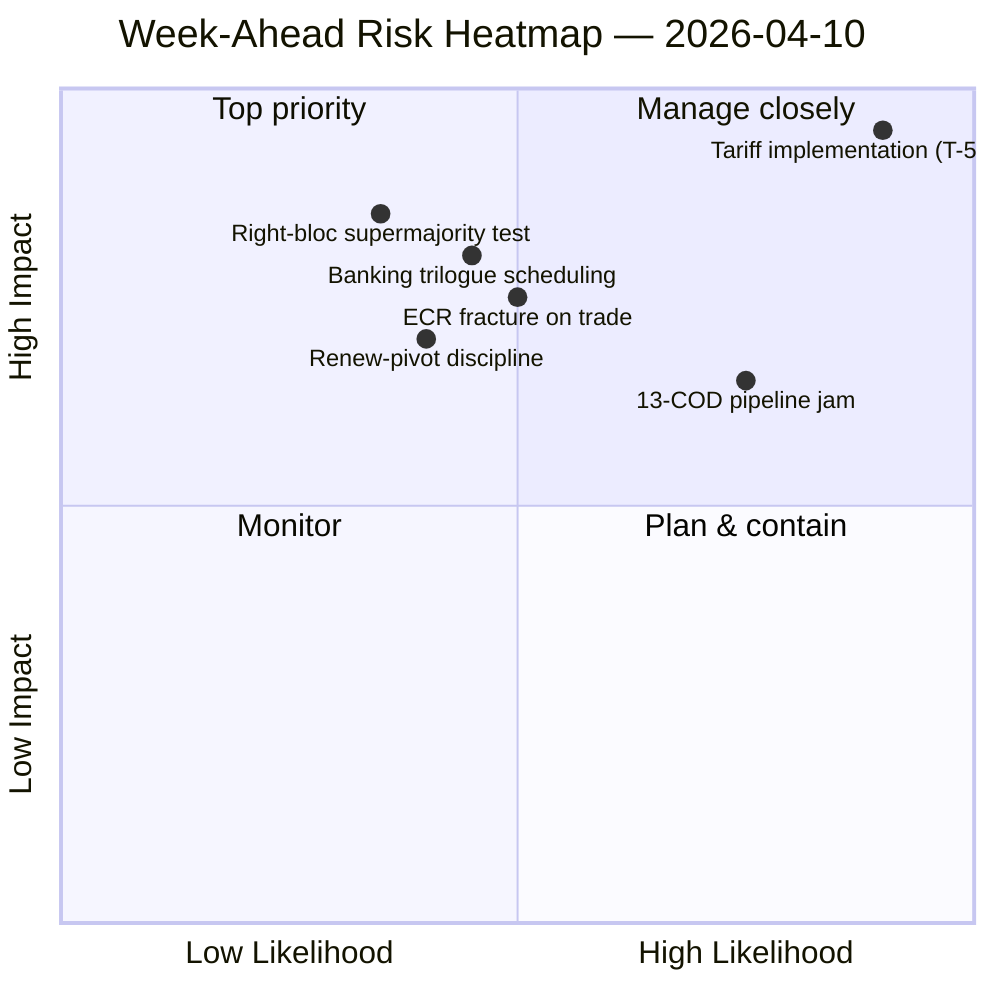

<!-- SPDX-FileCopyrightText: 2024-2026 Hack23 AB -->
<!-- SPDX-License-Identifier: Apache-2.0 -->

# エグゼクティブ・ブリーフ — 週間展望：復活祭後の委員会再起動（4月10〜17日）| 2026-04-10

**分類：** OSINT — 公開議会記録
**信頼度：** 🟡 中程度（分析ファイル19件；連立／会期間情報／詳細分析／利害関係者／投票パターンはいずれも 🟢 高 ローカル）
**実行：** `analysis/daily/2026-04-10/week-ahead-run12/`
**カバレッジ：** 2026-04-10 → 2026-04-17（復活祭休暇15日目 → 委員会再起動週）
**作成日：** 2026-05-16（遡及ブリーフ、新規MCP呼び出しなし）
**一次情報源：** EP MCP — 分析ファイル19件；週次情報ブリーフ；総合要約；連立／会期間／詳細／利害関係者／投票パターン分析。

---

## 🎯 BLUF（結論要旨）

**4月10〜17日は、欧州議会の復活祭休暇終了から4月14〜17日の委員会再起動週への移行期を扱う。今回の実行で最も決定的な知見は、構造的な脅威過多の姿勢である：35件の脅威コード化エントリーに対し、強みは10件、弱みは6件、機会は4件という集計SWOTの構成。** 35の脅威という結果は緊急シグナルではない——EP10の断片化指数（6.59）がEP10史上最大の未解決CODパイプラインと衝突する休暇明け復帰の*構造的特徴*である。本実行は**7件の重大リスク言及**を記録しており、高・中・低は一切ない——分析的手法がマークされた各要素を重大またはノイズとして読むことを示す二項分布である。5つの分析ファイルはすべて 🟢 高信頼度を獲得——連立ダイナミクス、会期間情報、詳細分析、利害関係者インパクト、投票パターン——これは休暇週実行としては異例の高い一致度であり、ブリーフはこれを単一ソースの主張ではなく*収束した情報像*として読む。今週の将来的な構造的問題は3つ：**(a) 4月14〜17日の委員会再起動は13 CODの滞留を遅延なく解消できるか？** **(b) Renewピボット大連立（EPP+S&D+Renew＝396議席）は休暇後最初の旗標投票——関税実施監視が見込まれる——で規律を維持できるか？** **(c) 3月26日に観察されたECR右派ブロックの貿易分裂は休暇後も継続するか？** 実行の編集上の推奨は**マルチ記事制作（19分析ファイルは複数のナラティブを正当化する）**であり、脅威過多のSWOTは「機会フレーミングの恩恵を受ける可能性がある」——いずれの解釈も警戒的ではなく運用的である。

---

## 🧭 このブリーフが支援する3つの意思決定

| # | 意思決定 | 決定者 | 期限 | 根拠 |
|:-:|---------|--------|:----:|------|
| 1 | **週間展望のマルチ記事編集分解** — 分析ファイル19件＋高信頼度見出し5件は集約より分離を正当化 | ニュースルーム；news-journalist | 公開ウィンドウ | §編集上の推奨 |
| 2 | **35脅威SWOTへの機会フレーミング上書き** — 明示的フレーミングなしにはナラティブが脆弱性として読まれる；実行がこれを示す | 編集部 | 公開ウィンドウ | §集計SWOT（35T） |
| 3 | **再起動前13 COD優先リストの周知** — 委員会議長会議は4月14日朝にこれをテーブルに置くべき | 委員会議長会議 | 4月14日 | §会期間継続性；パイプライン滞留の繰越 |

---

## 📰 60秒読み

- 🔴 **SWOT脅威コード化エントリー35件** — 構造的、緊急ではない；断片化×休暇後パイプライン圧力を反映。
- 🟠 **重大リスク言及7件** — 二項分布；手法はマークされた各リスクを重大またはゼロと読む。
- 🟢 **分析ファイル5件 🟢 高信頼度** — 連立／会期間／詳細／利害関係者／投票が収束。
- 🟡 **分析ファイル19件処理** — 単一集約ではなくマルチ記事制作を正当化。
- 🔵 **委員会再起動4月14〜17日** — 委員会議長会議が4月14日に13 COD優先順位を確定。
- 🟣 **ECR貿易分裂** — 3月26日投票シグナル；休暇後の持続が反証子。
- 🩷 **Renewピボット機能的多数（396）** — 休暇後最初の旗標投票での規律テスト。
- ⚪ **信頼度中程度** — 手法はファイルごとに高を示すが、休暇後行動データが届くまで収束判断は中程度。

---

## 🏆 信頼度上位の知見（実行中に執筆）

| 順位 | ファイル | 手法 | 信頼度 | 要約 |
|:----:|---------|------|:------:|------|
| 1 | coalition-dynamics.md | 連立分析 | 🟢 高 | 三極連立幾何学；Renewピボットが第2四半期のデフォルト |
| 2 | cross-session-intelligence.md | 会期間情報 | 🟢 高 | 休暇前→休暇後継続性；パイプライン繰越 |
| 3 | deep-analysis.md | 詳細分析 | 🟢 高 | 多視点総合；実施ギャップリスク |
| 4 | stakeholder-impact.md | 利害関係者分析 | 🟢 高 | ファイルごとの6次元利害関係者フットプリント |
| 5 | voting-patterns.md | 投票パターン | 🟢 高 | 3月26日投票分散；ECR分裂シグナル |

---

## 💪 集計SWOT

| 次元 | 件数 | 解釈 |
|------|:----:|------|
| ✅ 強み | 10 | 第1四半期記録的アウトプット；大連立算術の実行可能性；ほとんどのファイルでの連立規律 |
| ⚠️ 弱み | 6 | 13 COD滞留；断片化6.59；休暇中のデータ可用性ギャップ |
| 🚀 機会 | 4 | 銀行同盟完成；腐敗防止移植；ECB金利触媒；休暇後のパイプライン再起動 |
| 🔴 **脅威** | **35** | **関税実施圧力；ECR分裂；右派ブロック超多数（348/361）；連立ストレステスト** |

---

## ⚠️ リスクスナップショット

---

## 🔮 上位先行トリガー（今後7日間）

1. **4月13日 — 最終休暇日。** motions/breaking/CR/props実行横断の複合リスク収束（〜14.8/25）。
2. **4月14日09:00 — 議会復帰；委員会再起動。** 13 COD優先順位付けがここで確定。
3. **4月15日 — TA-10-2026-0096 起動** — 休暇後最初の実施監視投票＝ECR分裂テスト。
4. **4月17日 — ECB金利決定** — ECON起動シグナル。
5. **4月下旬 — SRMR3理事会交渉マンデート。**

---

## 🛡️ 情報源品質評価

- **分析ファイル19件（実行内部、A2）：** 5件のファイルごと 🟢 高信頼度；収束判断は中程度を維持。
- **連立ダイナミクス／会期間／詳細／利害関係者／投票（A2）：** 多手法三角測量が構造的解釈への信頼を高める。
- **方法論的留意事項：** **7重大／0高／0中／0低**のリスク分布それ自体が方法論的シグナルである——ヒューリスティックが二項読みをする；リスクグレーデーションが休暇週データに対してキャリブレーションされていない可能性がある。
- **総合信頼度：** 🟡 総合中程度；35脅威SWOTと5ファイル収束では 🟢 高（方法論的に堅牢）；7重大／0その他分布についての ⚠️ 留意事項。

---

## 📎 実行アーティファクト（決定前読了）

| 層 | アーティファクト | 理由 |
|----|----------------|------|
| 記事 | `article.md` | 公開週間展望ナラティブ |
| 総合 | `synthesis-summary.md` | 上位5信頼度ランキング＋SWOT集計（権威的） |
| 週次 | `weekly-intelligence-brief.md` | 週間横断フレーミング |
| 文書 | `documents/` | 文書分析インデックス |
| リスク | `risk-scoring/` | リスク台帳（7重大二項分布） |
| 脅威 | `threat-assessment/` | 5フレーム政治的脅威（STRIDE却下） |
| 既存 | `existing/coalition-dynamics.md`、`existing/cross-session-intelligence.md`、`existing/deep-analysis.md`、`existing/stakeholder-impact.md`、`existing/voting-patterns.md` | 5件の 🟢 高分析 |
| 関連 | breaking-run168 / motions-run41 / props-run41 / CR-run47 / week-ahead-run13 | 再起動前→復帰週ブラケット |

---

**文書管理**
- **テンプレート参照：** `analysis/templates/executive-brief.md`
- **アーティファクトパス：** `analysis/daily/2026-04-10/week-ahead-run12/executive-brief.md`
- **分類：** 公開
- **遡及的：** ブリーフは2026-05-16にコミット済み実行アーティファクトから執筆；**新規MCP呼び出しは行われていない**。🟡 中程度の収束信頼度＋7重大二項分布に関する方法論的留意事項を保持。
