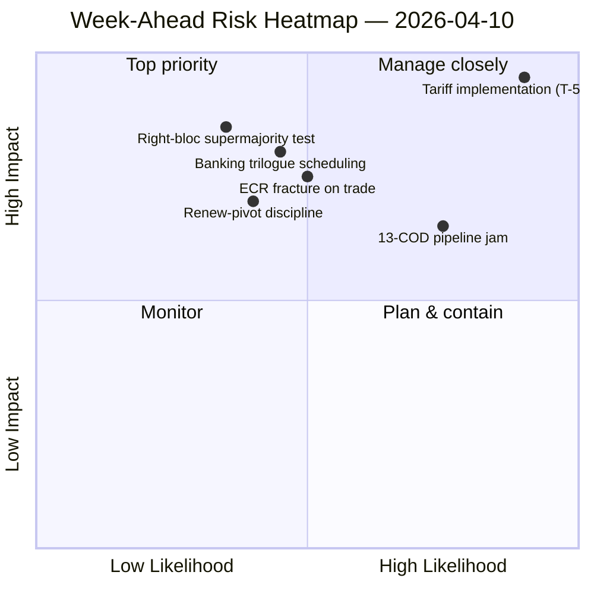

<!-- SPDX-FileCopyrightText: 2024-2026 Hack23 AB -->
<!-- SPDX-License-Identifier: Apache-2.0 -->

# 집행 브리핑 — 주간 전망: 부활절 이후 위원회 재가동 (4월 10–17일) | 2026-04-10

**분류:** OSINT — 공개 의회 기록
**신뢰도:** 🟡 중간 (분석 파일 19개; 연립/회기 간 정보/심층 분석/이해관계자/투표 패턴 모두 🟢 높음 로컬)
**실행:** `analysis/daily/2026-04-10/week-ahead-run12/`
**커버리지:** 2026-04-10 → 2026-04-17 (부활절 휴회 15일차 → 위원회 재가동 주)
**생성일:** 2026-05-16 (소급 브리핑, 새로운 MCP 호출 없음)
**주요 출처:** EP MCP — 분석 파일 19개; 주간 정보 보고서; 종합 요약; 연립/회기 간/심층/이해관계자/투표 패턴 분석.

---

## 🎯 BLUF (핵심 결론)

**4월 10–17일은 의회가 부활절 휴회 종료에서 4월 14–17일 위원회 재가동 주로 전환하는 시기를 다루며, 이번 실행의 가장 결정적인 발견은 구조적으로 위협 편중된 태도이다: 집계 SWOT에서 위협으로 코딩된 항목 35개 대 강점 10개/약점 6개/기회 4개에 불과.** 35개의 위협 결과는 비상 신호가 아니다——EP10 단편화 지수(6.59)가 EP10 역사상 최대의 미결 COD 파이프라인과 충돌할 때 나타나는 휴회 복귀의 *구조적 특성*이다. 이번 실행은 **7건의 심각한 위험 언급**을 기록하며 높음/중간/낮음은 0건——분석 방법론이 표시된 각 항목을 심각 또는 노이즈로 읽는다는 것을 나타내는 이진 분포이다. 5개 분석 파일이 모두 🟢 높은 신뢰도를 획득했다——연립 역학, 회기 간 정보, 심층 분석, 이해관계자 영향, 투표 패턴——이는 휴회 주 실행으로서 비정상적으로 높은 합의이며, 브리핑은 이를 단일 출처 주장이 아닌 *수렴된 정보 그림*으로 읽는다. 이번 주의 전향적 구조적 질문은 세 가지이다: **(가) 4월 14–17일 위원회 재가동이 13개 COD 적체를 지연 없이 흡수하는가?** **(나) Renew 피벗 대연립(EPP+S&D+Renew = 396석)이 첫 번째 휴회 후 기준 투표——관세 이행 모니터링에 관한 것으로 예상——에서 규율을 유지하는가?** **(다) 3월 26일에 관찰된 ECR 우파 블록의 무역 균열이 휴회 후에도 지속되는가?** 실행의 편집 권고는 **다중 기사 생산(분석 파일 19개는 복수의 서사를 정당화함)**이며, 위협 편중 SWOT은 "기회 프레이밍에서 이점을 얻을 수 있다"——두 해석 모두 경보성이 아닌 운영적이다.

---

## 🧭 이 브리핑이 지원하는 3가지 결정

| # | 결정 | 결정자 | 기한 | 근거 |
|:-:|------|--------|:----:|------|
| 1 | **주간 전망을 위한 다중 기사 편집 분해** — 분석 파일 19개 + 높은 신뢰도 헤드라인 5개는 집계가 아닌 분리를 정당화 | 뉴스룸; news-journalist | 발행 창 | §편집 권고 |
| 2 | **35위협 SWOT에 기회 프레이밍 오버레이** — 명시적 프레이밍 없이는 서사가 취약성으로 읽힘; 실행이 이를 표시 | 편집부 | 발행 창 | §집계 SWOT (35T) |
| 3 | **재가동 전 13COD 우선순위 목록 사회화** — 위원회 의장 회의는 4월 14일 아침에 이것을 테이블에 올려야 함 | 위원회 의장 회의 | 4월 14일 | §회기 간 연속성; 파이프라인 적체 이월 |

---

## 📰 60초 읽기

- 🔴 **SWOT 위협 코딩 항목 35개** — 구조적, 비상사태 아님; 단편화 × 휴회 후 파이프라인 압력 반영.
- 🟠 **심각한 위험 언급 7건** — 이진 분포; 방법론은 표시된 각 위험을 심각 또는 0으로 읽음.
- 🟢 **분석 파일 5개 🟢 높은 신뢰도** — 연립/회기 간/심층/이해관계자/투표 수렴.
- 🟡 **분석 파일 19개 처리** — 단일 집계가 아닌 다중 기사 생산 정당화.
- 🔵 **위원회 재가동 4월 14–17일** — 위원회 의장 회의가 4월 14일에 13 COD 우선순위 순서 확정.
- 🟣 **ECR 무역 균열** — 3월 26일 투표 신호; 휴회 후 지속이 반증자.
- 🩷 **Renew 피벗 작동 다수(396)** — 첫 번째 휴회 후 기준 투표에서 규율 테스트.
- ⚪ **신뢰도 중간** — 방법론은 파일별 높음을 제공하지만 휴회 후 행동 데이터가 도착할 때까지 수렴 판단은 중간.

---

## 🏆 신뢰도별 상위 발견 (실행 중 작성)

| 순위 | 파일 | 방법 | 신뢰도 | 요약 |
|:----:|------|------|:------:|------|
| 1 | coalition-dynamics.md | 연립 분석 | 🟢 높음 | 3극 연립 기하학; Renew 피벗이 Q2 기본값 |
| 2 | cross-session-intelligence.md | 회기 간 정보 | 🟢 높음 | 휴회 전→휴회 후 연속성; 파이프라인 이월 |
| 3 | deep-analysis.md | 심층 분석 | 🟢 높음 | 다관점 종합; 이행 격차 위험 |
| 4 | stakeholder-impact.md | 이해관계자 분석 | 🟢 높음 | 파일당 6차원 이해관계자 발자국 |
| 5 | voting-patterns.md | 투표 패턴 | 🟢 높음 | 3월 26일 투표 분산; ECR 균열 신호 |

---

## 💪 집계 SWOT

| 차원 | 수 | 해석 |
|------|:--:|------|
| ✅ 강점 | 10 | 기록적 Q1 산출; 대연립 산술 실행 가능; 대부분 파일에서 연립 규율 |
| ⚠️ 약점 | 6 | 13 COD 적체; 단편화 6.59; 휴회 중 데이터 가용성 격차 |
| 🚀 기회 | 4 | 은행 동맹 완성; 반부패 이식; ECB 금리 촉매; 휴회 후 파이프라인 재가동 |
| 🔴 **위협** | **35** | **관세 이행 압력; ECR 균열; 우파 블록 초다수(348/361); 연립 스트레스 테스트** |

---

## ⚠️ 위험 스냅샷

---

## 🔮 상위 선행 트리거 (향후 7일)

1. **4월 13일 — 마지막 휴회일.** motions/breaking/CR/props 실행 전반의 복합 위험 수렴 (~14.8/25).
2. **4월 14일 09:00 — 의회 복귀; 위원회 재가동.** 13 COD 우선순위 지정이 여기서 확정.
3. **4월 15일 — TA-10-2026-0096 활성화** — 첫 번째 휴회 후 이행 모니터링 투표 = ECR 균열 테스트.
4. **4월 17일 — ECB 금리 결정** — ECON 활성화 신호.
5. **4월 말 — SRMR3 이사회 협상 권한.**

---

## 🛡️ 출처 품질 평가

- **분석 파일 19개 (실행 내부, A2):** 파일당 🟢 높은 신뢰도 5개; 수렴 판단은 중간 유지.
- **연립 역학/회기 간/심층/이해관계자/투표 (A2):** 다방법 삼각법이 구조적 해석에 대한 신뢰를 높임.
- **방법론적 주의:** **7심각/0높음/0중간/0낮음** 위험 분포 자체가 방법론적 신호이다——휴리스틱이 이진으로 읽음; 위험 등급이 휴회 주 데이터에 맞게 보정되지 않았을 수 있음.
- **순 신뢰도:** 🟡 종합 중간; 35위협 SWOT 및 5파일 수렴에서 🟢 높음 (방법론적으로 견고); 7심각/0기타 분포에 대한 ⚠️ 주의.

---

## 📎 실행 아티팩트 (결정 전 읽기)

| 계층 | 아티팩트 | 이유 |
|------|---------|------|
| 기사 | `article.md` | 공개 전향적 주간 서사 |
| 종합 | `synthesis-summary.md` | 신뢰도 상위 5위 순위 + SWOT 집계 (권위적) |
| 주간 | `weekly-intelligence-brief.md` | 주간 교차 프레이밍 |
| 문서 | `documents/` | 문서 분석 인덱스 |
| 위험 | `risk-scoring/` | 위험 등록부 (7심각 이진 분포) |
| 위협 | `threat-assessment/` | 5프레임 정치적 위협 (STRIDE 거부) |
| 기존 | `existing/coalition-dynamics.md`, `existing/cross-session-intelligence.md`, `existing/deep-analysis.md`, `existing/stakeholder-impact.md`, `existing/voting-patterns.md` | 5개 🟢 높은 분석 |
| 동반 | breaking-run168 / motions-run41 / props-run41 / CR-run47 / week-ahead-run13 | 재가동 전→복귀 주 괄호 |

---

**문서 관리**
- **템플릿 참조:** `analysis/templates/executive-brief.md`
- **아티팩트 경로:** `analysis/daily/2026-04-10/week-ahead-run12/executive-brief.md`
- **분류:** 공개
- **소급:** 브리핑은 2026-05-16에 커밋된 실행 아티팩트로부터 작성됨; **새로운 MCP 호출은 이루어지지 않음**. 🟡 수렴 신뢰도 중간 + 7심각 이진 분포에 대한 방법론적 주의 보존.
