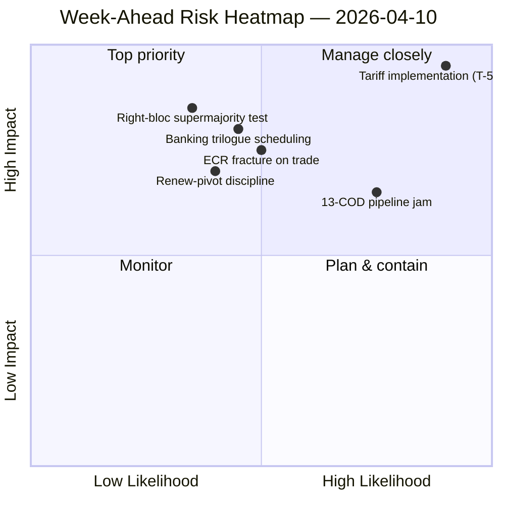

<!-- SPDX-FileCopyrightText: 2024-2026 Hack23 AB -->
<!-- SPDX-License-Identifier: Apache-2.0 -->

# Uitvoerend Overzicht — Week Vooruit: Herstart Commissies na Pasen (10–17 april) | 2026-04-10

**Classificatie:** OSINT — Publiek parlementair archief
**Betrouwbaarheid:** 🟡 GEMIDDELD (19 analysebestanden; coalitie / intersessioneel / diepgaande analyse / belanghebbenden / stempatronen allemaal 🟢 HOOG lokaal)
**Uitvoering:** `analysis/daily/2026-04-10/week-ahead-run12/`
**Dekking:** 2026-04-10 → 2026-04-17 (Dag 15 van de paasreces → herstartsweek commissies)
**Gegenereerd:** 2026-05-16 (retrospectief overzicht, geen nieuwe MCP-aanroepen)
**Primaire bronnen:** EP MCP — 19 analysebestanden; wekelijks inlichtingenrapport; syntheseoverzicht; analyses van coalities / intersessionele / diepgaande / stakeholder / stempatronen.

---

## 🎯 BLUF

**De week van 10 tot 17 april omvat de overgang van het Parlement van het einde van het paasverlof naar de herstartsweek van de commissies van 14 tot 17 april — en de meest bepalende bevinding van de uitvoering is een structureel dreigingsbelaste houding: 35 als dreigingen gecodeerde invoeren tegenover slechts 10 sterktes / 6 zwakheden / 4 kansen in de geaggregeerde SWOT.** Het resultaat van 35 dreigingen is geen noodsignaal — het is een *structureel kenmerk* van de terugkeer na reces wanneer de EP10-fragmentatie-index (6,59) botst met de grootste uitstaande COD-pijplijn in de EP10-geschiedenis. De uitvoering registreert **7 KRITIEKE risicovermeldingen** met nul hoog/gemiddeld/laag — een binaire verdeling die aangeeft dat de analytische methodologie elk gemarkeerd element leest als kritiek of als ruis. Vijf analysebestanden scoren allemaal 🟢 HOGE betrouwbaarheid — coalitiedynamiek, intersessionele inlichtingen, diepgaande analyse, stakeholderimpact, stempatronen — wat een ongewoon hoge overeenstemming is voor een reces-week uitvoering, en het overzicht leest dit als een *geconvergeerd inlichtingenplaatje* in plaats van een enkelvoudige bronbewering. De prospectieve structurele vragen van de week zijn drie: **(a) absorbeert de commissieherstart van 14 tot 17 april de 13 COD-achterstand zonder vertraging?** **(b) handhaaft de grote Renew-pivot coalitie (EVP+S&D+Renew = 396 zetels) discipline bij de eerste post-reces markante stemming, verwacht over de monitoring van tariefimplementatie?** **(c) blijft de ECR rechtsblokbreuk bij handel, waargenomen op 26 maart, na het reces bestaan?** De redactionele aanbeveling van de uitvoering is **multi-artikel productie (19 analysebestanden rechtvaardigen meerdere narratieven)** en de dreigingsbelaste SWOT "kan profiteren van kansencadrering" — beide lezingen zijn operationeel in plaats van alarmistisch.

---

## 🧭 3 Beslissingen die dit overzicht ondersteunt

| # | Beslissing | Wie beslist | Deadline | Bewijs |
|:-:|------------|-------------|:--------:|--------|
| 1 | **Multi-artikel redactionele uitsplitsing voor de week vooruit** — 19 analysebestanden + 5 HOGE betrouwbaarheidskoppen rechtvaardigen scheiding in plaats van aggregatie | Redactie; news-journalist | publicatievenster | §Redactionele aanbevelingen |
| 2 | **Kansencadrering overlay op de 35-dreigingen SWOT** — zonder expliciete cadrering wordt het narratief gelezen als kwetsbaarheid; de uitvoering signaleert dit | Redactie | publicatievenster | §SWOT Geaggregeerd (35D) |
| 3 | **Pre-herstart 13-COD prioriteitenlijst socialisering** — de Conferentie van Commissievoorzitters zou dit op de ochtend van 14 april op tafel moeten hebben | Conferentie van Commissievoorzitters | 14 april | §Intersessionele continuïteit; pipeline-opstoppingsoverdracht |

---

## 📰 Lezen in 60 seconden

- 🔴 **35 als dreigingen gecodeerde SWOT-invoeren** — structureel, geen noodgeval; weerspiegelt fragmentatie × post-reces pijplijndruk.
- 🟠 **7 KRITIEKE risicovermeldingen** — binaire verdeling; methodologie leest elk gemarkeerd risico als KRITIEK of NIL.
- 🟢 **5 analysebestanden 🟢 HOGE betrouwbaarheid** — coalitie / intersessioneel / diepgaand / stakeholders / stemmen convergeren.
- 🟡 **19 analysebestanden verwerkt** — rechtvaardigt multi-artikel productie in plaats van één enkel aggregaat.
- 🔵 **Commissieherstart 14–17 april** — de Conferentie van Commissievoorzitters stelt de prioriteitsvolgorde van de 13 COD vast op 14 april.
- 🟣 **ECR-breuk bij handel** — stemsignaal van 26 maart; persistentie na reces is de falsificator.
- 🩷 **Renew-pivot werkende meerderheid (396)** — disciplinetest bij de eerste post-reces markante stemming.
- ⚪ **Betrouwbaarheid GEMIDDELD** — methodologie geeft HOOG per bestand maar geconvergeerd oordeel GEMIDDELD totdat post-reces gedragsdata binnenkomt.

---

## 🏆 Topbevindingen op betrouwbaarheid (tijdens uitvoering opgesteld)

| Rang | Bestand | Methode | Betrouwbaarheid | Samenvatting |
|:----:|---------|---------|:---------------:|-------------|
| 1 | coalition-dynamics.md | coalitieanalyse | 🟢 HOOG | Driepolige coalitiegeometrie; Renew-pivot is de Q2-standaard |
| 2 | cross-session-intelligence.md | intersessionele inlichtingen | 🟢 HOOG | Continuïteit vóór reces → na reces; pijplijnoverdracht |
| 3 | deep-analysis.md | diepgaande analyse | 🟢 HOOG | Multi-perspectief synthese; risico van implementatiekloof |
| 4 | stakeholder-impact.md | stakeholderanalyse | 🟢 HOOG | 6-dimensionele stakeholdervoetafdruk per bestand |
| 5 | voting-patterns.md | stempatronen | 🟢 HOOG | Stemspreiding van 26 maart; ECR-breuксignaal |

---

## 💪 SWOT Geaggregeerd

| Dimensie | Aantal | Lezing |
|----------|:------:|--------|
| ✅ Sterktes | 10 | Record Q1-uitvoer; grote coalitie-rekenkunde haalbaar; coalitiediscipline over de meeste bestanden |
| ⚠️ Zwakheden | 6 | 13 COD-achterstand; fragmentatie 6,59; gegevensbeschikbaarheidskloof tijdens reces |
| 🚀 Kansen | 4 | Voltooiing Bankenunie; anticorruptie-omzetting; ECB-rentekatalysator; pijplijnherstart na reces |
| 🔴 **Dreigingen** | **35** | **Druk van tariefimplementatie; ECR-breuk; rechtsblok supermeerderheid (348/361); coalitie-stresstest** |

---

## ⚠️ Risico-overzicht

---

## 🔮 Top Toekomstige Triggers (komende 7 dagen)

1. **13 april — laatste recesday.** Samengestelde risicoconvergentie (~14,8/25) over uitvoeringen motions/breaking/CR/props.
2. **14 april 09:00 — Parlement keert terug; commissieherstart.** 13-COD-prioritering wordt hier vastgesteld.
3. **15 april — TA-10-2026-0096 activeert** — eerste post-reces implementatiemonitoringstemming = ECR-breuktest.
4. **17 april — ECB rentebesluit** — ECON-activeringssignaal.
5. **Eind april — SRMR3 Raadsonderhandelingsmandaat.**

---

## 🛡️ Bronnenkwaliteitsbeoordeling

- **19 analysebestanden (intern aan uitvoering, A2):** vijf 🟢 HOGE per-bestand betrouwbaarheden; het geconvergeerde oordeel blijft GEMIDDELD.
- **Coalitiedynamiek / intersessioneel / diepgaand / stakeholders / stemmen (A2):** multi-methode triangulatie vergroot het vertrouwen in de structurele lezing.
- **Methodologisch voorbehoud:** de **7 KRITIEK / 0 HOOG / 0 GEMIDDELD / 0 LAAG** risicoverdeling is zelf een methodologisch signaal — de heuristiek leest binair; risicogradaties zijn mogelijk niet gekalibreerd voor reces-weekdata.
- **Netto betrouwbaarheid:** 🟡 GEMIDDELD op synthese; 🟢 HOOG op de 35-dreigingen-SWOT en 5-bestand convergentie (methodologisch robuust); ⚠️ voorbehoud over de 7-KRITIEK / 0-alles-anders verdeling.

---

## 📎 Uitvoeringsartefacten (Lezen-Vóór-Beslissen)

| Laag | Artefact | Waarom |
|------|----------|--------|
| Artikel | `article.md` | Publiek prospectief weeknarratief |
| Synthese | `synthesis-summary.md` | Top-5 betrouwbaarheidsrangschikkingen + SWOT-aggregaat (gezaghebbend) |
| Wekelijks | `weekly-intelligence-brief.md` | Inter-weeks cadrering |
| Documenten | `documents/` | Documentanalyseindex |
| Risico | `risk-scoring/` | Risicoregister (7 KRITIEKE binaire verdeling) |
| Dreiging | `threat-assessment/` | 5-raamwerk politieke dreiging (STRIDE afgewezen) |
| Bestaand | `existing/coalition-dynamics.md`, `existing/cross-session-intelligence.md`, `existing/deep-analysis.md`, `existing/stakeholder-impact.md`, `existing/voting-patterns.md` | Vijf 🟢 HOGE analyses |
| Metgezellen | breaking-run168 / motions-run41 / props-run41 / CR-run47 / week-ahead-run13 | Pre-herstart → terugkeer-week haakjes |

---

**Documentcontrole**
- **Sjabloonreferentie:** `analysis/templates/executive-brief.md`
- **Artefactpad:** `analysis/daily/2026-04-10/week-ahead-run12/executive-brief.md`
- **Classificatie:** Publiek
- **Retrospectief:** Overzicht geschreven op 2026-05-16 vanuit de gecommitte artefacten van de uitvoering; **er zijn geen nieuwe MCP-aanroepen gedaan**. De geconvergeerde betrouwbaarheid 🟡 GEMIDDELD + methodologisch voorbehoud over de 7-KRITIEKE binaire verdeling worden bewaard.
