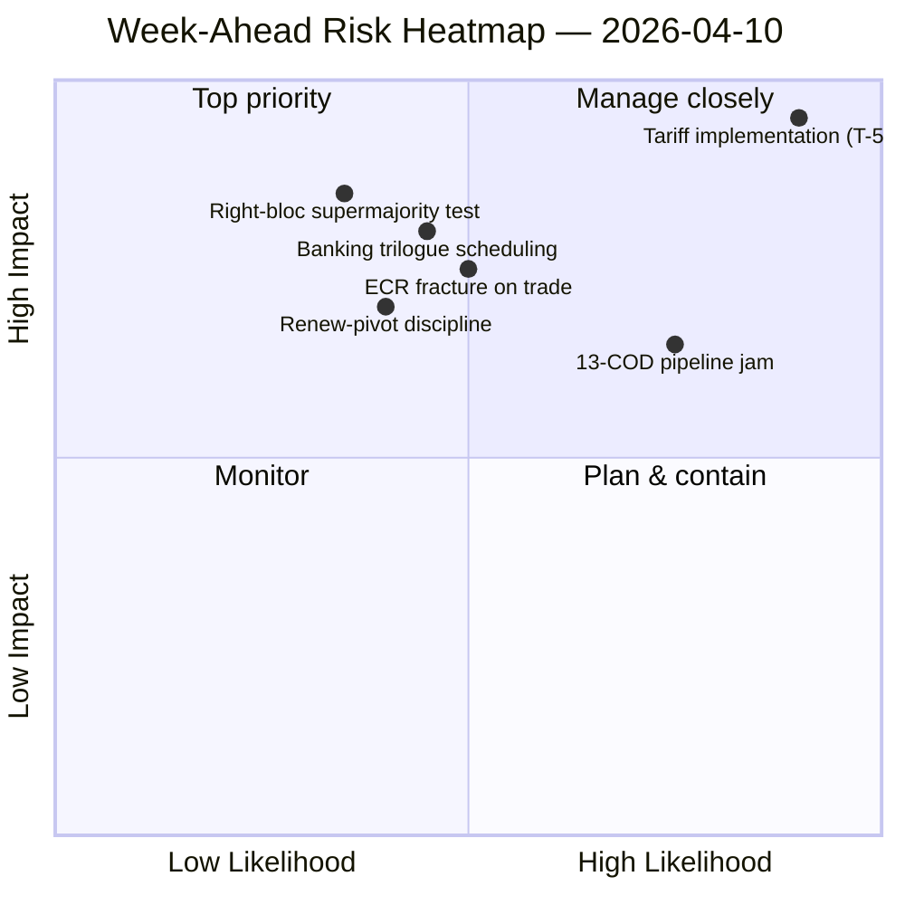

<!-- SPDX-FileCopyrightText: 2024-2026 Hack23 AB -->
<!-- SPDX-License-Identifier: Apache-2.0 -->

# Ledersammendrag — Uken fremover: Gjenstart av komiteer etter påske (10.–17. april) | 2026-04-10

**Klassifisering:** OSINT — Offentlig parlamentarisk protokoll
**Tillit:** 🟡 MIDDELS (19 analysefiler; koalisjon / kryssesjon / dybdeanalyse / interessenter / stemmeanalyser alle 🟢 HØY lokalt)
**Kjøring:** `analysis/daily/2026-04-10/week-ahead-run12/`
**Dekning:** 2026-04-10 → 2026-04-17 (påskeferiens dag 15 → komitérestartuke)
**Generert:** 2026-05-16 (retrospektivt sammendrag, ingen nye MCP-anrop)
**Primærkilder:** EP MCP — 19 analysefiler; ukentlig etterretningsrapport; syntesesammendrag; koalisjons- / kryssesjon- / dybde- / interessent- / stemmeanalyser.

---

## 🎯 BLUF

**Uken 10.–17. april dekker Parlamentets overgang fra påskeferiens slutt til komiterestartsuken 14.–17. april — og kjøringens mest avgjørende funn er en strukturelt trusselstung holdning: 35 trusselsklassifiserte oppføringer mot bare 10 styrker / 6 svakheter / 4 muligheter i den aggregerte SWOT-analysen.** Det 35-trussel-resultatet er ikke et krisesignal — det er et *strukturelt trekk* ved gjenkomsten etter ferie når EP10s fragmenteringsindeks (6,59) kolliderer med den største ventende COD-pipelinen i EP10s historie. Kjøringen registrerer **7 KRITISKE risikonnevnelser** med null høye/middels/lave — en binær fordeling som signaliserer at den analytiske metodologien leser hvert flagget element som enten kritisk eller støy. Fem analysefiler scorer alle 🟢 HØY tillit — koalisjonsddynamikk, kryssesjonsetterretning, dybdeanalyse, interessentpåvirkning, stemmeanalyser — noe som er uvanlig høy enighet for en feriekjøring, og sammendraget leser dette som et *konvergert etterretningsbilde* snarere enn en enkildepåstand. Ukens fremoverskuende strukturelle spørsmål er tre: **(a) absorberer komiterestarten 14.–17. april de 13 COD-etterslepene uten forsinkelse?** **(b) holder Renew-pivot storkoalisjonen (EPP+S&D+Renew = 396 seter) disiplin ved den første post-ferie flaggavstemningen, forventet å handle om tilsyn med tolltariffimplementering?** **(c) vedvarer ECR-høyreblokkens sprekk i handelsspørsmål, observert 26. mars, etter ferien?** Kjøringens redaksjonelle anbefaling er **multi-artikkelutdata (19 analysefiler rettferdiggjør flere fortellinger)** og den trusselstunge SWOT "kan ha nytte av mulighetsrammesetting" — begge lesningene er operasjonelle snarere enn alarmistiske.

---

## 🧭 3 Beslutninger dette sammendraget støtter

| # | Beslutning | Hvem bestemmer | Frist | Bevis |
|:-:|------------|----------------|:-----:|-------|
| 1 | **Multi-artikkel redaksjonell nedbrytning for uken fremover** — 19 analysefiler + 5 HØY-tillit overskrifter rettferdiggjør separasjon snarere enn aggregering | Redaksjonen; news-journalist | publiseringsvindu | §Redaksjonelle anbefalinger |
| 2 | **Mulighetsrammingsoverlegg på 35-truslenes SWOT** — uten eksplisitt rammesetting leses fortellingen som skjørhet; kjøringen flagger dette | Redaksjonen | publiseringsvindu | §SWOT Aggregert (35T) |
| 3 | **Pre-restart 13-COD prioriteringsliste-sosialisering** — Konferansen av komitéledere bør ha dette på bordet 14. april morgen | Konferansen av komitéledere | 14. april | §Kryssesjonskontinuitet; pipeline-forsinkelse carry-over |

---

## 📰 60 sekunders lesning

- 🔴 **35 trusselsklassifiserte SWOT-oppføringer** — strukturelle, ikke nødssituasjon; gjenspeiler fragmentering × post-ferie pipeline-press.
- 🟠 **7 KRITISKE risikonnevnelser** — binær fordeling; metodologien leser hver flagget risiko som KRITISK eller NIL.
- 🟢 **5 analysefiler 🟢 HØY tillit** — koalisjon / kryssesjon / dybde / interessenter / stemmer konvergerer.
- 🟡 **19 analysefiler behandlet** — rettferdiggjør multi-artikkelutdata snarere enn enkelt aggregat.
- 🔵 **Komitérestart 14.–17. april** — Konferansen av komitéledere fastsetter 13-COD prioritetsorden 14. april.
- 🟣 **ECR-sprekk i handel** — Avstemningssignal 26. mars; vedvarenhet etter ferien er falsifikatoren.
- 🩷 **Renew-pivot fungerende flertall (396)** — disiplintest ved den første post-ferie flaggavstemningen.
- ⚪ **Tillit MIDDELS** — metodologien gir HØY per fil men konvergert vurdering MIDDELS inntil post-ferie atferdsdata lander.

---

## 🏆 Toppfunn etter tillit (kjøringsforfatter)

| Rang | Fil | Metode | Tillit | Sammendrag |
|:----:|-----|--------|:------:|------------|
| 1 | coalition-dynamics.md | koalisjonsanalyse | 🟢 HØY | Tre-pol koalisjonsgeometri; Renew-pivot er Q2-standard |
| 2 | cross-session-intelligence.md | kryssesjonsetterretning | 🟢 HØY | Pre-ferie → post-ferie kontinuitet; pipeline carry-over |
| 3 | deep-analysis.md | dybdeanalyse | 🟢 HØY | Flerperspektiv-syntese; implementeringsgap-risiko |
| 4 | stakeholder-impact.md | interessentanalyse | 🟢 HØY | 6-dimensjoners interessentfotavtrykk per fil |
| 5 | voting-patterns.md | stemmeanalyser | 🟢 HØY | 26. mars stemmespredning; ECR-sprekksignal |

---

## 💪 SWOT Aggregert

| Dimensjon | Antall | Lesning |
|-----------|:------:|---------|
| ✅ Styrker | 10 | Rekord Q1-utdata; storkoalisjonens aritmetikk levedyktig; koalisjonsdisiplin i de fleste filer |
| ⚠️ Svakheter | 6 | 13-COD etterslep; fragmentering 6,59; datatilgjengelighetsgap under ferien |
| 🚀 Muligheter | 4 | Bankunionfullføring; anti-korrupsjonsgjennomføring; ECB-rentekatalysator; pipeline-gjenstart etter ferien |
| 🔴 **Trusler** | **35** | **Tolltariffimplementeringspress; ECR-sprekk; høyreblokk-supermajoritet (348/361); koalisjonsstresstest** |

---

## ⚠️ Risikoøyeblikksbilde

---

## 🔮 Topp Fremtidige Utløsere (neste 7 dager)

1. **13. april — siste feriedag.** Sammensatt risikokonvergens (~14,8/25) på tvers av motions/breaking/CR/props-kjøringer.
2. **14. april 09:00 — Parlamentet returnerer; komitérestart.** 13-COD prioritering fastsettes her.
3. **15. april — TA-10-2026-0096 aktiveres** — første post-ferie implementeringstilsynsavstemning = ECR-sprekkstest.
4. **17. april — ECB-rentebeslutning** — ECON-aktiveringssignal.
5. **Sent april — SRMR3 Råds-trilogmandat.**

---

## 🛡️ Kildekvalitetsvurdering

- **19 analysefiler (kjøringsinterne, A2):** fem 🟢 HØY per-fil-tilliter; den konvergerte vurderingen forblir MIDDELS.
- **Koalisjonsdynamikk / kryssesjon / dybde / interessenter / stemmer (A2):** multi-metode-triangulering øker tilliten på den strukturelle lesningen.
- **Metodologisk forbehold:** den **7 KRITISKE / 0 HØY / 0 MIDDELS / 0 LAV** risikofordelingen er i seg selv et metodologisk signal — heuristikken leser binært; risikonivåer er kanskje ikke kalibrert for ferieukedata.
- **Nettotillit:** 🟡 MIDDELS på syntese; 🟢 HØY på 35-truslenes SWOT og 5-filskonvergens (metodologisk robust); ⚠️ forbehold for 7-KRITISKE / 0-alt-annet-fordelingen.

---

## 📎 Kjøringsartefakter (Les-Før-Beslutning)

| Lag | Artefakt | Hvorfor |
|-----|----------|---------|
| Artikkel | `article.md` | Offentlig fremadskuende ukesfortelling |
| Syntese | `synthesis-summary.md` | Topp-5 tillitsrangering + SWOT-aggregat (autoritativt) |
| Ukentlig | `weekly-intelligence-brief.md` | Tverrukesrammesetting |
| Dokumenter | `documents/` | Dokumentanalyseindeks |
| Risiko | `risk-scoring/` | Risikoregister (7 KRITISKE binær fordeling) |
| Trussel | `threat-assessment/` | 5-rammeverk politisk trussel (STRIDE avvist) |
| Eksisterende | `existing/coalition-dynamics.md`, `existing/cross-session-intelligence.md`, `existing/deep-analysis.md`, `existing/stakeholder-impact.md`, `existing/voting-patterns.md` | Fem 🟢 HØY analyser |
| Følgesvenner | breaking-run168 / motions-run41 / props-run41 / CR-run47 / week-ahead-run13 | Pre-restart → rettur-uke-parentes |

---

**Dokumentkontroll**
- **Mallreferanse:** `analysis/templates/executive-brief.md`
- **Artefaktsti:** `analysis/daily/2026-04-10/week-ahead-run12/executive-brief.md`
- **Klassifisering:** Offentlig
- **Retrospektiv:** Sammendrag skrevet 2026-05-16 fra kjøringens committede artefakter; **ingen nye MCP-anrop ble gjort**. Den 🟡 MIDDELS-konvergerte tilliten + metodologisk forbehold for den 7-KRITISKE binære fordelingen bevares.
