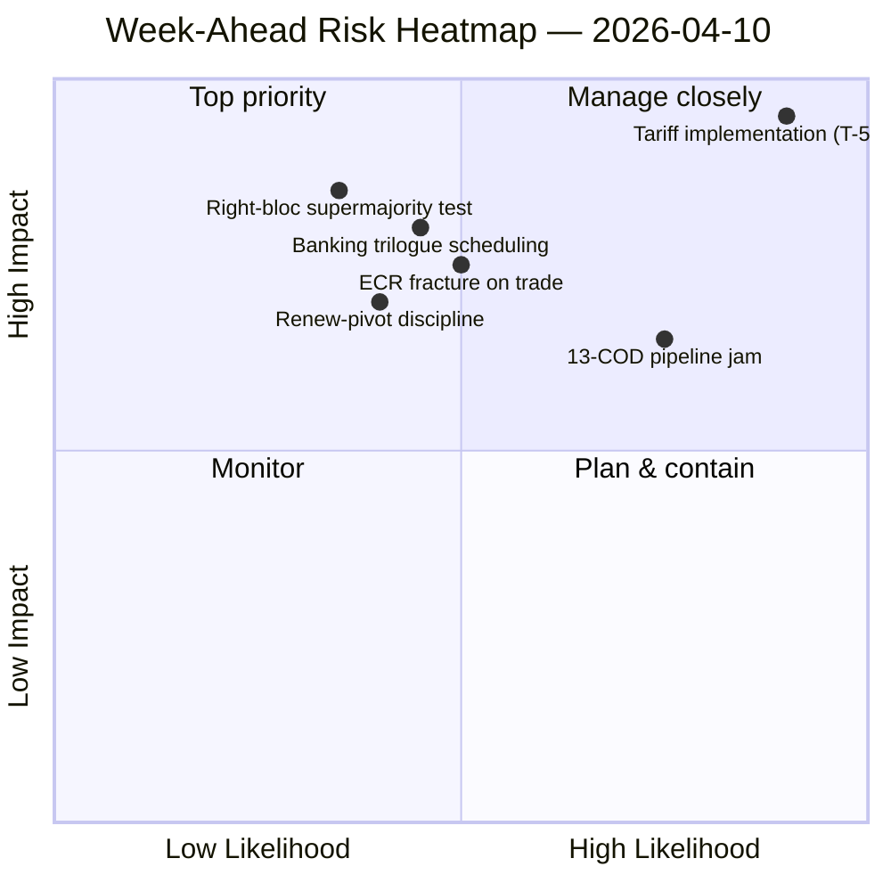

<!-- SPDX-FileCopyrightText: 2024-2026 Hack23 AB -->
<!-- SPDX-License-Identifier: Apache-2.0 -->

# Exekutiv sammanfattning — Veckan framåt: Omstart av utskott efter påsk (10–17 april) | 2026-04-10

**Klassificering:** OSINT — Offentligt parlamentariskt register
**Tillförlitlighet:** 🟡 MEDEL (19 analysfiler; koalition / tvärsessions- / djupanalys / intressenter / röstmönster alla 🟢 HÖG lokalt)
**Körning:** `analysis/daily/2026-04-10/week-ahead-run12/`
**Täckning:** 2026-04-10 → 2026-04-17 (påskledighetens dag 15 → utskottens återstartvecka)
**Genererad:** 2026-05-16 (retrospektivt sammanfattning, inga nya MCP-anrop)
**Primära källor:** EP MCP — 19 analysfiler; veckans underrättelserapport; syntessammanfattning; koalitions- / tvärsessions- / djup- / intressent- / röstmönsteranalyser.

---

## 🎯 BLUF

**Veckan 10–17 april täcker parlamentets övergång från påskledighetens avslutning till utskottsomstarten 14–17 april — och körningens mest avgörande slutsats är en strukturellt hotpräglad hållning: 35 hotklassificerade poster mot bara 10 styrkor / 6 svagheter / 4 möjligheter i den aggregerade SWOT-analysen.** Det 35-hotiga utslaget är inte en krissignal — det är ett *strukturellt drag* av återkomsten efter uppehåll när EP10:s fragmenteringsindex (6,59) kolliderar med den största pågående COD-pipelinen i EP10:s historia. Körningen registrerar **7 KRITISKA risknämnanden** med noll höga/medel/låga — en binär fördelning som signalerar att den analytiska metodologin läser varje flaggat objekt som antingen kritiskt eller brus. Fem analysfiler uppnår alla 🟢 HÖG tillförlitlighet — koalitionsdynamik, tvärsessionsunderrättelse, djupanalys, intressentpåverkan, röstmönster — vilket är ovanligt hög enighet för en ledighetsveckekörning och sammanfattningen läser detta som en *konvergerad underrättelsebilden* snarare än ett påstående från en enskild källa. Veckans framåtstrukturella frågor är tre: **(a) absorberar utskottsomstarten 14–17 april de 13 COD-eftersläpningarna utan förskjutning?** **(b) håller Renew-pivot-stormajoriteten (EPP+S&D+Renew = 396 platser) disciplin vid den första post-uppehålls flaggröstningen, som förväntas gälla tillsynen av tullarnas genomförande?** **(c) kvarstår ECR:s högerblocksspricka i handelsfrågor, observerad den 26 mars, efter uppehållet?** Körningens redaktionella rekommendation är **multi-artikelutdata (19 analysfiler motiverar flera berättelser)** och det hottunga SWOT "kan gagnas av möjlighetsframing" — båda läsningarna är operationella snarare än alarmistiska.

---

## 🧭 3 Beslut som detta sammanfattning stödjer

| # | Beslut | Vem beslutar | Deadline | Bevis |
|:-:|--------|--------------|:--------:|-------|
| 1 | **Multi-artikelredaktionell nedbrytning för veckan framåt** — 19 analysfiler + 5 HÖG-konfidens rubriker motiverar separation snarare än aggregering | Redaktionen; news-journalist | publiceringsfönster | §Redaktionella rekommendationer |
| 2 | **Möjlighetsramöverlagring på 35-hotets SWOT** — utan explicit framing läses berättelsen som skörhet; körningen flaggar detta | Redaktionen | publiceringsfönster | §SWOT Aggregerad (35H) |
| 3 | **Pre-omstart 13-COD prioriteringslista socialisation** — Konferensen av utskottsordföranden bör ha detta på bordet morgonen 14 april | Konferensen av utskottsordföranden | 14 april | §Tvärsessionskontinuitet; pipeline-stopp carry-over |

---

## 📰 60 sekunders läsning

- 🔴 **35 hotklassificerade SWOT-poster** — strukturella, inte nödläge; återspeglar fragmentering × post-uppehålls pipeline-tryck.
- 🟠 **7 KRITISKA risknämnanden** — binär fördelning; metodologin läser varje flaggad risk som KRITISK eller NIL.
- 🟢 **5 analysfiler 🟢 HÖG tillförlitlighet** — koalition / tvärsession / djup / intressenter / röstmönster konvergerar.
- 🟡 **19 analysfiler bearbetade** — motiverar multi-artikelutdata snarare än en enda aggregat.
- 🔵 **Utskottsomstart 14–17 april** — Konferensen av utskottsordföranden fastställer 13-COD prioritetsordning 14 april.
- 🟣 **ECR-spricka i handel** — Röstningssignal 26 mars; kvarstående efter uppehållet är falsifikatorn.
- 🩷 **Renew-pivot fungerande majoritet (396)** — disciplintest vid den första post-uppehålls flaggröstningen.
- ⚪ **Tillförlitlighet MEDEL** — metodologin ger HÖG per fil men konvergerad bedömning MEDEL tills post-uppehålls beteendedata landar.

---

## 🏆 Topphittningar efter tillförlitlighet (körningsförfattad)

| Rang | Fil | Metod | Tillförlitlighet | Sammanfattning |
|:----:|-----|-------|:----------------:|----------------|
| 1 | coalition-dynamics.md | koalitionsanalys | 🟢 HÖG | Trepols koalitionsgeometri; Renew-pivot är Q2-standard |
| 2 | cross-session-intelligence.md | tvärsessionsunderrättelse | 🟢 HÖG | Pre-uppehålls → post-uppehålls kontinuitet; pipeline carry-over |
| 3 | deep-analysis.md | djupanalys | 🟢 HÖG | Multiperspektiv syntes; implementeringsgap-risk |
| 4 | stakeholder-impact.md | intressentanalys | 🟢 HÖG | 6-dimensioners intressentfotavtryck per fil |
| 5 | voting-patterns.md | röstmönster | 🟢 HÖG | 26 mars röstdispersion; ECR-spricksignal |

---

## 💪 SWOT Aggregerad

| Dimension | Antal | Läsning |
|-----------|:-----:|---------|
| ✅ Styrkor | 10 | Rekordartat Q1-utdata; stormajoritetsaritmetik genomförbar; koalitionsdisciplin i de flesta filer |
| ⚠️ Svagheter | 6 | 13-COD eftersläpning; fragmentering 6,59; lucka i datatillgänglighet under uppehållet |
| 🚀 Möjligheter | 4 | Fullbordande av bankunionen; antikorruptionsomvandling; ECB-räntekatalysator; pipeline-återstart efter uppehållet |
| 🔴 **Hot** | **35** | **Tullarnas genomförandetryck; ECR-spricka; högerblockets supermajoritet (348/361); koalitionsstresstest** |

---

## ⚠️ Riskögonblicksbild

---

## 🔮 Topp Framtida Utlösare (nästa 7 dagar)

1. **13 april — sista uppehållsdagen.** Sammansatt riskkonvergens (~14,8/25) över motions/breaking/CR/props körningar.
2. **14 april 09:00 — Parlamentet återvänder; utskottsomstart.** 13-COD prioritering fastställs här.
3. **15 april — TA-10-2026-0096 aktiveras** — första post-uppehålls genomförandetillsynsomröstning = ECR-sprickstest.
4. **17 april — ECB:s räntebeslut** — ECON-aktiveringssignal.
5. **Sent april — SRMR3 rådskollokviet mandatmandat.**

---

## 🛡️ Källkvalitetsbedömning

- **19 analysfiler (körningsinterna, A2):** fem 🟢 HÖG per-fil-tillförlitligheter; den konvergerade bedömningen förblir MEDEL.
- **Koalitionsdynamik / tvärsession / djup / intressenter / röstmönster (A2):** multimetodsdetriangulering ökar tillförlitligheten på den strukturella läsningen.
- **Metodologisk förbehåll:** den **7 KRITISKA / 0 HÖG / 0 MEDEL / 0 LÅG** riskfördelningen är i sig själv en metodologisk signal — heuristiken läser binärt; riskgradering kanske inte är kalibrerad för ledighetsveckodata.
- **Nettotillförlitlighet:** 🟡 MEDEL på syntes; 🟢 HÖG på 35-hotets SWOT och 5-filskonvergens (metodologiskt robust); ⚠️ förbehåll för 7-KRITISKA / 0-allt-annat-fördelningen.

---

## 📎 Körningsartefakter (Läs-Innan-Beslut)

| Lager | Artefakt | Varför |
|-------|----------|--------|
| Artikel | `article.md` | Offentlig framåtblickande veckberättelse |
| Syntes | `synthesis-summary.md` | Topp-5 tillförlitlighetsrankningar + SWOT-aggregat (auktoritativt) |
| Veckovis | `weekly-intelligence-brief.md` | Tvärsveckas inramning |
| Dokument | `documents/` | Dokumentanalysindex |
| Risk | `risk-scoring/` | Riskregister (7 KRITISKA binär fördelning) |
| Hot | `threat-assessment/` | 5-ramverks politiskt hot (STRIDE avvisat) |
| Befintliga | `existing/coalition-dynamics.md`, `existing/cross-session-intelligence.md`, `existing/deep-analysis.md`, `existing/stakeholder-impact.md`, `existing/voting-patterns.md` | Fem 🟢 HÖG analyser |
| Följeslagare | breaking-run168 / motions-run41 / props-run41 / CR-run47 / week-ahead-run13 | Pre-omstart → återvändandevecka-parentes |

---

**Dokumentkontroll**
- **Mallreferens:** `analysis/templates/executive-brief.md`
- **Artefaktsökväg:** `analysis/daily/2026-04-10/week-ahead-run12/executive-brief.md`
- **Klassificering:** Offentlig
- **Retrospektiv:** Sammanfattning skriven 2026-05-16 från körningens committade artefakter; **inga nya MCP-anrop gjordes**. Den 🟡 MEDEL-konvergerade tillförlitligheten + metodologisk förbehåll för den 7-KRITISKA binära fördelningen bevaras.
