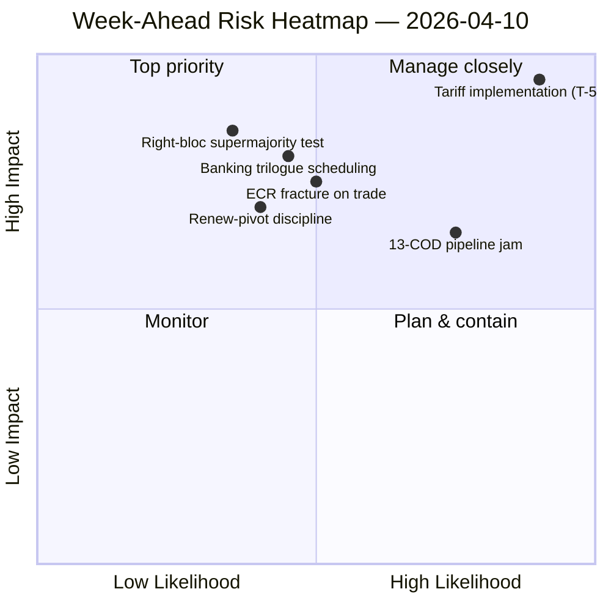

<!-- SPDX-FileCopyrightText: 2024-2026 Hack23 AB -->
<!-- SPDX-License-Identifier: Apache-2.0 -->

# 执行简报 — 周前瞻：复活节后委员会重启（4月10–17日）| 2026-04-10

**分类：** OSINT — 公开议会档案
**可信度：** 🟡 中等（19个分析文件；联盟/跨届/深度分析/利益相关者/投票模式均为本地 🟢 高）
**运行：** `analysis/daily/2026-04-10/week-ahead-run12/`
**覆盖范围：** 2026-04-10 → 2026-04-17（复活节休会第15天 → 委员会重启周）
**生成日期：** 2026-05-16（回顾性简报，无新MCP调用）
**主要来源：** EP MCP — 19个分析文件；每周情报简报；综合摘要；联盟/跨届/深度/利益相关者/投票模式分析。

---

## 🎯 核心结论

**4月10–17日覆盖了议会从复活节休会结束过渡至4月14–17日委员会重启周的阶段——本次运行最具决定性的发现是结构性的威胁过重态势：汇总SWOT中有35条威胁编码条目，仅对应10项优势/6项劣势/4项机会。** 35个威胁结果并非紧急信号——这是当EP10碎片化指数（6.59）与EP10历史上最大的未决COD管道相碰撞时，休会后复工的*结构性特征*。本次运行记录了**7条重大风险提及**，高/中/低均为零——这种二元分布表明分析方法论将每个标记条目读作关键或噪音。五个分析文件均获得 🟢 高可信度——联盟动态、跨届情报、深度分析、利益相关者影响、投票模式——对于休会周运行而言，这种一致程度异常高，简报将其解读为*收敛的情报图景*而非单一来源声明。本周前瞻性结构问题有三个：**(甲) 4月14–17日的委员会重启能否无延误地消化13项COD积压？** **(乙) Renew支点大联盟（EPP+S&D+Renew = 396席）能否在休会后首次基准投票——预计涉及关税执行监督——中维持纪律？** **(丙) 3月26日观察到的ECR右翼集团在贸易上的分裂，在休会后是否持续？** 本次运行的编辑建议是**多文章产出（19个分析文件支持多个叙事）**，且威胁过重的SWOT"可能受益于机会框架"——两种解读均属运营性而非警示性。

---

## 🧭 本简报支持的3项决策

| # | 决策 | 决策者 | 截止日期 | 依据 |
|:-:|------|--------|:--------:|------|
| 1 | **周前瞻多文章编辑分解** — 19个分析文件 + 5条高可信度标题支持分拆而非聚合 | 新闻编辑室；news-journalist | 发布窗口 | §编辑建议 |
| 2 | **35威胁SWOT叠加机会框架** — 无明确框架时叙事将被读作脆弱性；本次运行对此发出信号 | 编辑部 | 发布窗口 | §汇总SWOT（35T） |
| 3 | **重启前13项COD优先级列表社会化** — 委员会主席会议应于4月14日上午将此置于桌面 | 委员会主席会议 | 4月14日 | §跨届连续性；管道积压结转 |

---

## 📰 60秒阅读

- 🔴 **SWOT威胁编码条目35条** — 结构性，非紧急；反映碎片化 × 休会后管道压力。
- 🟠 **重大风险提及7条** — 二元分布；方法论将每条标记风险读作重大或零。
- 🟢 **5个分析文件 🟢 高可信度** — 联盟/跨届/深度/利益相关者/投票收敛。
- 🟡 **19个分析文件已处理** — 支持多文章产出而非单一聚合。
- 🔵 **委员会重启4月14–17日** — 委员会主席会议于4月14日确定13项COD优先顺序。
- 🟣 **ECR贸易分裂** — 3月26日投票信号；休会后持续是证伪因素。
- 🩷 **Renew支点有效多数（396）** — 休会后首次基准投票的纪律测试。
- ⚪ **可信度中等** — 方法论按文件给出高，但收敛判断为中等，直至休会后行为数据到达。

---

## 🏆 按可信度排列的顶级发现（运行中撰写）

| 排名 | 文件 | 方法 | 可信度 | 摘要 |
|:----:|------|------|:------:|------|
| 1 | coalition-dynamics.md | 联盟分析 | 🟢 高 | 三极联盟几何；Renew支点是Q2默认值 |
| 2 | cross-session-intelligence.md | 跨届情报 | 🟢 高 | 休会前→休会后连续性；管道结转 |
| 3 | deep-analysis.md | 深度分析 | 🟢 高 | 多视角综合；执行差距风险 |
| 4 | stakeholder-impact.md | 利益相关者分析 | 🟢 高 | 每文件6维度利益相关者足迹 |
| 5 | voting-patterns.md | 投票模式 | 🟢 高 | 3月26日投票分散；ECR分裂信号 |

---

## 💪 汇总SWOT

| 维度 | 数量 | 解读 |
|------|:----:|------|
| ✅ 优势 | 10 | Q1创纪录产出；大联盟算术可行；大多数文件显示联盟纪律 |
| ⚠️ 劣势 | 6 | 13项COD积压；碎片化6.59；休会期间数据可用性差距 |
| 🚀 机会 | 4 | 银行业联盟完成；反腐败移植；欧洲央行利率催化剂；休会后管道重启 |
| 🔴 **威胁** | **35** | **关税执行压力；ECR分裂；右翼集团超级多数（348/361）；联盟压力测试** |

---

## ⚠️ 风险快照

---

## 🔮 顶级前瞻触发因素（未来7天）

1. **4月13日 — 最后休会日。** motions/breaking/CR/props运行综合风险收敛（~14.8/25）。
2. **4月14日09:00 — 议会复会；委员会重启。** 13项COD优先级排序在此确定。
3. **4月15日 — TA-10-2026-0096 激活** — 休会后首次执行监督投票 = ECR分裂测试。
4. **4月17日 — 欧洲央行利率决定** — ECON激活信号。
5. **4月下旬 — SRMR3理事会谈判授权。**

---

## 🛡️ 信息源质量评估

- **19个分析文件（运行内部，A2）：** 五个 🟢 高每文件可信度；收敛判断保持中等。
- **联盟动态/跨届/深度/利益相关者/投票（A2）：** 多方法三角测量提升对结构性解读的信心。
- **方法论注意事项：** **7重大/0高/0中/0低**的风险分布本身是方法论信号——启发式读取为二元；风险等级可能未针对休会周数据进行校准。
- **综合可信度：** 🟡 综合中等；35威胁SWOT和5文件收敛为 🟢 高（方法论上稳健）；对7重大/0其他分布的 ⚠️ 注意事项。

---

## 📎 运行产物（决策前阅读）

| 层级 | 产物 | 原因 |
|------|------|------|
| 文章 | `article.md` | 公开前瞻性周叙事 |
| 综合 | `synthesis-summary.md` | 顶级5可信度排名 + SWOT汇总（权威性） |
| 每周 | `weekly-intelligence-brief.md` | 跨周框架 |
| 文件 | `documents/` | 文件分析索引 |
| 风险 | `risk-scoring/` | 风险登记册（7重大二元分布） |
| 威胁 | `threat-assessment/` | 5框架政治威胁（STRIDE已拒绝） |
| 现有 | `existing/coalition-dynamics.md`、`existing/cross-session-intelligence.md`、`existing/deep-analysis.md`、`existing/stakeholder-impact.md`、`existing/voting-patterns.md` | 五个 🟢 高分析 |
| 配套 | breaking-run168 / motions-run41 / props-run41 / CR-run47 / week-ahead-run13 | 重启前→复会周括号 |

---

**文件控制**
- **模板参考：** `analysis/templates/executive-brief.md`
- **产物路径：** `analysis/daily/2026-04-10/week-ahead-run12/executive-brief.md`
- **分类：** 公开
- **回顾性：** 简报于2026-05-16从已提交的运行产物中撰写；**未进行新的MCP调用**。保留 🟡 中等收敛可信度 + 关于7重大二元分布的方法论注意事项。
