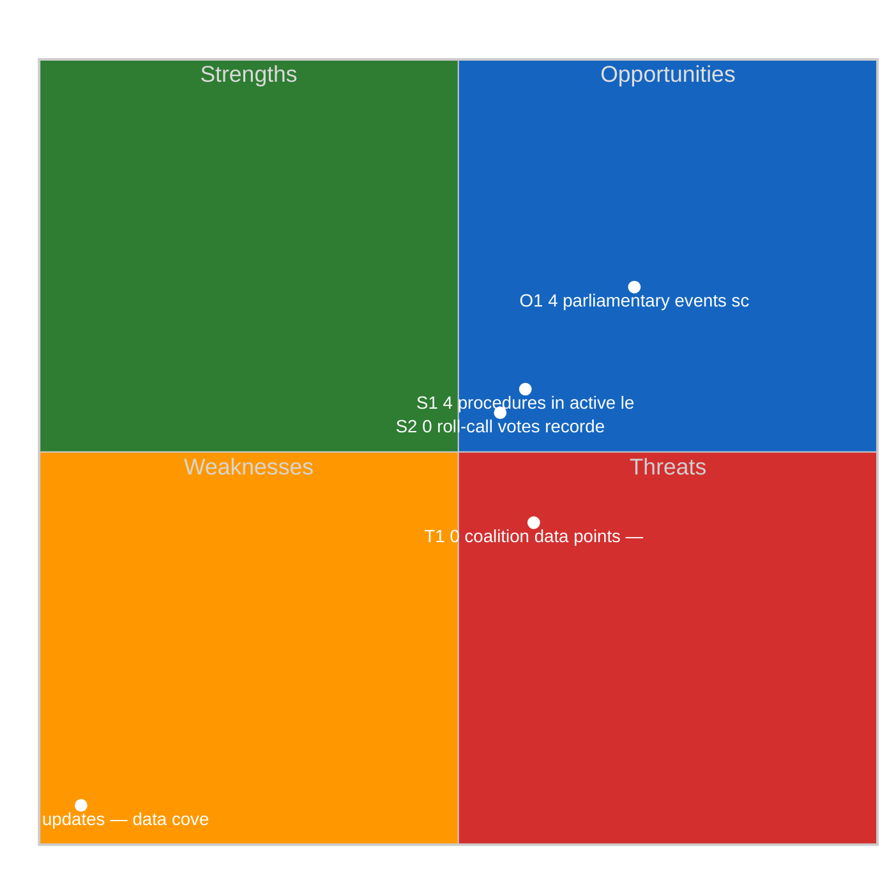

# Full Political SWOT Analysis

## Executive Summary

**Strategic Position Score**: 3.3/10
**Overall Assessment**: Weak strategic position: weaknesses and threats dominate — urgent mitigation needed.
**Analysis Date**: 2026-04-10

> This SWOT analysis is derived from 4 procedures, 4 events, 11 adopted texts, 2 documents, 0 voting records, and 0 coalition data points fetched from the European Parliament.

## SWOT Quadrant Chart

## SWOT Overview

| Category | Items | Avg Score | Trend |
|----------|-------|-----------|-------|
| 🟢 Strengths | 2 | 0.4 | stable |
| 🔴 Weaknesses | 1 | 5.0 | stable |
| 🔵 Opportunities | 1 | 2.1 | improving |
| 🟠 Threats | 1 | 0.9 | stable |

## 🟢 Strengths

### S1: 4 procedures in active legislative pipeline
- **Score**: 0.8/5
- **Confidence**: medium
- **Trend**: stable
- **Evidence**:
  - 4 procedures tracked in current period
  - 11 texts adopted
  - 2 documents published

### S2: 0 roll-call votes recorded with 0 questions
- **Score**: 0.0/5
- **Confidence**: low
- **Trend**: stable
- **Evidence**:
  - 0 voting records available
  - 0 parliamentary questions filed
  - 0 MEP activity updates

## 🔴 Weaknesses

### W1: 0 MEP updates — data coverage gap assessment
- **Score**: 5.0/5
- **Confidence**: medium
- **Trend**: stable
- **Evidence**:
  - 0 MEP updates in current period
  - 2 documents vs 4 procedures ratio
  - Data freshness depends on EP feed update frequency

## 🔵 Opportunities

### O1: 4 parliamentary events scheduled
- **Score**: 2.1/5
- **Confidence**: medium
- **Trend**: improving
- **Evidence**:
  - 4 events in analysis period
  - 11 texts adopted indicates legislative throughput
  - 4 procedures in various stages

## 🟠 Threats

### T1: 0 coalition data points — cohesion monitoring
- **Score**: 0.9/5
- **Confidence**: low
- **Trend**: stable
- **Evidence**:
  - 0 coalition observations recorded
  - Cross-reference with 0 voting records
  - 4 procedures may be affected by coalition shifts

## Cross-Impact Matrix

| Interaction | Net Effect | Rationale |
|-------------|-----------|----------|
| strength #1 × threat #1 | -0.16 | Strength "4 procedures in active legislative pipeline" partially mitigates threat "0 coalition data points — cohesion monitoring" |
| strength #2 × threat #1 | 0.00 | Strength "0 roll-call votes recorded with 0 questions" partially mitigates threat "0 coalition data points — cohesion monitoring" |
| weakness #1 × threat #1 | 0.75 | Weakness "0 MEP updates — data coverage gap assessment" amplifies threat "0 coalition data points — cohesion monitoring" |

## Strategic Priorities Matrix

## Data Summary

| Data Source | Count |
|-------------|-------|
| Procedures | 4 |
| Events | 4 |
| Documents | 2 |
| Voting Records | 0 |
| Adopted Texts | 11 |
| Coalitions | 0 |
| Questions | 0 |
| MEP Updates | 0 |
| **Total Data Points** | **21** |

## Date: 2026-04-10
