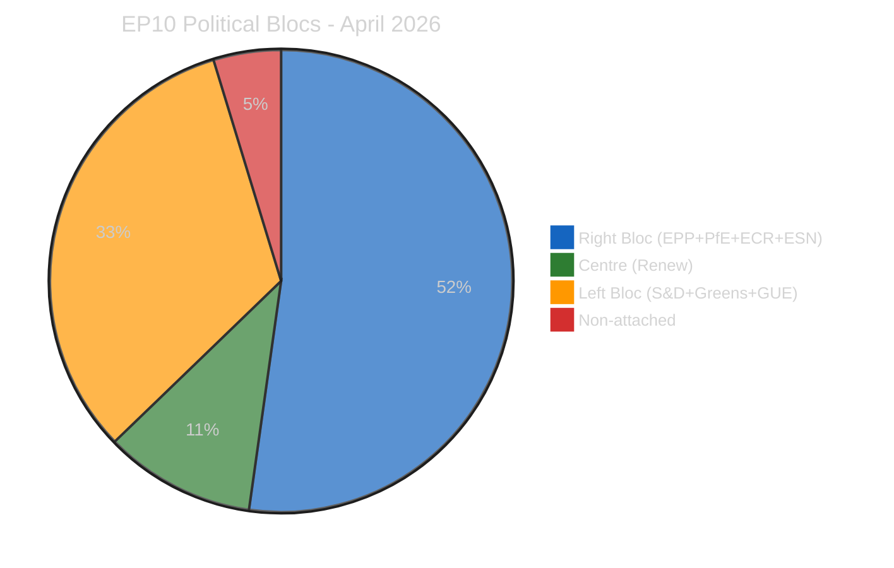

# Coalition Intelligence - EP10 Pre-Restart Dynamics Assessment

> **Assessment ID:** COA-2026-04-11-157
> **Date:** 2026-04-11 00:30 UTC
> **Analyst:** news-breaking workflow (Run 157)
> **Data Quality:** Partial (coalition dynamics API returned results with LOW confidence; MEP pagination failed)

---

## EP10 Coalition Architecture

### Seat Distribution and Power Dynamics

| Group | Seats | Share | Bloc | Role |
|-------|:-----:|:-----:|------|------|
| **EPP** | 185 | 25.7% | Centre-right | Largest group; leads flexible majorities |
| **S&D** | 135 | 18.8% | Centre-left | Second largest; traditional grand coalition partner |
| **PfE** | 84 | 11.7% | Right | Third force; national-conservative platform |
| **ECR** | 79 | 11.0% | Right | Competitiveness focus; Renew convergence |
| **Renew** | 76 | 10.6% | Centre | Kingmaker position; pivotal for any majority |
| **Greens/EFA** | 53 | 7.4% | Centre-left | Green Deal defenders; declining influence in EP10 |
| **GUE/NGL** | 46 | 6.4% | Left | Opposition role; rarely in winning coalitions |
| **NI** | 34 | 4.7% | Non-attached | No group discipline; unpredictable votes |
| **ESN** | 28 | 3.9% | Far-right | Sovereignist bloc; consistently in opposition |

**Majority threshold:** 361 seats (50% + 1 of 720)

### Viable Coalition Paths

```mermaid
%%{init: {"theme":"dark","themeVariables":{"primaryColor":"#1565C0","primaryTextColor":"#ffffff","primaryBorderColor":"#0A3F7F","lineColor":"#90CAF9","secondaryColor":"#2E7D32","secondaryTextColor":"#ffffff","secondaryBorderColor":"#0F3F00","tertiaryColor":"#FF9800","tertiaryTextColor":"#000000","tertiaryBorderColor":"#7F4F00","mainBkg":"#1565C0","secondBkg":"#2E7D32","tertiaryBkg":"#FF9800","noteBkgColor":"#FFC107","noteTextColor":"#000000","noteBorderColor":"#7F6000","errorBkgColor":"#D32F2F","errorTextColor":"#ffffff","fontFamily":"Inter, Helvetica, Arial, sans-serif","pie1":"#1565C0","pie2":"#2E7D32","pie3":"#FF9800","pie4":"#D32F2F","pie5":"#FFC107","pie6":"#7B1FA2","pie7":"#9E9E9E","pie8":"#0288D1","pie9":"#388E3C","pie10":"#F57C00","pie11":"#C62828","pie12":"#FBC02D","pieTitleTextSize":"18px","pieSectionTextSize":"14px","pieLegendTextSize":"13px","pieStrokeColor":"#1e1e1e","pieOuterStrokeColor":"#1e1e1e","git0":"#1565C0","git1":"#2E7D32","git2":"#FF9800","git3":"#D32F2F","gitBranchLabel0":"#ffffff","gitBranchLabel1":"#ffffff","gitBranchLabel2":"#000000","gitBranchLabel3":"#ffffff","cScale0":"#1565C0","cScale1":"#2E7D32","cScale2":"#FF9800","cScale3":"#D32F2F","cScale4":"#FFC107","cScale5":"#7B1FA2","cScale6":"#9E9E9E","cScale7":"#0288D1","xyChart":{"backgroundColor":"#1e1e1e","plotColorPalette":"#1565C0,#2E7D32,#FF9800,#D32F2F,#FFC107,#7B1FA2,#9E9E9E"}}}}%%
graph LR
    subgraph "Majority Coalition Paths (need 361+ seats)"
        P1["EPP+S&D+Renew = 396 seats - Traditional centre alliance"]
        P2["EPP+S&D+ECR = 399 seats - Grand coalition + right wing"]
        P3["EPP+ECR+Renew+PfE = 424 seats - Right-centre supermajority"]
        P4["EPP+S&D+Greens = 373 seats - Centre-left progressive"]
        P5["EPP+Renew+ECR = 340 seats - FAILS by 21 seats"]
    end
    
    style P1 fill:#28a745,color:#fff
    style P2 fill:#28a745,color:#fff
    style P3 fill:#ffc107,color:#000
    style P4 fill:#28a745,color:#fff
    style P5 fill:#dc3545,color:#fff
```

### Key Coalition Dynamics for Committee Restart

**1. Tariff countermeasures (2025/0261(COD)) - INTA:**
- **Required coalition:** EPP+S&D+Renew (Path 1, 396 seats) most likely
- **Risk:** EPP internal split on scope (DE free-trade vs. FR protectionist wings)
- **Alternative:** EPP+ECR+Renew (Path 5, 340 seats) fails on its own but ECR+PfE could substitute for S&D if scope is narrowed
- **Forecast:** MEDIUM confidence that Path 1 holds; tariff urgency creates cohesion pressure

**2. Banking Union SRMR3 trilogue - ECON:**
- **Required coalition:** EPP+S&D+Renew (Path 1) for Parliament position in trilogue
- **Risk:** S&D demands social safeguards as precondition; Renew split on burden-sharing
- **Forecast:** HIGH confidence that trilogue proceeds; strong institutional momentum from Q1 adoption

**3. Anti-Corruption Directive (2023/0135(COD)) - LIBE:**
- **Required coalition:** Broad consensus expected (Paths 1, 2, or 4 all viable)
- **Risk:** Implementation delays at member-state level, not parliamentary coalition risk
- **Forecast:** HIGH confidence; consensus file with cross-group support

---

## Political Bloc Analysis

### Three-Pole Structure

| Bloc | Seats | Share | Key Interest |
|------|:-----:|:-----:|-------------|
| **Right** (EPP+PfE+ECR+ESN) | 376 | 52.2% | Competitiveness, defence, migration control |
| **Centre** (Renew) | 76 | 10.6% | Liberal economics, EU integration, rule of law |
| **Left** (S&D+Greens/EFA+GUE/NGL) | 234 | 32.5% | Social justice, Green Deal, workers rights |
| **Non-attached** (NI) | 34 | 4.7% | Diverse; no consistent bloc position |

**Structural insight:** The right bloc (52.2%) holds a theoretical majority BUT includes ESN (3.9%) which is excluded from formal coalitions due to cordon sanitaire. Excluding ESN, the viable right bloc = 348 seats (below 361 majority). This means Renew remains the kingmaker in all scenarios.

---

## Renew-ECR Convergence Tracker

| Metric | Value | Source | Confidence |
|--------|-------|--------|-----------|
| Voting cohesion (competitiveness files) | 0.95 | Runs 3-6 coalition sentiment | MEDIUM |
| Combined seats | 155 (21.5%) | Official EP composition | HIGH |
| Combined with EPP | 340 (below majority) | Calculated | HIGH |
| Policy alignment areas | Trade defence, competitiveness, deregulation | Prior run analysis | MEDIUM |
| First policy test | Tariff countermeasures (April 14-15) | Committee calendar | HIGH |

**Assessment:** The Renew-ECR convergence is the most significant coalition development of EP10 year 2. At 0.95 voting cohesion on competitiveness files, it approaches formal alliance levels. However, the alliance has not been tested on a major legislative file with real stakes. The tariff countermeasures vote will be the proving ground.

**Scenario if alliance formalises:**
- Creates a 155-seat swing bloc that can join either EPP-led or (theoretically) S&D-led majorities
- Shifts EPP strategic calculus: currently relies on S&D+Renew; could shift to ECR+Renew+PfE
- Weakens S&D bargaining position in traditional grand coalition negotiations
- May trigger S&D-Greens-GUE counter-alignment on social/environmental files

---

## Stress Indicators

| Indicator | Current Value | Normal Range | Status |
|-----------|:------------:|:------------:|--------|
| Grand coalition surplus | -5.5% | +5% to +15% (EP5-EP8) | BELOW NORMAL |
| Fragmentation index | 6.59 | 4.0-5.5 (historical) | ABOVE NORMAL |
| HHI | 0.1517 | 0.18-0.23 (historical) | BELOW NORMAL (deconcentration) |
| Bipolar index | 0.232 | 0.05-0.15 (historical) | ABOVE NORMAL (rightward shift) |
| Eurosceptic share | 15.6% | 5-10% (historical) | ABOVE NORMAL |
| Min winning coalition size | 3 groups | 2 groups (pre-2019) | ELEVATED |

**Overall coalition stress assessment:** EP10 operates in a structurally more complex coalition environment than any predecessor. The combination of high fragmentation, right-bloc growth, and grand coalition impossibility means every major legislative file requires multi-group negotiation. This system works (Q1 record output proves it) but is vulnerable to external shocks that split groups along national lines (e.g., tariff crisis).

---

## Sources

- Coalition Dynamics MCP Analysis (11.6K chars, partial) - LOW confidence
- EP Precomputed Statistics political landscape (2026-04-08) - HIGH confidence
- Coalition sentiment analysis from Runs 3-6 - MEDIUM confidence
- Political SWOT Framework v2.2 - methodology reference
- Official EP seat composition - HIGH confidence
