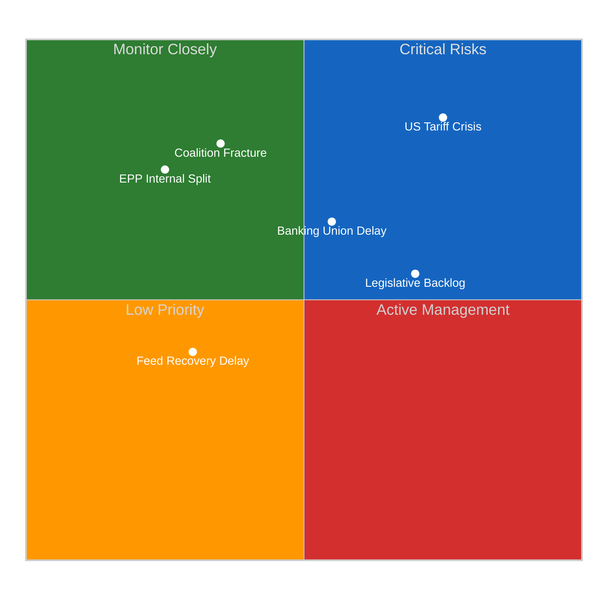
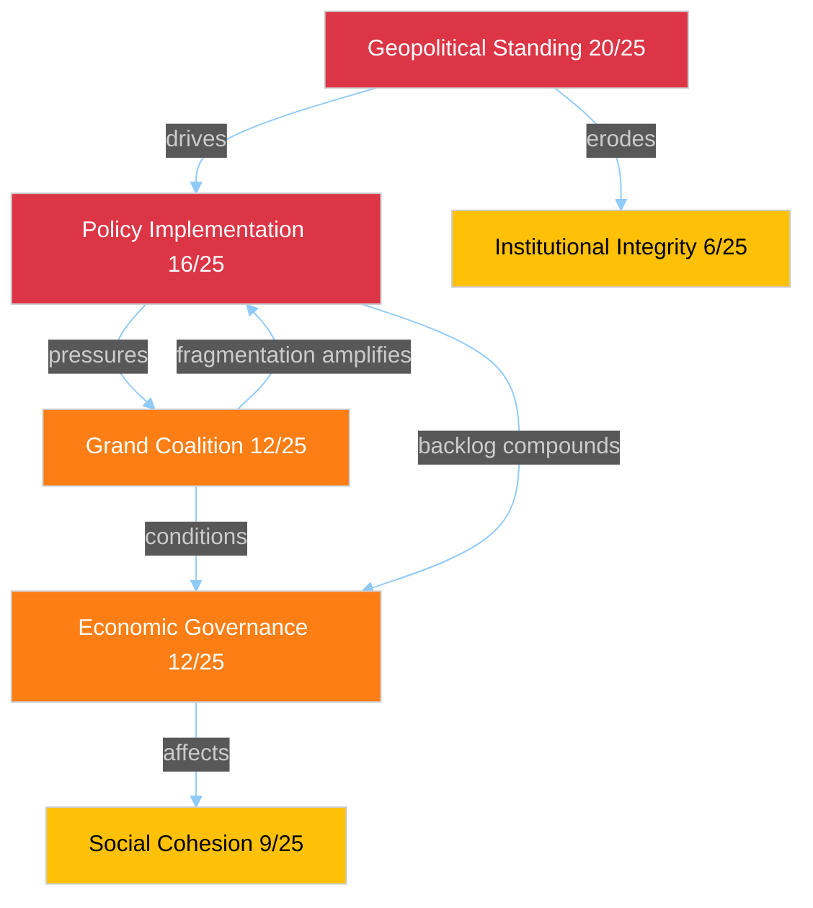

# Political Risk Assessment - Easter Recess T-3 Committee Restart

> **Assessment ID:** RSK-2026-04-11-157
> **Date:** 2026-04-11 00:30 UTC
> **Framework:** Likelihood x Impact 5x5 Matrix (political-risk-methodology v2.2)
> **Analyst:** news-breaking workflow (Run 157)
> **Overall Risk Level:** HIGH (12.85/25 composite)

---

## Executive Summary

Political risk continues its upward trajectory as the Easter recess approaches its conclusion (Day 16 of 16). The convergence of the US tariff countermeasures deadline (15 April), legislative backlog from the pre-Easter sprint, and extended EP API monitoring gap creates a risk environment that has escalated from 10.10/25 (Run 3, Apr 9) to 12.85/25 (current run). The committee restart on 14 April faces a compressed timeframe with multiple high-priority files competing for attention.

---

## Six EP Political Risk Categories

### 1. Grand Coalition Stability

| Dimension | Score | Rationale |
|-----------|:-----:|-----------|
| Likelihood | 4/5 (Likely) | EPP+S&D = 44.5%, structurally below majority; 3-group minimum required since 2019 |
| Impact | 3/5 (Moderate) | Failure to form majority delays but does not block legislation; flexible coalitions compensate |
| **Risk Score** | **12/25** | **HIGH** |

**Evidence:** Fragmentation index 6.59 (highest in EP history). HHI at 0.1517 confirms deconcentration from near-duopoly to multi-polar system. Grand coalition surplus deficit of -5.5% means EPP+S&D cannot pass legislation alone on any file. Prior analyses confirmed Renew-ECR competitiveness convergence at 0.95 cohesion, creating a viable alternative coalition path that further destabilises traditional grand coalition assumptions.

**Trend:** Stable risk level. The structural reality has not changed since EP10 formation. However, the tariff crisis may test whether the three-pole system can deliver rapid policy responses under time pressure.

### 2. Policy Implementation Risk

| Dimension | Score | Rationale |
|-----------|:-----:|-----------|
| Likelihood | 4/5 (Likely) | 13 COD procedures backlogged; ECON-INTA dual bottleneck; tariff deadline convergence |
| Impact | 4/5 (Major) | Trade countermeasures failure would signal EU policy paralysis to international partners |
| **Risk Score** | **16/25** | **CRITICAL** |

**Evidence:** 2025/0261(COD) tariff countermeasures file has April 15 external deadline. INTA emergency procedure path requires cross-group consensus achievable only with EPP+S&D+Renew alignment (minimum winning coalition = 3 groups). Banking Union SRMR3/BRRD3/DGSD2 package awaiting ECON-Council trilogue creates competing demand for political capital. Anti-Corruption Directive (2023/0135(COD)) has 24-month transposition clock (deadline March 2028) creating implementation urgency.

**Trend:** Rising. Each day of recess without feed visibility compounds the risk of undetected procedural complications.

### 3. Institutional Integrity Risk

| Dimension | Score | Rationale |
|-----------|:-----:|-----------|
| Likelihood | 2/5 (Unlikely) | No active Article 7 proceedings; EP-Council relations stable |
| Impact | 3/5 (Moderate) | Extended API outage creates transparency deficit |
| **Risk Score** | **6/25** | **MEDIUM** |

**Evidence:** The 4+ day EP API outage during recess represents an institutional transparency gap. While routine during recesses, the longest observed in EP10 reduces public monitoring capacity. MEP oversight intensity at 8.54 questions per MEP (up from 5.76 in 2004) demonstrates strong baseline institutional health.

### 4. Economic Governance Risk

| Dimension | Score | Rationale |
|-----------|:-----:|-----------|
| Likelihood | 3/5 (Possible) | Banking Union trilogue pending; tariff impact on EU budget |
| Impact | 4/5 (Major) | SRMR3/BRRD3/DGSD2 represents fundamental financial architecture reform |
| **Risk Score** | **12/25** | **HIGH** |

**Evidence:** Banking Union triple package (TA-10-2026-0092, TA-10-2026-0094, TA-10-2026-0096) adopted in Q1 plenary sprint now awaiting Council trilogue. US tariff countermeasures create fiscal uncertainty for EU trade balance. Committee meeting frequency at 2,363 (2026 projected) indicates high workload for ECON.

### 5. Social Cohesion Risk

| Dimension | Score | Rationale |
|-----------|:-----:|-----------|
| Likelihood | 3/5 (Possible) | Tariff impacts on employment in exposed sectors |
| Impact | 3/5 (Moderate) | Regional economic disparities may widen |
| **Risk Score** | **9/25** | **MEDIUM** |

**Evidence:** Eurosceptic seat share at 15.6% reflects underlying social discontent. Right-bloc consolidated share at 52.3% (political bloc analysis) indicates voter preference for national sovereignty narratives. S&D positioning improvement (+0.2 from coalition sentiment analysis, Run 3) may reflect growing social dimension demand.

### 6. Geopolitical Standing Risk

| Dimension | Score | Rationale |
|-----------|:-----:|-----------|
| Likelihood | 4/5 (Likely) | US tariff confrontation active; April 15 deadline |
| Impact | 5/5 (Severe) | EU credibility as trade partner at stake |
| **Risk Score** | **20/25** | **CRITICAL** |

**Evidence:** 2025/0261(COD) tariff countermeasures represent EU external policy credibility test. INTA committee holds primary jurisdiction. Prior analysis identified this as the highest single-risk item across all categories. The combination of external deadline pressure and internal coalition complexity makes this the defining risk of the April session.

---

## Composite Risk Summary

```mermaid
%%{init: {"theme":"dark","themeVariables":{"primaryColor":"#1565C0","primaryTextColor":"#ffffff","primaryBorderColor":"#0A3F7F","lineColor":"#90CAF9","secondaryColor":"#2E7D32","secondaryTextColor":"#ffffff","secondaryBorderColor":"#0F3F00","tertiaryColor":"#FF9800","tertiaryTextColor":"#000000","tertiaryBorderColor":"#7F4F00","mainBkg":"#1565C0","secondBkg":"#2E7D32","tertiaryBkg":"#FF9800","noteBkgColor":"#FFC107","noteTextColor":"#000000","noteBorderColor":"#7F6000","errorBkgColor":"#D32F2F","errorTextColor":"#ffffff","fontFamily":"Inter, Helvetica, Arial, sans-serif","pie1":"#1565C0","pie2":"#2E7D32","pie3":"#FF9800","pie4":"#D32F2F","pie5":"#FFC107","pie6":"#7B1FA2","pie7":"#9E9E9E","pie8":"#0288D1","pie9":"#388E3C","pie10":"#F57C00","pie11":"#C62828","pie12":"#FBC02D","pieTitleTextSize":"18px","pieSectionTextSize":"14px","pieLegendTextSize":"13px","pieStrokeColor":"#1e1e1e","pieOuterStrokeColor":"#1e1e1e","git0":"#1565C0","git1":"#2E7D32","git2":"#FF9800","git3":"#D32F2F","gitBranchLabel0":"#ffffff","gitBranchLabel1":"#ffffff","gitBranchLabel2":"#000000","gitBranchLabel3":"#ffffff","cScale0":"#1565C0","cScale1":"#2E7D32","cScale2":"#FF9800","cScale3":"#D32F2F","cScale4":"#FFC107","cScale5":"#7B1FA2","cScale6":"#9E9E9E","cScale7":"#0288D1","xyChart":{"backgroundColor":"#1e1e1e","plotColorPalette":"#1565C0,#2E7D32,#FF9800,#D32F2F,#FFC107,#7B1FA2,#9E9E9E"}}}}%%
graph LR
    subgraph "Risk Heat Map - 11 April 2026"
        R1["Grand Coalition 12/25 HIGH"]
        R2["Policy Implementation 16/25 CRITICAL"]
        R3["Institutional Integrity 6/25 MEDIUM"]
        R4["Economic Governance 12/25 HIGH"]
        R5["Social Cohesion 9/25 MEDIUM"]
        R6["Geopolitical Standing 20/25 CRITICAL"]
    end

    style R1 fill:#fd7e14,color:#fff
    style R2 fill:#dc3545,color:#fff
    style R3 fill:#ffc107,color:#000
    style R4 fill:#fd7e14,color:#fff
    style R5 fill:#ffc107,color:#000
    style R6 fill:#dc3545,color:#fff
```

| Category | Score | Level | Trend |
|----------|:-----:|-------|-------|
| Grand Coalition Stability | 12/25 | HIGH | Stable |
| Policy Implementation | 16/25 | CRITICAL | Rising |
| Institutional Integrity | 6/25 | MEDIUM | Stable |
| Economic Governance | 12/25 | HIGH | Rising |
| Social Cohesion | 9/25 | MEDIUM | Stable |
| Geopolitical Standing | 20/25 | CRITICAL | Rising |
| **Composite (weighted avg)** | **12.85/25** | **HIGH** | **Rising** |

**Weighting:** Geopolitical (25%), Policy (25%), Grand Coalition (20%), Economic (15%), Social (10%), Institutional (5%)

---

## Risk Interconnections

**Key cascade:** Geopolitical tariff crisis (20/25) directly drives policy implementation pressure (16/25), which in turn stresses grand coalition stability (12/25). This three-link cascade represents the highest-probability risk amplification pathway for the committee restart.

---

## Sources

- EP Precomputed Statistics (generated 2026-04-08, 264K chars) - HIGH confidence
- Coalition dynamics analysis (partial, 11.6K chars) - LOW confidence
- Risk trajectory from editorial memory (Runs 3-12) - MEDIUM confidence
- Tariff file reference: 2025/0261(COD) - HIGH confidence (adopted text reference)
- Banking Union references: TA-10-2026-0092, TA-10-2026-0094, TA-10-2026-0096 - HIGH confidence
- Anti-Corruption Directive: 2023/0135(COD) - HIGH confidence
