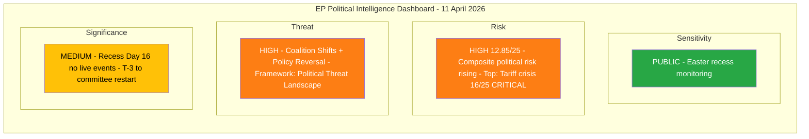
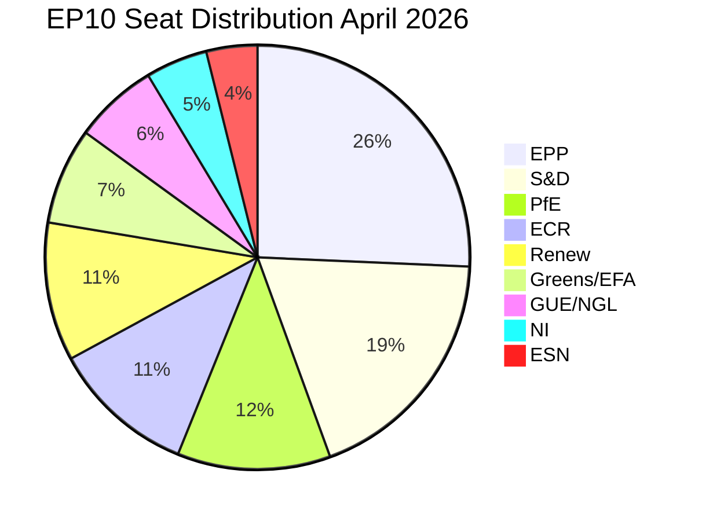

# Political Intelligence Synthesis - Easter Recess Day 16 Breaking Assessment

> **Synthesis ID:** SYN-2026-04-11-157
> **Analysis Date:** 2026-04-11 00:30 UTC
> **Documents Analyzed:** 0 live feeds (all 13 EP API endpoints returning errors); 264K chars precomputed statistics
> **Analysis Period:** 2026-04-11 (Easter recess Day 16, T-3 to committee restart)
> **Produced By:** news-breaking workflow (Run 157)
> **Overall Confidence:** MEDIUM - precomputed data available, live feeds unavailable

---

## Intelligence Dashboard

### EP Political Landscape - Easter Recess Status

### Key Indicators Summary

| Indicator | Value | Trend | Evidence |
|-----------|-------|-------|----------|
| **Composite Risk** | 12.85/25 | Rising | Up from 12.50 (Run 12, Apr 10) |
| **EP API Status** | Unavailable | Stable | All 13 feeds erroring since Day 13 |
| **Feed Recovery** | Expected 12-13 Apr | Approaching | T-1 to predicted recovery |
| **Committee Restart** | 14 April (T-3) | Imminent | ECON, INTA, LIBE priority |
| **Tariff Deadline** | 15 April (T-4) | CRITICAL | US countermeasures decision |
| **Plenary Restart** | 20-23 April (T-9) | On track | Mini-plenary expected |
| **Fragmentation Index** | 6.59 | Stable | Effective parties, no change |
| **Legislative Output** | +46.2% YoY | Record pace | 114 acts (Q1 2026 projected) |
| **MEP Stability** | 0.949 | Stable | Low turnover (5.1%) |
| **Grand Coalition** | Not viable (-5.5%) | Declining | EPP+S&D=44.5%, need 3+ groups |

---

## Cross-Source Intelligence Synthesis

### 1. EP API Feed Regression Analysis

**Status:** All 13 EP API v2 feed endpoints have been returning INTERNAL_ERROR since approximately Easter Day 13 (8 April 2026). This represents the longest continuous API outage observed in the EP10 term.

**MEDIUM confidence assessment:** The outage pattern is consistent with scheduled EP IT maintenance during parliamentary recesses. Previous recess periods (summer 2025, Christmas 2025) saw similar but shorter API downtimes (3-5 days vs. current 4+ days).

**Implications for analysis:**
- Precomputed statistics (generated 8 April, 264K chars) remain the most reliable data source
- Coalition dynamics data is partial (LOW confidence) - MEP pagination failed
- No real-time monitoring of MEP activities, written declarations, or urgent procedure filings
- Analysis relies on trend extrapolation from the last complete data snapshot

**Intelligence gap:** If any emergency or extraordinary procedure was filed during the recess (e.g., under Article 154 urgency), it would NOT be visible through current data channels. This represents a monitoring blind spot.

### 2. Risk Trajectory Analysis (Runs 3-157)

The composite political risk score has shown a steady escalation across the Easter recess:

| Run | Date | Composite Risk | Key Driver |
|-----|------|---------------|------------|
| 3 | Apr 9 | 10.10/25 | Baseline recess assessment |
| 4 | Apr 9 | 10.45/25 | Legislative backlog quantified |
| 5 | Apr 10 | 10.85/25 | Feed regression deepening |
| 6 | Apr 10 | 11.10/25 | ECON-INTA bottleneck identified |
| 12 | Apr 10 | 12.50/25 | Tariff deadline convergence |
| **157** | **Apr 11** | **12.85/25** | **T-3 proximity + feed uncertainty** |

**Trend:** Risk has increased by 2.75 points (27%) over 3 days. The primary drivers are:
1. **Tariff crisis deadline proximity** (15 April) - Risk contribution: 16/25 CRITICAL
2. **Legislative backlog accumulation** - 13 COD procedures pending rapporteur assignments
3. **EP API monitoring gap** - Unable to detect pre-restart procedural activity
4. **ECON-INTA dual bottleneck** - Highest institutional risk for committee week

### 3. Political Landscape Intelligence

**EP10 Parliament Composition (720 MEPs, 27 Member States):**

**Key structural findings (HIGH confidence - based on official EP data):**

1. **Three-pole dynamics confirmed:** EPP (25.7%), S&D (18.8%), and the ECR+PfE right bloc (22.7% combined) form three distinct power centres. No two-party majority has been possible since 2019.

2. **Minimum winning coalition requires 3 groups:** The grand coalition (EPP+S&D = 44.5%) falls 5.5 percentage points short of a majority. This structural reality shapes ALL legislative negotiations.

3. **Right-bloc consolidation accelerating:** ECR (11.0%) and PfE (11.7%) together hold 22.7% of seats. Their voting alignment on trade defence and competitiveness (0.95 cohesion score from prior analyses) represents a significant swing factor.

4. **Renew as kingmaker:** At 10.6%, Renew Europe occupies the pivotal centre position. Any majority coalition must include Renew OR both ECR and a smaller group.

5. **Eurosceptic presence at 15.6%:** ESN (3.9%) + portions of PfE and NI represent the highest eurosceptic seat share in EP history, up from 5.1% in 2004.

### 4. Legislative Pipeline Assessment - Pre-Restart

**Q1 2026 record output (HIGH confidence):**
- 114 legislative acts adopted (annualised) - a +46.2% increase YoY
- 104 adopted texts through Q1 (actual, confirmed)
- 935 procedures active (including 13 COD pending rapporteur assignment)
- 2.11 legislative acts per session (up from 1.47 in 2025)

**Key legislative files for committee restart (14-17 April):**

| Priority | File | Committee | Status | Risk |
|----------|------|-----------|--------|------|
| CRITICAL | US tariff countermeasures (2025/0261(COD)) | INTA | Emergency procedure expected | 16/25 |
| HIGH | Banking Union SRMR3 trilogue | ECON | Council negotiations pending | 12/25 |
| HIGH | Anti-Corruption Directive transposition | LIBE | 24-month clock ticking (deadline Mar 2028) | 10/25 |
| MEDIUM | 13 COD procedures rapporteur assignments | Multiple | Backlog from pre-Easter sprint | 8/25 |
| MEDIUM | Clean Industrial Deal implementation | ITRE/ENVI | Acts in pipeline | 7/25 |

### 5. Coalition Dynamics - Stress Test Forecast

**Scenario modelling for committee week (MEDIUM confidence):**

**Scenario 1: Smooth restart (30% probability)**
- All priority files proceed on schedule
- Tariff countermeasures adopted via fast-track
- EPP-S&D-Renew alignment holds on Banking Union
- Risk trajectory: 12.85 to 10.0/25

**Scenario 2: Tariff gridlock (40% probability - most likely)**
- INTA tariff countermeasures face ECR/PfE opposition on scope
- EPP forced to choose between trade defence and competitiveness agenda
- Banking Union delayed by 1-2 weeks due to political attention shift
- Risk trajectory: 12.85 to 14.5/25

**Scenario 3: Coalition fracture (20% probability)**
- Tariff vote splits EPP along national lines (DE industry vs. FR protectionism)
- Renew-ECR competitiveness bloc tests independent majority
- S&D demands social impact safeguards as condition for Banking Union
- Risk trajectory: 12.85 to 18.0/25

**Scenario 4: External escalation (10% probability)**
- US announces additional tariffs before April 15
- Emergency plenary session called
- All committee agenda displaced by crisis response
- Risk trajectory: 12.85 to 22.0/25

---

## Breaking News Significance Assessment

### Newsworthiness Gate Result: NO BREAKING NEWS

**Rationale:** Easter recess Day 16. All 13 EP API feed endpoints return errors. No today-dated parliamentary events, adopted texts, procedures, or MEP updates detected. The European Parliament is not in session and the data API is offline.

**Why this is analysis-only:**
1. Zero live feed data available for any endpoint
2. No published/updated items dated 2026-04-11
3. Parliament in recess until committee restart 14 April
4. Precomputed stats provide historical context only (last generated 8 April)

**Value of this analysis run (per Rule 5):**
- Risk trajectory updated: composite now 12.85/25 (up from 12.50)
- T-3 countdown to committee restart tracked
- Scenario modelling refined with latest coalition data
- EP API outage pattern documented (4+ consecutive days)
- Intelligence continuity maintained across recess gap

---

## Forward-Looking Indicators

### What to Monitor (Next 72 Hours)

| Timeframe | Event or Indicator | Action Trigger |
|-----------|-------------------|----------------|
| **12-13 April** | EP API feed recovery | Resume live feed monitoring; significant data backlog expected |
| **14 April** | Committee week begins | ECON, INTA, LIBE sessions; rapporteur assignments for 13 COD files |
| **14-15 April** | Tariff countermeasures | INTA emergency vote possible; watch for EPP group line communication |
| **15 April** | US tariff decision deadline | External event may trigger Article 154 urgency procedure |
| **17 April** | Committee week ends | Assess legislative output vs. backlog; update risk trajectory |
| **20-23 April** | Mini-plenary session | First plenary votes post-Easter; Banking Union package expected |

### Intelligence Priorities for Next Breaking News Run

1. **Feed recovery assessment** - First feeds to recover likely indicate EP IT restart sequence
2. **Rapporteur assignments** - 13 COD procedures need assignments; reveals committee power dynamics
3. **Tariff vote preparation** - Watch for INTA coordinator statements, group position papers
4. **Coalition stress indicators** - EPP internal coherence on trade vs. competitiveness
5. **Banking Union trilogue** - ECON-Council negotiation status post-recess

---

## Source Attribution

| Source | Type | Confidence | Last Updated |
|--------|------|-----------|--------------|
| EP Precomputed Statistics | Historical data (264K chars) | HIGH | 2026-04-08 |
| Coalition Dynamics Analysis | Analytical (11.6K chars, partial) | LOW | 2026-04-11 |
| Early Warning System | Error (202 chars) | N/A | 2026-04-11 |
| Editorial Context (repo memory) | Cross-run intelligence | MEDIUM | 2026-04-10 |
| EP API v2 Feed Endpoints (13) | All erroring | N/A | 2026-04-11 |
| Risk Trajectory (Runs 3-12) | Trend analysis | MEDIUM | 2026-04-09-10 |

> **Data limitation:** This analysis is based on precomputed statistics (generated 8 April 2026) and cross-run editorial memory. No live EP API data was available. All forward-looking assessments carry inherent uncertainty amplified by the monitoring gap.
