# Political Threat Landscape Analysis - T-3 Pre-Restart Assessment

> **Assessment ID:** THR-2026-04-11-157
> **Date:** 2026-04-11 00:30 UTC
> **Frameworks Applied:** Political Threat Landscape (6-dimension), Attack Trees, PESTLE
> **Analyst:** news-breaking workflow (Run 157)
> **Overall Threat Level:** HIGH

---

## Executive Summary

With the Easter recess concluding in 3 days and committee work resuming 14 April, the threat landscape is dominated by the convergence of the US tariff countermeasures deadline (15 April), legislative backlog pressure, and the structural fragility of EP10 coalition dynamics. The Political Threat Landscape model identifies Coalition Shifts and Policy Reversal as the two highest-severity threat dimensions.

---

## Political Threat Landscape - 6-Dimension Assessment

```mermaid
%%{init: {"theme":"dark","themeVariables":{"primaryColor":"#1565C0","primaryTextColor":"#ffffff","primaryBorderColor":"#0A3F7F","lineColor":"#90CAF9","secondaryColor":"#2E7D32","secondaryTextColor":"#ffffff","secondaryBorderColor":"#0F3F00","tertiaryColor":"#FF9800","tertiaryTextColor":"#000000","tertiaryBorderColor":"#7F4F00","mainBkg":"#1565C0","secondBkg":"#2E7D32","tertiaryBkg":"#FF9800","noteBkgColor":"#FFC107","noteTextColor":"#000000","noteBorderColor":"#7F6000","errorBkgColor":"#D32F2F","errorTextColor":"#ffffff","fontFamily":"Inter, Helvetica, Arial, sans-serif","pie1":"#1565C0","pie2":"#2E7D32","pie3":"#FF9800","pie4":"#D32F2F","pie5":"#FFC107","pie6":"#7B1FA2","pie7":"#9E9E9E","pie8":"#0288D1","pie9":"#388E3C","pie10":"#F57C00","pie11":"#C62828","pie12":"#FBC02D","pieTitleTextSize":"18px","pieSectionTextSize":"14px","pieLegendTextSize":"13px","pieStrokeColor":"#1e1e1e","pieOuterStrokeColor":"#1e1e1e","git0":"#1565C0","git1":"#2E7D32","git2":"#FF9800","git3":"#D32F2F","gitBranchLabel0":"#ffffff","gitBranchLabel1":"#ffffff","gitBranchLabel2":"#000000","gitBranchLabel3":"#ffffff","cScale0":"#1565C0","cScale1":"#2E7D32","cScale2":"#FF9800","cScale3":"#D32F2F","cScale4":"#FFC107","cScale5":"#7B1FA2","cScale6":"#9E9E9E","cScale7":"#0288D1","xyChart":{"backgroundColor":"#1e1e1e","plotColorPalette":"#1565C0,#2E7D32,#FF9800,#D32F2F,#FFC107,#7B1FA2,#9E9E9E"}}}}%%
graph TD
    TL["Political Threat Landscape - 11 April 2026"]
    
    TL --> CS["Coalition Shifts - HIGH - Renew-ECR convergence 0.95 - EPP dual-track strategy under pressure"]
    TL --> TR["Transparency Deficit - MEDIUM - EP API down 4+ days - Monitoring blind spot during recess"]
    TL --> PR["Policy Reversal - HIGH - Tariff 2025/0261 deadline April 15 - Banking Union trilogue at risk"]
    TL --> IP["Institutional Pressure - MEDIUM - ECON-INTA dual bottleneck - 13 COD backlog"]
    TL --> LO["Legislative Obstruction - MEDIUM - Compressed committee week - Multiple priority files competing"]
    TL --> DE["Democratic Erosion - LOW - MEP stability 0.949 - Oversight intensity 8.54 healthy"]
    
    style TL fill:#0d6efd,color:#fff
    style CS fill:#fd7e14,color:#fff
    style TR fill:#ffc107,color:#000
    style PR fill:#fd7e14,color:#fff
    style IP fill:#ffc107,color:#000
    style LO fill:#ffc107,color:#000
    style DE fill:#28a745,color:#fff
```



### Dimension 1: Coalition Shifts (HIGH)

**Current Threat:** The Renew-ECR competitiveness convergence (0.95 cohesion, documented in Runs 3-6) represents a structural coalition realignment threat. If this bloc solidifies into a formal voting alliance, it would fundamentally alter the three-pole dynamic by creating a centre-right alternative to EPP-led coalitions.

**CMO Assessment:**
- **Capability:** Renew (76 seats) + ECR (79 seats) = 155 seats (21.5%). Not a majority alone, but combined with EPP (185) creates a 340-seat supermajority.
- **Motivation:** Shared economic liberalisation and competitiveness agenda. US tariff crisis creates external pressure for trade-defence alignment.
- **Opportunity:** Committee restart provides first post-recess test of this alignment. INTA tariff vote will be the proving ground.

**Evidence:** Prior run coalition sentiment analysis showed S&D positioning improving (+0.2) while EPP declined (-0.1), suggesting the competitive bloc may be drawing EPP-adjacent moderates.

**Confidence:** MEDIUM - Based on pre-recess voting pattern analysis; live feed data unavailable to confirm current group communications.

### Dimension 2: Transparency Deficit (MEDIUM)

**Current Threat:** The EP API has been returning errors on all 13 feed endpoints since Day 13 of the recess (approximately 8 April). This is the longest continuous API outage in the EP10 term, creating a monitoring blind spot that could mask:
- Emergency procedure filings under Article 154
- MEP group-switching declarations
- Written questions signalling policy positions
- Pre-committee negotiation documents

**Mitigation:** Precomputed statistics (264K chars, generated 8 April) provide historical context. Feed recovery expected 12-13 April based on past recess patterns.

**Confidence:** MEDIUM - Outage pattern is consistent with past recesses but duration exceeds precedent.

### Dimension 3: Policy Reversal (HIGH)

**Current Threat:** Two policy reversal risks dominate:

1. **Tariff countermeasures stalling (2025/0261(COD)):** If INTA fails to advance the emergency procedure by 15 April, the EU loses its initial response window. This would represent a reversal of the pre-Easter political commitment to trade defence.

2. **Banking Union trilogue collapse:** The SRMR3/BRRD3/DGSD2 package (TA-10-2026-0092, 0094, 0096) achieved plenary adoption but faces Council resistance on burden-sharing provisions. If the trilogue fails, months of ECON committee work could be reversed.

**Attack Tree - Tariff Response Failure:**
```
Goal: EU tariff response paralysis
  AND: INTA fails to schedule emergency vote
    OR: Committee coordinator disagreement
    OR: EPP internal split on scope
    OR: Procedural delay exceeds April 15 deadline
  AND: No fallback Commission autonomous action
    OR: Commission defers to Parliament
    OR: Legal basis challenge from Member State
```

**Confidence:** MEDIUM - Attack tree based on institutional procedure analysis; actual committee coordinator positions unknown during recess.

### Dimension 4: Institutional Pressure (MEDIUM)

**Current Threat:** The ECON-INTA dual bottleneck represents the highest institutional stress point. Both committees face priority files (Banking Union for ECON, tariff countermeasures for INTA) in a compressed committee week (14-17 April, 4 working days).

Additionally, 13 COD procedures need rapporteur assignments - a backlog from the pre-Easter sprint that reflects the high-output Q1 (114 legislative acts annualised, +46.2% YoY).

**Evidence:** Q1 2026 legislative output per session reached 2.11 (up from 1.47 in 2025), indicating the institution is operating at capacity.

### Dimension 5: Legislative Obstruction (MEDIUM)

**Current Threat:** The compressed post-Easter schedule creates conditions for legislative delay:
- Committee week: 14-17 April (4 days)
- Mini-plenary: 20-23 April (4 days)
- Multiple CRITICAL/HIGH priority files competing for floor time
- Rapporteur assignments for 13 COD files must precede substantive work

**Obstruction scenario:** If ECR or PfE use procedural tactics to delay the tariff countermeasures vote (e.g., requesting impact assessment, demanding committee hearing), the April 15 external deadline becomes unachievable.

### Dimension 6: Democratic Erosion (LOW)

**Current Status:** Baseline indicators healthy:
- MEP stability index: 0.949 (low turnover 5.1%)
- Oversight intensity: 8.54 questions per MEP (rising from 5.76 in 2004)
- Institutional memory risk: LOW
- Legislative output: record pace

No active Article 7 proceedings. EP-Council relations stable within normal parameters.

---

## PESTLE Analysis - Committee Restart Context

| Dimension | Assessment | Key Factor | Impact |
|-----------|-----------|------------|--------|
| **Political** | HIGH | Three-pole dynamics under tariff pressure | Coalition realignment test |
| **Economic** | HIGH | US tariff impact on EU trade balance | Banking Union architecture at stake |
| **Social** | MEDIUM | Employment in tariff-exposed sectors | Potential S&D leverage on social safeguards |
| **Technological** | LOW | Digital regulation stable post-AI Act | No immediate tech policy disruption |
| **Legal** | MEDIUM | Article 154 urgency procedure question | Legal basis for fast-track trade response |
| **Environmental** | LOW | Clean Industrial Deal in pipeline | Not competing for April committee time |

---

## Forward Threat Indicators

| Indicator | Watch For | Threshold | Action |
|-----------|----------|-----------|--------|
| EP API recovery | Feed status changes from error to operational | Any 1 of 13 feeds recovers | Immediately expand monitoring; check for backlogged data |
| INTA coordinator statement | Position on tariff vote scheduling | Public or leaked communication | Assess fast-track viability |
| EPP group line communication | Position on tariff scope | Internal group document | Evaluate coalition fracture risk |
| Renew-ECR joint statement | Joint position on competitiveness | Any formal or informal alignment | Confirm convergence trajectory |
| US tariff announcement | Additional tariffs before April 15 | Any new tariff measure | Escalate to emergency scenario |

---

## Sources

- Political Threat Landscape Framework v3.1 (analysis/methodologies/political-threat-framework.md)
- EP Precomputed Statistics (2026-04-08, 264K chars) - HIGH confidence
- Coalition dynamics (partial, 11.6K chars) - LOW confidence
- Risk trajectory editorial memory (Runs 3-12) - MEDIUM confidence
- Tariff file: 2025/0261(COD), Banking Union: TA-10-2026-0092/0094/0096 - HIGH confidence
