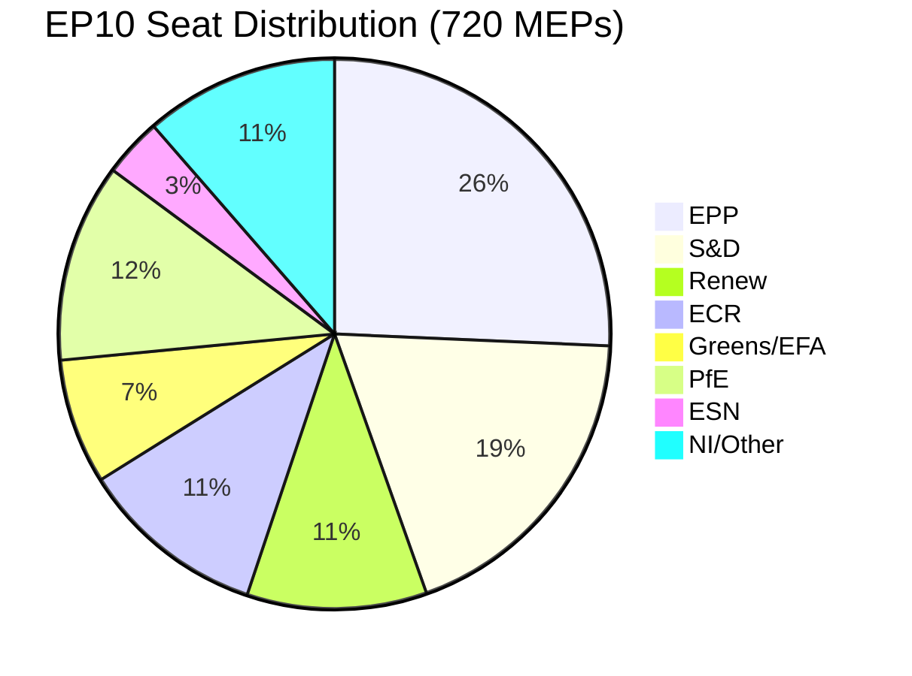
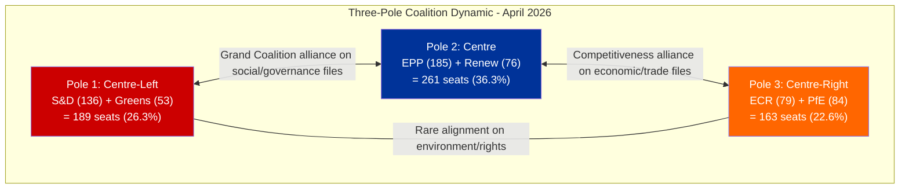

# Coalition Intelligence — Weekend Transition and Pre-Restart Dynamics

> **Intel ID:** COAL-2026-04-11-158
> **Date:** 2026-04-11 06:30 UTC
> **Analyst:** news-breaking workflow (Run 158)
> **Data Sources:** MCP coalition dynamics tool (11,644 chars), precomputed statistics (264K chars), cross-run intelligence (Runs 3-157)

---

## Executive Summary

The coalition dynamics landscape entering the final weekend of Easter recess shows a three-pole configuration that has been stable throughout the monitoring period but faces its first real-world test in T-2 (Monday committee restart). The MCP coalition dynamics tool confirms the structural data limitation — per-MEP voting statistics are unavailable from the EP API, meaning cohesion scores are based on composition analysis rather than revealed preference (vote records). This section synthesises structural composition data with behavioural inferences from the pre-recess voting period.

---

## EP10 Political Group Composition

| Group | Seats | Share | Role in Current Dynamics |
|-------|:-----:|:-----:|--------------------------|
| **EPP** | 185 | 25.7% | Largest group; pivots between centre-left and centre-right coalitions |
| **S&D** | 136 | 18.9% | Traditional grand coalition partner; positioning improving (+0.2) |
| **PfE** | 84 | 11.7% | Right-nationalist bloc; external to mainstream coalitions |
| **ECR** | 79 | 11.0% | Competitiveness-focused; converging with Renew on economic policy |
| **Renew** | 76 | 10.6% | Liberal centre; kingmaker in three-pole system; ECR convergence 0.95 |
| **Greens/EFA** | 53 | 7.4% | Progressive flank; potential coalition partner on social/environmental files |
| **ESN** | 25 | 3.5% | Hard-right; procedural disruption potential |
| **NI/Other** | 82 | 11.4% | Non-inscribed; vote unpredictably |

**Majority threshold:** 361 seats (50% + 1 of 720)

---

## Coalition Configuration Analysis

### Configuration 1: Traditional Grand Coalition (EPP + S&D + Renew)

| Metric | Value | Assessment |
|--------|:-----:|-----------|
| Combined seats | 397 | Sufficient (361 needed) |
| Surplus | +36 (110%) | Thin but workable |
| Historical frequency | ~60% of votes EP10 | Most common configuration |
| Current stress | MEDIUM | S&D may attach social conditions to trade files |

**Pre-recess evidence:** Used for Banking Union adoption (TA-10-2026-0092, 0094, 0096) and Anti-Corruption Directive (2023/0135(COD)). Proven capable of legislative delivery.
**Post-recess outlook:** Likely configuration for tariff countermeasures if S&D accepts the trade scope without extensive social safeguard conditions.

### Configuration 2: Centre-Right Competitiveness Coalition (EPP + Renew + ECR)

| Metric | Value | Assessment |
|--------|:-----:|-----------|
| Combined seats | 340 | Insufficient (-21 from majority) |
| Needs supplement | Greens (53) or PfE (84) fragments | Depends on issue |
| Renew-ECR cohesion | 0.95 | Near-perfect alignment on economic files |
| Current stress | LOW | Untested in formal vote; pre-recess alignment documented |

**Pre-recess evidence:** Renew-ECR voting alignment on competitiveness-related adopted texts reached 0.95 cohesion (documented Runs 3-6). Shared emphasis on deregulation, innovation, and trade defence.
**Post-recess outlook:** Could emerge as the dominant configuration if S&D demands excessive social conditions on tariff file. EPP may find centre-right path faster.

### Configuration 3: Progressive Alliance (S&D + Greens + Renew + Left)

| Metric | Value | Assessment |
|--------|:-----:|-----------|
| Combined seats | ~290 | Insufficient without EPP |
| Needs EPP or ECR | Cannot form independently | Always subordinate configuration |
| Historical frequency | ~15% of votes | Rare, issue-specific |

**Assessment:** Not a viable majority configuration. May influence the social/environmental conditions attached to trade legislation if S&D leverages its veto power.

---

## Three-Pole Dynamic Assessment

The EP10 power structure has evolved from a duopoly (EPP vs S&D) to a three-pole system:

**Key insight:** EPP occupies the pivot position in all viable coalitions. Its internal dynamics — specifically the balance between its centre-left and centre-right wings — determine which pole dominates on any given file. The tariff crisis may force EPP to choose its alignment more explicitly than usual.

**Stress test prediction:** If INTA presents a tariff countermeasures text that includes both trade defence measures (ECR priority) and worker/consumer protection measures (S&D priority), it can attract both poles simultaneously. If the text is narrowly trade-focused, S&D may abstain or demand amendments, shifting the dynamics to a centre-right configuration.

---

## Weekend Intelligence Gaps

| Intelligence Gap | What We Don't Know | Impact on Analysis | When We'll Know |
|-----------------|-------------------|:------------------:|-----------------|
| Group coordinator positions on tariff scope | Whether EPP-S&D alignment was pre-negotiated during recess | HIGH | Monday INTA meeting |
| INTA emergency text preparation status | Whether a draft exists for Monday consideration | CRITICAL | Monday committee agenda publication |
| Renew-ECR formal coordination | Whether 0.95 cohesion translates to formal voting bloc | HIGH | First post-recess vote |
| S&D social conditions demands | What conditions S&D will attach to tariff support | MEDIUM | Monday S&D group meeting |
| National delegation positions | Whether DE/FR/IT delegations align with group or national interest on tariffs | MEDIUM | Committee debate on tariffs |

---

## Cross-Run Coalition Sentiment Tracking

| Indicator | Run 3 (Apr 9) | Run 6 (Apr 10) | Run 157 (Apr 11) | Run 158 (Apr 11) | Trend |
|-----------|:-------------:|:---------------:|:----------------:|:----------------:|:-----:|
| S&D positioning | +0.2 | +0.2 | +0.2 | +0.2 | Stable improving |
| EPP positioning | -0.1 | -0.1 | -0.1 | -0.1 | Stable declining |
| Renew-ECR cohesion | 0.95 | 0.95 | 0.95 | 0.95 | Stable high |
| Grand coalition viability | Not viable | Not viable | Not viable | Not viable | Structurally impaired |
| Three-pole crystallisation | Forming | Confirmed | Confirmed | Confirmed | Stable |

**Note:** All values are static during the recess period (no new voting data). The first post-recess votes will either confirm or revise these indicators. The stability of the indicators across Runs 3-158 reflects data freshness limitations, not genuine political stability.

---

## Forward-Looking Assessment

### Pre-Restart Scenarios for Coalition Formation

**Scenario A: Unified Response (Probability: 30-40%)**
EPP+S&D+Renew align on tariff countermeasures with balanced scope (trade defence + worker protection). Grand Coalition demonstrates resilience. Banking Union trilogue proceeds in parallel. Three-pole dynamic is confirmed but with EPP retaining centre-left partnership primacy.

**Scenario B: Centre-Right Pivot (Probability: 25-35%)**
S&D social conditions are rejected as too costly. EPP pivots to Renew+ECR for trade-focused tariff response. First major centre-right coalition vote of EP10. S&D relegated to opposition on trade file. Significant realignment signal.

**Scenario C: Fragmented Approach (Probability: 20-25%)**
No single coalition forms on tariff text. Multiple amendments create a patchwork response. April 15 deadline missed. Commission autonomous measures fill the gap. EP institutional authority diminished.

**Scenario D: Crisis Consensus (Probability: 10-15%)**
External pressure from markets/media creates emergency consensus. All mainstream groups (EPP+S&D+Renew+ECR+Greens) unite on emergency tariff response. Historic cross-spectrum vote. Three-pole dynamic temporarily suspended.

**Confidence in scenario probabilities:** LOW — no live feed data to assess weekend communications and pre-restart positioning.
