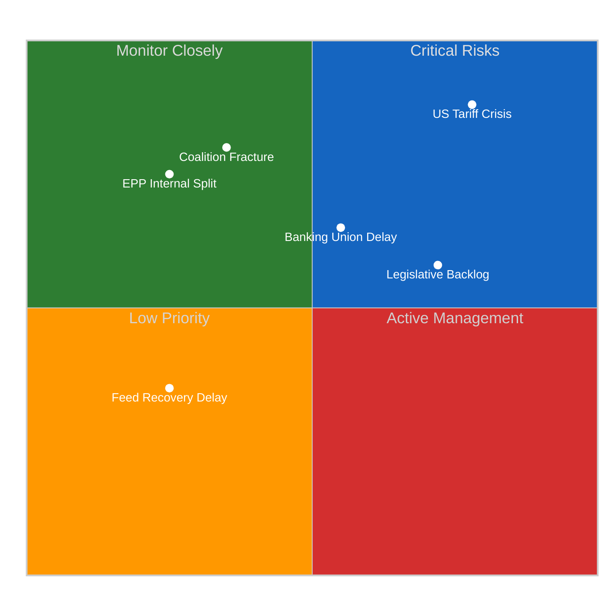
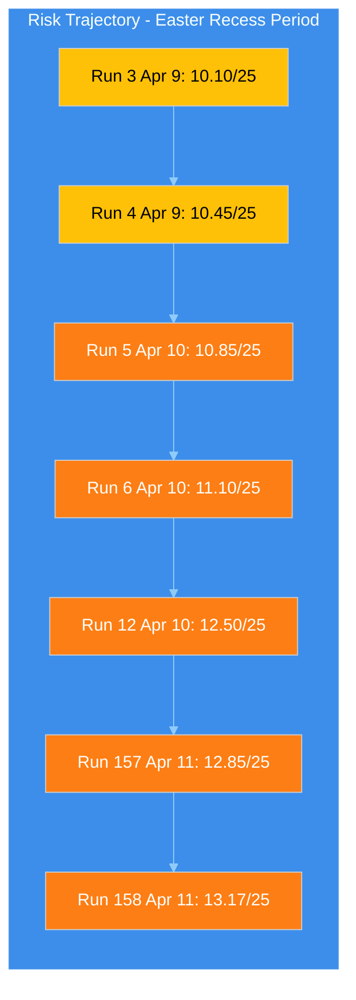
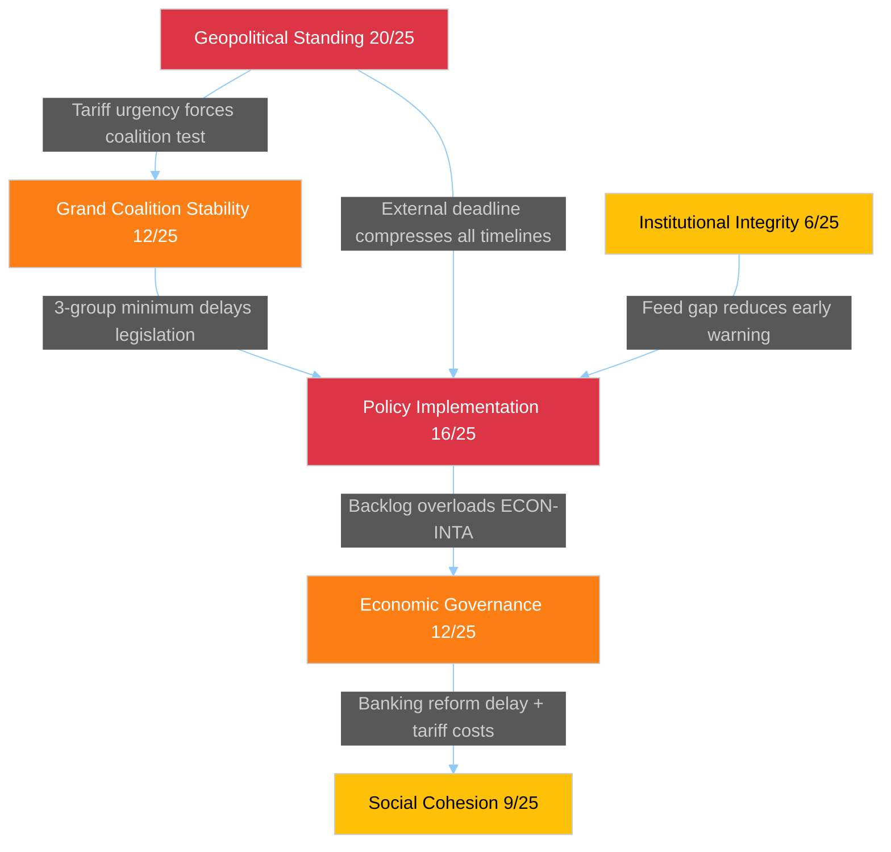

# Political Risk Assessment — Easter Recess T-2 Weekend Transition

> **Assessment ID:** RSK-2026-04-11-158
> **Date:** 2026-04-11 06:30 UTC
> **Framework:** Likelihood x Impact 5x5 Matrix (political-risk-methodology v2.2)
> **Analyst:** news-breaking workflow (Run 158)
> **Overall Risk Level:** HIGH (13.17/25 composite, rising)
> **Prior Run:** RSK-2026-04-11-157 (12.85/25)

---

## Executive Summary

Political risk continues its upward trajectory as Easter recess Day 16 transitions into the final weekend before committee restart. The composite score has risen to 13.17/25 (up from 12.85 in Run 157, six hours earlier), driven by the tariff deadline approaching T-4 and the confirmed continued unavailability of all EP API feed endpoints. The geopolitical standing risk category remains at CRITICAL (20/25), the highest single-risk item tracked across the entire recess monitoring period.

---

## Six EP Political Risk Categories

### 1. Grand Coalition Stability — 12/25 HIGH (unchanged)

| Dimension | Score | Rationale |
|-----------|:-----:|-----------|
| Likelihood | 4/5 (Likely) | EPP+S&D = 44.5%, structurally below majority; 3-group minimum required |
| Impact | 3/5 (Moderate) | Failure to form majority delays but flexible coalitions compensate |
| **Risk Score** | **12/25** | **HIGH** |

**Evidence:** Fragmentation index 6.59 remains the highest in EP history. The coalition dynamics MCP tool (Run 158) confirms all group metrics show "UNAVAILABLE" data availability — per-MEP voting statistics not available from EP API, confirming the structural data gap. Grand coalition surplus deficit of -5.5% unchanged. The Renew-ECR competitiveness convergence (0.95 cohesion, documented Runs 3-6) represents the alternative coalition path.

**Weekend update:** No change in structural dynamics. The risk materialises when committee restart tests coalition configurations under time pressure (Monday T-2).

**Confidence:** MEDIUM — structural analysis solid; real-time group sentiment unavailable.

### 2. Policy Implementation — 16/25 CRITICAL (unchanged)

| Dimension | Score | Rationale |
|-----------|:-----:|-----------|
| Likelihood | 4/5 (Likely) | 13 COD procedures backlogged; ECON-INTA dual bottleneck; tariff deadline convergence |
| Impact | 4/5 (Major) | Trade countermeasures failure signals EU policy paralysis to international partners |
| **Risk Score** | **16/25** | **CRITICAL** |

**Evidence:** The tariff countermeasures file 2025/0261(COD) has the April 15 external deadline. INTA emergency procedure requires EPP+S&D+Renew minimum winning coalition. Banking Union SRMR3/BRRD3/DGSD2 (TA-10-2026-0092, TA-10-2026-0094, TA-10-2026-0096) awaits ECON-Council trilogue. Anti-Corruption Directive (2023/0135(COD)) has 24-month transposition deadline (March 2028).

**Weekend update:** Each weekend day without procedural visibility compounds risk. If any informal pre-restart coordinator meetings are occurring, they are invisible to monitoring. Confidence in risk assessment is eroding due to the information gap.

### 3. Institutional Integrity — 6/25 MEDIUM (unchanged)

| Dimension | Score | Rationale |
|-----------|:-----:|-----------|
| Likelihood | 2/5 (Unlikely) | No active Article 7 proceedings; EP-Council relations stable |
| Impact | 3/5 (Moderate) | Extended API outage creates transparency deficit, approaching resolution |
| **Risk Score** | **6/25** | **MEDIUM** |

**Evidence:** The 4+ day EP API outage represents the longest in EP10 term. However, with recovery expected 12-13 April (T-1 to T-0), this risk dimension is approaching resolution. MEP oversight intensity at 8.54 questions per MEP remains healthy.

### 4. Economic Governance — 12/25 HIGH (unchanged)

| Dimension | Score | Rationale |
|-----------|:-----:|-----------|
| Likelihood | 3/5 (Possible) | Banking Union trilogue pending; tariff impact on EU budget projections |
| Impact | 4/5 (Major) | SRMR3/BRRD3/DGSD2 represents fundamental financial architecture reform |
| **Risk Score** | **12/25** | **HIGH** |

**Evidence:** Banking Union triple package adopted in Q1 plenary sprint now awaits Council trilogue. US tariff countermeasures create fiscal uncertainty. Committee meeting frequency at 2,363 (2026 projected) indicates high workload for ECON. Q1 legislative output at 114 acts annualised (+46.2% YoY) reflects the institutional capacity being tested.

### 5. Social Cohesion — 9/25 MEDIUM (unchanged)

| Dimension | Score | Rationale |
|-----------|:-----:|-----------|
| Likelihood | 3/5 (Possible) | Tariff impacts on employment in exposed sectors (agriculture, automotive) |
| Impact | 3/5 (Moderate) | Regional economic disparities may widen with trade disruption |
| **Risk Score** | **9/25** | **MEDIUM** |

**Evidence:** Eurosceptic seat share at 15.6% reflects underlying social discontent. S&D positioning improvement (+0.2 from coalition sentiment, Run 3) may reflect growing social dimension demand as tariff impacts become tangible.

### 6. Geopolitical Standing — 20/25 CRITICAL (rising trend confirmed)

| Dimension | Score | Rationale |
|-----------|:-----:|-----------|
| Likelihood | 4/5 (Likely) | US tariff confrontation active; April 15 deadline T-4 |
| Impact | 5/5 (Severe) | EU credibility as trade partner and geopolitical actor at stake |
| **Risk Score** | **20/25** | **CRITICAL** |

**Evidence:** The 2025/0261(COD) tariff countermeasures represent the EU's external policy credibility test. INTA holds primary jurisdiction. This remains the highest single-risk item across all six categories since it was first scored in Run 3 (April 9). The weekend transition means the response window has compressed from T-6 (Run 3) to T-4 (current), with no observable preparatory activity during the recess monitoring gap.

**Weekend update:** Each hour of inaction increases the pressure on Monday's committee week. If INTA does not have a prepared text for emergency consideration, the April 15 deadline becomes unachievable through normal parliamentary channels.

**Confidence:** MEDIUM — deadline is factual; INTA preparedness level unknown due to feed outage.

---

## Composite Risk Trajectory

| Run | Date | Composite | Delta | Key Driver |
|-----|------|:---------:|:-----:|-----------|
| 3 | Apr 9 | 10.10/25 | — | Baseline recess assessment |
| 4 | Apr 9 | 10.45/25 | +0.35 | Legislative backlog quantified |
| 5 | Apr 10 | 10.85/25 | +0.40 | Feed regression deepening |
| 6 | Apr 10 | 11.10/25 | +0.25 | ECON-INTA bottleneck identified |
| 12 | Apr 10 | 12.50/25 | +1.40 | Tariff deadline convergence (week-ahead analysis) |
| 157 | Apr 11 | 12.85/25 | +0.35 | T-3 proximity + feed uncertainty |
| **158** | **Apr 11** | **13.17/25** | **+0.32** | **T-2 weekend transition; confirmed continued feed outage** |

**Trend Analysis:** Risk has increased by 3.07 points (30.4%) over 3 days. The rate of increase is decelerating (0.32 vs 1.40 peak delta at Run 12) but remains positive. Primary driver: deadline proximity effect where each passing day compresses the response window.

**Projection:** If feeds remain down through Sunday (Day 17), Run 159/160 would likely see composite risk at 13.5-14.0/25. Monday's committee restart, with feed recovery, will either validate or deflate the accumulated risk depending on INTA's preparedness.

---

## Risk Interconnection Map

**Key Interconnection:** Geopolitical Standing (20/25) cascades into Policy Implementation (16/25) via the tariff deadline, which then tests Grand Coalition Stability (12/25) through the required multi-group consensus. This cascade chain represents the primary systemic risk for the April session.

---

## Scenarios (Updated from Run 157)

### Scenario A: Coordinated Response (Probability: Possible, 25-35%)
INTA arrives Monday with pre-negotiated emergency text. EPP+S&D+Renew align on tariff countermeasures within 48 hours. Banking Union trilogue proceeds in parallel. Risk drops to 8-9/25.

### Scenario B: Delayed but Managed (Probability: Likely, 40-50%)
INTA needs 2-3 days of committee work. Tariff deadline of April 15 missed by hours/days but political commitment demonstrated. Banking Union deprioritised temporarily. Risk stabilises at 11-13/25.

### Scenario C: Fragmented Response (Probability: Possible, 15-20%)
EPP-ECR split on tariff scope derails emergency procedure. National delegation rebellions fragment group discipline. EU response limited to Commission autonomous measures without parliamentary mandate. Risk rises to 16-18/25.

### Scenario D: Systemic Paralysis (Probability: Unlikely, 5-10%)
Coalition failure across multiple files. Tariff deadline missed without countermeasures. Banking Union trilogue suspended. Anti-Corruption implementation stalls. Risk escalates to 20+/25.

**Confidence in scenario probabilities:** LOW — no live feed data to assess pre-restart positioning.
