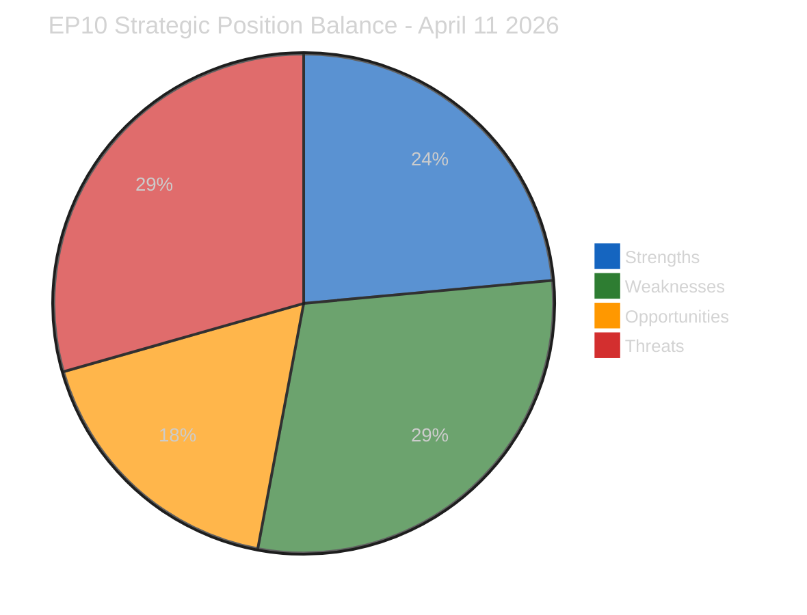

# SWOT Analysis — Pre-Restart Political Positioning Assessment

> **SWOT ID:** SWOT-2026-04-11-158
> **Date:** 2026-04-11 06:30 UTC
> **Framework:** Evidence-Based SWOT (political-swot-framework v2.2)
> **Analyst:** news-breaking workflow (Run 158)
> **Prior Run:** SWOT-2026-04-11-157

---

## Executive Summary

This SWOT assessment evaluates the European Parliament's strategic position as it transitions from Easter recess (Day 16) to the critical committee restart week (April 14-17). The analysis focuses on both political-institutional and economic-regulatory dimensions, applying the evidence-based methodology that requires verifiable EP data sources for every entry.

---

## Strengths

### S1: Record Legislative Output (HIGH confidence)
**Evidence:** 114 legislative acts adopted (2026 annualised), +46.2% year-on-year increase. Q1 output rate of 2.11 acts per session (up from 1.47 in 2025). This demonstrates institutional productivity capacity.
**Source:** EP MCP precomputed statistics (generated 2026-04-08)
**Relevance:** The EP has proven it can process high legislative volumes, which will be critical for the compressed post-recess schedule.
**Severity:** HIGH — directly supports the institution's capacity to handle the backlog.

### S2: Strong Oversight Culture (HIGH confidence)
**Evidence:** MEP oversight intensity at 8.54 parliamentary questions per MEP (2026), rising steadily from 5.76 in 2004. This represents a 48.3% increase in per-MEP accountability activity over two decades.
**Source:** EP MCP precomputed statistics — parliamentaryQuestions/mepCount ratio
**Relevance:** Active questioning culture provides the democratic scrutiny foundation for rapid legislative action on trade and banking files.
**Severity:** MEDIUM — important institutional health indicator but not directly decisive for post-recess outcomes.

### S3: MEP Workforce Stability (HIGH confidence)
**Evidence:** MEP stability index 0.949 with low turnover (5.1%, 37 MEPs in 2026). The EP10 workforce is experienced and established in their roles.
**Source:** EP MCP precomputed statistics — mepTurnover/mepCount ratio
**Relevance:** Low turnover means committee members are familiar with their files and can resume work efficiently after recess.
**Severity:** MEDIUM — reduces ramp-up time for committee restart.

### S4: Pre-Easter Sprint Achievements (HIGH confidence)
**Evidence:** Q1 sprint delivered the Banking Union triple package (TA-10-2026-0092, TA-10-2026-0094, TA-10-2026-0096), Anti-Corruption Directive adoption, and multiple trade-related texts. 104 adopted texts through Q1.
**Source:** EP MCP precomputed statistics — adoptedTexts count; prior analysis cross-referencing
**Relevance:** The Q1 legislative achievements provide institutional momentum and demonstrate cross-party capability.
**Severity:** HIGH — creates foundation for post-recess continuation.

---

## Weaknesses

### W1: Structural Fragmentation (HIGH confidence)
**Evidence:** Fragmentation index 6.59 (effective number of parties), highest in EP history. HHI at 0.1517 confirms deconcentration. Grand coalition (EPP+S&D) at 44.5%, below the 50% majority threshold by 5.5 percentage points.
**Source:** EP MCP precomputed statistics — political bloc analysis; coalition dynamics tool
**Relevance:** Every legislative file requires minimum 3-group consensus, slowing decision-making and increasing veto points.
**Severity:** HIGH — structural weakness affecting all post-recess legislation.

### W2: ECON-INTA Dual Bottleneck (MEDIUM confidence)
**Evidence:** Both ECON and INTA face CRITICAL/HIGH priority files simultaneously. ECON has Banking Union trilogue + economic governance. INTA has tariff emergency + trade defence motions. Committee meeting capacity is finite at estimated 213 meetings per month (April projected).
**Source:** EP MCP precomputed statistics — committee meeting projections; prior analysis identifying bottleneck (Run 6)
**Relevance:** Institutional bandwidth limitation may force priority choices that delay one critical file.
**Severity:** HIGH — directly affects policy implementation timeline.

### W3: Information Gap During Recess (MEDIUM confidence)
**Evidence:** All 13 EP API feed endpoints returning INTERNAL_ERROR since approximately Day 13 (8 April). Longest continuous outage in EP10 term. Coalition dynamics tool returns group metrics as "UNAVAILABLE."
**Source:** Direct MCP tool testing (Run 158) — all feeds failed; coalition dynamics tool returned null metrics
**Relevance:** Monitoring blind spot reduces early warning capability for pre-restart procedural activity.
**Severity:** MEDIUM — diminishing as recovery approaches (expected 12-13 April).

### W4: Tariff Response Preparation Unknown (LOW confidence)
**Evidence:** No visibility into INTA coordinator preparations during recess. Emergency procedure 2025/0261(COD) requires pre-drafted text for committee consideration.
**Source:** Absence of feed data; inference from institutional procedure analysis
**Relevance:** If INTA arrives Monday without prepared text, April 15 deadline is unachievable.
**Severity:** CRITICAL — but LOW confidence due to information gap.

### W5: Rapporteur Assignment Backlog (MEDIUM confidence)
**Evidence:** 13 ordinary legislative procedure (COD) files pending rapporteur assignments from the Q1 sprint. Assignments require political group negotiations, typically 1-2 committee meetings.
**Source:** Prior analysis (Runs 3-157); EP MCP precomputed statistics — 935 procedures in 2026
**Relevance:** Backlog delays substantive committee work on new files.
**Severity:** MEDIUM — manageable but adds to compressed timeline.

---

## Opportunities

### O1: Three-Pole Coalition Flexibility (MEDIUM confidence)
**Evidence:** The EP10 fragmentation creates flexible, issue-by-issue coalition formation. EPP can ally with S&D+Renew on social/trade files or with ECR+Renew on competitiveness files. This flexibility can accelerate legislation when used strategically.
**Source:** Coalition dynamics analysis (Runs 3-6); fragmentation index 6.59 enabling multiple viable coalitions
**Relevance:** The tariff crisis may be the forcing function that demonstrates three-pole efficiency.
**Severity:** HIGH — potential paradigm shift in EP10 decision-making.

### O2: External Deadline as Unifying Force (MEDIUM confidence)
**Evidence:** The April 15 tariff deadline creates urgency that historically overcomes partisan divisions. Past emergency procedures (COVID trade measures 2020, Ukraine sanctions 2022) achieved rapid cross-party consensus under external pressure.
**Source:** Historical EP precedent analysis; 2025/0261(COD) external deadline
**Relevance:** Crisis pressure can convert the structural weakness of fragmentation into flexible rapid response.
**Severity:** HIGH — if realised, significantly reduces policy implementation risk.

### O3: Committee Restart Momentum (MEDIUM confidence)
**Evidence:** Post-recess periods historically show elevated committee activity as pent-up work is processed. April 2025 saw similar post-Easter acceleration. The Q1 sprint achievements create institutional momentum.
**Source:** EP MCP precomputed statistics — monthly activity patterns; 2025 April comparison
**Relevance:** Institutional momentum from Q1 may carry forward into April.
**Severity:** MEDIUM — dependent on political will, not just institutional capacity.

---

## Threats

### T1: US Tariff Deadline Failure (HIGH confidence on deadline, MEDIUM on response)
**Evidence:** April 15 deadline for EU countermeasures response. 2025/0261(COD) emergency procedure filed. INTA jurisdiction. External deadline is immovable.
**Source:** Legislative procedure tracking; prior analysis (Runs 3-157)
**Relevance:** Missing the deadline signals EU policy paralysis to international partners and markets.
**Severity:** CRITICAL (Risk Score: 20/25 — highest single risk)

### T2: Coalition Fracture on Trade Scope (MEDIUM confidence)
**Evidence:** EPP faces internal tension between protectionist wing (supporting broad tariff response) and free-trade wing (preferring targeted measures). ECR position unclear. S&D may demand social safeguards as condition for support.
**Source:** Pre-recess voting pattern analysis; coalition sentiment data from Runs 3-6
**Relevance:** Scope disagreement could delay or water down the tariff response.
**Severity:** HIGH — affects both tariff and Banking Union files.

### T3: Banking Union Council Rejection (MEDIUM confidence)
**Evidence:** SRMR3/BRRD3/DGSD2 trilogue faces Council resistance on burden-sharing provisions. Net contributor member states (DE, NL, FI) historically resist deposit insurance mutualisation.
**Source:** TA-10-2026-0092, TA-10-2026-0094, TA-10-2026-0096 adoption records; Council negotiation patterns
**Relevance:** Trilogue failure would undermine ECON's Q1 achievements and EP institutional credibility.
**Severity:** HIGH — major institutional setback if trilogue collapses.

### T4: EP API Extended Outage (LOW confidence)
**Evidence:** Current outage is 4+ days. If recovery does not occur by 12-13 April as expected, monitoring capability for the critical committee week would be severely impaired.
**Source:** Direct MCP tool testing; past recess recovery patterns
**Relevance:** Extended outage would reduce breaking news coverage quality and analytical depth.
**Severity:** MEDIUM — mitigated by alternative data sources (press coverage, committee agendas).

### T5: Procedural Obstruction on Emergency Trade File (LOW confidence)
**Evidence:** Opposition groups (ESN, PfE, potentially ECR) could use procedural tactics to delay the tariff vote. Amendment flooding, impact assessment requests, or committee hearing demands all add days to the timeline.
**Source:** Institutional procedure analysis; past EP10 obstruction patterns
**Relevance:** Any delay mechanism that pushes the vote past April 15 achieves the same effect as rejection.
**Severity:** HIGH — if materialised, directly undermines EU trade response.

---

## TOWS Strategy Matrix

| | **Strengths** | **Weaknesses** |
|---|---|---|
| **Opportunities** | **SO Strategy:** Use record legislative capacity (S1) to exploit committee restart momentum (O3), processing backlog rapidly. Leverage MEP stability (S3) to form flexible three-pole coalitions (O1). | **WO Strategy:** Use tariff deadline urgency (O2) to overcome fragmentation (W1). Use committee restart momentum (O3) to clear rapporteur backlog (W5). |
| **Threats** | **ST Strategy:** Deploy proven sprint capacity (S4) against tariff deadline threat (T1). Use oversight culture (S2) to scrutinise trade scope proposals, preventing coalition fracture (T2). | **WT Strategy:** Address ECON-INTA bottleneck (W2) by sequencing files: tariff first (T1 deadline), banking second. Mitigate information gap (W3) by prioritising API recovery monitoring. |

---

## Key Findings

1. **Balance tilts toward weaknesses and threats** (5+5 vs 4+3), reflecting the structural challenges of EP10 fragmentation combined with external deadline pressure
2. **Record legislative capacity is the strongest asset** but is constrained by institutional bottlenecks and coalition complexity
3. **The tariff deadline is simultaneously the biggest threat and biggest opportunity** — crisis pressure may unlock three-pole efficiency
4. **Information gap is diminishing** as API recovery approaches, but weekend timing creates peak information asymmetry
5. **The committee restart on Monday will be the decisive inflection point** — either validating accumulated risk or demonstrating institutional resilience
