# Political Threat Landscape — T-2 Weekend Transition Assessment

> **Assessment ID:** THR-2026-04-11-158
> **Date:** 2026-04-11 06:30 UTC
> **Frameworks Applied:** Political Threat Landscape (6-dimension), Attack Trees, PESTLE
> **Analyst:** news-breaking workflow (Run 158)
> **Overall Threat Level:** HIGH
> **Prior Run:** THR-2026-04-11-157 (00:30 UTC)

---

## Executive Summary

The political threat landscape remains dominated by Coalition Shifts and Policy Reversal as the two highest-severity dimensions. Run 158 adds a PESTLE macro-environmental scan and weekend-specific transition analysis, identifying the information asymmetry between EP insiders (who may be conducting informal pre-restart consultations) and external monitors (who lack feed data) as a new dimension of the transparency deficit threat.

---

## Political Threat Landscape — 6-Dimension Assessment

```mermaid
%%{init: {"theme":"dark","themeVariables":{"primaryColor":"#1565C0","primaryTextColor":"#ffffff","primaryBorderColor":"#0A3F7F","lineColor":"#90CAF9","secondaryColor":"#2E7D32","secondaryTextColor":"#ffffff","secondaryBorderColor":"#0F3F00","tertiaryColor":"#FF9800","tertiaryTextColor":"#000000","tertiaryBorderColor":"#7F4F00","mainBkg":"#1565C0","secondBkg":"#2E7D32","tertiaryBkg":"#FF9800","noteBkgColor":"#FFC107","noteTextColor":"#000000","noteBorderColor":"#7F6000","errorBkgColor":"#D32F2F","errorTextColor":"#ffffff","fontFamily":"Inter, Helvetica, Arial, sans-serif","pie1":"#1565C0","pie2":"#2E7D32","pie3":"#FF9800","pie4":"#D32F2F","pie5":"#FFC107","pie6":"#7B1FA2","pie7":"#9E9E9E","pie8":"#0288D1","pie9":"#388E3C","pie10":"#F57C00","pie11":"#C62828","pie12":"#FBC02D","pieTitleTextSize":"18px","pieSectionTextSize":"14px","pieLegendTextSize":"13px","pieStrokeColor":"#1e1e1e","pieOuterStrokeColor":"#1e1e1e","git0":"#1565C0","git1":"#2E7D32","git2":"#FF9800","git3":"#D32F2F","gitBranchLabel0":"#ffffff","gitBranchLabel1":"#ffffff","gitBranchLabel2":"#000000","gitBranchLabel3":"#ffffff","cScale0":"#1565C0","cScale1":"#2E7D32","cScale2":"#FF9800","cScale3":"#D32F2F","cScale4":"#FFC107","cScale5":"#7B1FA2","cScale6":"#9E9E9E","cScale7":"#0288D1","xyChart":{"backgroundColor":"#1e1e1e","plotColorPalette":"#1565C0,#2E7D32,#FF9800,#D32F2F,#FFC107,#7B1FA2,#9E9E9E"}}}}%%
graph TD
    TL["Political Threat Landscape - 11 April 2026 Run 158"]
    
    TL --> CS["Coalition Shifts - HIGH<br/>Renew-ECR convergence 0.95<br/>Three-pole stress test T-2"]
    TL --> TR["Transparency Deficit - MEDIUM<br/>EP API Day 16 + Weekend gap<br/>Insider-outsider information asymmetry"]
    TL --> PR["Policy Reversal - HIGH<br/>Tariff 2025/0261 T-4<br/>Banking Union trilogue risk"]
    TL --> IP["Institutional Pressure - MEDIUM<br/>ECON-INTA dual bottleneck<br/>13 COD rapporteur assignments"]
    TL --> LO["Legislative Obstruction - MEDIUM<br/>4-day compressed committee week<br/>Multiple CRITICAL files competing"]
    TL --> DE["Democratic Erosion - LOW<br/>MEP stability 0.949<br/>Oversight intensity 8.54 healthy"]
    
    style TL fill:#0d6efd,color:#fff
    style CS fill:#fd7e14,color:#fff
    style TR fill:#ffc107,color:#000
    style PR fill:#fd7e14,color:#fff
    style IP fill:#ffc107,color:#000
    style LO fill:#ffc107,color:#000
    style DE fill:#28a745,color:#fff
```



### Dimension 1: Coalition Shifts (HIGH)

**Current Threat:** The Renew-ECR competitiveness convergence (0.95 cohesion) represents a structural coalition realignment threat entering its first post-recess test.

**CMO Assessment (updated Run 158):**
- **Capability:** Renew (76 seats) + ECR (79 seats) = 155 seats (21.5%). Combined with EPP (185) creates 340-seat supermajority. Combined with S&D (136) instead creates 291-seat centre-left alternative. The bloc is a kingmaker.
- **Motivation:** Tariff crisis reinforces shared economic liberalisation agenda. Weekend media coverage of US-EU trade tensions may harden positions before Monday.
- **Opportunity:** Committee restart Monday. INTA tariff vote is the proving ground. Weekend is the preparation window for group coordinators.

**Weekend-Specific Analysis:** Group coordinators typically use weekends before committee restart for informal bilateral consultations. These are invisible to external monitoring. The Renew-ECR alignment may have already solidified or fractured based on weekend communications — we will only know when committee proceedings resume.

**Evidence from coalition dynamics MCP tool (Run 158):** The tool returned data but with all group metrics showing "UNAVAILABLE" — per-MEP voting statistics not available from EP API. This confirms the structural data limitation is API-side, not an outage artefact. Dominant coalition reported as empty (0 combined strength) due to missing data. Parliamentary fragmentation metric confirmed at data quality warning level.

**Confidence:** MEDIUM — Pre-recess pattern analysis solid; weekend communications invisible.

### Dimension 2: Transparency Deficit (MEDIUM)

**Current Threat (Weekend Amplification):** The transparency deficit has a weekend-specific dimension: while the EP API outage affects all days equally, the Saturday-Sunday period creates a double-layer information gap:
- Layer 1: EP API feeds down (all 13 endpoints, Day 16)
- Layer 2: Weekend period means even manual monitoring (press releases, social media) is minimal

**Insider-Outsider Asymmetry:** EP insiders (group secretariats, committee coordinators, MEP offices) continue to communicate and prepare during the weekend. External monitors and civil society observers have no visibility into these preparations. This information asymmetry peaks on weekends during API outages.

**Recovery Timeline Assessment:**
- Saturday 11 April: Current (Day 16, API down)
- Sunday 12 April: Expected recovery window opens (Day 17, T-1)
- Monday 13 April: Feed recovery likely (Day 18, T-0 minus 1)
- Tuesday 14 April: Committee restart (T-0)

**Confidence:** MEDIUM — Recovery timeline based on past recess patterns (Christmas 2025: recovery 2 days pre-restart).

### Dimension 3: Policy Reversal (HIGH)

**Current Threat:** Two critical policy reversal risks persist:

1. **Tariff countermeasures stalling (2025/0261(COD)):** April 15 deadline is T-4. If INTA fails to advance emergency procedure, EU loses initial response window.

2. **Banking Union trilogue collapse:** SRMR3/BRRD3/DGSD2 package (TA-10-2026-0092, TA-10-2026-0094, TA-10-2026-0096) faces Council resistance on burden-sharing.

**Attack Tree — Tariff Response Failure (Updated Run 158):**

```
Goal: EU tariff response paralysis by April 15
  AND: INTA fails to schedule emergency vote by April 14
    OR: Committee coordinator disagreement on scope
      [Likelihood: 3/5, Impact: 4/5]
    OR: EPP internal split between protectionist and free-trade wings
      [Likelihood: 2/5, Impact: 5/5]
    OR: Procedural delay exceeds April 15 deadline
      [Likelihood: 4/5, Impact: 3/5]
    OR: Legal service challenges legal basis for emergency procedure
      [Likelihood: 2/5, Impact: 4/5]
  AND: No fallback Commission autonomous action
    OR: Commission defers to Parliament (institutional deference)
      [Likelihood: 3/5, Impact: 3/5]
    OR: Member State legal challenge to autonomous measures
      [Likelihood: 2/5, Impact: 4/5]
```

**Highest-risk path:** Procedural delay (4/5 likelihood) combined with Commission deference (3/5) = 12/25 CRITICAL path.

### Dimension 4: Institutional Pressure (MEDIUM)

**ECON-INTA Dual Bottleneck Analysis:**

| Committee | Priority File | Risk Level | Bandwidth Available |
|-----------|--------------|:----------:|:-------------------:|
| INTA | 2025/0261(COD) Tariff countermeasures | CRITICAL | 1 emergency slot per week |
| ECON | SRMR3/BRRD3/DGSD2 Banking Union | HIGH | 2-3 regular slots per week |
| LIBE | 2023/0135(COD) Anti-Corruption | HIGH | 2-3 regular slots per week |

**Bottleneck severity:** The overlap of INTA's emergency timeline with ECON's trilogue preparation creates competition for political capital and media attention. MEPs serving on both committees face scheduling conflicts.

**13 COD procedure backlog:** Rapporteur assignments must precede substantive work. If political groups disagree on rapporteur allocations (particularly for high-profile files), the backlog extends further.

### Dimension 5: Legislative Obstruction (MEDIUM)

**Obstruction Scenario Analysis:**

| Tactic | Actor | Probability | Impact | Precedent |
|--------|-------|:-----------:|:------:|-----------|
| Request impact assessment | ECR or PfE | Possible (30%) | 1-2 week delay | Used on migration files 2025 |
| Demand committee hearing | National delegation | Unlikely (15%) | 3-5 day delay | Rare in emergency procedures |
| Procedural motion to refer back | ESN | Unlikely (10%) | 1 week delay | Untested in EP10 |
| Amendment flooding | Multiple groups | Possible (25%) | 2-3 day delay | Standard on contentious files |

**Highest-risk obstruction:** Amendment flooding combined with coordinator disagreement could push the tariff vote past April 15.

### Dimension 6: Democratic Erosion (LOW)

**Baseline healthy:** MEP stability index 0.949 (low turnover 5.1%), oversight intensity 8.54 questions per MEP (trending upward from 5.76 in 2004), record legislative output pace. No active Article 7 proceedings.

---

## PESTLE Macro-Environmental Scan (New in Run 158)

| Factor | Assessment | Trend | Evidence |
|--------|-----------|:-----:|---------|
| **Political** | Three-pole fragmentation stable; pre-election positioning beginning for 2029 | Stable | Fragmentation index 6.59; EPP 185, S&D 136, Renew 76, ECR 79, Greens 53 |
| **Economic** | US tariff shock creating EU fiscal uncertainty; Banking Union reform in progress | Deteriorating | 2025/0261(COD) emergency procedure; SRMR3/BRRD3/DGSD2 trilogue pending |
| **Social** | Eurosceptic share 15.6%; tariff impacts on employment in exposed sectors | Stable-to-Deteriorating | Right-bloc consolidated share 52.3%; social dimension demand rising |
| **Technological** | EP API outage highlights digital infrastructure fragility; AI Act implementation | Stable | 4+ day API outage; AI Act monitoring framework under development |
| **Legal** | Anti-Corruption Directive transposition (24 months from adoption); emergency trade procedure legality | Complex | 2023/0135(COD) transposition deadline March 2028; trade measures legal basis uncertain |
| **Environmental** | Clean Industrial Deal in pipeline; Green Deal implementation continuing | Stable | ENVI committee workload steady; less urgent than trade/banking files |

**PESTLE Synthesis:** The economic and political factors dominate the current threat landscape. The US tariff crisis creates the external pressure that tests internal political dynamics. Social and environmental factors are secondary but contribute to the complexity of coalition formation on trade files.

---

## Consolidated Threat Assessment

| Dimension | Severity | Trend vs Run 157 | Key Indicator |
|-----------|:--------:|:-----------------:|--------------|
| Coalition Shifts | HIGH | Stable | Renew-ECR 0.95 cohesion, T-2 to test |
| Transparency Deficit | MEDIUM | Declining (recovery approaching) | API recovery expected 12-13 April |
| Policy Reversal | HIGH | Stable | Tariff deadline T-4, Banking Union trilogue pending |
| Institutional Pressure | MEDIUM | Stable | ECON-INTA bottleneck, 13 COD backlog |
| Legislative Obstruction | MEDIUM | Stable | Compressed 4-day committee week |
| Democratic Erosion | LOW | Stable | Healthy institutional baseline indicators |

**Overall:** HIGH threat level maintained. No new threat vectors identified since Run 157. The primary change is temporal — the weekend transition means Monday's committee restart will be the first opportunity to validate or adjust the threat assessment with live data.
