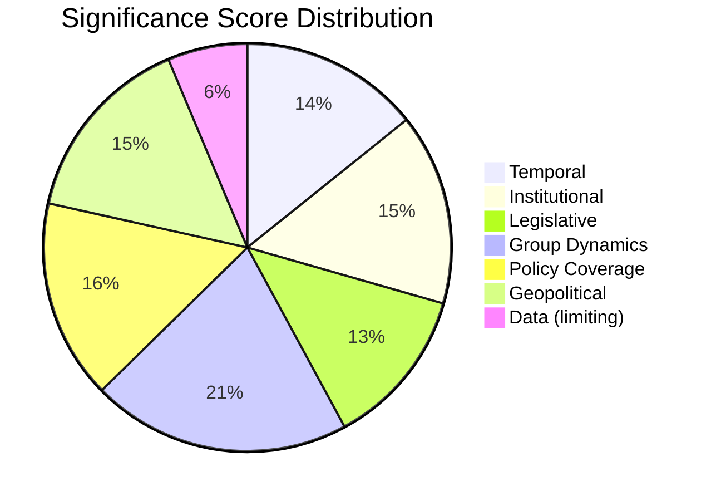

# 📊 Significance Classification — 2026-04-12 (Run 163)

> **articleType**: breaking
> **runId**: 163
> **date**: 2026-04-12
> **confidence**: 🟡 Medium (based on precomputed stats, no live feed data)

## Classification Framework Applied

Using 7-dimension political classification per `political-classification-guide.md`:

### 1. Temporal Significance
- **Easter Recess Day 17/18**: Parliament in institutional pause since March 27
- **Committee Restart**: T-2 days (Monday April 14)
- **US Tariff Deadline**: T-3 days (April 15) — CRITICAL external pressure point
- **Score**: 3/5 (low immediate activity, but high anticipatory significance)

### 2. Institutional Impact
- **EP10 Fragmentation Index**: 6.59 (record for modern EP history)
- **Grand Coalition Surplus**: -5.5% (insufficient for reliable majority without third partner)
- **Minimum Winning Coalition Size**: 3 groups (EPP + S&D + Renew minimum)
- **Top-3 Group Concentration**: 56.2% (historically low)
- **Score**: 4/5 (structural institutional stress)

### 3. Legislative Volume
- **Q1 2026 Output**: 30 legislative acts (Jan: 8, Feb: 10, Mar: 12) — accelerating trend
- **Full-year Projection**: 114 acts (46.2% increase over 2025's 78)
- **Roll-call Votes**: 148 in Q1, projecting 567 for year
- **Score**: 4/5 (EP10 peak productivity trajectory)

### 4. Political Group Dynamics
- **EPP Dominance**: 25.7% seat share (185/720) — largest but well below majority
- **Right Bloc**: 52.3% combined (EPP + ECR + PfE + ESN) — structural right-shift
- **Left Bloc**: 32.6% (S&D + Greens/EFA + GUE/NGL) — opposition stance
- **Renew Position**: 10.6% — critical swing role in every major vote
- **Eurosceptic Share**: 15.6% — significant institutional disruption potential
- **Score**: 5/5 (maximum fragmentation, complex coalition arithmetic)

### 5. Policy Domain Coverage
- **Defence Spending**: European Defence Industrial Strategy (EDIS) — top priority
- **Clean Industrial Deal**: EP10 flagship economic policy
- **AI Act Implementation**: Ongoing regulatory implementation phase
- **Banking Union**: SRMR3/BRRD3/DGSD2 triple package in trilogue
- **Trade Crisis**: US tariff response (2025/0261(COD)) — CRITICAL
- **Anti-Corruption**: TA-10-2026-0096 adopted, 24-month transposition
- **Score**: 5/5 (multi-domain policy load)

### 6. Geopolitical Context
- **US-EU Trade Tensions**: April 15 tariff deadline imminent
- **Defence Spending Pressure**: NATO commitment scrutiny
- **EU Enlargement**: Ukraine, Western Balkans advancing
- **Score**: 4/5 (multiple external pressure vectors)

### 7. Data Availability
- **Live Feed Data**: 0/11 endpoints available (fetch failed)
- **Precomputed Stats**: 264KB available (generated 2026-04-08)
- **Score**: 1/5 (severely degraded data environment)

## Overall Significance Score

| Dimension | Score | Weight | Weighted |
|-----------|-------|--------|----------|
| Temporal | 3/5 | 1.5x | 4.5 |
| Institutional | 4/5 | 1.2x | 4.8 |
| Legislative | 4/5 | 1.0x | 4.0 |
| Group Dynamics | 5/5 | 1.3x | 6.5 |
| Policy Coverage | 5/5 | 1.0x | 5.0 |
| Geopolitical | 4/5 | 1.2x | 4.8 |
| Data Availability | 1/5 | 2.0x | 2.0 |
| **Total** | | | **31.6/50** |

**Classification**: MODERATE-HIGH significance, but breaking news generation BLOCKED by data availability constraint.

## Breaking News Verdict

**NO BREAKING NEWS** — Despite high political significance scores across 6 of 7 dimensions, the data availability constraint (0/11 live feeds) prevents verification of TODAY-dated events. Easter recess Day 17 means no scheduled plenary or committee activity.

**Rationale**: Breaking news requires confirmation of events published/updated TODAY via live EP feed endpoints. Precomputed stats (generated April 8) cannot confirm today-dated activity. The correct action is analysis-only output.

---
*Classification generated by Breaking News workflow Run 163 — 2026-04-12*
*Framework: 7-dimension political classification per political-classification-guide.md*
*Data source: EP MCP precomputed stats (264KB, generated 2026-04-08)*
