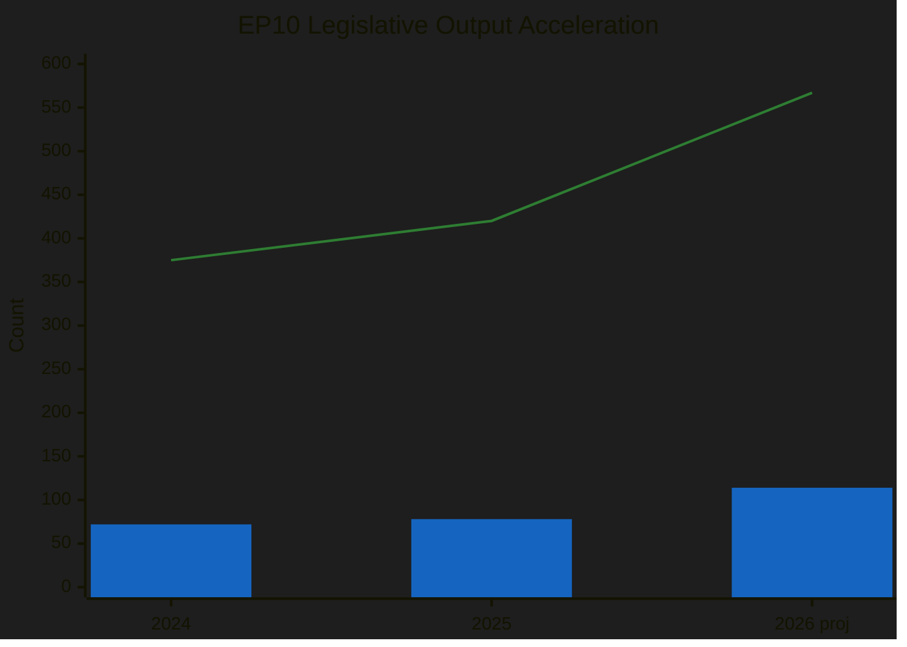
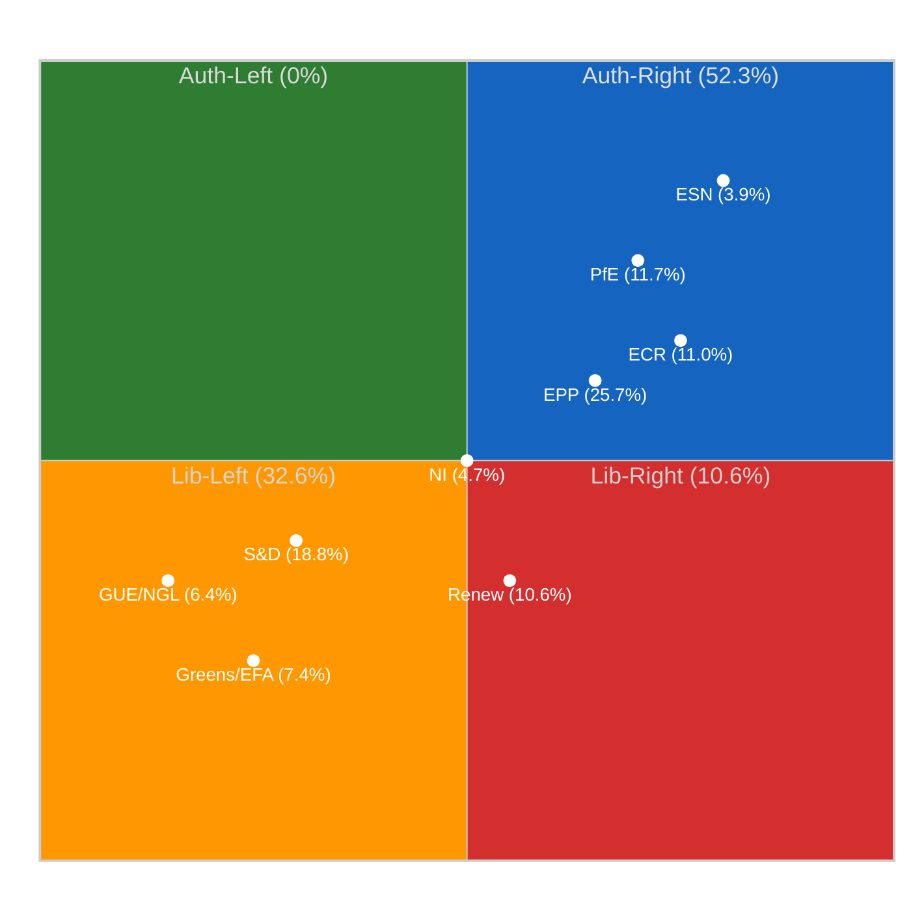

# 📈 Significance Scoring — 2026-04-12 (Run 163)

> **articleType**: breaking
> **runId**: 163
> **date**: 2026-04-12
> **confidence**: 🟡 Medium (precomputed stats only)

## Scoring Methodology

Applied per `significance-scoring.md` template and `ai-driven-analysis-guide.md` framework.

### EP10 Legislative Productivity Trajectory

| Metric | 2024 | 2025 | 2026 (projected) | Trend |
|--------|------|------|-------------------|-------|
| Legislative Acts | 72 | 78 | 114 | ↑↑ +46.2% |
| Roll-Call Votes | 375 | 420 | 567 | ↑ +35.0% |
| Plenary Sessions | 50 | 53 | 54 | → +1.9% |
| Resolutions | 108 | 135 | 180 | ↑ +33.3% |
| Procedures | n/a | n/a | 935 | — |
| Adopted Texts | n/a | n/a | 104 | — |

**Key Insight**: EP10 Year 2 shows dramatic acceleration in legislative output (+46.2% acts YoY) while plenary sessions remain nearly flat (+1.9%). This indicates increased legislative density per session — more acts per sitting — consistent with institutional pressure to deliver on defence, industrial, and trade agendas before mid-term political dynamics shift.

### Political Fragmentation Analysis

| Indicator | Value | Historical Context | Risk Level |
|-----------|-------|-------------------|------------|
| Fragmentation Index | 6.59 | EP9 peak: 5.8 | 🔴 HIGH |
| Grand Coalition Surplus | -5.5% | Negative = insufficient | 🔴 HIGH |
| Min Winning Coalition | 3 groups | EP9: 2 groups | 🟡 MEDIUM |
| Top-2 Concentration | 44.5% | EP9: 52.1% | 🔴 HIGH |
| Eurosceptic Share | 15.6% | EP9: 11.2% | 🟡 MEDIUM |
| Right Bloc Share | 52.3% | EP9: 42.8% | 🟡 MEDIUM |

**Derived Intelligence Scores** (from EP MCP precomputed stats):

| Metric | Value | Interpretation |
|--------|-------|---------------|
| Legislative Output per Session | 2.11 | Above EP9 average (1.44) |
| Legislative Output per MEP | 0.158 | Moderate efficiency |
| Roll-Call Vote Yield | 20.1% | One in 5 votes becomes law |
| Procedure Completion Rate | 12.2% | Low — large pipeline backlog |
| Resolution-to-Legislation Ratio | 1.58 | More political signals than binding law |
| MEP Oversight Intensity | 8.54 | Strong questioning culture |
| Debate Intensity per Session | 236.3 speeches | Very high chamber engagement |
| HHI (concentration) | 0.1517 | Moderate market-equivalent fragmentation |
| Dominance Ratio | 1.37 | EPP leads but not dominant |

### Political Compass Assessment

**Political Balance**: Parliament skews significantly to the authoritarian-right quadrant (52.3%), with the libertarian-left bloc at 32.6% and the centrist Renew holding a pivotal 10.6% swing position. The EU integration dispersion index of 2.71 indicates deep divisions on the pace and scope of European integration — a key fault line on defence spending, trade autonomy, and institutional reform.

### Pre-Recess Legislative Sprint Assessment

Q1 2026 monthly acceleration pattern:
- **January**: 8 acts, 40 votes, 5 sessions — normal start
- **February**: 10 acts, 51 votes, 5 sessions — building momentum
- **March**: 12 acts, 57 votes, 6 sessions — pre-Easter sprint peak

This 50% increase in legislative acts from January to March reflects the classic pre-recess sprint pattern: committees and plenary accelerate output before institutional pause. Key items pushed through included the Anti-Corruption Directive (TA-10-2026-0096) and Banking Union triple package components.

### Forward-Looking Scenarios

**Scenario 1: Post-Easter Legislative Surge** (likely — 65%)
- Committee restart April 14 brings deferred files to immediate consideration
- US tariff deadline April 15 forces urgent plenary on trade response 2025/0261(COD)
- Defence spending consensus drives cross-party cooperation
- Expected: 15+ legislative acts in April alone

**Scenario 2: Fragmentation Gridlock** (possible — 25%)
- EPP-ECR split on trade tariffs blocks US response measure
- Grand coalition arithmetic (-5.5% surplus) fails on defence spending
- Renew demands concessions on industrial policy
- Expected: Delayed votes, emergency sessions, procedural disputes

**Scenario 3: External Shock Dominance** (unlikely — 10%)
- US tariff escalation beyond current scope
- Geopolitical crisis requiring emergency plenary
- Expected: All-hands response, temporary coalition unity

---
*Scoring generated by Breaking News workflow Run 163 — 2026-04-12*
*Data source: EP MCP precomputed stats (264KB, generated 2026-04-08)*
