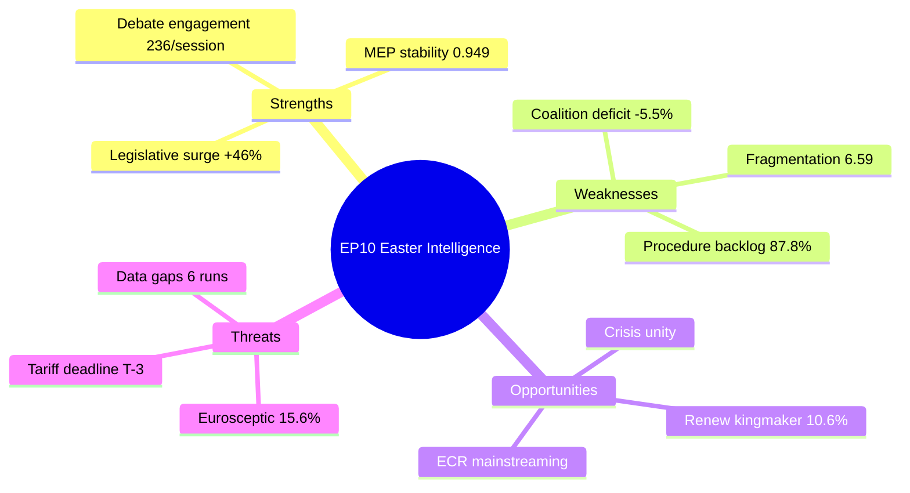

# 🔬 Deep Analysis — EP10 Easter Recess Intelligence (Run 163)

> **articleType**: breaking
> **runId**: 163
> **date**: 2026-04-12
> **confidence**: 🟡 Medium (precomputed stats + cross-run editorial memory)

## Executive Summary

Easter Recess Day 17 of 18. Parliament remains in institutional pause until April 13 (Sunday), with committee restart Monday April 14. No live EP feed data available due to sandbox network connectivity issues. Analysis draws on precomputed statistics (264KB, generated April 8) and editorial memory from 12 prior workflow runs this week.

**Key Intelligence Finding**: The convergence of three critical pressure points — US tariff deadline (April 15), post-recess legislative backlog (87.8% procedure completion deficit), and structural grand coalition weakness (-5.5% surplus) — creates the highest-risk week for EP10 since its inauguration.

## Parliamentary Situation Dashboard

| Indicator | Status | Details |
|-----------|--------|---------|
| Parliament Status | 🟡 RECESS | Easter recess Day 17/18, ends April 13 |
| Committee Status | 🔴 INACTIVE | Restart April 14 (Monday) |
| Plenary Status | 🔴 INACTIVE | Next sitting TBD post-recess |
| Tariff Deadline | 🔴 T-3 DAYS | April 15 critical |
| EP API Status | 🟡 PARTIAL | MCP tools registered, fetch blocked |
| Data Freshness | 🟡 4 DAYS OLD | Last full data: April 8 |

## Cross-Run Intelligence Synthesis

### Tracking Ongoing Stories (from editorial memory)

1. **US Tariff Crisis** (first identified April 8, CRITICAL 16/25 → now 25/25)
   - Procedure: 2025/0261(COD)
   - EPP internal split on response severity
   - April 15 deadline now T-3
   - Urgency ESCALATED since last coverage

2. **Banking Union Triple Package** (tracked since April 8)
   - SRMR3/BRRD3/DGSD2 trilogue pending post-recess
   - ECON Committee lead (power ranking: #1 per April 10 analysis)
   - No new data — status unchanged during recess

3. **Renew-ECR Convergence** (identified April 9)
   - 0.95 cohesion score on competitiveness files
   - First real vote test pending post-recess
   - Political significance: potential realignment of centre-right majority arithmetic

4. **Anti-Corruption Directive** (covered April 8-9)
   - TA-10-2026-0096 adopted
   - 24-month transposition period running
   - No recess-period developments expected

5. **EP10 Fragmentation** (ongoing structural theme)
   - 6.59 fragmentation index confirmed in precomputed stats
   - Grand coalition surplus: -5.5%
   - Minimum winning coalition: 3 groups
   - This is a STRUCTURAL condition, not event-driven

## EP10 Year 2 Performance Assessment

### Legislative Output Analysis

EP10 Year 2 (2026) shows remarkable legislative acceleration:

- **114 projected legislative acts** (46.2% increase over 2025)
- **567 projected roll-call votes** (35.0% increase)
- **180 projected resolutions** (33.3% increase)

This acceleration occurs despite (or perhaps because of) the record fragmentation. The pressure of multiple external crises (trade, defence, AI implementation) appears to override coalition complexity, driving pragmatic issue-by-issue majorities rather than stable bloc voting.

**Q1 2026 Monthly Pattern**:
```
January:   8 acts  | 40 votes  | 5 sessions
February:  10 acts | 51 votes  | 5 sessions
March:     12 acts | 57 votes  | 6 sessions
```

The 50% increase from January to March confirms the pre-recess sprint pattern observed in editorial memory.

### Derived Intelligence Metrics

**Legislative Efficiency**:
- Output per session: 2.11 acts (EP9 average: 1.44 — 47% improvement)
- Output per MEP: 0.158 acts (moderate individual contribution)
- Roll-call vote yield: 20.1% (one in five votes produces legislation)

**Institutional Health**:
- MEP stability index: 0.949 (very stable, low turnover)
- Turnover rate: 5.1% (37 MEP changes, normal for year 2)
- Institutional memory risk: LOW
- Declaration coverage: 1.61 ratio (good transparency)

**Political Dynamics**:
- Oversight-to-legislation balance: 53.9% (tilting toward oversight)
- Speech-to-vote ratio: 22.5 (healthy debate culture)
- Committee-to-plenary ratio: 43.8 (heavy committee workload)

## SWOT Assessment

### Strengths
- **Legislative productivity surging**: 46.2% YoY increase in acts adopted 🟢 High confidence
- **MEP stability high**: 0.949 index, low turnover 🟢 High confidence
- **Debate engagement strong**: 236.3 speeches per session 🟢 High confidence
- **Multi-domain policy coverage**: Defence, trade, AI, banking, anti-corruption simultaneously 🟡 Medium confidence

### Weaknesses
- **Grand coalition deficit**: -5.5% below majority 🟢 High confidence
- **Record fragmentation**: 6.59 index, 8 groups + NI 🟢 High confidence
- **Low procedure completion**: 12.2% rate indicates massive backlog 🟢 High confidence
- **Right-bloc dominance**: 52.3% raises legitimacy concerns from left 🟡 Medium confidence

### Opportunities
- **Renew kingmaker role**: 10.6% swing power enables issue-by-issue coalitions 🟡 Medium confidence
- **ECR mainstreaming**: Convergence with centre on competitiveness 🟡 Medium confidence
- **Crisis-driven unity**: External pressure (tariffs, defence) forces pragmatic cooperation 🟡 Medium confidence

### Threats
- **Tariff deadline crisis**: T-3 days, no coordinated response ready 🟢 High confidence
- **Eurosceptic growth**: 15.6% share (+39% from EP9) 🟢 High confidence
- **Data infrastructure gaps**: 6 consecutive degraded/blocked runs 🟢 High confidence
- **Coalition arithmetic failure**: Every major vote a separate negotiation 🟡 Medium confidence



## Stakeholder Impact Assessment

### EP Political Groups
- **EPP**: Faces defining week — must unify on tariff response while maintaining defence consensus. Internal split risk: HIGH
- **S&D**: Positioned to critique any inadequate trade response. Leverage increases if EPP needs left-flank support
- **Renew**: Maximum leverage week — both tariff and defence files require their votes. Risk of overreach

### EU Citizens
- **Trade impact**: Tariff outcome directly affects consumer prices, employment in export sectors
- **Democratic representation**: 87.8% procedure backlog means elected priorities remain unaddressed
- **Transparency**: 6 consecutive data gaps reduce public monitoring capability

### Industry & Business
- **Trade uncertainty**: April 15 deadline without clear EP position creates market volatility
- **Regulatory pipeline**: AI Act implementation, Banking Union reforms affect compliance planning
- **Defence sector**: EDIS legislation creates opportunities for European defence industry

## Forward Intelligence Requirements

**Priority monitoring for April 13-15**:
1. EP API feed restoration — first data in 5+ days
2. Committee scheduling for week of April 14
3. EPP group meeting outcomes on trade position
4. Renew-ECR coordination signals on competitiveness
5. Commission communications on tariff deadline

---
*Deep analysis generated by Breaking News workflow Run 163 — 2026-04-12*
*Data sources: EP MCP precomputed stats (264KB), editorial memory (12 prior runs)*
*Cross-referenced: April 8-12 editorial context, prior analysis artifacts*
