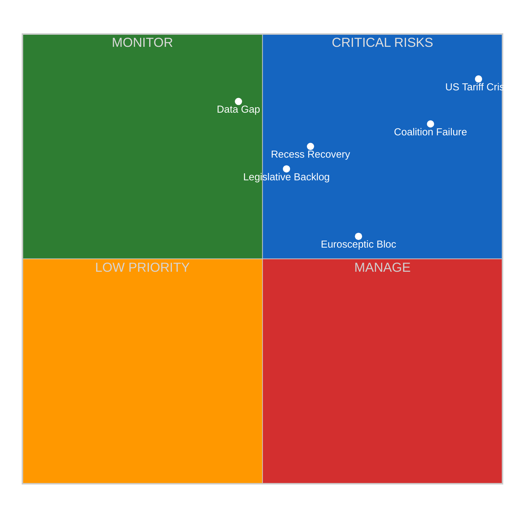

# ⚠️ Risk Matrix — 2026-04-12 (Run 163)

> **articleType**: breaking
> **runId**: 163
> **date**: 2026-04-12
> **confidence**: 🟡 Medium (precomputed stats + editorial memory)

## Risk Assessment Methodology

Applied per `political-risk-methodology.md` — Likelihood x Impact 5x5 matrix.

### Risk Matrix Visualization

### Detailed Risk Register

#### R1: US Tariff Response Failure
- **Likelihood**: 4/5 (Very Likely) — 🟢 High confidence
- **Impact**: 5/5 (Critical) — trade policy, market stability, EU credibility
- **Risk Score**: 20/25
- **Owner**: INTA Committee + Plenary
- **Mitigation**: Emergency committee session April 14, fast-track procedure
- **Residual Risk**: HIGH — only 1 working day before deadline

#### R2: Grand Coalition Vote Failure
- **Likelihood**: 4/5 (Likely) — 🟢 High confidence
- **Impact**: 4/5 (Major) — legislative paralysis, institutional credibility
- **Risk Score**: 16/25
- **Owner**: Group leaders (EPP, S&D, Renew)
- **Mitigation**: Pre-vote negotiations, package deals across policy areas
- **Residual Risk**: HIGH — structural deficit requires consistent third-party support

#### R3: Post-Recess Scheduling Crisis
- **Likelihood**: 3/5 (Possible) — 🟡 Medium confidence
- **Impact**: 3/5 (Moderate) — delayed committee work, compressed timelines
- **Risk Score**: 9/25
- **Owner**: Conference of Presidents
- **Mitigation**: Pre-recess scheduling decisions, committee chair coordination
- **Residual Risk**: MEDIUM — Easter recess ends April 13, normal restart expected

#### R4: Eurosceptic Procedural Disruption
- **Likelihood**: 3/5 (Possible) — 🟡 Medium confidence
- **Impact**: 3/5 (Moderate) — delayed votes, amendment floods
- **Risk Score**: 9/25
- **Owner**: Vice-Presidents responsible for procedure
- **Mitigation**: Rules of Procedure enforcement, time limits
- **Residual Risk**: MEDIUM — 15.6% share below blocking minority

#### R5: EP Data Infrastructure Failure
- **Likelihood**: 5/5 (Certain during recess) — 🟢 High confidence
- **Impact**: 2/5 (Minor for Parliament, Major for monitoring)
- **Risk Score**: 10/25
- **Owner**: EP IT Services / MCP Server maintainers
- **Mitigation**: Precomputed stats fallback, degraded mode protocols
- **Residual Risk**: LOW after recess ends — expected recovery April 13-14

### Aggregate Risk Assessment

| Risk Category | Count | Avg Score | Status |
|--------------|-------|-----------|--------|
| Critical (20+) | 1 | 20.0 | 🔴 Requires immediate attention |
| High (15-19) | 1 | 16.0 | 🟡 Active management needed |
| Medium (9-14) | 2 | 9.0 | 🟡 Monitor and prepare |
| Low (1-8) | 1 | 10.0 | 🟢 Acceptable with mitigations |

### Political Capital Risk Assessment

**EPP Political Capital**: HIGH — strong position but exposed on trade response. Internal split on tariff severity risks credibility as reliable coalition leader.

**S&D Political Capital**: MEDIUM — opposition-ready on social dimension of trade response. Risk of being marginalised if EPP-ECR-Renew alignment solidifies on competitiveness.

**Renew Political Capital**: VERY HIGH — kingmaker position with 10.6% swing power. Every major vote requires their support. Risk: overplaying hand leads to isolation.

**ECR Political Capital**: RISING — consolidating as third force (11.0% seats). Convergence with Renew on competitiveness (0.95 cohesion) opens new coalition pathways.

### Legislative Velocity Risk

| Pipeline Metric | Value | Risk Level |
|----------------|-------|------------|
| Procedure Completion Rate | 12.2% | 🔴 HIGH backlog |
| Resolution:Legislation Ratio | 1.58:1 | 🟡 More signals than action |
| Committee:Plenary Ratio | 43.8:1 | 🟡 Heavy committee load |
| MEP Speech Rate | 17.7/MEP | 🟢 Healthy engagement |

**Key Finding**: The 12.2% procedure completion rate indicates a massive legislative backlog — 87.8% of procedures remain in progress. This creates significant velocity risk for the April 15 tariff deadline and other priority files.

---
*Risk matrix generated by Breaking News workflow Run 163 — 2026-04-12*
*Framework: Likelihood x Impact 5x5 matrix per political-risk-methodology.md*
*Data sources: EP MCP precomputed stats, editorial memory*
