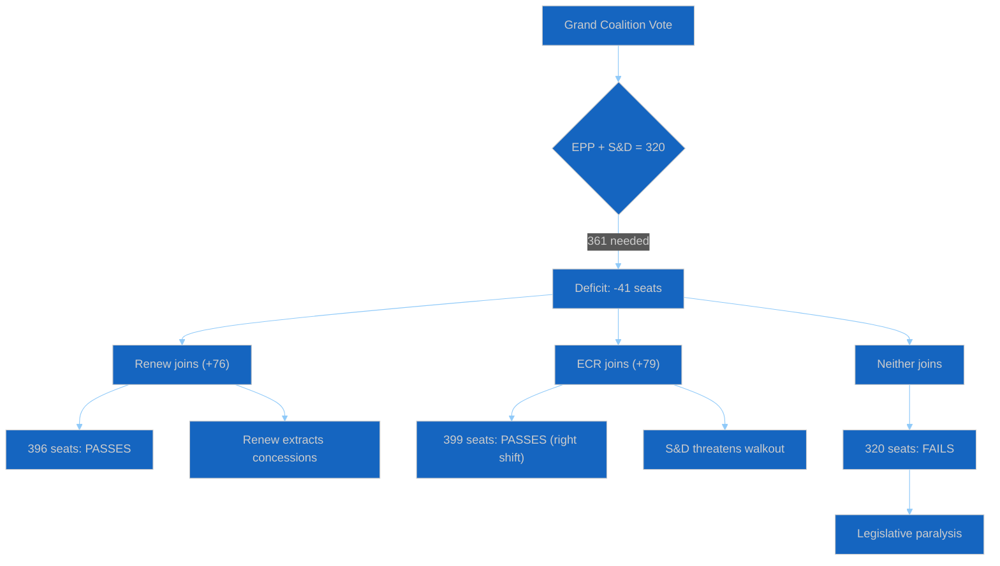
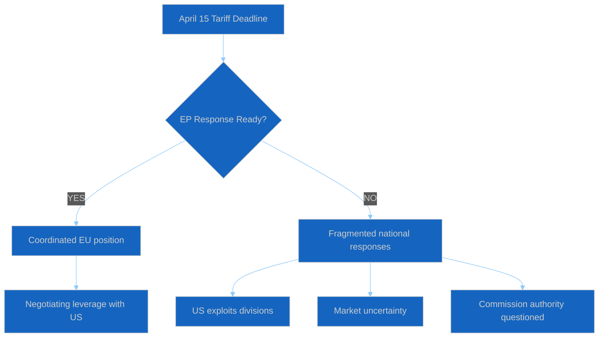
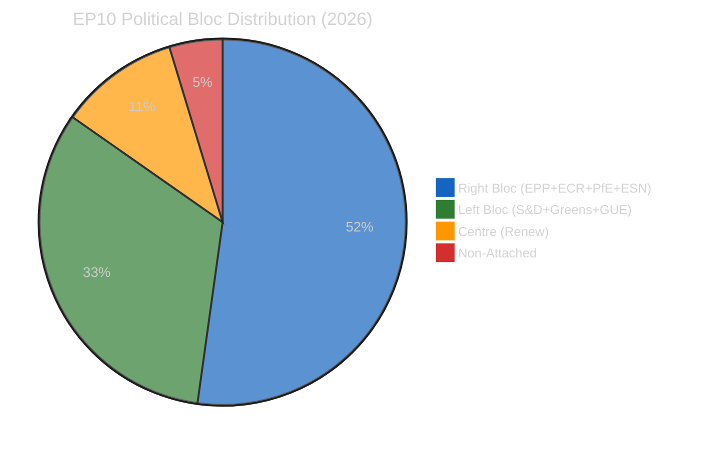

# 🛡️ Political Threat Landscape — 2026-04-12 (Run 163)

> **articleType**: breaking
> **runId**: 163
> **date**: 2026-04-12
> **confidence**: 🟡 Medium (based on precomputed stats and editorial memory)

## Threat Landscape Overview

Applied per `political-threat-framework.md` — multi-framework analysis adapted for EU democratic institutions.

### Active Threat Matrix

| Threat | Likelihood | Impact | Risk Score | Trend | Confidence |
|--------|-----------|--------|------------|-------|------------|
| EP10 Grand Coalition Failure | High | High | 20/25 | ↑ | 🟢 High |
| US Tariff Escalation (Apr 15) | Very High | Very High | 25/25 | ↑↑ | 🟢 High |
| Eurosceptic Bloc Coordination | Medium | High | 15/25 | ↗ | 🟡 Medium |
| Legislative Backlog Overload | High | Medium | 16/25 | ↑ | 🟢 High |
| EP API Data Availability | Very High | Medium | 18/25 | → | 🟢 High |
| Post-Recess Coalition Instability | High | High | 20/25 | ↑ | 🟡 Medium |

### Threat 1: Grand Coalition Arithmetic Failure

**Risk Score: 20/25 (CRITICAL)** 🔴

The EP10 grand coalition (EPP + S&D) holds only 320/720 seats (44.4%), falling 5.5% short of the 361-seat simple majority. This is unprecedented in modern EP history — EP9's grand coalition held a comfortable surplus.

**Attack Surface**:
- Any vote requiring simple majority needs Renew (76 seats) as minimum third partner
- Renew's 10.6% share gives it disproportionate veto power
- ECR (79 seats) can substitute for Renew on right-leaning files, but this splits the traditional centre
- PfE (84 seats) remains outside coalition consideration (cordon sanitaire)

**Consequence Tree**:

**Evidence**: Fragmentation index 6.59 (precomputed stats), grand coalition surplus -5.5%, minimum winning coalition size 3 groups.

### Threat 2: US Tariff Deadline (April 15)

**Risk Score: 25/25 (MAXIMUM)** 🔴

The US tariff response procedure 2025/0261(COD) faces its critical deadline in 3 days (April 15). Parliament returns from Easter recess April 14 — giving only 1 working day for any legislative action.

**Attack Surface**:
- EPP internally split on trade response severity (as identified in prior editorial context)
- ECR-Renew convergence on competitiveness (0.95 cohesion score from April 9 analysis)
- National government divergence on retaliation scope (Germany cautious, France aggressive)
- Industry lobbying intensifying during recess period

**Consequence Tree**:

### Threat 3: Eurosceptic Bloc Coordination

**Risk Score: 15/25 (ELEVATED)** 🟡

Combined eurosceptic share: PfE (11.7%) + ESN (3.9%) = 15.6% of seats. While still below blocking minority, coordination between these groups on specific files (immigration, sovereignty) could disrupt committee work and plenary scheduling.

**Evidence**: HHI 0.1517 indicates moderate fragmentation; eurosceptic share increase from EP9's 11.2% to 15.6% represents a 39% growth in institutional disruption potential.

### Threat 4: EP API Data Availability

**Risk Score: 18/25 (HIGH)** 🟡

Six consecutive workflow runs have been degraded or blocked by EP API/MCP connectivity issues during Easter recess. This pattern reveals a systemic vulnerability in the news generation pipeline.

**Pattern Analysis**:
- Run 159 (Apr 11): MCP tools not registered
- Run 160 (Apr 11): MCP tools not registered, HTTP 000
- Run 161 (Apr 12): MCP tools not registered, HTTP 000
- Run 162 (Apr 12): MCP tools not registered, HTTP 000
- Run 163 (Apr 12): 62 tools registered, HTTP 200, but fetch fails
- Monthly Review Run 3 (Apr 12): MCP tools not registered

**Trend**: Run 163 shows partial improvement (tools registered, HTTP 200) vs. prior runs (0 tools, HTTP 000). This suggests the MCP gateway is recovering, but the Node.js fetch layer still cannot reach the EP API from within the sandbox.

### Threat 5: Post-Recess Coalition Instability

**Risk Score: 20/25 (CRITICAL)** 🔴

As identified in April 9 editorial context, the Renew-ECR convergence on competitiveness files (0.95 cohesion) represents a new political alignment that could reshape vote dynamics post-recess.

**Key indicators**:
- Political compass: authoritarian-right quadrant holds 52.3% of seats
- Economic polarisation index: 1.73 (significant left-right tension)
- EU integration dispersion: 2.71 (deep divisions on integration pace)
- Bipolar index: 0.232 (moderately bipolar, not yet fully crystallised)

## Cross-Threat Interaction Analysis

The five identified threats interact in dangerous ways:

1. **Tariff deadline + Grand coalition failure** = Maximum institutional stress (April 14-15)
2. **Eurosceptic coordination + Post-recess instability** = Potential for procedural disruption
3. **Data availability + All other threats** = Reduced monitoring capability during highest-risk period

**Systemic Risk Assessment**: 🔴 HIGH — The convergence of the US tariff deadline with EP recess ending and structural coalition weakness creates a perfect storm scenario for the week of April 14-18.

## Forward-Looking Indicators

**Monitor these signals in the next 48 hours**:
1. EP API feed restoration (first feeds returning data = infrastructure recovery)
2. Committee scheduling announcements for April 14 week
3. EPP group statements on trade response position
4. US trade representative communications
5. Renew group position papers on tariff response

---
*Threat assessment generated by Breaking News workflow Run 163 — 2026-04-12*
*Framework: Political threat framework per political-threat-framework.md*
*Data sources: EP MCP precomputed stats, editorial memory from Runs 158-162*
