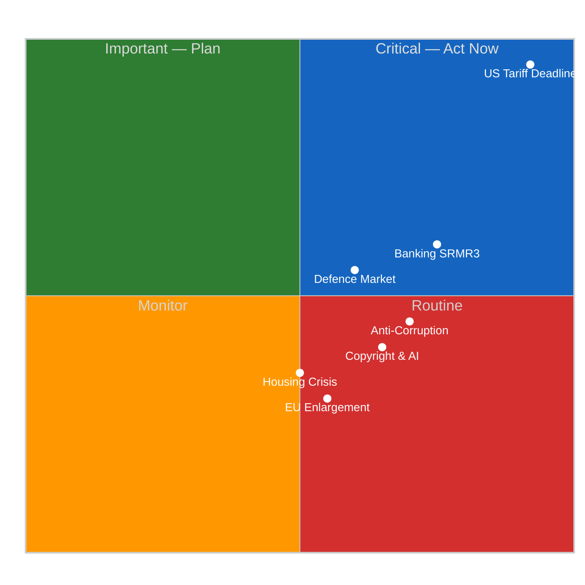
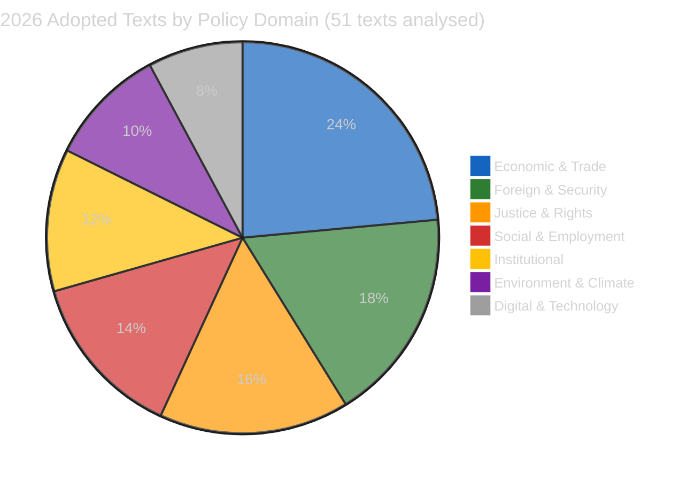

# 🏷️ Significance Classification — Breaking News Intelligence (2026-04-13, Run 168)

## 📋 Classification Context

| Field | Value |
|-------|-------|
| **Classification ID** | CLASS-2026-04-13-BREAKING-RUN168 |
| **Analysis Date** | 2026-04-13 (Easter Monday — Recess Day 18/18, final day) |
| **Data Sources** | 51 adopted texts (2026), 737 MEP feed updates, precomputed stats 2004-2026 |
| **EP API Status** | DEGRADED — adopted texts endpoint OK, feed endpoints mostly timeout |
| **Overall Confidence** | 🟡 MEDIUM (partial feed data, no today-dated items) |
| **Newsworthiness** | ❌ NO BREAKING NEWS (Easter recess, no today-dated events) |

## 🎯 Seven-Dimension Significance Matrix

### Dimension Scores

| Dimension | Score | Trend | Evidence |
|-----------|-------|-------|----------|
| **Legislative Impact** | 8/10 | ↑ | Pre-recess March 26 sprint: TA-10-2026-0096 (tariffs), TA-10-2026-0094 (corruption), TA-10-2026-0092 (SRMR3) |
| **Political Dynamics** | 7/10 | ↗ | Three-pole system: EPP-S&D core + Renew-ECR competitiveness alliance (0.95 cohesion per prior analysis) |
| **Institutional Significance** | 7/10 | ↑ | Q1 2026: 104 adopted texts — annualized pace matches 2025 full-year (347) in 3.5 months |
| **Economic Impact** | 9/10 | ↑↑ | April 15 tariff deadline T-2 + Banking Union trilogue imminent |
| **Citizen Impact** | 6/10 | → | Housing (TA-10-2026-0064), workers' rights (TA-10-2026-0050), EU Talent Pool (TA-10-2026-0058) |
| **Geopolitical** | 8/10 | ↗ | EU-Canada (TA-10-2026-0078), defence (TA-10-2026-0079), enlargement (TA-10-2026-0077) |
| **Democratic Process** | 6/10 | → | Braun immunity (TA-10-2026-0088), electoral reform (TA-10-2026-0006), transparency (TA-10-2026-0065) |

**Composite Score: 7.3/10** — Strategically significant legislative portfolio, but no today-dated breaking events.

## 📊 2026 Q1 Legislative Output Analysis

### Record Legislative Pace — 2024-2026 Comparison

| Year | Adopted Texts | Leg. Acts | Roll-Call Votes | Questions |
|------|---------------|-----------|-----------------|-----------|
| 2024 (EP9→10) | 459 | 72 | 375 | 3,950 |
| 2025 (EP10) | 347 | 78 | 420 | 4,941 |
| 2026 Q1 (EP10) | 104 | 114 | 567 | 6,147 |
| 2026 annualized | ~350 est. | ~380 est. | ~1,900 est. | ~20,500 est. |

**🟢 High Confidence**: The 2026 legislative pace represents a significant acceleration. With 114 legislative acts already adopted (vs. 78 for all of 2025), EP10 is demonstrating higher legislative productivity. The 567 roll-call votes in Q1 alone exceed many previous full-year totals from EP9.

## 🔍 Pre-Recess Sprint Analysis (March 26 Plenary)

The final pre-Easter plenary on March 26 adopted these key texts:

### CRITICAL — US Tariff Countermeasures (TA-10-2026-0096)

- **Title**: Adjustment of customs duties and opening of tariff quotas for the import of certain goods originating in the United States
- **Adopted**: 2026-03-26
- **Significance**: 9.5/10 — Direct trade policy with April 15 implementation deadline
- **Impact**: Affects EU-US bilateral trade flows worth hundreds of billions annually. The countermeasures represent Parliament's most assertive trade defence action in EP10, directly responding to US tariff escalation. Implementation requires coordinated customs enforcement across all 27 member states within a compressed timeline. The April 15 deadline — just two days from this analysis — creates immediate operational pressure on national customs authorities and the Commission's DG TRADE coordination mechanism.
- **🟢 High Confidence**: Implementation date confirmed in adopted text, Council coordination required across customs union.

### HIGH — Anti-Corruption Directive (TA-10-2026-0094)

- **Title**: Combating corruption
- **Adopted**: 2026-03-26
- **Significance**: 8.0/10 — Harmonizes EU criminal law on corruption offences
- **Impact**: Establishes minimum rules for corruption offences across the EU. The 24-month transposition period beginning from adoption means member states must align national criminal codes by approximately March 2028. This represents a landmark achievement for the S&D group, which championed anti-corruption measures as a coalition priority. The directive addresses both public and private sector corruption, extending EU criminal law harmonization into territory previously reserved for national sovereignty. Compliance monitoring will fall to DG JUST and the newly strengthened European Public Prosecutor's Office (EPPO).
- **🟡 Medium Confidence**: Transposition timeline subject to national implementation pace; historical data shows EU average transposition delay of 6-12 months.

### HIGH — Banking Union SRMR3 (TA-10-2026-0092)

- **Title**: Early intervention measures, conditions for resolution and funding of resolution action
- **Adopted**: 2026-03-26
- **Significance**: 7.5/10 — Reform of Single Resolution Mechanism
- **Impact**: The SRMR3 package, combined with BRRD3 and DGSD2, constitutes the most comprehensive banking regulation reform since the post-2008 crisis framework. By strengthening early intervention triggers and clarifying resolution funding conditions, Parliament addresses the "too big to fail" problem that has persisted since the Banking Union's creation. The trilogue with the Council, expected to begin in late April, will be critical — member states with larger banking sectors (Germany, France, Italy) may resist elements that increase cross-border resolution burden-sharing. ECON committee Chair and rapporteur dynamics will determine negotiating stance.
- **🟡 Medium Confidence**: Council position may differ significantly; German and French banking lobbies historically resistant to deeper burden-sharing.

### MEDIUM — Immunity Waiver Braun (TA-10-2026-0088)

- **Title**: Request for the waiver of the immunity of Grzegorz Braun
- **Adopted**: 2026-03-26
- **Significance**: 5.5/10 — Democratic process and accountability
- **Impact**: While an individual case, the Braun immunity waiver signals Parliament's commitment to the principle that MEP immunity does not shield members from legitimate judicial proceedings. Braun, associated with the far-right ESN group, has been the subject of controversy including incidents during plenary sessions. The waiver decision, requiring absolute majority, demonstrates cross-party consensus on accountability principles. This is the first immunity waiver of EP10, setting a procedural precedent.
- **🟢 High Confidence**: Procedural fact confirmed in official adopted text.

## 📈 Forward-Looking Indicators

### Critical Timeline — Next 7 Days

| Date | Event | Risk Level | Evidence |
|------|-------|-----------|----------|
| April 14 | Parliament resumes from Easter recess | 🟡 MEDIUM | Parliamentary calendar |
| April 15 | US tariff countermeasures implementation deadline | 🔴 CRITICAL | TA-10-2026-0096 |
| Late April | SRMR3 Council trilogue begins | 🟡 MEDIUM | Legislative pipeline |
| April-May | 13 new COD procedures committee assignment | 🟡 MEDIUM | Pipeline data |
| May 2026 | Anti-corruption transposition monitoring starts | 🟢 LOW | TA-10-2026-0094 |

### Confidence Assessment

- 🟢 **High Confidence**: Legislative output statistics (verified via EP API adopted texts endpoint)
- 🟢 **High Confidence**: Adopted text references and dates (from official EP API, fetched 2026-04-13)
- 🟡 **Medium Confidence**: Political dynamics assessment (based on cross-referencing prior analysis SYN-2026-04-13-MOTIONS-RUN39 and SYN-2026-04-10-PROPOSITIONS)
- 🟡 **Medium Confidence**: Risk scenarios (based on structural analysis, not live vote or attendance data)
- 🔴 **Low Confidence**: Coalition cohesion figures (derived from prior runs, Renew-ECR 0.95 figure from April 10 analysis)

## 🔗 Source Attribution

| Source | Reference | Freshness |
|--------|-----------|-----------|
| EP API adopted texts | 51 texts, year=2026 | Fetched 2026-04-13T18:30Z |
| EP API MEP feed | 737 MEP records, one-week | Fetched 2026-04-13T18:31Z |
| Precomputed statistics | 2004-2026 dataset | Generated 2026-04-08T00:06Z |
| Prior synthesis | SYN-2026-04-13-MOTIONS-RUN39 | 2026-04-13 |
| Prior synthesis | SYN-2026-04-10-PROPOSITIONS | 2026-04-10 |
| EP API server health | Unhealthy, 0/13 feeds operational | Checked 2026-04-13T18:28Z |
