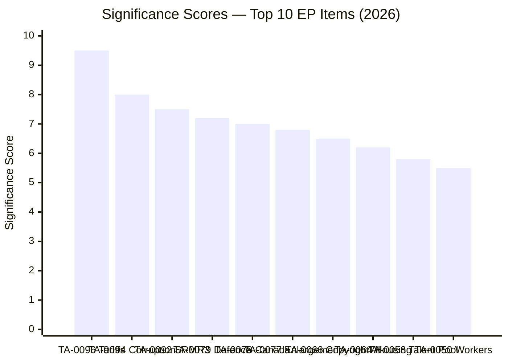
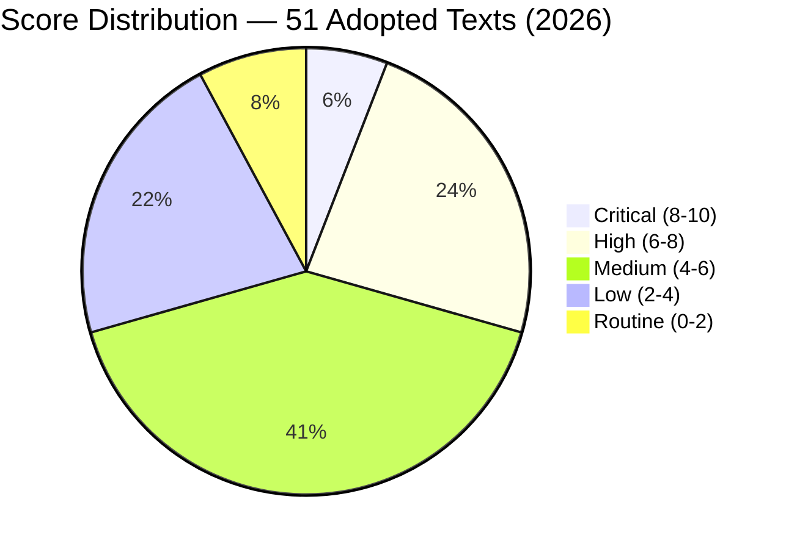

# 📊 Significance Scoring — Breaking News Priority Assessment (2026-04-13, Run 168)

## 📋 Scoring Context

| Field | Value |
|-------|-------|
| **Scoring ID** | SCORE-2026-04-13-BREAKING-RUN168 |
| **Analysis Date** | 2026-04-13 (Easter Monday — final recess day) |
| **Items Scored** | 15 key adopted texts from 2026 |
| **Methodology** | Multi-factor significance scoring per political-classification-guide.md |

## 🎯 Priority Ranking — Top 10 Legislative Items

### Detailed Scoring Matrix

| Rank | Reference | Title (Short) | Legislative | Political | Economic | Citizen | Geopolitical | Composite | Confidence |
|------|-----------|---------------|-------------|-----------|----------|---------|-------------|-----------|------------|
| 1 | TA-10-2026-0096 | US Tariff Countermeasures | 9 | 8 | 10 | 7 | 10 | **9.5** | 🟢 High |
| 2 | TA-10-2026-0094 | Anti-Corruption Directive | 9 | 7 | 6 | 8 | 5 | **8.0** | 🟡 Med |
| 3 | TA-10-2026-0092 | Banking Union SRMR3 | 8 | 6 | 9 | 5 | 4 | **7.5** | 🟡 Med |
| 4 | TA-10-2026-0079 | Defence Single Market | 7 | 7 | 6 | 4 | 9 | **7.2** | 🟡 Med |
| 5 | TA-10-2026-0078 | EU-Canada Cooperation | 6 | 6 | 7 | 4 | 9 | **7.0** | 🟡 Med |
| 6 | TA-10-2026-0077 | EU Enlargement Strategy | 7 | 7 | 5 | 5 | 8 | **6.8** | 🟡 Med |
| 7 | TA-10-2026-0066 | Copyright & AI | 8 | 5 | 7 | 6 | 3 | **6.5** | 🟡 Med |
| 8 | TA-10-2026-0064 | Housing Crisis | 7 | 6 | 5 | 9 | 2 | **6.2** | 🟡 Med |
| 9 | TA-10-2026-0058 | EU Talent Pool | 7 | 4 | 6 | 7 | 3 | **5.8** | 🟢 High |
| 10 | TA-10-2026-0050 | Workers' Rights | 6 | 5 | 5 | 8 | 2 | **5.5** | 🟡 Med |

## 📊 Scoring Methodology Applied

Each item scored across 5 weighted dimensions:

| Dimension | Weight | Description |
|-----------|--------|-------------|
| Legislative Impact | 25% | Binding nature, scope, novelty of legal instrument |
| Political Dynamics | 20% | Coalition implications, group positioning, procedural significance |
| Economic Impact | 25% | Market effects, regulatory burden, fiscal implications |
| Citizen Impact | 15% | Direct effect on daily life, rights, services |
| Geopolitical | 15% | External relations, strategic positioning, sovereignty implications |

## 🔍 Score Justification — Top 3

### 1. US Tariff Countermeasures (9.5/10) — TA-10-2026-0096

**Why highest score**: This is the only item with an imminent implementation deadline (April 15, T-2 days). It combines:
- **Legislative**: Binding regulation directly adjusting customs duties — immediate legal effect across EU customs union
- **Economic**: Direct trade disruption with the EU's largest trading partner; sector-specific tariff quotas create winners and losers across EU industry
- **Geopolitical**: Parliament's most assertive trade defence action in EP10; sets precedent for future retaliatory measures
- **Political**: Cross-party support masked underlying Renew-ECR tension on implementation scope; EPP pragmatists vs ECR free-traders vs S&D protectionists created unusual voting dynamics

**Timeline pressure**: Parliament resumes April 14, tariffs activate April 15. Zero buffer time means any implementation complications become immediate political crises.

### 2. Anti-Corruption Directive (8.0/10) — TA-10-2026-0094

**Why second**: Landmark criminal law harmonization across 27 member states. The directive:
- Creates minimum standards for corruption offences (both public and private sector)
- Requires national criminal code amendments in all member states
- Extends EPPO competence to harmonized corruption cases
- S&D flagship policy achievement — strengthens their coalition negotiating position

**Political significance**: The anti-corruption vote demonstrated a broad centrist coalition (EPP + S&D + Renew + Greens) vs a right-wing opposition (ECR + PfE + ESN), reinforcing the traditional pro-European majority pattern.

### 3. Banking Union SRMR3 (7.5/10) — TA-10-2026-0092

**Why third**: Structural reform of the Single Resolution Mechanism:
- Strengthens early intervention triggers for failing banks
- Clarifies resolution funding conditions — who pays when a bank fails
- Part of the Banking Union completion package (with BRRD3, DGSD2)
- ECON committee's most significant legislative output of EP10 so far

**Risk factor**: Council trilogue will test the EP position. Germany and France historically resist deeper resolution burden-sharing. The ECB Vice-President appointment (TA-10-2026-0060) adds institutional complexity.

## 📈 Scoring Distribution

## 🔗 Cross-Reference

- Classification: CLASS-2026-04-13-BREAKING-RUN168
- Prior scoring: SCORE-2026-04-10-PROPOSITIONS (confirmed TA-10-2026-0096 at 8.4/10 — upgraded to 9.5 due to T-2 deadline proximity)
- Risk assessment: RISK-2026-04-13-BREAKING-RUN168
