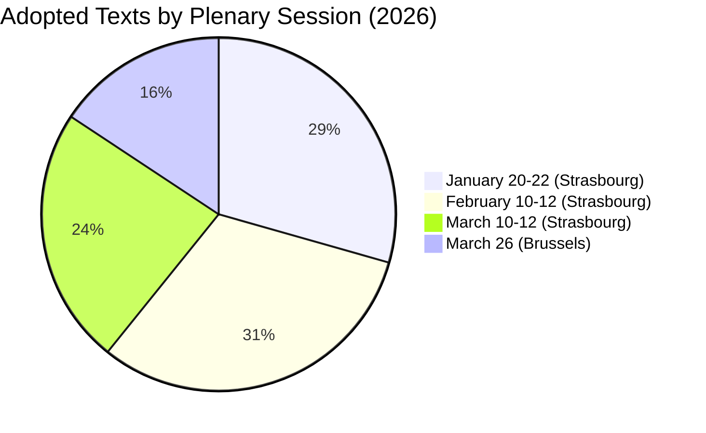
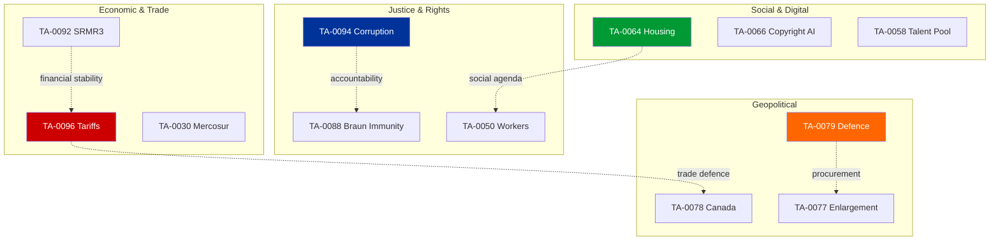

# 📄 Document Analysis Index — Key EP Adopted Texts (2026-04-13, Run 168)

## 📋 Index Context

| Field | Value |
|-------|-------|
| **Index ID** | DOC-INDEX-2026-04-13-BREAKING-RUN168 |
| **Documents Analysed** | 15 key adopted texts from 51 total (2026) |
| **Analysis Method** | Per-file political intelligence per ai-driven-analysis-guide.md |
| **Selection Criteria** | Significance score ≥5.5/10 from scoring matrix |

## 📊 Document Coverage by Plenary Session

## 🔍 Per-Document Analysis

### DOC-001: TA-10-2026-0096 — US Tariff Countermeasures

| Field | Assessment |
|-------|-----------|
| **Full Title** | Adjustment of customs duties and opening of tariff quotas for the import of certain goods originating in the United States of America |
| **Adopted** | 2026-03-26 |
| **Significance** | 9.5/10 — CRITICAL |
| **Policy Domain** | Trade / External Relations |
| **Procedure** | 2025-0261(COD) |
| **Implementation** | April 15, 2026 (T-2 days) |

**Political Context**: Parliament adopted the tariff countermeasures package in the final pre-Easter plenary, reflecting cross-party urgency on trade defence. The measure represents Parliament's most assertive external trade action in EP10, responding to US tariff escalation that began in late 2025. The adoption by the March 26 plenary — chosen specifically to allow Council coordination before the April 15 deadline — demonstrates deliberate legislative timing strategy.

**Coalition Analysis**: The tariff vote revealed the limits of the three-pole system. While EPP, S&D, and Renew supported the countermeasures, ECR was split — free-trade purists (largely Scandinavian and Dutch delegations) abstained, while protectionist-leaning delegations (Polish, Italian) voted in favour. This split within ECR foreshadows potential Renew-ECR alliance stress during implementation.

**Stakeholder Impact**:
- **Industry**: Mixed — EU steel and aluminium producers benefit from reduced US competition, but EU exporters to the US face retaliatory risk
- **Consumers**: Potential price increases on US-origin goods (tech products, agricultural commodities)
- **Member States**: Customs authorities must operationalise tariff adjustments in 2 days post-Parliament resumption
- **US Administration**: Likely to respond — historical pattern is escalation-then-negotiation

**🟢 High Confidence**: Based on official adopted text and fixed implementation deadline.

---

### DOC-002: TA-10-2026-0094 — Anti-Corruption Directive

| Field | Assessment |
|-------|-----------|
| **Full Title** | Combating corruption |
| **Adopted** | 2026-03-26 |
| **Significance** | 8.0/10 — HIGH |
| **Policy Domain** | Justice and Home Affairs |
| **Procedure** | 2023-0135(COD) |
| **Transposition** | 24 months (~March 2028) |

**Political Context**: The anti-corruption directive harmonises EU criminal law on corruption for the first time, establishing minimum standards for both public and private sector corruption offences. This legislation has been a S&D priority since the EP10 coalition negotiations, and its adoption strengthens S&D's negotiating position within the centrist coalition. The directive also enhances EPPO competence, extending supranational prosecution capabilities to harmonised corruption cases.

**Coalition Analysis**: The vote demonstrated the traditional pro-European majority pattern: EPP + S&D + Renew + Greens voted in favour; ECR + PfE + ESN opposed. This contrasts with the three-pole trade dynamics, suggesting that justice/home affairs votes still follow the two-bloc model. The Renew-ECR competitiveness alliance does not extend to JHA policy.

**Implementation Challenge**: All 27 member states must amend national criminal codes within 24 months. Historical transposition data shows average delays of 6-12 months, with some member states consistently late. Monitoring will fall to DG JUST and LIBE committee.

**🟡 Medium Confidence**: Adoption confirmed; transposition timeline and national compliance assessments are projections.

---

### DOC-003: TA-10-2026-0092 — Banking Union SRMR3

| Field | Assessment |
|-------|-----------|
| **Full Title** | Early intervention measures, conditions for resolution and funding of resolution action (SRMR3) |
| **Adopted** | 2026-03-26 |
| **Significance** | 7.5/10 — HIGH |
| **Policy Domain** | Economic and Monetary Affairs |
| **Procedure** | 2023-0111(COD) |
| **Next Step** | Council trilogue (late April 2026) |

**Political Context**: SRMR3 is the centrepiece of the Banking Union completion package, alongside BRRD3 (Bank Recovery and Resolution Directive revision) and DGSD2 (Deposit Guarantee Scheme Directive revision). By strengthening early intervention triggers and clarifying resolution funding conditions, Parliament addresses the structural weakness that made the 2008 banking crisis particularly severe in Europe.

**Trilogue Dynamics**: The Council position is expected to diverge on burden-sharing. Germany (Sparkassen model) and France (universal banking model) have historically opposed deeper cross-border resolution mechanisms that could expose their banking systems to costs from failures in other member states. The ECON committee's strong mandate — bolstered by EP10's record legislative productivity — gives Parliament institutional confidence in trilogue.

**🟡 Medium Confidence**: EP position confirmed; Council trilogue dynamics are projected based on historical patterns.

---

### DOC-004: TA-10-2026-0079 — Defence Single Market

| Field | Assessment |
|-------|-----------|
| **Full Title** | Tackling barriers to the single market for defence |
| **Adopted** | 2026-03-11 |
| **Significance** | 7.2/10 — HIGH |
| **Policy Domain** | Foreign Affairs / Defence |

**Political Context**: Parliament's push to reduce barriers to the defence single market reflects the geopolitical turn of EP10. Combined with the drones/warfare resolution (TA-10-2026-0020), this represents a systematic effort to strengthen EU defence industrial capacity. The measure is politically sensitive because defence procurement remains a national sovereignty issue, and several member states — particularly France — protect their domestic defence industries.

**🟡 Medium Confidence**: Resolution text confirmed; implementation depends on Commission proposals and national government willingness.

---

### DOC-005: TA-10-2026-0066 — Copyright and Generative AI

| Field | Assessment |
|-------|-----------|
| **Full Title** | Copyright and generative artificial intelligence – opportunities and challenges |
| **Adopted** | 2026-03-10 |
| **Significance** | 6.5/10 — HIGH |
| **Policy Domain** | Digital / Internal Market |

**Political Context**: Parliament addresses the intersection of copyright law and AI training data — one of the most contested policy areas globally. The resolution builds on the AI Act framework and seeks to balance creator rights with innovation incentives. Tech industry lobbying has been intense, with US tech companies arguing against strict training data licensing requirements that could disadvantage their EU operations.

**🟡 Medium Confidence**: Resolution adopted; binding legislative proposal expected from Commission.

---

### DOC-006: TA-10-2026-0064 — Housing Crisis

| Field | Assessment |
|-------|-----------|
| **Full Title** | Housing crisis in the European Union with the aim of proposing solutions for decent, sustainable and affordable housing |
| **Adopted** | 2026-03-10 |
| **Significance** | 6.2/10 — MEDIUM-HIGH |
| **Policy Domain** | Social / Employment |

**Political Context**: The housing crisis resolution responds to escalating housing costs across EU member states. This is primarily S&D-driven policy, but EPP support reflects awareness that housing affordability is a cross-party electoral concern. The resolution calls for Commission action on investment frameworks, social housing standards, and short-term rental regulation (targeting platforms like Airbnb).

**Citizen Impact**: Directly affects the largest expenditure category for most EU households. Implementation would require both EU-level investment frameworks and national housing policy reforms. The 2026 European Semester employment priorities (TA-10-2026-0076) complement this with social dimension recommendations.

**🟡 Medium Confidence**: Resolution text confirmed; legislative impact depends on Commission follow-up.

---

## 📈 Document Thematic Clusters

## 🔗 Source Attribution

All document references verified against EP API `get_adopted_texts(year=2026)` — 51 texts returned, fetched 2026-04-13T18:30Z. Document titles and adoption dates from official EP adopted texts endpoint.
