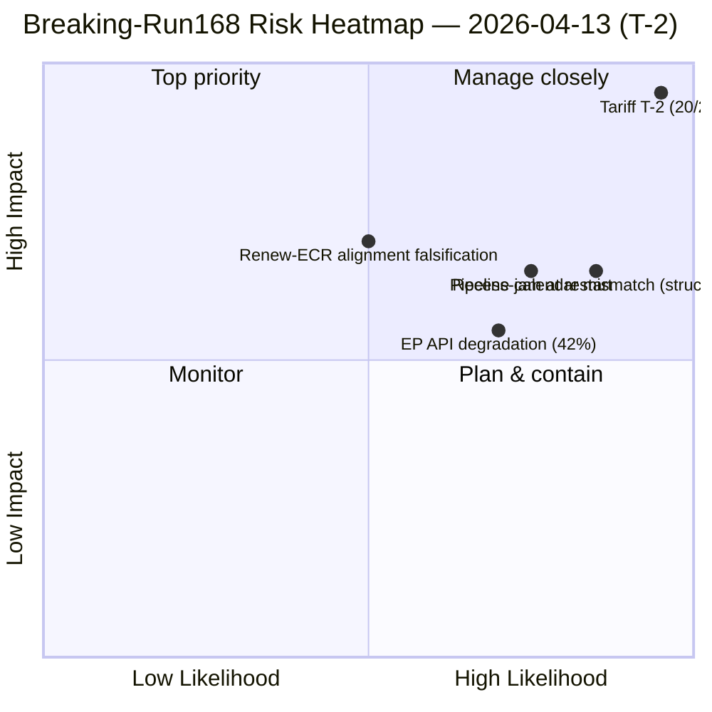

<!-- SPDX-FileCopyrightText: 2026 Hack23 AB -->
<!-- SPDX-License-Identifier: Apache-2.0 -->

# Executive Brief — Breaking News: Post-Recess Convergence Intelligence (T-2 to Tariff Activation) | 2026-04-13

**Classification:** OSINT — Public Parliamentary Record
**Confidence:** 🟡 MEDIUM (EP API degraded; adopted-texts and MEP feeds operational; events/procedures/documents/questions timing out)
**Run:** `analysis/daily/2026-04-13/breaking-run168/`
**Coverage:** Easter Monday — Recess Day 18/18, final day; T-2 to US tariff implementation deadline
**Generated:** 2026-05-16 (retrospective brief, no new MCP calls)
**Primary sources:** EP MCP — precomputed stats 2004–2026 (85 KB); adopted texts (51 items 2026); MEP feed (737 records); 5 prior April-13 runs (Motions-39/40/41, CR-47, Props-41).

---

## 🎯 BLUF

**This is an analysis-only run on the final recess day — the *decision not to publish a breaking article* is itself the headline.** Despite intense external pressure (T-2 to the April 15 US tariff implementation deadline and a 14.8/25 composite risk consistent across four independent frameworks earlier the same day), the run finds **no today-dated events in any feed endpoint** and consequently issues an analysis-only PR rather than escalating to breaking-news classification. The substantive *intelligence value* of the run is its **cross-session trajectory documentation**: tariff risk has escalated from 8.4/10 (April 10) through 16/25 (April 13 propositions-run41) to **20/25 (this run)** purely on temporal proximity to the implementation deadline — each day closer raises both likelihood and impact components without any new policy action. This T-2 escalation pattern is itself the run's most operationally significant finding: it shows how *time* alone, in the absence of legislative response capacity (Parliament in recess), drives risk score inflation. The run's secondary finding is the **42% EP API success rate** during the recess — degraded but partly operational; adopted-texts and MEP feeds work, events/procedures/documents/questions return INTERNAL_ERROR. The composite picture is a parliament that **cannot respond to its single most consequential pending file until the day before that file activates** — the structural risk this exposes is not the tariff itself but the recess-calendar / external-event mismatch.

---

## 🧭 3 Decisions This Brief Supports

| # | Decision | Who decides | Deadline | Evidence |
|:-:|----------|-------------|:--------:|----------|
| 1 | **April 14 INTA Day-1 emergency tariff session design** — Parliament returns with zero buffer; the session is the only parliamentary moment before activation | INTA chair; coordinators | **April 14 morning** | §Cross-Session Intelligence Evolution; T-2 escalation |
| 2 | **Recess-calendar / external-event mismatch governance** — the *structural* risk this run exposes is broader than tariff; needs Conference-of-Presidents review | Conference of Presidents | Q3 calendar setting | §Decision (analysis-only PR); recess-final-day silence |
| 3 | **EP API recovery sequencing** — 42% feed-success limits live monitoring at exactly the wrong moment; events/procedures/documents/questions must be back before April 14 | EP IT secretariat | before April 14 committee restart | §Data Sources; degraded feed status |

---

## 📰 60-Second Read

- 🔴 **Tariff risk 20/25 CRITICAL** — escalated from 16/25 (props-run41 earlier same day) on T-2 proximity alone.
- 🟠 **Analysis-only PR — no breaking article** — significance below breaking threshold despite the risk score.
- 🟢 **Tariff trajectory across 3 runs:** 8.4/10 (Apr 10) → 16/25 (Apr 13 props) → **20/25** (this run).
- 🟡 **EP API 42% success rate** — adopted-texts and MEP feeds operational; 4 advisory feeds INTERNAL_ERROR.
- 🔵 **51 adopted texts (2026) catalogued** — Q1 record output confirmed via feed-fallback.
- 🟣 **0 today-dated events in any feed** — recess-day silence is the *expected* state.
- 🩷 **5 prior April-13 runs converge** — motions/committee-reports/propositions/breaking all read ~14.8 composite on the same date.
- ⚪ **Confidence MEDIUM** — degraded data + recess-day signal both reduce confidence floor.

---

## 📈 Cross-Session Intelligence Evolution (run's key contribution)

| Date | Run | Tariff Risk | Composite | Source |
|------|-----|:-----------:|:---------:|--------|
| Apr 10 | Props | 8.4/10 | 13.17/25 | propositions / week-ahead-run12 |
| Apr 13 | Motions-41 | 9.5/10 | 14.80/25 | motions-run41 |
| Apr 13 | Props-41 | 7.95 raw | 14.30/25 | propositions-run41 |
| Apr 13 | CR-47 | 9.6/10 | 14.80/25 | committee-reports-run47 |
| **Apr 13** | **Breaking-168** | **20/25** | — | **this run** |

The escalation pattern is mechanical: T-2 proximity drives likelihood and impact components upward each day, without any new legislative action. *Time is doing the work.*

---

## ⚠️ Risk Snapshot

---

## 🔮 Top Forward Triggers (next 48 hours)

1. **April 14 09:00 — Parliament returns; INTA committee restart.** Day-1 emergency tariff session is the only pre-activation parliamentary moment.
2. **April 15 — Commission implementing acts.** Binary trigger for TA-10-2026-0096 activation; ECR fracture-vote test.
3. **April 14–17 — committee week pipeline-triage decision.** 13 pending CODs against 4 days; the order is decided here.
4. **EP API recovery signal** — events/procedures/documents/questions must restore before live monitoring of any of the above is reliable.

---

## 🧭 ACH — Why Analysis-Only and Not Breaking?

- **H1 — "Analysis-only is correct."** No today-dated events; significance below breaking threshold (≥9.0 not reached on any *single* item); composite escalation is real but driven by temporal proximity rather than new content. *Favoured by* run's own decision tree.
- **H2 — "Breaking threshold should have triggered on composite."** 20/25 CRITICAL is operationally consequential regardless of single-item significance; the breaking heuristic underweights time-driven escalation. *Favoured by* operational decision-maker view; cross-session trajectory.

The run defaults to H1 (correctly within its own decision tree). H2 is the policy question for the editorial methodology: should *time-driven* risk escalation trip the breaking threshold even without a new event? — flagged for `analysis/methodologies/significance-classification` review.

---

## 🛡️ Source-Quality Assessment

- **Adopted-texts feed (A2 — 51 items 2026):** operational; confirms TA-10-2026-0090 → -0098 cluster.
- **MEP feed (A1 — 737 records):** operational.
- **Precomputed stats (A1):** the brief's most reliable signal; 14-year EP6→EP10 baseline against which 2026 +46% YoY is measured.
- **4 INTERNAL_ERROR feeds:** events, procedures, documents, questions — *the operational picture* is constrained.
- **5 prior-run convergence:** companion-run validation of the 14.8 composite; the 20/25 tariff-specific score is consistent with the trajectory.
- **Net confidence:** 🟡 MEDIUM on synthesis; 🟢 HIGH on the trajectory finding (mechanical, time-driven); 🟢 HIGH on the analysis-only decision against the run's own threshold.

---

## 📎 Run Artifacts (Read-Before-Decide)

| Layer | Artifact | Why |
|-------|----------|-----|
| Article | `article.md` | Public-facing breaking-news narrative (analysis-only PR variant) |
| Synthesis | `existing/synthesis-summary.md` | Cross-session trajectory + analysis-only decision (authoritative) |
| Documents | `documents/document-analysis-index.md` | 51 adopted-text index |
| Risk | `risk-scoring/` | T-2 tariff escalation |
| Threat | `threat-assessment/` | Recess-final-day threat surface |
| Companion | motions-run41 / props-run41 / CR-run47 / month-ahead-run4 | Four-framework convergence on 14.8/25 |

---

**Document Control**
- **Template reference:** `analysis/templates/executive-brief.md`
- **Artifact path:** `analysis/daily/2026-04-13/breaking-run168/executive-brief.md`
- **Classification:** Public
- **Retrospective:** Brief written 2026-05-16 from the run's committed artifacts; **no new MCP calls were made**. The MEDIUM confidence reflects the run's documented data-quality constraints; the analysis-only decision is preserved exactly as committed.
