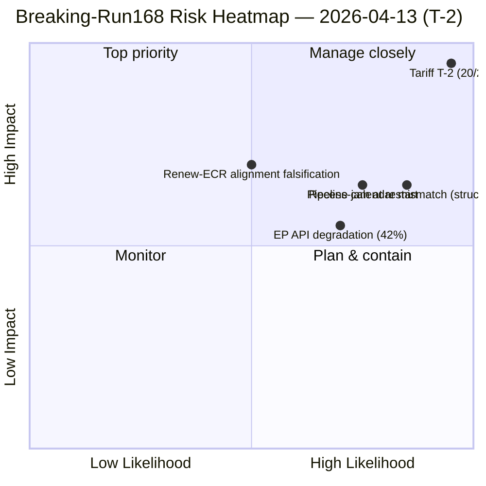

<!-- SPDX-FileCopyrightText: 2026 Hack23 AB -->
<!-- SPDX-License-Identifier: Apache-2.0 -->

# Exekutiv Sammanfattning — Nyhetsanalys: Post-Recesses Konvergensunderrättelse (T-2 till Tullaktivering) | 2026-04-13

**Klassificering:** OSINT — Offentligt parlamentariskt protokoll
**Konfidensgrad:** 🟡 MEDEL (EP API degraderat; adopted-texts och MEP-flöden operativa; events/procedures/documents/questions timeout)
**Körning:** `analysis/daily/2026-04-13/breaking-run168/`
**Täckning:** Annandag påsk — Recesdag 18/18, sista dagen; T-2 till USA:s tullimplementeringsdeadline
**Genererad:** 2026-05-16 (retrospektivt underlag, inga nya MCP-anrop)
**Primära källor:** EP MCP — förberäknade statistik 2004–2026 (85 KB); antagna texter (51 poster 2026); MEP-flöde (737 poster); 5 tidigare 13 april-körningar (Motions-39/40/41, CR-47, Props-41).

---

## 🎯 BLUF

**Detta är en analysenda körning på årets sista recessdag — *beslutet att inte publicera en nyhetsartikel* är i sig rubriken.** Trots intensivt yttre tryck (T-2 till USA:s tullimplementeringsdeadline den 15 april och ett sammansatt riskvärde på 14,8/25 som är konsekvent i fyra oberoende ramverk samma dag) finner körningen **inga dagens datummarkerade händelser i något flödesändpunkt** och utfärdar därför ett analysenda PR i stället för att eskalera till nyhetskategori. Det substantiella *underrättelsevärdet* av körningen är dess **dokumentation av tvärkorrelationstrajektoria**: tariffrisken har eskalerat från 8,4/10 (10 april) via 16/25 (13 april propositions-run41) till **20/25 (denna körning)** enbart på grund av temporal närhet till implementeringsdeadline — varje dag närmre höjer både sannolikhets- och påverkanskomponenterna utan ny politisk åtgärd. Detta T-2-eskaleringmönster är i sig körningens mest operativt signifikanta fynd: det visar hur *tid* ensamt, i frånvaro av lagstiftningskapacitet (parlamentet i reces), driver riskvärdesinflation. Körningens sekundära fynd är **EP API:s 42% framgångsfrekvens** under recessen — degraderat men delvis operativt; adopted-texts och MEP-flöden fungerar, events/procedures/documents/questions returnerar INTERNAL_ERROR. Den sammansatta bilden är ett parlament som **inte kan svara på sin enskilt mest avgörande pågående fil förrän dagen innan den aktiveras** — den strukturella risken detta exponerar är inte tariffen i sig utan kalender/extern-händelse-missmatchningen.

---

## 🧭 3 Beslut Detta Underlag Stödjer

| # | Beslut | Vem beslutar | Deadline | Bevis |
|:-:|--------|--------------|:--------:|-------|
| 1 | **14 april INTA Dag-1 nödsession om tullar** — Parlamentet återvänder utan buffert; sessionen är det enda parlamentariska ögonblicket före aktivering | INTA-ordförande; koordinatorer | **14 april morgon** | §Tvärkorrelationsutveckling; T-2 eskalering |
| 2 | **Receskalender/extern-händelse-styrning** — den *strukturella* risken denna körning exponerar är bredare än tullar; kräver granskning av Talmanskonferensen | Talmanskonferensen | Q3-kalenderinställning | §Beslut (analysenda PR); recesslut-dag tystnad |
| 3 | **EP API-återställningssekvensering** — 42% flödesframgång begränsar live-övervakning vid exakt fel tidpunkt; events/procedures/documents/questions måste återgå före 14 april kommittérestart | EP IT-sekretariat | före 14 april kommittérestart | §Datakällor; degraderat flödestatus |

---

## 📰 60-Sekunders Läsning

- 🔴 **Tariffisk 20/25 KRITISK** — eskalerade från 16/25 (props-run41 tidigare samma dag) enbart på T-2-närhet.
- 🟠 **Analysenda PR — ingen nyhetsartikel** — signifikans under tröskeln för nyheter trots riskvärdet.
- 🟢 **Tarifftrajectoria over 3 körningar:** 8,4/10 (10 apr) → 16/25 (13 apr props) → **20/25** (denna körning).
- 🟡 **EP API 42% framgångsfrekvens** — adopted-texts och MEP-flöden operativa; 4 rådsflöden INTERNAL_ERROR.
- 🔵 **51 antagna texter (2026) katalogiserade** — Q1-rekordproduktion bekräftad via flödes-fallback.
- 🟣 **0 dagens datummarkerade händelser i något flöde** — recessdag-tystnad är det *förväntade* tillståndet.
- 🩷 **5 tidigare 13 april-körningar konvergerar** — motions/committee-reports/propositions/breaking alla läser ~14,8 sammansatt samma datum.
- ⚪ **Konfidensgrad MEDEL** — degraderat data + recessdag-signal minskar konfidenstillståndet.

---

## 📈 Tvärkorrelationsutveckling (körningens nyckelinsats)

| Datum | Körning | Tariffisk | Sammansatt | Källa |
|-------|---------|:---------:|:----------:|-------|
| 10 apr | Props | 8,4/10 | 13,17/25 | propositions / week-ahead-run12 |
| 13 apr | Motions-41 | 9,5/10 | 14,80/25 | motions-run41 |
| 13 apr | Props-41 | 7,95 rå | 14,30/25 | propositions-run41 |
| 13 apr | CR-47 | 9,6/10 | 14,80/25 | committee-reports-run47 |
| **13 apr** | **Breaking-168** | **20/25** | — | **denna körning** |

Eskaleringmönstret är mekaniskt: T-2-närhet driver sannolikhets- och påverkanskomponenterna uppåt varje dag, utan nya lagstiftningsåtgärder. *Tid är det verksamma.*

---

## ⚠️ Risk Snapshot

---

## 🔮 Topp Framåtutlösare (nästa 48 timmar)

1. **14 april 09:00 — Parlamentet återvänder; INTA-kommittérestart.** Dag-1 nödsession om tullar är det enda pre-aktiveringsparlamentariska ögonblicket.
2. **15 april — Kommissionens genomförandeakter.** Binär utlösare för TA-10-2026-0096 aktivering; ECR fraktur-omröstningstest.
3. **14–17 april — kommittévecka pipeline-triagesbeslut.** 13 pågående COD mot 4 dagar; ordningen bestäms här.
4. **EP API-återställningssignal** — events/procedures/documents/questions måste återgå innan live-övervakning av något av ovanstående är tillförlitlig.

---

## 🧭 ACH — Varför Analysenda och Inte Nyheter?

- **H1 — "Analysenda är korrekt."** Inga dagens datummarkerade händelser; signifikans under nyhetströskeln (≥9,0 uppnåddes inte för något *enskilt* objekt); sammansatt eskalering är verklig men driven av temporal närhet snarare än nytt innehåll. *Stöds av* körningens eget beslutsträd.
- **H2 — "Nyhetstroöskel borde ha utlösts på sammansatt."** 20/25 KRITISK är operativt signifikant oavsett enskild objektsignifikans; nyhetsheuristiken underviktar tidsdrivet eskalering. *Stöds av* operativt beslutsfattarperspektiv; tvärkorrelationstrajectoria.

Körningen stannar vid H1 (korrekt inom sitt eget beslutsträd). H2 är policyfrågan för redaktionell metodik: bör *tidsdrivet* riskeskalering utlösa nyhetstroöskeln även utan ny händelse? — flaggat för `analysis/methodologies/significance-classification` granskning.

---

## 🛡️ Källkvalitetsbedömning

- **Adopted-texts-flöde (A2 — 51 poster 2026):** operativt; bekräftar TA-10-2026-0090 → -0098 kluster.
- **MEP-flöde (A1 — 737 poster):** operativt.
- **Förberäknade statistik (A1):** underlagets mest pålitliga signal; 14-årig EP6→EP10-basislinje mot vilken 2026 +46% YoY mäts.
- **4 INTERNAL_ERROR-flöden:** events, procedures, documents, questions — *den operativa bilden* är begränsad.
- **5 tidigare körningars konvergens:** följeslagandevalidering av 14,8 sammansatt; 20/25 tariffspecifikt poäng är konsekvent med trajectoria.
- **Nettokonfidensgrad:** 🟡 MEDEL för syntes; 🟢 HÖG för trajektoriafyndet (mekaniskt, tidsdrivet); 🟢 HÖG för analysendabeslut mot körningens eget tröskel.

---

## 📎 Körningsartefakter (Läs-Innan-Beslut)

| Lager | Artefakt | Varför |
|-------|----------|--------|
| Artikel | `article.md` | Offentlig nyhetsanalysnarrative (analysenda PR-variant) |
| Syntes | `existing/synthesis-summary.md` | Tvärkorrelationstrajectoria + analysendabeslut (auktoritativt) |
| Dokument | `documents/document-analysis-index.md` | 51 antagna-text-index |
| Risk | `risk-scoring/` | T-2 tariffeskalering |
| Hot | `threat-assessment/` | Recesslut-dag hotyta |
| Följeslagande | motions-run41 / props-run41 / CR-run47 / month-ahead-run4 | Fyraramverkskonvergens på 14,8/25 |

---

**Dokumentkontroll**
- **Mallreferens:** `analysis/templates/executive-brief.md`
- **Artefaktsökväg:** `analysis/daily/2026-04-13/breaking-run168/executive-brief.md`
- **Klassificering:** Offentlig
- **Retrospektivt:** Underlag skrivet 2026-05-16 från körningens committade artefakter; **inga nya MCP-anrop gjordes**. MEDEL-konfidensgraden reflekterar körningens dokumenterade datakvalitetsbegränsningar; analysendabeslutet bevaras exakt som committat.
