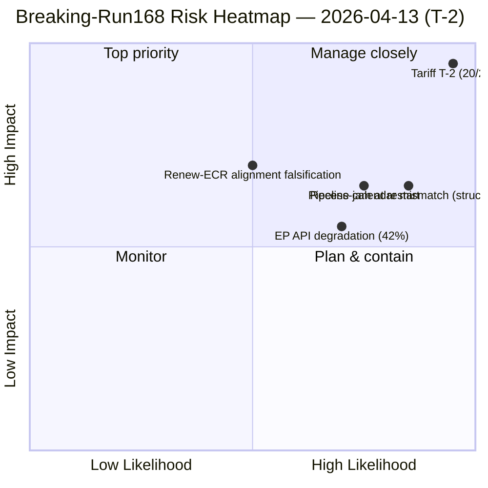

<!-- SPDX-FileCopyrightText: 2026 Hack23 AB -->
<!-- SPDX-License-Identifier: Apache-2.0 -->

# Eksekutivsammendrag — Hastemelding: Konvergensetterretning etter påskepause (T-2 til tolltrevirksomhet) | 2026-04-13

**Klassifisering:** OSINT — Offentlig parlamentarisk protokoll
**Konfidens:** 🟡 MEDIUM (EP API degradert; tekster og MEP-feeder operasjonelle; hendelser/prosedyrer/dokumenter/spørsmål tar tidsavbrudd)
**Kjøring:** `analysis/daily/2026-04-13/breaking-run168/`
**Dekning:** Påskemandagen — Pausedag 18/18, siste dag; T-2 til implementeringsfristen for amerikanske tollsatser
**Generert:** 2026-05-16 (retrospektivt sammendrag, ingen nye MCP-kall)
**Primærkilder:** EP MCP — forhåndsberegnede statistikker 2004–2026 (85 KB); vedtatte tekster (51 elementer 2026); MEP-feeder (737 poster); 5 tidligere 13. april-kjøringer (Motions-39/40/41, CR-47, Props-41).

---

## 🎯 BLUF

**Dette er en analysekjøring på den siste pausedagen — *beslutningen om ikke å publisere en hasteartikkel* er i seg selv overskriften.** Til tross for intenst eksternt press (T-2 til implementeringsfristen for amerikanske tollsatser 15. april og en komposittrisiko på 14,8/25 konsistent på tvers av fire uavhengige rammeverk tidligere samme dag), finner kjøringen **ingen dagensdaterte hendelser i noen feeder-endepunkt** og utsteder følgelig en analyse-kun PR fremfor å eskalere til hastenyhet-klassifisering. Den substantielle *etterretningsverdien* av kjøringen er dens **dokumentasjon av forløp på tvers av sesjoner**: tollrisiko har eskalert fra 8,4/10 (10. april) via 16/25 (13. april propositions-run41) til **20/25 (denne kjøringen)** utelukkende på grunn av temporal nærhet til implementeringsfristen — for hver dag tettere øker både sannsynlighets- og konsekvensfaktorene uten noen ny politisk handling. Dette T-2-eskaleringmønsteret er i seg selv kjøringens mest operasjonelt betydelige funn: det viser hvordan *tid* alene, i fravær av lovgivningsresponskapasitet (parlamentet i pause), driver inflasjon av risikoscore. Kjøringens sekundære funn er **42% EP API-suksessrate** under pausen — degradert men delvis operasjonell; vedtatte tekster og MEP-feeder fungerer, hendelser/prosedyrer/dokumenter/spørsmål returnerer INTERNAL_ERROR. Det sammensatte bildet er et parlament som **ikke kan respondere på sin eneste mest konsekvensfulle ventende fil før dagen før den filen aktiveres** — den strukturelle risikoen dette avdekker er ikke tollsatsen i seg selv, men misforholdet mellom pausekalender og ekstern hendelse.

---

## 🧭 3 Beslutninger Dette Sammendraget Støtter

| # | Beslutning | Hvem bestemmer | Frist | Bevis |
|:-:|----------|-------------|:--------:|----------|
| 1 | **14. april INTA Dag-1 nødtollsesjonsdesign** — Parlamentet returnerer uten buffer; sesjonen er det eneste parlamentariske øyeblikket før aktivering | INTA-leder; koordinatorer | **14. april morgen** | §Konvergensetterretning på tvers av sesjoner; T-2-eskalering |
| 2 | **Styring av pausekalender/ekstern hendelsesmisforhold** — den *strukturelle* risikoen denne kjøringen avdekker er bredere enn toll; behøver gjennomgang av Konferansen for presidenter | Konferansen for presidenter | Q3 kalenderoppsett | §Beslutning (analyse-kun PR); pause-siste-dag-stillhet |
| 3 | **EP API-gjenopprettingssekvensering** — 42% feeder-suksess begrenser live-overvåking på nøyaktig feil tidspunkt; hendelser/prosedyrer/dokumenter/spørsmål må være tilbake før 14. april komitérestart | EP IT-sekretariat | før 14. april komitérestart | §Datakilder; degradert feeder-status |

---

## 📰 60-Sekunders Lesing

- 🔴 **Tollrisiko 20/25 KRITISK** — eskalert fra 16/25 (props-run41 tidligere samme dag) på T-2-nærhet alene.
- 🟠 **Analyse-kun PR — ingen hasteartikkel** — betydning under hasteterskel til tross for risikoscoren.
- 🟢 **Tollforløp over 3 kjøringer:** 8,4/10 (10. apr) → 16/25 (13. apr props) → **20/25** (denne kjøringen).
- 🟡 **EP API 42% suksessrate** — vedtatte tekster og MEP-feeder operasjonelle; 4 rådgivende feeder INTERNAL_ERROR.
- 🔵 **51 vedtatte tekster (2026) katalogisert** — Q1-rekordproduksjon bekreftet via feeder-tilbakefallsmekanisme.
- 🟣 **0 dagensdaterte hendelser i noen feeder** — pausedagstillhet er den *forventede* tilstanden.
- 🩷 **5 tidligere 13. april-kjøringer konvergerer** — motions/committee-reports/propositions/breaking leser alle ~14,8 kompositt på samme dato.
- ⚪ **Konfidens MEDIUM** — degraderte data + pausedagssignal reduserer begge konfidensgulvet.

---

## 📈 Konvergensetterretning på tvers av sesjoner (kjøringens nøkkelbidrag)

| Dato | Kjøring | Tollrisiko | Kompositt | Kilde |
|------|-----|:-----------:|:---------:|--------|
| 10. apr | Props | 8,4/10 | 13,17/25 | propositions / week-ahead-run12 |
| 13. apr | Motions-41 | 9,5/10 | 14,80/25 | motions-run41 |
| 13. apr | Props-41 | 7,95 rå | 14,30/25 | propositions-run41 |
| 13. apr | CR-47 | 9,6/10 | 14,80/25 | committee-reports-run47 |
| **13. apr** | **Breaking-168** | **20/25** | — | **denne kjøringen** |

Eskaleringmønsteret er mekanisk: T-2-nærhet driver sannsynlighets- og konsekvensfaktorer oppover for hver dag, uten noen ny lovgivningshandling. *Tid gjør arbeidet.*

---

## ⚠️ Risikoøyeblikksbilde

---

## 🔮 Viktigste fremtidige utløsere (neste 48 timer)

1. **14. april 09:00 — Parlamentet returnerer; INTA-komitérestart.** Dag-1 nødtollsesjonen er det eneste parlamentariske øyeblikket før aktivering.
2. **15. april — Kommisjonens gjennomføringshandlinger.** Binær utløser for aktivering av TA-10-2026-0096; ECR-bruddstemmtest.
3. **14.–17. april — komitéuke pipeline-triasebeslutning.** 13 ventende CODer mot 4 dager; rekkefølgen bestemmes her.
4. **EP API-gjenopprettingssignal** — hendelser/prosedyrer/dokumenter/spørsmål må gjenopprettes før live-overvåking av noe av det ovennevnte er pålitelig.

---

## 🧭 ACH — Hvorfor Analyse-kun og ikke Hastemelding?

- **H1 — «Analyse-kun er korrekt.»** Ingen dagensdaterte hendelser; betydning under hasteterskel (≥9,0 ikke nådd på noe *enkelt* element); kompositteskalering er reell men drevet av temporal nærhet fremfor nytt innhold. *Støttet av* kjøringens eget beslutningstreet.
- **H2 — «Hasterskel burde ha utløst på kompositt.»** 20/25 KRITISK er operasjonelt konsekvensfylt uavhengig av enkeltelemantsignifikans; hasteheuristikken undervekter tidsdrevet eskalering. *Støttet av* operasjonell beslutningstakerperspektiv; forløp på tvers av sesjoner.

Kjøringen velger H1 som standard (korrekt innenfor sitt eget beslutningstreet). H2 er politikkspørsmålet for den redaksjonelle metodologien: bør *tidsdrevet* risikoeskalering utløse hasteterskelen selv uten en ny hendelse? — flagget for gjennomgang av `analysis/methodologies/significance-classification`.

---

## 🛡️ Kildekvalitetsvurdering

- **Vedtatte tekster-feeder (A2 — 51 elementer 2026):** operasjonell; bekrefter TA-10-2026-0090 → -0098-cluster.
- **MEP-feeder (A1 — 737 poster):** operasjonell.
- **Forhåndsberegnede statistikker (A1):** sammendragets mest pålitelige signal; 14-år EP6→EP10-grunnlinje mot hvilken 2026 +46% ÅoÅ måles.
- **4 INTERNAL_ERROR-feeder:** hendelser, prosedyrer, dokumenter, spørsmål — *det operasjonelle bildet* er begrenset.
- **5 tidligere kjøringer konvergerer:** følgesjonsvalidering av 14,8-kompositten; 20/25 tollspesifikk score er konsistent med forløpet.
- **Netto konfidens:** 🟡 MEDIUM på syntese; 🟢 HIGH på forløpsfunnet (mekanisk, tidsdrevet); 🟢 HIGH på analyse-kun-beslutningen mot kjøringens eget terskel.

---

## 📎 Kjøregjenstander (Les-Før-Beslutning)

| Lag | Gjenstand | Hvorfor |
|-------|----------|-----|
| Artikkel | `article.md` | Offentlig hastenyhet-narrativ (analyse-kun PR-variant) |
| Syntese | `existing/synthesis-summary.md` | Forløp på tvers av sesjoner + analyse-kun-beslutning (autoritativ) |
| Dokumenter | `documents/document-analysis-index.md` | 51 vedtatt tekst-indeks |
| Risiko | `risk-scoring/` | T-2-tolleskalering |
| Trussel | `threat-assessment/` | Pause-siste-dag trusselbilde |
| Følgesjoner | motions-run41 / props-run41 / CR-run47 / month-ahead-run4 | Fire-rammeverk konvergens på 14,8/25 |

---

**Dokumentkontroll**
- **Malreferanse:** `analysis/templates/executive-brief.md`
- **Artefaktsti:** `analysis/daily/2026-04-13/breaking-run168/executive-brief.md`
- **Klassifisering:** Offentlig
- **Retrospektiv:** Sammendrag skrevet 2026-05-16 fra kjøringens committede artefakter; **ingen nye MCP-kall ble gjort**. MEDIUM-konfidens reflekterer kjøringens dokumenterte datakvalitetsbegrensninger; analyse-kun-beslutningen er bevart nøyaktig som committed.
