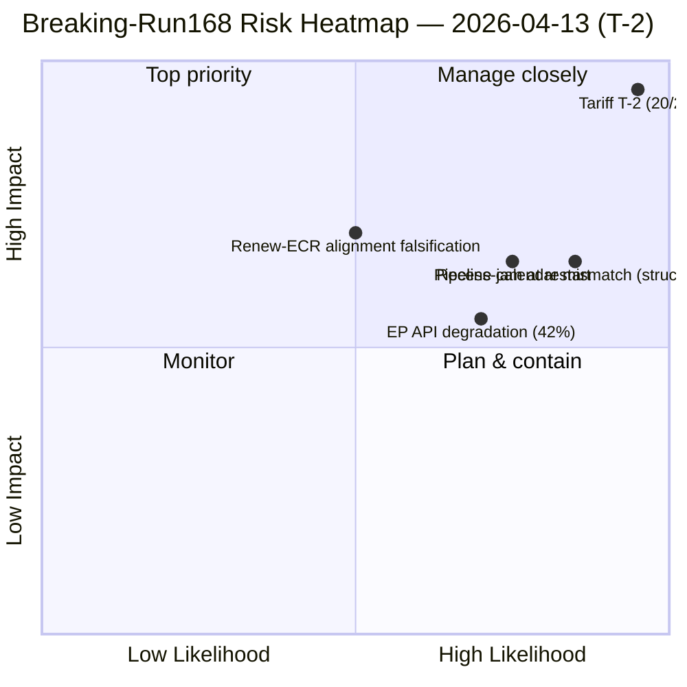

<!-- SPDX-FileCopyrightText: 2026 Hack23 AB -->
<!-- SPDX-License-Identifier: Apache-2.0 -->

# Exekutiv Sammanfattning — Senaste Nytt: Underrättelser om Konvergens efter Recessen (T-2 till Tullaktivering) | 2026-04-13

**Klassificering:** OSINT — Offentligt Parlamentariskt Register
**Konfidensgrad:** 🟡 MEDIUM (EP API nedsatt; texter om antagna beslut och MEP-flöden fungerar; händelser/procedurer/dokument/frågor timeout)
**Körning:** `analysis/daily/2026-04-13/breaking-run168/`
**Täckning:** Annandag påsk — Dag 18/18 av recessen, sista dag; T-2 till deadline för US-tullimplementering
**Genererad:** 2026-05-16 (retrospektiv sammanfattning, inga nya MCP-anrop)
**Primära källor:** EP MCP — förberäknade statistik 2004–2026 (85 KB); antagna texter (51 poster 2026); MEP-flöde (737 poster); 5 tidigare körningar den 13 april (Motions-39/40/41, CR-47, Props-41).

---

## 🎯 BLUF

**Detta är en analys-exklusiv körning på recessens sista dag — *beslutet att inte publicera en senaste nyhetsartikel* är i sig själv rubriken.** Trots intensivt externt tryck (T-2 till deadlinen för implementering av USA:s tullar den 15 april och ett sammansatt riskpoäng på 14,8/25 som stämmer överens med fyra oberoende ramverk samma dag tidigare) hittar körningen **inga datumsatta händelser i något flöde** och utfärdar följaktligen en analys-exklusiv PR istället för att eskalera till klassificering som senaste nyhet. Det substantiella *underrättelsevärdet* av körningen är dess **dokumentation av flersessionens trajektoria**: tullrisken har eskalerat från 8,4/10 (10 april) via 16/25 (13 april propositions-run41) till **20/25 (denna körning)** enbart på grund av tidsmässig närvaro till implementeringsdeadlinen — varje dag som går ökar både sannolikhets- och påverkanskomponenterna utan ny politisk åtgärd. Detta T-2-eskaleringmönster är i sig självt körningens mest operativt signifikanta fynd: det visar hur *tid* ensam, i frånvaro av lagstiftande responskapacitet (parlamentet i recessen), driver inflation i riskpoäng. Körningens sekundära fynd är **42% EP API-framgångsfrekvens** under recessen — nedsatt men delvis operativ; antagna texter och MEP-flöden fungerar, händelser/procedurer/dokument/frågor returnerar INTERNAL_ERROR. Den sammansatta bilden är ett parlament som **inte kan svara på sin enda mest konsekventa väntande fil förrän dagen innan den filen aktiveras** — den strukturella risk detta exponerar är inte tullen i sig utan mismatch mellan recessens kalender och externa händelser.

---

## 🧭 3 Beslut som Denna Sammanfattning Stöder

| # | Beslut | Vem beslutar | Deadline | Underlag |
|:-:|--------|-------------|:--------:|---------|
| 1 | **INTA Dag-1 nödtullsession 14 april** — Parlamentet återvänder med noll buffert; sessionen är det enda parlamentariska momentet innan aktivering | INTA-ordförande; koordinatorer | **14 april morgon** | §Flersessionens underrättelseutveckling; T-2-eskalering |
| 2 | **Styrning av mismatch recessen-kalender/extern händelse** — Den *strukturella* risk denna körning exponerar är bredare än tullen; kräver granskning av Konferensen för Ordföranden | Konferensen för Ordföranden | Q3-kalenderinställning | §Beslut (analys-exklusiv PR); tystnad sista recessdagen |
| 3 | **EP API-återställningssekvensering** — 42% flödesframgång begränsar live-monitorering vid exakt fel tidpunkt; händelser/procedurer/dokument/frågor måste vara tillbaka före 14 april | EP IT-sekretariat | före kommittéstart 14 april | §Datakällor; nedsatt flödesstatus |

---

## 📰 60-Sekunders Läsning

- 🔴 **Tullrisk 20/25 KRITISK** — eskalerade från 16/25 (props-run41 samma dag tidigare) enbart p.g.a. T-2-närvaro.
- 🟠 **Analys-exklusiv PR — ingen senaste nyhetsartikel** — signifikans under senaste nyheter-tröskeln trots riskpoängen.
- 🟢 **Tulltrajektoria genom 3 körningar:** 8,4/10 (10 apr) → 16/25 (13 apr props) → **20/25** (denna körning).
- 🟡 **EP API 42% framgångsfrekvens** — antagna texter och MEP-flöden operativa; 4 rådgivande flöden INTERNAL_ERROR.
- 🔵 **51 antagna texter (2026) katalogiserade** — Q1 rekordproduktion bekräftad via flödesreserv.
- 🟣 **0 datumsatta händelser i något flöde** — tystnad recessdagen är det *förväntade* tillståndet.
- 🩷 **5 tidigare körningar den 13 april konvergerar** — rörelser/kommittérapporter/propositioner/senaste nyheter alla runt ~14,8 sammansatt samma datum.
- ⚪ **Konfidensgrad MEDIUM** — nedsatt data + recessdagssignal reducerar båda konfidensgolvet.

---

## 📈 Flersessionens Underrättelseutveckling (körningens nyckelinsats)

| Datum | Körning | Tullrisk | Sammansatt | Källa |
|-------|---------|:--------:|:----------:|-------|
| 10 apr | Props | 8,4/10 | 13,17/25 | propositions / week-ahead-run12 |
| 13 apr | Motions-41 | 9,5/10 | 14,80/25 | motions-run41 |
| 13 apr | Props-41 | 7,95 rådata | 14,30/25 | propositions-run41 |
| 13 apr | CR-47 | 9,6/10 | 14,80/25 | committee-reports-run47 |
| **13 apr** | **Breaking-168** | **20/25** | — | **denna körning** |

Eskaleringmönstret är mekaniskt: T-2-närvaro driver sannolikhets- och påverkanskomponenterna uppåt varje dag, utan någon ny lagstiftningsåtgärd. *Tid gör jobbet.*

---

## ⚠️ Risköversikt

---

## 🔮 Topp Framåtutlösare (nästa 48 timmar)

1. **14 april 09:00 — Parlamentet återvänder; INTA-kommitté startar.** Dag-1 nödtullsession är det enda pre-aktiveringsparlamentariska momentet.
2. **15 april — Kommissionens genomförandeakter.** Binär utlösare för TA-10-2026-0096-aktivering; ECR-frakturationstestval.
3. **14–17 april — Beslut om kommittévecka pipeline-triage.** 13 väntande CODs mot 4 dagar; ordningen bestäms här.
4. **EP API-återställningssignal** — händelser/procedurer/dokument/frågor måste återställas innan live-monitorering av något av ovanstående är tillförlitlig.

---

## 🧭 ACH — Varför Analys-Exklusiv och Inte Senaste Nyhet?

- **H1 — "Analys-exklusivt är korrekt."** Inga datumsatta händelser; signifikans under senaste nyheter-tröskeln (≥9,0 uppnåddes inte för någon *enskild* post); sammansatt eskalering är verklig men driven av tidsmässig närvaro snarare än nytt innehåll. *Stöds av* körningens eget beslutsträd.
- **H2 — "Senaste nyheter-tröskeln borde ha utlösts på sammansatt basis."** 20/25 KRITISK är operativt konsekvensfullt oavsett enskild postsignifikans; senaste nyheter-heuristiken underviktar tidsdriven eskalering. *Stöds av* operativt beslutsfattarperspektiv; flersessionstrajektoria.

Körningen väljer H1 som standard (korrekt inom sitt eget beslutsträd). H2 är policyfragan för den redaktionella metodologin: bör *tiddriven* riskeskalering utlösa senaste nyheter-tröskeln även utan en ny händelse? — flaggad för granskning av `analysis/methodologies/significance-classification`.

---

## 🛡️ Källkvalitetsbedömning

- **Antagna texter-flöde (A2 — 51 poster 2026):** operativt; bekräftar TA-10-2026-0090 → -0098-klustret.
- **MEP-flöde (A1 — 737 poster):** operativt.
- **Förberäknade statistiker (A1):** sammanfattningens mest tillförlitliga signal; 14-årig EP6→EP10-baslinje mot vilken 2026 +46% YoY mäts.
- **4 INTERNAL_ERROR-flöden:** händelser, procedurer, dokument, frågor — *den operativa bilden* är begränsad.
- **5 tidigare körningars konvergens:** valideringsledsagarkörning av det 14,8 sammansatta; 20/25 tullspecifika poäng stämmer överens med trajektorian.
- **Nettokonfidensgrad:** 🟡 MEDIUM om syntes; 🟢 HIGH om trajektoriafyndet (mekaniskt, tidsdriven); 🟢 HIGH om analys-exklusivt beslut mot körningens eget tröskel.

---

## 📎 Körningsartefakter (Läs-Innan-Beslut)

| Lager | Artefakt | Varför |
|-------|----------|--------|
| Artikel | `article.md` | Offentlig senaste nyhet-berättelse (analys-exklusiv PR-variant) |
| Syntes | `existing/synthesis-summary.md` | Flersessionstrajektoria + analys-exklusivt beslut (auktoritativt) |
| Dokument | `documents/document-analysis-index.md` | 51 antagna textindex |
| Risk | `risk-scoring/` | T-2 tulleskalering |
| Hot | `threat-assessment/` | Hotyta recessens sista dag |
| Ledsagare | motions-run41 / props-run41 / CR-run47 / month-ahead-run4 | Fyra-ramverks konvergens på 14,8/25 |

---

**Dokumentkontroll**
- **Mallreferens:** `analysis/templates/executive-brief.md`
- **Artefaktväg:** `analysis/daily/2026-04-13/breaking-run168/executive-brief.md`
- **Klassificering:** Offentlig
- **Retrospektiv:** Sammanfattning skriven 2026-05-16 från körningens committade artefakter; **inga nya MCP-anrop gjordes**. MEDIUM-konfidensgraden återspeglar körningens dokumenterade datakvalitetsbegränsningar; det analys-exklusiva beslutet bevaras exakt som committat.
