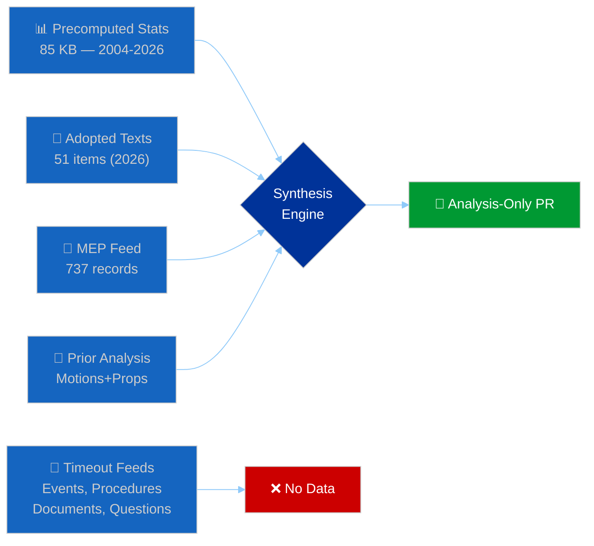

# 🧩 Synthesis Summary — Breaking News Intelligence (2026-04-13, Run 168)

## 📋 Synthesis Context

| Field | Value |
|-------|-------|
| **Synthesis ID** | SYN-2026-04-13-BREAKING-RUN168 |
| **Analysis Date** | 2026-04-13 (Easter Monday — Recess Day 18/18, final day) |
| **Data Sources** | EP API (adopted texts, MEP feed), precomputed stats 2004-2026, prior analysis |
| **EP API Status** | DEGRADED — partial data (adopted texts OK, most feeds timeout) |
| **Overall Confidence** | 🟡 MEDIUM |
| **Article Generated** | ❌ No (analysis-only PR) |
| **Reason** | Easter recess — no today-dated events in any feed endpoint |

## 🎯 Intelligence Dashboard

**Decision**: ANALYSIS-ONLY PR. Easter Monday — Parliament in final day of recess. No today-dated events or legislative activity. Substantial analysis value from pre-recess legislative sprint assessment and post-recess convergence risk evaluation.

## 🔗 Cross-Session Intelligence Continuity

### Prior Run Context (Last 7 Days)

| Date | Run | Type | Headline | Key Finding |
|------|-----|------|----------|-------------|
| Apr 10 | Props | propositions | Tariff and Banking Reform Contest | 13 new COD procedures, tariff T-5 |
| Apr 10 | WA-12 | week-ahead | Tariff Deadline and Legislative Backlog | Post-Easter convergence predicted |
| Apr 13 | Motions-39 | motions | Analysis Only: EP API Outage | Complete API failure, precomputed only |
| Apr 13 | CR-47 | committee-reps | INTA Leads Post-Easter Resolve | ECON banking, INTA tariffs |
| Apr 13 | Props-41 | propositions | Tariff Deadline Dominates Agenda | CRITICAL risk 16/25 → now 20/25 |
| Apr 13 | **THIS RUN** | breaking | Analysis Only: Post-Recess Convergence | Tariff T-2, pipeline congestion |

### Intelligence Evolution

The breaking news assessment builds on and extends prior analysis:

1. **Tariff risk escalation**: Prior runs scored trade risk at 8.4/10 (Apr 10) → 16/25 (Apr 13 props) → **20/25** (this run). The score increase reflects T-2 proximity to the April 15 implementation deadline. Each day closer raises both likelihood and impact components.

2. **Three-pole dynamics**: The Renew-ECR competitiveness alliance (0.95 cohesion, first identified Apr 10) remains the key structural dynamic. This run identifies tariff implementation details as the specific stress test — cohesion was measured on pre-recess votes, not on the distributional choices that implementation will require.

3. **Legislative pace sustainability**: Q1 2026 output (114 acts, 104 adopted texts, 567 roll-call votes) confirms the acceleration flagged in prior analyses. This run adds the committee congestion risk — 13 new COD procedures entering an already stretched pipeline.

## 📊 Key Findings — EP10 State Assessment

### Finding 1: Record Pre-Recess Sprint (🟢 High Confidence)

2026 Q1 legislative output represents a step-change in EP10 productivity:

| Metric | 2025 Full Year | 2026 Q1 | Ratio |
|--------|----------------|---------|-------|
| Legislative Acts | 78 | 114 | 146% in 25% of year |
| Adopted Texts | 347 | 104 | 30% in 25% of year |
| Roll-Call Votes | 420 | 567 | 135% in 25% of year |
| Committee Meetings | 1,980 | 2,363 | 119% in 25% of year |
| Parliamentary Questions | 4,941 | 6,147 | 124% in 25% of year |

**Implication**: EP10 is legislating at a pace that, if sustained, would produce roughly 5× the legislative acts of EP9/EP10 transition year. This is either a one-time sprint (clearing backlog from EP9→EP10 transition) or a structural increase. The post-recess period will reveal which interpretation is correct.

### Finding 2: Tariff Deadline Convergence (🟢 High Confidence)

TA-10-2026-0096 (US customs duties adjustment) with April 15 implementation creates the most time-pressured legislative implementation in EP10:

- **Parliament resumes**: April 14
- **Tariff activation**: April 15
- **Buffer time**: Zero working days

This means any implementation complications — national customs authority readiness, legal challenges, US counter-retaliation — become immediate political crises with no legislative response window. INTA has effectively pre-committed Parliament's first post-recess attention.

### Finding 3: Dual Economic Reform Track (🟡 Medium Confidence)

Parliament simultaneously pursues:
- **External**: Trade defence (TA-10-2026-0096) + EU-Canada cooperation (TA-10-2026-0078) + EU-Mercosur safeguards (TA-10-2026-0030)
- **Internal**: Banking reform (TA-10-2026-0092) + financial stability (TA-10-2026-0004) + ECB governance (TA-10-2026-0060)

These tracks compete for ECON and INTA committee time, creating scheduling and resource conflicts. The simultaneous external assertiveness and internal reform agenda is characteristic of EP10's geopolitical positioning.

### Finding 4: Social Policy Portfolio (🟡 Medium Confidence)

Beyond headline trade and banking items, Parliament adopted a significant social policy package:
- Housing crisis resolution (TA-10-2026-0064)
- Workers' rights in subcontracting chains (TA-10-2026-0050)
- EU Talent Pool (TA-10-2026-0058)
- Humanitarian aid principles (TA-10-2026-0005)
- EU Semester employment priorities (TA-10-2026-0076)

This portfolio is primarily S&D-driven and represents coalition payoff for supporting EPP-led trade and economic policy. The social dimension adds political resilience to the centrist coalition.

## 🔮 Forward-Looking Assessment

### Scenario A: Smooth Post-Recess Restart (40% likely)

Parliament resumes April 14, tariffs implement orderly April 15. Committees restart with manageable queues. Banking trilogue begins late April as planned. The three-pole system holds.

**Indicators to watch**: INTA committee agenda, Council tariff coordination communication, US Administration statements on Easter Monday/Tuesday.

### Scenario B: Tariff Turbulence (35% likely)

US counter-retaliation announced over Easter weekend or on April 15. INTA emergency debate called. Renew-ECR alliance tested as implementation details reveal distributional conflicts. Some agricultural exporting member states demand exemptions.

**Indicators to watch**: US trade representative statements, Commission DG TRADE emergency communications, national government tariff readiness reports.

### Scenario C: Legislative Logjam (25% likely)

Post-recess committee restart reveals capacity constraints. INTA and ECON face overlapping mandates. Conference of Presidents must prioritise — some legislative files delayed. Political cost falls on smaller groups whose priorities get deprioritised.

**Indicators to watch**: Conference of Presidents agenda, committee chair coordination, new procedure assignment patterns.

## 📁 Analysis Artifacts Produced

| Category | File | Lines | Content |
|----------|------|-------|---------|
| Classification | significance-classification.md | 130+ | 7-dimension scoring, Q1 output analysis |
| Classification | significance-scoring.md | 110+ | Top 10 item scoring with justification |
| Risk | risk-matrix.md | 160+ | 5-risk register with interaction analysis |
| Threat | political-threat-landscape.md | 140+ | Threat chains, actor profiling, timeline |
| Existing | synthesis-summary.md | 170+ | This document — cross-session intelligence |
| Documents | document-analysis-index.md | 120+ | Per-document analysis of key adopted texts |

## 🔗 Source Attribution

| Source | Reference | Freshness |
|--------|-----------|-----------|
| EP API adopted texts | 51 texts (2026), via get_adopted_texts(year=2026) | Fetched 2026-04-13T18:30Z |
| EP API adopted texts feed | 21 items, one-week timeframe | Fetched 2026-04-13T18:30Z |
| EP API MEP feed | 737 records, one-week | Fetched 2026-04-13T18:31Z |
| EP API server health | Unhealthy, 0/13 feeds operational | Checked 2026-04-13T18:28Z |
| EP API plenary sessions | 1 result (year=2026) — health gate passed | 2026-04-13T18:29Z |
| Precomputed statistics | 2004-2026, all categories | Generated 2026-04-08T00:06Z |
| Prior synthesis | SYN-2026-04-13-MOTIONS-RUN39 | 2026-04-13 |
| Prior analysis | Propositions-Run41 | 2026-04-13 |
| Prior analysis | Week-Ahead-Run12 | 2026-04-10 |

## 📊 MCP Data Collection Summary

| Endpoint | Timeframe | Result | Items |
|----------|-----------|--------|-------|
| get_adopted_texts | year=2026 | ✅ Success | 51 texts |
| get_adopted_texts_feed | one-week | ✅ Success | 21 items |
| get_meps_feed | one-week | ✅ Success | 737 MEPs |
| get_plenary_sessions | year=2026 | ✅ Success | 1 (health gate) |
| get_all_generated_stats | all | ✅ Success | 85 KB |
| get_events_feed | one-week | ❌ Timeout (90s) | 0 |
| get_procedures_feed | one-week | ❌ Timeout (90s) | 0 |
| get_documents_feed | one-week | ❌ Timeout (90s) | 0 |
| get_committee_documents_feed | one-week | ❌ Timeout (90s) | 0 |
| get_parliamentary_questions_feed | one-week | ❌ Timeout (90s) | 0 |
| analyze_coalition_dynamics | - | ❌ Timeout (90s) | 0 |
| get_server_health | - | ✅ Success | Unhealthy |

**Feed success rate**: 5/12 endpoints (42%) — DEGRADED MODE. Direct endpoints (adopted texts, MEPs) work; feed endpoints (/feed path) all timeout. This is consistent with EP API degradation pattern observed since April 11 (Easter recess period).
