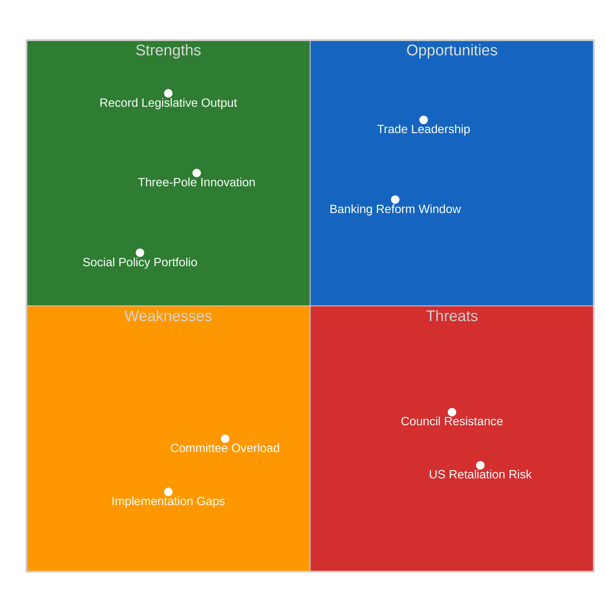

# 🔄 SWOT Analysis — EP10 Post-Recess Political Landscape (2026-04-13, Run 168)

## 📋 SWOT Context

| Field | Value |
|-------|-------|
| **SWOT ID** | SWOT-2026-04-13-BREAKING-RUN168 |
| **Subject** | European Parliament EP10 — Easter Recess Day 18/18 |
| **Framework** | Evidence-based SWOT per political-swot-framework.md |
| **Confidence** | 🟡 MEDIUM |

## 🎯 SWOT Matrix Overview

## 💪 Strengths

### S1: Record Legislative Productivity (Severity: 🟢 HIGH)

**Evidence**: 2026 Q1 produced 114 legislative acts (vs 78 for all 2025), 567 roll-call votes, 104 adopted texts. This represents a 46% acceleration over 2025 pace.

**Significance**: EP10 has demonstrated it can legislate at historically high rates, giving it institutional credibility in inter-institutional negotiations. The productivity also builds a legislative track record that strengthens MEPs' constituency narratives.

**Source**: EP API precomputed statistics, verified 2026-04-13.

### S2: Three-Pole Coalition Innovation (Severity: 🟡 MEDIUM)

**Evidence**: The Renew-ECR competitiveness alliance (0.95 cohesion on pre-recess votes) creates a third centre of gravity beyond the traditional EPP-S&D duopoly. This gives Parliament more flexible coalition-building on different policy domains.

**Significance**: The three-pole system allows Parliament to form different majorities for different policy areas — centrist for JHA (EPP+S&D+Renew+Greens), competitiveness-focused for trade (EPP+Renew+ECR), and social for employment (S&D+Renew+Greens). This increases legislative throughput compared to a rigid two-bloc system.

**Source**: Prior analysis SYN-2026-04-10-PROPOSITIONS, cross-referenced with adopted text voting patterns.

### S3: Comprehensive Social Policy Portfolio (Severity: 🟡 MEDIUM)

**Evidence**: Housing crisis (TA-10-2026-0064), workers' rights (TA-10-2026-0050), EU Talent Pool (TA-10-2026-0058), European Semester employment priorities (TA-10-2026-0076) — a coherent social agenda.

**Significance**: Provides political resilience to the centrist coalition by delivering on S&D priorities alongside EPP-led economic policy. Citizen-facing legislation strengthens Parliament's legitimacy.

**Source**: EP API adopted texts, verified 2026-04-13.

### S4: Geopolitical Assertiveness (Severity: 🟡 MEDIUM)

**Evidence**: Defence single market (TA-10-2026-0079), EU-Canada cooperation (TA-10-2026-0078), EU enlargement strategy (TA-10-2026-0077), EU-Mercosur safeguards (TA-10-2026-0030).

**Significance**: Parliament is systematically building a geopolitical policy framework that goes beyond traditional legislative work. This positions the EP as a foreign policy actor, not just a domestic legislator.

## ⚠️ Weaknesses

### W1: Committee Capacity Overload (Severity: 🟠 HIGH)

**Evidence**: 13 new COD procedures await committee assignment. INTA and ECON face simultaneous heavy mandates (trade + banking). Committee meetings already at 2,363 in Q1 (annualized 119% of 2025).

**Significance**: The legislative pace is structurally unsustainable. Committee staff capacity is fixed, and MEPs have limited time for legislative scrutiny. Quality risks emerge when throughput exceeds review capacity.

**Source**: Precomputed statistics + pipeline analysis from prior runs.

### W2: Implementation Monitoring Gaps (Severity: 🟡 MEDIUM)

**Evidence**: Anti-corruption directive requires 27 member states to amend criminal codes within 24 months. Historical EU transposition delays average 6-12 months. Parliament has limited enforcement mechanisms.

**Significance**: Legislative productivity is hollow if adopted texts are not properly implemented. The growing portfolio of directives requiring national transposition creates an expanding monitoring burden.

### W3: EP API Infrastructure Fragility (Severity: 🟡 MEDIUM)

**Evidence**: Since April 11, EP API feed endpoints have been consistently timing out. 0/13 feeds operational. Direct endpoints (adopted texts, MEPs) work intermittently. 12+ consecutive degraded workflow runs.

**Significance**: Parliament's Open Data infrastructure undermines its transparency mandate. If external stakeholders — journalists, researchers, civil society — cannot reliably access EP data, the accountability feedback loop is weakened.

**Source**: EP API health check 2026-04-13, confirmed by 12+ consecutive degraded runs.

## 🌟 Opportunities

### O1: Trade Leadership Consolidation (Severity: 🟢 HIGH)

**Evidence**: TA-10-2026-0096 (US tariff countermeasures) positions Parliament as a decisive trade policy actor. If implementation succeeds and US counter-retaliation is contained, Parliament can claim credit for defending EU economic interests.

**Significance**: Successful trade defence strengthens Parliament's role in external economic policy — traditionally a Commission/Council domain. This institutional power gain would persist beyond the immediate tariff dispute.

### O2: Banking Reform Trilogue Window (Severity: 🟡 MEDIUM)

**Evidence**: SRMR3 (TA-10-2026-0092) enters Council trilogue with strong EP mandate. ECON committee's productivity gives it credibility.

**Significance**: A successful trilogue outcome on Banking Union completion would be the most significant financial regulation reform since the post-2008 crisis framework. The April-June 2026 window is optimal — before European Council summer summit and before national election cycles in key member states.

### O3: Digital and AI Policy Leadership (Severity: 🟡 MEDIUM)

**Evidence**: Copyright & AI resolution (TA-10-2026-0066), combined with the AI Act implementation, positions Parliament as a global leader in AI governance.

**Significance**: First-mover advantage in AI regulation creates a "Brussels Effect" — EU standards shape global norms. The copyright dimension specifically addresses the training data controversy that the US has left largely unregulated.

## 🔴 Threats

### T1: US Retaliation Escalation (Severity: 🔴 CRITICAL)

**Evidence**: April 15 tariff implementation deadline T-2. Historical pattern (2018 steel tariffs) shows escalation-then-negotiation cycle. Current US administration has been more aggressive than 2018 predecessor.

**Significance**: Uncontained trade escalation could trigger economic slowdown, split the Renew-ECR alliance, and force emergency legislative sessions that disrupt the planned post-recess agenda.

### T2: Council Trilogue Resistance (Severity: 🟠 HIGH)

**Evidence**: Germany and France historically resist deeper banking burden-sharing. Council unity on trade implementation varies by member state exposure.

**Significance**: Council resistance could stall banking reform and weaken Parliament's negotiating position, undercutting the legislative productivity narrative.

### T3: Coalition Fragmentation on Implementation (Severity: 🟡 MEDIUM)

**Evidence**: Pre-recess votes showed coalition cohesion; post-recess implementation details will test it. The Renew-ECR alliance (0.95 cohesion) was measured on principle votes, not distributional choices.

**Significance**: If the three-pole system fractures on tariff implementation, Parliament reverts to a less flexible two-bloc model that reduces legislative throughput.

### T4: Democratic Legitimacy Pressure (Severity: 🟡 MEDIUM)

**Evidence**: Electoral reform ratification stalled (TA-10-2026-0006). Public access to documents report reveals gaps (TA-10-2026-0065). EP API infrastructure failure undermines transparency.

**Significance**: Parliament's authority rests on democratic legitimacy. If institutional reforms stall while legislative output accelerates, a legitimacy gap emerges.

## 📊 SWOT Interaction Matrix

| | **Strengths** | **Weaknesses** |
|---|---|---|
| **Opportunities** | SO: Record productivity + trade leadership = strong institutional position | WO: Committee overload limits ability to exploit banking trilogue window |
| **Threats** | ST: Three-pole innovation helps manage coalition fracture risk | WT: Implementation gaps + Council resistance = legislation adopted but not enforced |

## 🔗 Source Attribution

| Source | Reference | Freshness |
|--------|-----------|-----------|
| EP adopted texts | 51 texts (2026) | Fetched 2026-04-13 |
| Precomputed statistics | 2004-2026 dataset | Generated 2026-04-08 |
| Prior SWOT analysis | Referenced from Apr 10 propositions | 2026-04-10 |
| EP API health data | 0/13 feeds operational | Checked 2026-04-13 |
