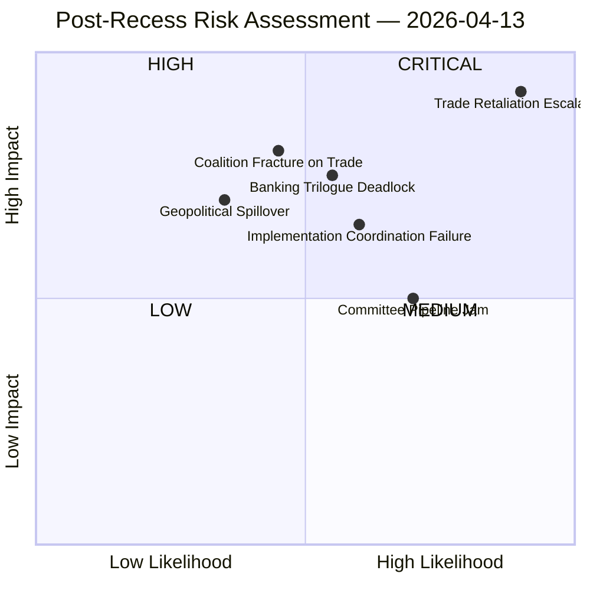
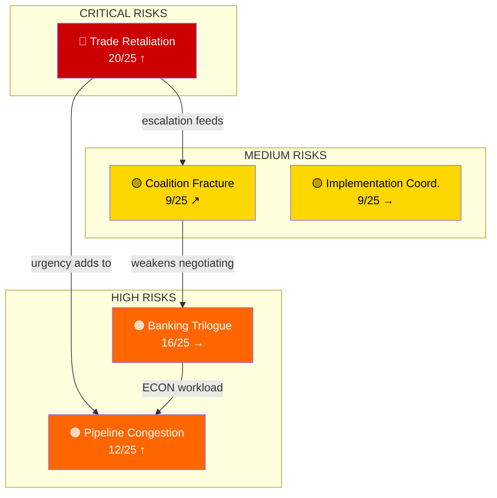

# ⚠️ Risk Matrix — Post-Recess Convergence Assessment (2026-04-13, Run 168)

## 📋 Assessment Context

| Field | Value |
|-------|-------|
| **Assessment ID** | RISK-2026-04-13-BREAKING-RUN168 |
| **Analysis Date** | 2026-04-13 (Easter Monday — Parliament resumes April 14) |
| **Methodology** | Likelihood × Impact 5×5 matrix per political-risk-methodology.md |
| **Data Sources** | 51 adopted texts, precomputed stats, prior analysis cross-references |
| **Overall Risk Level** | 🔴 ELEVATED (tariff deadline T-2, multiple legislative convergences) |

## 🎯 Risk Heat Map

## 📊 Detailed Risk Register

### RISK-1: Trade Retaliation Escalation — CRITICAL (20/25)

| Factor | Score | Justification |
|--------|-------|---------------|
| **Likelihood** | 5/5 | April 15 deadline is fixed; US administration has signalled further escalation |
| **Impact** | 4/5 | Affects EU-US trade worth hundreds of billions; sector-specific disruption |
| **Velocity** | ⚡ Immediate | T-2 days — zero buffer between Parliament resumption and deadline |
| **Trend** | ↑ Rising | Escalation cycle has not de-escalated since March 26 adoption |
| **Confidence** | 🟢 High | Based on adopted text TA-10-2026-0096 and fixed deadline |

**Scenario A — Orderly Implementation (40% likely)**: EU customs authorities activate tariff adjustments on schedule. US response is rhetorical but contained. Market adjustment is gradual. The Renew-ECR competitiveness alliance holds — both groups see orderly retaliation as preferable to capitulation.

**Scenario B — Escalation Spiral (35% likely)**: US announces counter-retaliation targeting EU agricultural exports or automotive sector. INTA emergency session required. Coalition dynamics fracture as agricultural exporting member states (France, Netherlands, Spain) demand exceptions. The three-pole system is tested as national interests override group discipline.

**Scenario C — Diplomatic De-escalation (25% likely)**: Easter period diplomatic contacts yield a temporary standstill agreement. Implementation delayed pending bilateral negotiations. Parliament's role becomes secondary to Commission-led diplomacy.

### RISK-2: Banking Trilogue Deadlock — HIGH (16/25)

| Factor | Score | Justification |
|--------|-------|---------------|
| **Likelihood** | 4/5 | Historical pattern: Council resists EP positions on burden-sharing |
| **Impact** | 4/5 | SRMR3 + BRRD3 + DGSD2 collectively reshape EU banking regulation |
| **Velocity** | 🐢 Gradual | Trilogue expected late April; multi-month negotiation likely |
| **Trend** | → Stable | Neither side has shown flexibility pre-recess |
| **Confidence** | 🟡 Medium | Based on structural analysis; Council position not yet formally adopted |

**Key fault line**: Germany and France both have large banking sectors but divergent interests — German Sparkassen model (small-bank protection) vs French universal banking model (cross-border expansion). The EP position (TA-10-2026-0092) pushes for deeper burden-sharing, which Germany traditionally resists.

**ECON dynamics**: Committee chair and rapporteur negotiating mandate will shape EP flexibility. Prior analysis identifies ECON as the most productive committee in EP10, giving it institutional confidence in trilogue.

### RISK-3: Legislative Pipeline Congestion — HIGH (12/25)

| Factor | Score | Justification |
|--------|-------|---------------|
| **Likelihood** | 4/5 | 13 new COD procedures await committee assignment; Q1 pace unsustainable |
| **Impact** | 3/5 | Delayed committee work reduces legislative throughput |
| **Velocity** | 🐢 Gradual | Builds over April-May as committees restart |
| **Trend** | ↑ Rising | 2026 pace (annualized ~380 acts) exceeds committee capacity |
| **Confidence** | 🟢 High | Based on verified EP statistics: 114 acts in Q1 vs 78 for all 2025 |

**Evidence**: The 2026 legislative acceleration is unprecedented in EP10. Q1 alone produced 114 legislative acts — already exceeding the entire 2025 total of 78. Committee meetings (2,363) and parliamentary questions (6,147) show similar acceleration. This pace requires either sustained committee capacity or some items being deprioritised.

**Bottleneck risk**: INTA (trade), ECON (banking), and LIBE (anti-corruption) face simultaneous heavy mandates. Committee scheduling conflicts are likely.

### RISK-4: Coalition Fracture on Trade — MEDIUM (9/25)

| Factor | Score | Justification |
|--------|-------|---------------|
| **Likelihood** | 3/5 | Easter break cools tensions; structural incentives for alliance maintenance |
| **Impact** | 3/5 | Three-pole system fragile; trade implementation reveals differences |
| **Velocity** | 🐌 Slow | Would develop over weeks of post-recess debate |
| **Trend** | ↗ Slightly rising | Tariff implementation details create new pressure points |
| **Confidence** | 🔴 Low | Based on prior analysis cohesion figures, not fresh voting data |

**The Renew-ECR dynamic**: Prior analysis identified 0.95 cohesion in the Renew-ECR competitiveness alliance. However, this was measured on pre-recess votes. Tariff implementation details — which specific US products face duties, which EU sectors get quota protection — will test whether the alliance holds when distributional consequences become concrete.

### RISK-5: Implementation Coordination Failure — MEDIUM (9/25)

| Factor | Score | Justification |
|--------|-------|---------------|
| **Likelihood** | 3/5 | 27 member states must coordinate customs adjustments in 2 days |
| **Impact** | 3/5 | Uneven implementation creates trade diversion and legal challenges |
| **Velocity** | ⚡ Immediate | April 15 deadline |
| **Trend** | → Stable | Standard EU coordination challenge |
| **Confidence** | 🟡 Medium | Based on historical implementation patterns |

## 📈 Risk Trend Dashboard

## 📊 Risk Interaction Analysis

The risks above are interconnected:
1. **Trade retaliation** (R1) feeds directly into **coalition fracture** (R4) — if US escalates, political groups must take positions that may break the Renew-ECR alliance
2. **Trade urgency** (R1) adds workload to already congested **legislative pipeline** (R3) — INTA emergency sessions compete for plenary time
3. **Banking trilogue complexity** (R2) consumes ECON committee capacity that is already stretched by **pipeline congestion** (R3)
4. **Coalition fracture** (R4) weakens Parliament's negotiating position in **banking trilogue** (R2) — Council exploits EP internal divisions

**🟡 Medium Confidence**: Interaction analysis based on structural assessment. Live voting and attendance data unavailable due to EP API degradation.

## 🔗 Source Attribution

| Source | Reference | Date |
|--------|-----------|------|
| EP adopted texts | TA-10-2026-0096, 0094, 0092 | Adopted 2026-03-26 |
| Precomputed statistics | 2026 Q1 legislative output | Generated 2026-04-08 |
| Prior risk assessment | RISK-2026-04-10-PROPOSITIONS | 2026-04-10 |
| Prior synthesis | SYN-2026-04-13-MOTIONS-RUN39 | 2026-04-13 |
