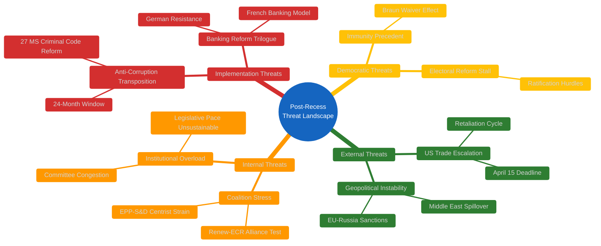
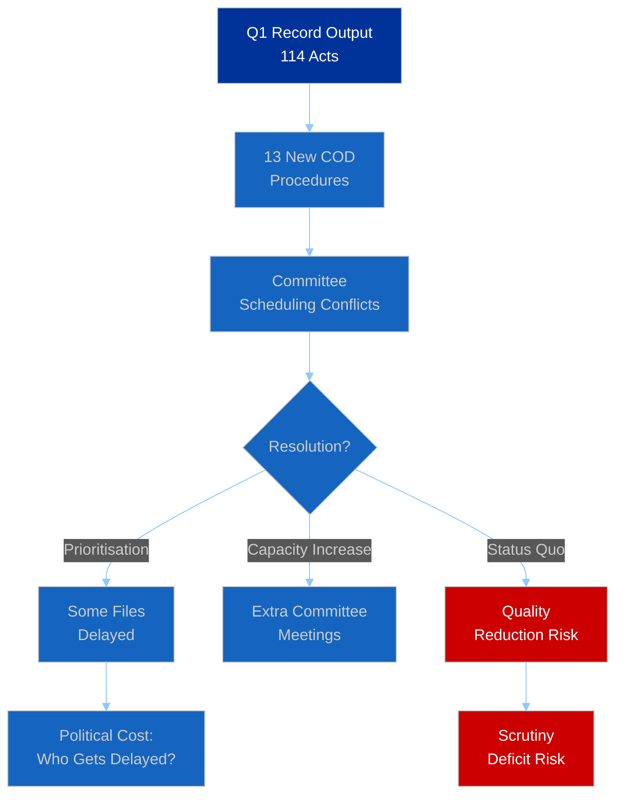

# 🛡️ Political Threat Landscape — Post-Recess Convergence (2026-04-13, Run 168)

## 📋 Threat Assessment Context

| Field | Value |
|-------|-------|
| **Assessment ID** | THREAT-2026-04-13-BREAKING-RUN168 |
| **Analysis Date** | 2026-04-13 (Easter Monday — Parliament resumes April 14) |
| **Framework** | Political Threat Framework adapted for EU parliamentary democracy |
| **Threat Level** | 🟠 ELEVATED (multiple converging pressure points) |
| **Confidence** | 🟡 MEDIUM |

## 🎯 Threat Landscape Overview

## 📊 Threat Actor Profiling

### External Actors

| Actor | Threat Type | Capability | Intent | Proximity | Overall |
|-------|-----------|-----------|--------|-----------|---------|
| **US Administration** | Trade retaliation | 🔴 High | 🔴 High | ⚡ Immediate (T-2) | **CRITICAL** |
| **Council of EU** | Trilogue resistance | 🟠 Medium | 🟡 Medium | 🐢 Gradual (late April) | **HIGH** |
| **National Govts** | Implementation delay | 🟠 Medium | 🟡 Low | 🐢 Gradual (24 months) | **MEDIUM** |
| **Far-right parties** | Democratic norms erosion | 🟡 Low | 🟠 Medium | → Ongoing | **MEDIUM** |

### Internal Actors

| Actor | Threat Type | Capability | Intent | Proximity | Overall |
|-------|-----------|-----------|--------|-----------|---------|
| **ECR hardliners** | Trade coalition split | 🟡 Medium | 🟠 Medium | ⚡ Immediate | **HIGH** |
| **National delegations** | Group discipline break | 🟠 Medium | 🟡 Low | 🐢 Post-recess | **MEDIUM** |
| **Committee chairs** | Agenda gatekeeping | 🟠 Medium | 🟡 Low | → Ongoing | **LOW** |

## 🔍 Threat Scenario Analysis

### Threat Chain 1: Trade Escalation → Coalition Fracture

```mermaid
%%{init: {"theme":"dark","themeVariables":{"primaryColor":"#1565C0","primaryTextColor":"#ffffff","primaryBorderColor":"#0A3F7F","lineColor":"#90CAF9","secondaryColor":"#2E7D32","secondaryTextColor":"#ffffff","secondaryBorderColor":"#0F3F00","tertiaryColor":"#FF9800","tertiaryTextColor":"#000000","tertiaryBorderColor":"#7F4F00","mainBkg":"#1565C0","secondBkg":"#2E7D32","tertiaryBkg":"#FF9800","noteBkgColor":"#FFC107","noteTextColor":"#000000","noteBorderColor":"#7F6000","errorBkgColor":"#D32F2F","errorTextColor":"#ffffff","fontFamily":"Inter, Helvetica, Arial, sans-serif","pie1":"#1565C0","pie2":"#2E7D32","pie3":"#FF9800","pie4":"#D32F2F","pie5":"#FFC107","pie6":"#7B1FA2","pie7":"#9E9E9E","pie8":"#0288D1","pie9":"#388E3C","pie10":"#F57C00","pie11":"#C62828","pie12":"#FBC02D","pieTitleTextSize":"18px","pieSectionTextSize":"14px","pieLegendTextSize":"13px","pieStrokeColor":"#1e1e1e","pieOuterStrokeColor":"#1e1e1e","git0":"#1565C0","git1":"#2E7D32","git2":"#FF9800","git3":"#D32F2F","gitBranchLabel0":"#ffffff","gitBranchLabel1":"#ffffff","gitBranchLabel2":"#000000","gitBranchLabel3":"#ffffff","cScale0":"#1565C0","cScale1":"#2E7D32","cScale2":"#FF9800","cScale3":"#D32F2F","cScale4":"#FFC107","cScale5":"#7B1FA2","cScale6":"#9E9E9E","cScale7":"#0288D1","xyChart":{"backgroundColor":"#1e1e1e","plotColorPalette":"#1565C0,#2E7D32,#FF9800,#D32F2F,#FFC107,#7B1FA2,#9E9E9E"}}}}%%
flowchart LR
    A["US Tariffs<br/>Activate Apr 15"] --> B["EU Counter-<br/>measures Active"]
    B --> C{"US Response?"}
    C --> |"Escalation"| D["INTA Emergency<br/>Session"]
    C --> |"Standstill"| E["Orderly<br/>Implementation"]
    D --> F["Renew-ECR<br/>Alliance Tested"]
    F --> G{"Alliance<br/>Holds?"}
    G --> |"Yes"| H["Strengthened<br/>Three-Pole System"]
    G --> |"No"| I["Return to<br/>Two-Bloc Model"]

    style A fill:#cc0000,color:#fff
    style D fill:#ff6600,color:#fff
    style I fill:#cc0000,color:#fff
    style H fill:#009933,color:#fff
```

**Assessment**: The most probable outcome (40%) is orderly implementation with contained US rhetorical response. The critical scenario (35%) involves US counter-retaliation triggering INTA emergency proceedings that test the three-pole system. Historical precedent (2018 steel tariff cycle) suggests escalation-then-negotiation pattern.

**🟡 Medium Confidence**: Assessment based on structural analysis of trade dynamics and prior voting patterns. No fresh intelligence on US diplomatic posture available.

### Threat Chain 2: Legislative Overload → Institutional Strain

**Assessment**: The 2026 legislative pace is structurally unsustainable. With 114 acts in Q1 (annualized ~380, vs 78 for all 2025), either committee capacity must expand (unlikely given fixed MEP numbers and committee structures) or some legislative files will be deprioritised. The political question is which files get delayed — trade-related items face political urgency but compete with banking reform, anti-corruption implementation oversight, and digital policy.

**🟢 High Confidence**: Based on verified EP statistics — the acceleration is measurable and the capacity constraints are structural.

### Threat Chain 3: Democratic Accountability Pressure

**Immunity waiver precedent** (TA-10-2026-0088): The Braun case establishes that EP10 will cooperate with national judicial authorities seeking to lift MEP immunity. Combined with the anti-corruption directive (TA-10-2026-0094) and the public access to documents report (TA-10-2026-0065), Parliament is strengthening its accountability framework.

**Electoral reform stall** (TA-10-2026-0006): Despite parliamentary pressure, ratification of the European Electoral Act reform faces hurdles in several member states. This creates a democratic legitimacy gap — Parliament has adopted the reform but cannot enforce member state compliance.

**🟡 Medium Confidence**: Democratic process assessment requires tracking national-level developments beyond EP data.

## 📊 Threat Severity Timeline

| Threat | April 2026 | May 2026 | June 2026 | Q3 2026 |
|--------|-----------|----------|-----------|---------|
| Trade Escalation | 🔴 CRITICAL | 🟠 HIGH | 🟡 MEDIUM | 🟡 MEDIUM |
| Banking Trilogue | 🟡 LOW | 🟠 HIGH | 🟠 HIGH | 🟡 MEDIUM |
| Pipeline Congestion | 🟡 MEDIUM | 🟠 HIGH | 🟠 HIGH | 🟡 MEDIUM |
| Coalition Stress | 🟡 MEDIUM | 🟡 MEDIUM | 🟡 MEDIUM | 🟡 MEDIUM |
| Democratic Norms | 🟢 LOW | 🟢 LOW | 🟡 MEDIUM | 🟡 MEDIUM |

## 🔗 Source Attribution

| Source | Reference | Freshness |
|--------|-----------|-----------|
| EP adopted texts | TA-10-2026-0096, 0094, 0092, 0088, 0079 | Fetched 2026-04-13 |
| Precomputed stats | 2026 legislative output metrics | Generated 2026-04-08 |
| Prior threat analysis | THREAT-2026-04-10 series | 2026-04-10 |
| Prior synthesis | SYN-2026-04-13-MOTIONS-RUN39 | 2026-04-13 |
