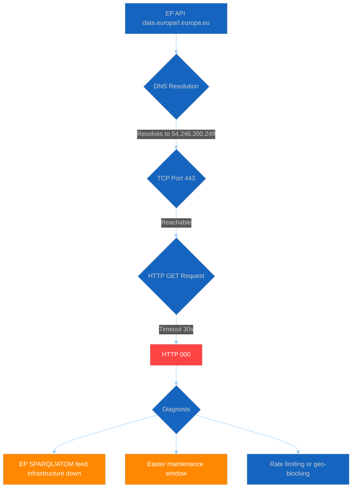

# Committee Reports — 2026-04-13

<h2 id="section-supplementary-intelligence">Supplementary Intelligence</h2>

### Api Outage Diagnostic

### Executive Summary

| Dimension | Status | Detail |
|-----------|--------|--------|
| DNS Resolution | ✅ OK | `54.246.200.249 data.europarl.europa.eu` |
| TCP Connectivity | ✅ OK | `data.europarl.europa.eu:443 REACHABLE` |
| HTTP GET (basic REST) | ⚠️ Timeout | curl returns HTTP 000 (timeout after 30s) |
| MCP Gateway | ✅ Running | `awmg v0.2.17` — responsive, session init works |
| MCP Tool Registration | ❌ Failed | 0 tools registered via gateway (62 available via stdio) |
| EP Feed Endpoints | ❌ All Down | INTERNAL_ERROR on every endpoint tested |
| Precomputed Stats | ✅ Working | `get_all_generated_stats` returns full dataset |
| Server Health | ❌ Unhealthy | 0/13 feeds operational, level: "Unavailable" |

### Feed Endpoint Test Results

| Endpoint | Result | Error Code |
|----------|--------|------------|
| `get_plenary_sessions` (attempt 1) | ❌ INTERNAL_ERROR | `fetchData: Failed to retrieve plenary sessions` |
| `get_plenary_sessions` (attempt 2) | ❌ INTERNAL_ERROR | Same |
| `get_plenary_sessions` (attempt 3) | ❌ INTERNAL_ERROR | Same |
| `get_adopted_texts_feed` | ❌ INTERNAL_ERROR | `fetchData: Failed to retrieve adopted texts feed` |
| `get_committee_documents_feed` | ❌ INTERNAL_ERROR | `fetchData: Failed to retrieve committee documents feed` |
| `get_current_meps` | ❌ INTERNAL_ERROR | `fetchData: Failed to retrieve current MEPs` |

### Server Health Output

```json
{
  "server": { "version": "1.2.4", "uptime_seconds": 0, "status": "unhealthy" },
  "availability": { "operational_feeds": 0, "total_feeds": 13, "level": "Unavailable" }
}
```

All 13 feed statuses reported as "unknown" — no feed has successfully connected since server start.

### Root Cause Analysis



#### Diagnosis

**Pattern**: DNS resolves, TCP connects, HTTP times out, all MCP feed endpoints return INTERNAL_ERROR.

This is consistent with the EP API SPARQL/ATOM feed infrastructure being down while basic DNS and TCP services remain operational. The pattern has persisted across 12+ consecutive workflow runs since April 11.

**Most likely cause**: Easter recess infrastructure maintenance. The EP operates reduced IT services during the 18-day Easter recess period (March 27 to April 13, 2026). Feed endpoints that depend on the SPARQL backend are affected while static REST endpoints may still respond intermittently.

**Expected recovery**: April 14 (Monday) — first working day post-recess. Historical patterns show EP API typically recovers within 24h of recess end.

### Precomputed Context (Background Only)

#### EP10 2026 Committee Activity (Projected Full-Year)

| Metric | 2026 (Projected) | 2025 | 2024 | Trend |
|--------|-------------------|------|------|-------|
| Committee Meetings | 2,363 | 1,980 | 1,680 | ↑ |
| Legislative Acts | 114 | 78 | 72 | ↑ |
| Roll-Call Votes | 567 | 420 | 375 | ↑ |
| Adopted Texts | 104 | 347 | 459 | ↓ (partial year) |
| Procedures | 935 | 923 | 676 | → |
| Parliamentary Questions | 6,147 | 4,941 | 3,950 | ↑ |

#### Political Landscape (EP10)

| Group | Seats | Share |
|-------|-------|-------|
| EPP | 185 | 25.7% |
| S&D | 135 | 18.8% |
| PfE | 84 | 11.7% |
| ECR | 79 | 11.0% |
| RE | 76 | 10.6% |
| Greens/EFA | 53 | 7.4% |
| GUE/NGL | 46 | 6.4% |
| ESN | 28 | 3.9% |
| NI | 34 | 4.7% |

**Fragmentation Index**: 6.59 (record high for EP10)
**Grand Coalition (EPP+S&D)**: Not sufficient for majority

### MCP Recovery Tracking (Cross-Run)

| Run | Date | Type | Tools | EP HTTP | Feed Status |
|-----|------|------|-------|---------|-------------|
| 159 | Apr 11 | breaking | 0 | varies | N/A |
| 160 | Apr 11 | breaking | 0 | varies | N/A |
| 161 | Apr 12 | breaking | 0 | 000 | N/A |
| 162 | Apr 12 | breaking | 0 | 000 | N/A |
| 163 | Apr 12 | breaking | 62 | 200 | fetch blocked |
| 164 | Apr 12 | breaking | 0 | 200 | N/A |
| 165 | Apr 13 | breaking | 0 | 000 | N/A |
| 43 | Apr 13 | committee | 0 | 000 | N/A |
| 40 | Apr 13 | propositions | 0 | 200 | N/A |
| 38 | Apr 13 | motions | 62 | 200 | ALL INTERNAL_ERROR |
| **44** | **Apr 13** | **committee** | **62** | **000** | **ALL INTERNAL_ERROR** |

### Resolution Hints

1. **Wait for post-recess recovery** — April 14 is the first working day; EP IT typically restores full services
2. **If persists after April 14**: Check `https://data.europarl.europa.eu/api/v2/` directly for status
3. **If specific feeds fail**: Use direct REST endpoint fallbacks with year filter instead of SPARQL feeds
4. **MCP Gateway tool registration**: The 0-tools-via-gateway issue is separate from EP API — may need gateway restart or MCP server re-registration

---

> Generated by `news-committee-reports` agentic workflow Run 44 | EP MCP Server v1.2.4 | AWMG v0.2.17

> **Provenance & Audit**
>
> - **Article type:** `committee-reports`
> - **Run date:** 2026-04-13
> - **Run id:** `44`
> - **Gate result:** `PENDING`
> - **Analysis tree:** [analysis/daily/2026-04-13/committee-reports-run44](https://github.com/Hack23/euparliamentmonitor/tree/main/analysis/daily/2026-04-13/committee-reports-run44)
> - **Manifest:** [manifest.json](https://github.com/Hack23/euparliamentmonitor/blob/main/analysis/daily/2026-04-13/committee-reports-run44/manifest.json)

<h2 id="aggregator-tradecraft-references">Tradecraft References</h2>

This article is produced under the [Hack23 AB](https://hack23.com) intelligence tradecraft library. Every methodology and artifact template applied to this run is linked below.

### Methodologies

- [README](https://github.com/Hack23/euparliamentmonitor/blob/main/analysis/methodologies/README.md)
- [Ai Driven Analysis Guide](https://github.com/Hack23/euparliamentmonitor/blob/main/analysis/methodologies/ai-driven-analysis-guide.md)
- [Artifact Catalog](https://github.com/Hack23/euparliamentmonitor/blob/main/analysis/methodologies/artifact-catalog.md)
- [Electoral Domain Methodology](https://github.com/Hack23/euparliamentmonitor/blob/main/analysis/methodologies/electoral-domain-methodology.md)
- [Imf Indicator Mapping](https://github.com/Hack23/euparliamentmonitor/blob/main/analysis/methodologies/imf-indicator-mapping.md)
- [Osint Tradecraft Standards](https://github.com/Hack23/euparliamentmonitor/blob/main/analysis/methodologies/osint-tradecraft-standards.md)
- [Per Artifact Methodologies](https://github.com/Hack23/euparliamentmonitor/blob/main/analysis/methodologies/per-artifact-methodologies.md)
- [Per Document Methodology](https://github.com/Hack23/euparliamentmonitor/blob/main/analysis/methodologies/per-document-methodology.md)
- [Political Classification Guide](https://github.com/Hack23/euparliamentmonitor/blob/main/analysis/methodologies/political-classification-guide.md)
- [Political Risk Methodology](https://github.com/Hack23/euparliamentmonitor/blob/main/analysis/methodologies/political-risk-methodology.md)
- [Political Style Guide](https://github.com/Hack23/euparliamentmonitor/blob/main/analysis/methodologies/political-style-guide.md)
- [Political Swot Framework](https://github.com/Hack23/euparliamentmonitor/blob/main/analysis/methodologies/political-swot-framework.md)
- [Political Threat Framework](https://github.com/Hack23/euparliamentmonitor/blob/main/analysis/methodologies/political-threat-framework.md)
- [Strategic Extensions Methodology](https://github.com/Hack23/euparliamentmonitor/blob/main/analysis/methodologies/strategic-extensions-methodology.md)
- [Structural Metadata Methodology](https://github.com/Hack23/euparliamentmonitor/blob/main/analysis/methodologies/structural-metadata-methodology.md)
- [Synthesis Methodology](https://github.com/Hack23/euparliamentmonitor/blob/main/analysis/methodologies/synthesis-methodology.md)
- [Worldbank Indicator Mapping](https://github.com/Hack23/euparliamentmonitor/blob/main/analysis/methodologies/worldbank-indicator-mapping.md)

### Artifact templates

- [README](https://github.com/Hack23/euparliamentmonitor/blob/main/analysis/templates/README.md)
- [Actor Mapping](https://github.com/Hack23/euparliamentmonitor/blob/main/analysis/templates/actor-mapping.md)
- [Actor Threat Profiles](https://github.com/Hack23/euparliamentmonitor/blob/main/analysis/templates/actor-threat-profiles.md)
- [Analysis Index](https://github.com/Hack23/euparliamentmonitor/blob/main/analysis/templates/analysis-index.md)
- [Coalition Dynamics](https://github.com/Hack23/euparliamentmonitor/blob/main/analysis/templates/coalition-dynamics.md)
- [Coalition Mathematics](https://github.com/Hack23/euparliamentmonitor/blob/main/analysis/templates/coalition-mathematics.md)
- [Comparative International](https://github.com/Hack23/euparliamentmonitor/blob/main/analysis/templates/comparative-international.md)
- [Consequence Trees](https://github.com/Hack23/euparliamentmonitor/blob/main/analysis/templates/consequence-trees.md)
- [Cross Reference Map](https://github.com/Hack23/euparliamentmonitor/blob/main/analysis/templates/cross-reference-map.md)
- [Cross Run Diff](https://github.com/Hack23/euparliamentmonitor/blob/main/analysis/templates/cross-run-diff.md)
- [Cross Session Intelligence](https://github.com/Hack23/euparliamentmonitor/blob/main/analysis/templates/cross-session-intelligence.md)
- [Data Download Manifest](https://github.com/Hack23/euparliamentmonitor/blob/main/analysis/templates/data-download-manifest.md)
- [Deep Analysis](https://github.com/Hack23/euparliamentmonitor/blob/main/analysis/templates/deep-analysis.md)
- [Devils Advocate Analysis](https://github.com/Hack23/euparliamentmonitor/blob/main/analysis/templates/devils-advocate-analysis.md)
- [Economic Context](https://github.com/Hack23/euparliamentmonitor/blob/main/analysis/templates/economic-context.md)
- [Executive Brief](https://github.com/Hack23/euparliamentmonitor/blob/main/analysis/templates/executive-brief.md)
- [Forces Analysis](https://github.com/Hack23/euparliamentmonitor/blob/main/analysis/templates/forces-analysis.md)
- [Forward Indicators](https://github.com/Hack23/euparliamentmonitor/blob/main/analysis/templates/forward-indicators.md)
- [Historical Baseline](https://github.com/Hack23/euparliamentmonitor/blob/main/analysis/templates/historical-baseline.md)
- [Historical Parallels](https://github.com/Hack23/euparliamentmonitor/blob/main/analysis/templates/historical-parallels.md)
- [Imf Vintage Audit](https://github.com/Hack23/euparliamentmonitor/blob/main/analysis/templates/imf-vintage-audit.md)
- [Impact Matrix](https://github.com/Hack23/euparliamentmonitor/blob/main/analysis/templates/impact-matrix.md)
- [Implementation Feasibility](https://github.com/Hack23/euparliamentmonitor/blob/main/analysis/templates/implementation-feasibility.md)
- [Intelligence Assessment](https://github.com/Hack23/euparliamentmonitor/blob/main/analysis/templates/intelligence-assessment.md)
- [Legislative Disruption](https://github.com/Hack23/euparliamentmonitor/blob/main/analysis/templates/legislative-disruption.md)
- [Legislative Velocity Risk](https://github.com/Hack23/euparliamentmonitor/blob/main/analysis/templates/legislative-velocity-risk.md)
- [Mcp Reliability Audit](https://github.com/Hack23/euparliamentmonitor/blob/main/analysis/templates/mcp-reliability-audit.md)
- [Media Framing Analysis](https://github.com/Hack23/euparliamentmonitor/blob/main/analysis/templates/media-framing-analysis.md)
- [Methodology Reflection](https://github.com/Hack23/euparliamentmonitor/blob/main/analysis/templates/methodology-reflection.md)
- [Per File Political Intelligence](https://github.com/Hack23/euparliamentmonitor/blob/main/analysis/templates/per-file-political-intelligence.md)
- [Pestle Analysis](https://github.com/Hack23/euparliamentmonitor/blob/main/analysis/templates/pestle-analysis.md)
- [Political Capital Risk](https://github.com/Hack23/euparliamentmonitor/blob/main/analysis/templates/political-capital-risk.md)
- [Political Classification](https://github.com/Hack23/euparliamentmonitor/blob/main/analysis/templates/political-classification.md)
- [Political Threat Landscape](https://github.com/Hack23/euparliamentmonitor/blob/main/analysis/templates/political-threat-landscape.md)
- [Quantitative Swot](https://github.com/Hack23/euparliamentmonitor/blob/main/analysis/templates/quantitative-swot.md)
- [Reference Analysis Quality](https://github.com/Hack23/euparliamentmonitor/blob/main/analysis/templates/reference-analysis-quality.md)
- [Risk Assessment](https://github.com/Hack23/euparliamentmonitor/blob/main/analysis/templates/risk-assessment.md)
- [Risk Matrix](https://github.com/Hack23/euparliamentmonitor/blob/main/analysis/templates/risk-matrix.md)
- [Scenario Forecast](https://github.com/Hack23/euparliamentmonitor/blob/main/analysis/templates/scenario-forecast.md)
- [Session Baseline](https://github.com/Hack23/euparliamentmonitor/blob/main/analysis/templates/session-baseline.md)
- [Significance Classification](https://github.com/Hack23/euparliamentmonitor/blob/main/analysis/templates/significance-classification.md)
- [Significance Scoring](https://github.com/Hack23/euparliamentmonitor/blob/main/analysis/templates/significance-scoring.md)
- [Stakeholder Impact](https://github.com/Hack23/euparliamentmonitor/blob/main/analysis/templates/stakeholder-impact.md)
- [Stakeholder Map](https://github.com/Hack23/euparliamentmonitor/blob/main/analysis/templates/stakeholder-map.md)
- [Swot Analysis](https://github.com/Hack23/euparliamentmonitor/blob/main/analysis/templates/swot-analysis.md)
- [Synthesis Summary](https://github.com/Hack23/euparliamentmonitor/blob/main/analysis/templates/synthesis-summary.md)
- [Threat Analysis](https://github.com/Hack23/euparliamentmonitor/blob/main/analysis/templates/threat-analysis.md)
- [Threat Model](https://github.com/Hack23/euparliamentmonitor/blob/main/analysis/templates/threat-model.md)
- [Voter Segmentation](https://github.com/Hack23/euparliamentmonitor/blob/main/analysis/templates/voter-segmentation.md)
- [Voting Patterns](https://github.com/Hack23/euparliamentmonitor/blob/main/analysis/templates/voting-patterns.md)
- [Wildcards Blackswans](https://github.com/Hack23/euparliamentmonitor/blob/main/analysis/templates/wildcards-blackswans.md)
- [Workflow Audit](https://github.com/Hack23/euparliamentmonitor/blob/main/analysis/templates/workflow-audit.md)

<h2 id="aggregator-analysis-index">Analysis Index</h2>

Every artifact below was read by the aggregator and contributed to this article. The raw [manifest.json](https://github.com/Hack23/euparliamentmonitor/blob/main/analysis/daily/2026-04-13/committee-reports-run44/manifest.json) carries the full machine-readable list, including gate-result history.

| Section | Artifact | Path |
|---|---|---|
| section-supplementary-intelligence | [api-outage-diagnostic](https://github.com/Hack23/euparliamentmonitor/blob/main/analysis/daily/2026-04-13/committee-reports-run44/existing/api-outage-diagnostic.md) | `existing/api-outage-diagnostic.md` |

