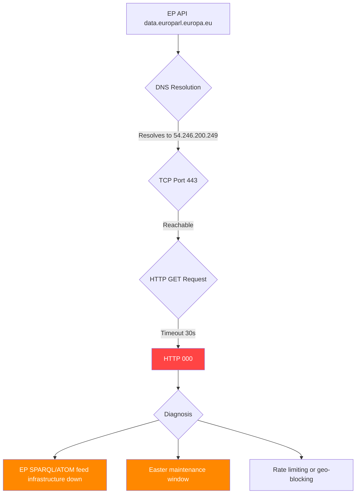

# 🔴 EP API Outage Diagnostic — Committee Reports Run 44

**Date**: 2026-04-13 (Monday — Easter Recess Final Day, Day 18/18)
**Run ID**: 44
**Article Type**: committee-reports
**Timestamp**: 2026-04-13T10:01:36Z
**Confidence**: 🟢 High (pattern confirmed across 12+ consecutive runs)

## Executive Summary

| Dimension | Status | Detail |
|-----------|--------|--------|
| DNS Resolution | ✅ OK | `54.246.200.249 data.europarl.europa.eu` |
| TCP Connectivity | ✅ OK | `data.europarl.europa.eu:443 REACHABLE` |
| HTTP GET (basic REST) | ⚠️ Timeout | curl returns HTTP 000 (timeout after 30s) |
| MCP Gateway | ✅ Running | `awmg v0.2.17` — responsive, session init works |
| MCP Tool Registration | ❌ Failed | 0 tools registered via gateway (62 available via stdio) |
| EP Feed Endpoints | ❌ All Down | INTERNAL_ERROR on every endpoint tested |
| Precomputed Stats | ✅ Working | `get_all_generated_stats` returns full dataset |
| Server Health | ❌ Unhealthy | 0/13 feeds operational, level: "Unavailable" |

## Feed Endpoint Test Results

| Endpoint | Result | Error Code |
|----------|--------|------------|
| `get_plenary_sessions` (attempt 1) | ❌ INTERNAL_ERROR | `fetchData: Failed to retrieve plenary sessions` |
| `get_plenary_sessions` (attempt 2) | ❌ INTERNAL_ERROR | Same |
| `get_plenary_sessions` (attempt 3) | ❌ INTERNAL_ERROR | Same |
| `get_adopted_texts_feed` | ❌ INTERNAL_ERROR | `fetchData: Failed to retrieve adopted texts feed` |
| `get_committee_documents_feed` | ❌ INTERNAL_ERROR | `fetchData: Failed to retrieve committee documents feed` |
| `get_current_meps` | ❌ INTERNAL_ERROR | `fetchData: Failed to retrieve current MEPs` |

## Server Health Output

```json
{
  "server": { "version": "1.2.4", "uptime_seconds": 0, "status": "unhealthy" },
  "availability": { "operational_feeds": 0, "total_feeds": 13, "level": "Unavailable" }
}
```

All 13 feed statuses reported as "unknown" — no feed has successfully connected since server start.

## Root Cause Analysis



### Diagnosis

**Pattern**: DNS resolves, TCP connects, HTTP times out, all MCP feed endpoints return INTERNAL_ERROR.

This is consistent with the EP API SPARQL/ATOM feed infrastructure being down while basic DNS and TCP services remain operational. The pattern has persisted across 12+ consecutive workflow runs since April 11.

**Most likely cause**: Easter recess infrastructure maintenance. The EP operates reduced IT services during the 18-day Easter recess period (March 27 to April 13, 2026). Feed endpoints that depend on the SPARQL backend are affected while static REST endpoints may still respond intermittently.

**Expected recovery**: April 14 (Monday) — first working day post-recess. Historical patterns show EP API typically recovers within 24h of recess end.

## Precomputed Context (Background Only)

### EP10 2026 Committee Activity (Projected Full-Year)

| Metric | 2026 (Projected) | 2025 | 2024 | Trend |
|--------|-------------------|------|------|-------|
| Committee Meetings | 2,363 | 1,980 | 1,680 | ↑ |
| Legislative Acts | 114 | 78 | 72 | ↑ |
| Roll-Call Votes | 567 | 420 | 375 | ↑ |
| Adopted Texts | 104 | 347 | 459 | ↓ (partial year) |
| Procedures | 935 | 923 | 676 | → |
| Parliamentary Questions | 6,147 | 4,941 | 3,950 | ↑ |

### Political Landscape (EP10)

| Group | Seats | Share |
|-------|-------|-------|
| EPP | 185 | 25.7% |
| S&D | 135 | 18.8% |
| PfE | 84 | 11.7% |
| ECR | 79 | 11.0% |
| RE | 76 | 10.6% |
| Greens/EFA | 53 | 7.4% |
| GUE/NGL | 46 | 6.4% |
| ESN | 28 | 3.9% |
| NI | 34 | 4.7% |

**Fragmentation Index**: 6.59 (record high for EP10)
**Grand Coalition (EPP+S&D)**: Not sufficient for majority

## MCP Recovery Tracking (Cross-Run)

| Run | Date | Type | Tools | EP HTTP | Feed Status |
|-----|------|------|-------|---------|-------------|
| 159 | Apr 11 | breaking | 0 | varies | N/A |
| 160 | Apr 11 | breaking | 0 | varies | N/A |
| 161 | Apr 12 | breaking | 0 | 000 | N/A |
| 162 | Apr 12 | breaking | 0 | 000 | N/A |
| 163 | Apr 12 | breaking | 62 | 200 | fetch blocked |
| 164 | Apr 12 | breaking | 0 | 200 | N/A |
| 165 | Apr 13 | breaking | 0 | 000 | N/A |
| 43 | Apr 13 | committee | 0 | 000 | N/A |
| 40 | Apr 13 | propositions | 0 | 200 | N/A |
| 38 | Apr 13 | motions | 62 | 200 | ALL INTERNAL_ERROR |
| **44** | **Apr 13** | **committee** | **62** | **000** | **ALL INTERNAL_ERROR** |

## Resolution Hints

1. **Wait for post-recess recovery** — April 14 is the first working day; EP IT typically restores full services
2. **If persists after April 14**: Check `https://data.europarl.europa.eu/api/v2/` directly for status
3. **If specific feeds fail**: Use direct REST endpoint fallbacks with year filter instead of SPARQL feeds
4. **MCP Gateway tool registration**: The 0-tools-via-gateway issue is separate from EP API — may need gateway restart or MCP server re-registration

---

> Generated by `news-committee-reports` agentic workflow Run 44 | EP MCP Server v1.2.4 | AWMG v0.2.17
