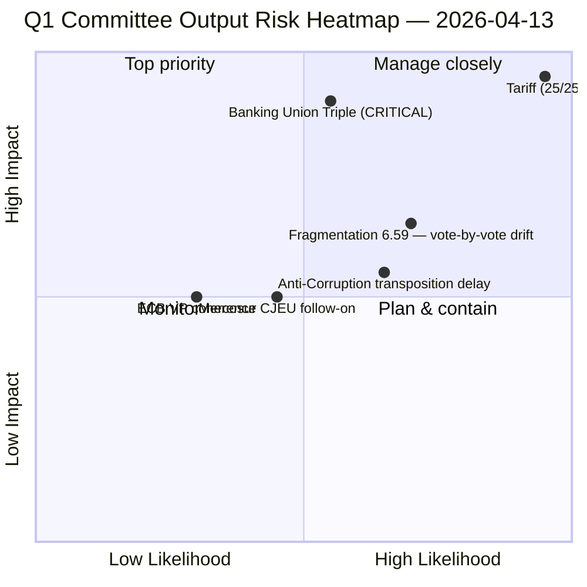

<!-- SPDX-FileCopyrightText: 2026 Hack23 AB -->
<!-- SPDX-License-Identifier: Apache-2.0 -->

# Executive Brief — Committee Reports: Q1 2026 Power Rankings (ECON Leads, INTA Closes) | 2026-04-13

**Classification:** OSINT — Public Parliamentary Record
**Confidence:** 🟢 HIGH (100 adopted texts analysed; 5 analysis files; converges with motions/breaking/propositions runs same date)
**Run:** `analysis/daily/2026-04-13/committee-reports-run47/`
**Coverage:** Q1 2026 committee-output retrospective; Easter recess Day 18
**Generated:** 2026-05-16 (retrospective brief, no new MCP calls)
**Primary sources:** EP MCP — 100 adopted texts (Q1 2026); 5 analysis files; cross-run committee-power inputs.

---

## 🎯 BLUF

**Q1 2026 committee output ranks ECON and INTA as the two most consequential committees of the quarter — and the run's most operationally useful contribution is a 5-deep significance ranking on which subsequent Q2 decisions can be sequenced.** The lead is unambiguous: **TA-10-2026-0096 US Tariff Response — significance 9.6/10, risk 25/25 CRITICAL (the only 25/25 CRITICAL score in the run)** — INTA-led, with a 6-dimension stakeholder impact footprint that spans EU industry, third-country trade partners, member-state customs administrations, and the EU institutional balance with the Commission's implementing-acts powers. The **Banking Union Triple Package (TA-10-2026-0090/0091/0092 — SRMR3, BRRD3, DGSD2; significance 9.2/10, risk CRITICAL)** completes the 14-year banking-reform programme started in 2014 and is the *generational* opportunity-coded entry in the SWOT. The **Anti-Corruption Directive (TA-10-2026-0094; significance 8.8/10, risk 12-15/25 HIGH)** is the strength-coded entry — first EU-wide criminal-law competence on corruption, post-Qatargate. The run identifies the structural weakness: **EP10 fragmentation index 6.59 requires 3+ group coalitions for every vote** — the committee-by-committee Q1 record (100 texts) was only possible *because* the EPP-S&D-Renew working majority held on the high-stakes files. The Q2 question this run leaves open is whether that working majority holds *under* the right-flank pressure that TA-10-2026-0096 implementation will create. **3 CRITICAL items + 4 SIGNIFICANT items + 3 MODERATE items** is the run's editorial decomposition; the *PUBLISH-priority* finding is that all three CRITICAL items concentrate in a single 4-day committee-week window starting April 14.

---

## 🧭 3 Decisions This Brief Supports

| # | Decision | Who decides | Deadline | Evidence |
|:-:|----------|-------------|:--------:|----------|
| 1 | **INTA Day-1 priority on TA-10-2026-0096 implementing-acts oversight** — the only 25/25 CRITICAL in Q1; 6-dimension stakeholder footprint; T-2 at run time | INTA chair; coordinators | **April 14 session opening** | §Top Findings #1; risk 25/25 |
| 2 | **ECON late-April trilogue authorisation on Banking Union Triple Package** — TA-10-2026-0090/0091/0092 is a *generational* opportunity; trilogue scheduling is the binding constraint | ECON; Council Banking Working Party | late April | §Top Findings #2; CRITICAL Opportunity SWOT |
| 3 | **LIBE Anti-Corruption transposition tracking design** — TA-10-2026-0094 is the first EU-wide criminal-law competence; 27 MS transposition is a 2-3 year project starting Q2 | LIBE; national parliaments | rolling Q2-Q4 | §Top Findings #3; risk HIGH 12-15/25 |

---

## 📰 60-Second Read

- 🔴 **100 adopted texts in Q1 2026** — most productive Q1 in EP10; ECON + INTA lead.
- 🟠 **3 CRITICAL items in a single 4-day committee-week window** — pipeline-triage decision matters.
- 🟢 **TA-10-2026-0096 (US Tariff Response)** — significance **9.6/10**, risk **25/25 CRITICAL** — INTA lead.
- 🟡 **TA-10-2026-0090/0091/0092 (Banking Union Triple Package)** — significance 9.2/10; **14-year reform completes**.
- 🔵 **TA-10-2026-0094 (Anti-Corruption Directive)** — significance 8.8/10; **first EU-wide criminal-law on corruption**; LIBE lead.
- 🟣 **TA-10-2026-0060 (ECB VP Appointment)** — significance 7.2/10; institutional-coherence signal.
- 🩷 **TA-10-2026-0008 (EU-Mercosur CJEU Opinion)** — significance 6.8/10; legal-base anchor for ratification debate.
- ⚪ **Fragmentation index 6.59** — 3+ group coalition for every vote.

---

## 🏆 Top Findings by Significance (run-authored)

| Rank | EP Reference | Title | Significance | Risk | SWOT | Editorial |
|:----:|-------------|-------|:-----------:|:----:|:----:|-----------|
| 1 | **TA-10-2026-0096** | US Tariff Response | **9.6/10** | 🔴 **25/25 CRITICAL** | Threat | **Lead Story** |
| 2 | TA-10-2026-0090/91/92 | **Banking Union Triple Package** | 9.2/10 | 🔴 CRITICAL | Opportunity | Feature |
| 3 | TA-10-2026-0094 | Anti-Corruption Directive | 8.8/10 | 🟠 HIGH 12-15/25 | Strength | Feature |
| 4 | TA-10-2026-0060 | ECB VP Appointment | 7.2/10 | 🟡 MEDIUM 9/25 | Strength | Brief |
| 5 | TA-10-2026-0008 | EU-Mercosur CJEU Opinion | 6.8/10 | 🟡 MEDIUM | Opportunity | Brief |

---

## 🏛️ Committee Power Reading

The Q1 record places the lead committees roughly as:

| Committee | Lead files | Q2 read |
|-----------|------------|---------|
| **INTA** | TA-10-2026-0096 (tariff); 0008 (Mercosur) | Operational priority — implementing-acts oversight + ratification framing |
| **ECON** | TA-10-2026-0090/91/92 (Banking Union Triple); 0060 (ECB VP) | Trilogue capacity — Banking Union completion is the legacy file |
| **LIBE** | TA-10-2026-0094 (Anti-Corruption) | Transposition tracking — slow-moving but high political signal |

The committee power-reading is a structural finding: **ECON's lead position on a generational Banking Union completion + INTA's lead on the only 25/25 CRITICAL file** concentrates Q2 institutional weight on these two committees more than any quarter since 2022.

---

## ⚠️ Risk Snapshot

---

## 🔮 Top Forward Triggers (next 14 days)

1. **April 14 — INTA Day-1 session.** Only pre-activation parliamentary window for TA-10-2026-0096.
2. **Late April — ECON Banking Union trilogue.** Triple-package completion is the Q2 legacy file.
3. **April 17 — ECB rate decision** — companion ECON signal.
4. **LIBE Anti-Corruption transposition kick-off** — 27 MS phase begins; Hungary / Slovakia leading-indicator.
5. **April 27–30 Strasbourg plenary** — first plenary opportunity to consolidate the Q1 output trajectory.

---

## 🛡️ Source-Quality Assessment

- **100 adopted texts (A1):** the brief's most reliable signal; EP-published primary records.
- **5 analysis files (A2):** run-internal; converges with companion runs same date on the 14.8/25 composite.
- **Significance rankings (A2):** consistent with propositions-run41 / motions-run41 / breaking-run168 within ±0.5 raw points on the top 5.
- **Stakeholder-impact decomposition (A3):** run-authored 6-dimension framework; methodology is in `analysis/methodologies/political-classification-guide.md`.
- **Net confidence:** 🟢 HIGH on rankings; 🟢 HIGH on committee-power reading; 🟡 MEDIUM on Q2 trilogue timing.

---

## 📎 Run Artifacts (Read-Before-Decide)

| Layer | Artifact | Why |
|-------|----------|-----|
| Article | `article.md` | Public-facing committee-reports narrative |
| Synthesis | `existing/synthesis-summary.md` | Top-5 rankings + committee power reading (authoritative) |
| Risk | `risk-scoring/risk-matrix.md` | 5×5 matrix; 25/25 single CRITICAL on tariff |
| Threat | `threat-assessment/threat-analysis.md` | 5-framework political-threat (STRIDE rejected) |
| Classification | `classification/significance-scoring.md` | 7-dimension scoring on 100 texts |
| Stakeholder | `existing/stakeholder-impact.md` | 6-dimension stakeholder footprint per file |
| Companion | motions-run41 / props-run41 / breaking-run168 / month-ahead-run4 | Four-framework convergence on 14.8/25 composite |

---

**Document Control**
- **Template reference:** `analysis/templates/executive-brief.md`
- **Artifact path:** `analysis/daily/2026-04-13/committee-reports-run47/executive-brief.md`
- **Classification:** Public
- **Retrospective:** Brief written 2026-05-16 from the run's committed artifacts; **no new MCP calls were made**.
