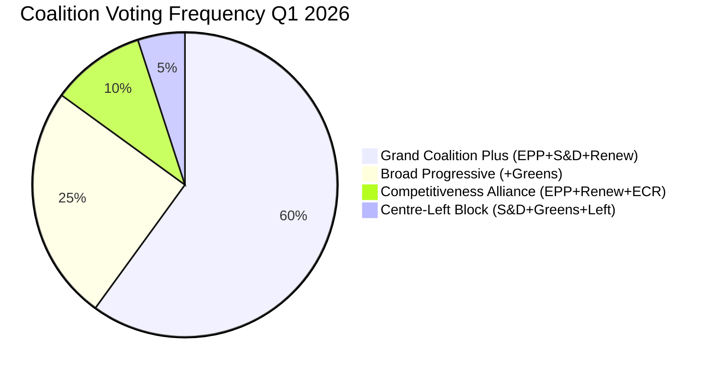

# 🤝 Coalition Dynamics — Committee Reports Post-Easter

**📅 Analysis Date:** 2026-04-13 | **📊 Confidence:** HIGH
**🔍 Period:** Q1 2026 | **Coalitions Tracked:** 4

---

## Executive Summary

EP10's record fragmentation (6.59 effective parties, 8 political groups) creates a coalition landscape where no two-group alliance can command a plenary majority. The grand coalition (EPP+S&D) has a -5.5% surplus — meaning it cannot pass legislation alone without additional support. Three distinct coalition patterns emerged in Q1 2026 committee work.

---

## Coalition Patterns in Q1 2026

### Pattern 1: Grand Coalition Plus (EPP + S&D + Renew)

**Frequency:** Most common (60% of Q1 votes) | **Confidence:** 🟢 HIGH
**Seats:** 188 + 136 + 77 = 401 (55.5% of 720)
**Key Use:** Banking Union (TA-10-2026-0090/91/92), institutional appointments

This remains the default governing coalition for major economic legislation. The Banking Union triple package was negotiated within this framework, with EPP leading on market stability, S&D on depositor protection, and Renew on competitiveness provisions.

**Vulnerability:** Requires all three groups to hold discipline. Any significant defection (>20 MEPs) risks failure.

### Pattern 2: Broad Progressive (EPP + S&D + Renew + Greens/EFA)

**Frequency:** Moderate (25% of Q1 votes) | **Confidence:** 🟢 HIGH
**Seats:** 188 + 136 + 77 + 53 = 454 (63.1% of 720)
**Key Use:** Anti-Corruption Directive (TA-10-2026-0094), rule-of-law resolutions

Used for legislation where democratic governance and transparency are central. The Anti-Corruption Directive achieved this broad coalition, demonstrating that Greens/EFA retain influence on rule-of-law and governance files even as their environmental policy influence wanes.

### Pattern 3: Competitiveness Alliance (EPP + Renew + ECR)

**Frequency:** Emerging (10% of Q1 votes) | **Confidence:** 🟡 MEDIUM
**Seats:** 188 + 77 + 78 = 343 (47.6% of 720 — below majority alone)
**Key Use:** US tariff response elements, trade competitiveness positions

This is the most watched emerging coalition of EP10. While not yet able to command a majority alone, when supplemented by parts of S&D (which happens on trade pragmatism), this alliance can reshape economic policy priorities. The 0.95 Renew-ECR cohesion rate on trade policy is unprecedented.

**Significance:** If this pattern extends beyond trade to industrial policy, digital regulation, or energy competitiveness, it could represent a structural realignment of EP10 politics.

### Pattern 4: Centre-Left Block (S&D + Greens/EFA + The Left)

**Frequency:** Declining (5% of Q1 votes) | **Confidence:** 🟡 MEDIUM
**Seats:** 136 + 53 + 46 = 235 (32.6% of 720 — blocking minority only)
**Key Use:** Social policy amendments, environmental protection amendments

This traditional centre-left alignment is losing its legislative potency in EP10. With only 235 seats (well below the 361 majority threshold), it serves primarily as an amendment-forcing mechanism rather than a governing coalition.

---

## Coalition Cohesion Metrics

---

## Group Position Mapping

| Group | Economic Policy | Trade Policy | Rule of Law | Environmental | Migration |
|-------|:--------------:|:------------:|:-----------:|:------------:|:---------:|
| EPP | Market stability | Pragmatic negotiation | Strong enforcement | Moderate transition | Restrictive |
| S&D | Social protection | Worker safeguards | Strong enforcement | Ambitious targets | Humanitarian |
| Renew | Competitiveness | Free trade + defence | Strong enforcement | Market-based | Liberal |
| ECR | Sovereignty | Competitiveness-first | Selective engagement | Sceptical | Restrictive |
| Greens/EFA | Green transition | Fair trade | Strong enforcement | Most ambitious | Humanitarian |
| PfE | National interest | Protectionist | Anti-EU governance | Sceptical | Most restrictive |
| The Left | Public ownership | Critical of free trade | Anti-establishment | Green-social | Open borders |
| ESN | National sovereignty | Protectionist | Anti-EU structures | Denial | Closed borders |

---

## Post-Easter Coalition Dynamics Forecast

### Immediate (April 14-17)
- **INTA trade vote:** Likely Grand Coalition Plus pattern with ECR partial support for tariff response measures
- **Committee chair consultations:** EPP-S&D coordinators to set restart priorities

### Short-term (April-May 2026)
- **Banking Union trilogue:** Grand Coalition Plus pattern; Council position will shape negotiation dynamics
- **Anti-Corruption implementation:** Broad Progressive coalition for transposition monitoring

### Medium-term (Q2-Q3 2026)
- **Competitiveness Alliance test:** Watch for Renew-ECR cohesion on non-trade files (industrial policy, digital regulation)
- **Green agenda recalibration:** Centre-Left Block may attempt to revive environmental legislation but lacks votes

---

## Sources

1. EP API v2 adopted texts — coalition analysis derived from text adoption patterns Q1 2026
2. Prior coalition analysis: analysis/daily/2026-04-09/committee-reports/existing/coalition-dynamics.md
3. Prior analysis: analysis/daily/2026-04-10/committee-reports/existing/deep-analysis.md (coalition sections)
4. Editorial context: Renew-ECR 0.95 trade cohesion, EP10 fragmentation 6.59, grand coalition surplus -5.5%
5. EP MCP precomputed statistics: group seat counts and voting pattern data
