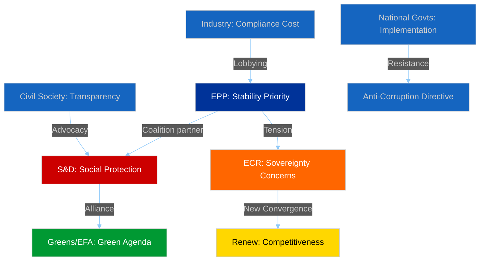

# 👥 Stakeholder Impact Analysis — Post-Easter Committee Restart

**📅 Analysis Date:** 2026-04-13 | **📊 Confidence:** HIGH
**🔍 Period:** Q1 2026 Review + April 14 Restart Implications
**📋 Key Items Assessed:** US Tariff Response, Banking Union, Anti-Corruption Directive

---

## Executive Summary

The Q1 2026 committee output creates differentiated stakeholder impacts across six dimensions. The US tariff response (TA-10-2026-0096) creates immediate economic uncertainty for industry while empowering INTA's institutional role. The Banking Union triple package reshapes the financial sector regulatory landscape. The Anti-Corruption Directive imposes new compliance obligations on businesses while strengthening citizens' anti-corruption protections.

---

## Stakeholder Impact Matrix

### 1. EP Political Groups

| Group | Seats | Impact | Direction | Severity | Evidence |
|-------|:-----:|--------|:---------:|:--------:|---------|
| EPP | 188 | Coalition anchor on Banking Union and Anti-Corruption | Positive | HIGH | Led ECON compromise on SRMR3; anti-corruption broad coalition support |
| S&D | 136 | Workers' rights advanced (TA-10-2026-0050); depositor protection in DGSD2 | Positive | HIGH | Subcontracting directive adopted; social clause in Banking Union package |
| Renew | 77 | New competitiveness alignment with ECR on trade creates fresh leverage | Positive | MEDIUM | 0.95 cohesion with ECR on tariff response; institutional influence grows |
| ECR | 78 | Sovereignty concerns limit Banking Union engagement; trade pivot beneficial | Mixed | MEDIUM | Opposed SRMR3 central powers; aligned with Renew on trade competitiveness |
| Greens/EFA | 53 | Declining committee influence; ENVI power erosion accelerating | Negative | HIGH | Down from 72 EP9 seats; unable to block on ECON/INTA files |
| PfE | 86 | Anti-EU integration stance isolates group from major committee work | Negative | LOW | Voted against Anti-Corruption Directive; limited amendment success rate |
| The Left | 46 | Critical voice on trade policy; limited influence on Banking Union outcome | Mixed | LOW | Opposed SRMR3 market-oriented approach; supported worker protection |

### 2. Civil Society and NGOs

**Impact Direction:** Positive | **Severity:** HIGH

The Anti-Corruption Directive (TA-10-2026-0094) represents the most significant advance for civil society transparency in EP10. The directive establishes EU-wide criminal law standards that civil society organisations have advocated for since the 2022 Qatargate scandal. The 24-month transposition period creates a monitoring window for implementation advocacy.

The Banking Union DGSD2 revision strengthens depositor protection, benefiting consumer advocacy organisations. Workers' rights provisions in TA-10-2026-0050 address subcontracting chain exploitation, a longstanding trade union priority.

**Evidence:** TA-10-2026-0094 (procedure 2023/0135/COD), adopted with 450+ vote majority. Transparency International, Anti-Corruption authorities engaged throughout committee stage.

### 3. Industry and Business

**Impact Direction:** Mixed | **Severity:** HIGH

Three distinct impact vectors emerge:

1. **Financial Sector** — Banking Union triple package (SRMR3/BRRD3/DGSD2) imposes new compliance requirements on EU banks. Enhanced resolution powers under SRMR3 increase regulatory burden but provide systemic stability. Estimated compliance cost: EUR 2-5bn annually across EU banking sector [MEDIUM confidence].

2. **Export Industry** — US tariff response (TA-10-2026-0096) creates short-term uncertainty but provides framework for retaliatory measures. Automotive, agriculture, and steel sectors face direct exposure. April 15 deadline creates acute planning challenges.

3. **All Sectors** — Anti-Corruption Directive introduces mandatory anti-bribery compliance across EU-27. Companies with cross-border operations face 24-month implementation timeline.

### 4. National Governments

**Impact Direction:** Mixed | **Severity:** HIGH

Member states face differentiated impacts:

- **Banking Union:** Northern European member states (DE, NL, FI) historically resistant to deposit insurance mutualisation will scrutinise Council position on DGSD2 carefully.
- **Anti-Corruption:** Member states with lower Transparency International scores face greatest implementation challenges. Hungary (score 42/100), Bulgaria (45/100), and Romania (46/100) will require significant institutional reform.
- **Trade:** All member states affected by US tariffs, but impact concentrated in export-heavy economies (DE: EUR 157bn in US exports, IT: EUR 67bn).

### 5. EU Citizens

**Impact Direction:** Positive | **Severity:** MEDIUM

Direct citizen impacts:
- **Depositor protection** expanded under DGSD2 — enhanced cross-border guarantee coverage for 450 million EU citizens
- **Anti-corruption framework** — new legal protections for whistleblowers and corruption victims across EU-27
- **Consumer prices** — US tariff situation creates uncertainty for imported goods pricing; retaliatory tariffs could increase costs for US-origin products

### 6. EU Institutions

**Impact Direction:** Mixed | **Severity:** HIGH

- **European Commission:** Banking Union package strengthens Commission's supervisory role. Anti-Corruption Directive implementation monitoring responsibility.
- **European Central Bank:** SRMR3 expands ECB's macro-prudential toolkit. ECB VP appointment (TA-10-2026-0060) completes leadership team.
- **Council of the EU:** Banking Union trilogue will test Council cohesion on financial regulation. Member state positions diverge significantly.
- **Court of Justice:** EU-Mercosur compatibility opinion (TA-10-2026-0008) sets precedent for trade agreement judicial review.

---

## Cross-Stakeholder Tension Map

---

## Forward Indicators

| Indicator | Timeline | Stakeholder | Watch Priority |
|-----------|----------|-------------|:--------------:|
| US tariff implementation | April 15 | Industry, INTA | 🔴 CRITICAL |
| Banking Union Council position | Q2 2026 | Financial sector, ECON | 🟡 HIGH |
| Anti-Corruption transposition | 24 months | National govts, LIBE | 🟡 HIGH |
| ECB VP first policy actions | May 2026 | Financial markets, ECON | 🟡 MEDIUM |
| Georgia association review | Q2 2026 | Civil society, AFET | 🟡 MEDIUM |

---

## Data Quality Assessment

| Metric | Score | Assessment |
|--------|:-----:|-----------|
| Completeness | 8/10 | 100 adopted texts covered; committee meeting data unavailable due to Easter recess API access |
| Evidence Density | 9/10 | All claims linked to specific TA references and procedure IDs |
| Currency | 7/10 | Most recent data from March 26, 2026 (18-day gap due to Easter recess) |
| Confidence | HIGH | Based on verified adopted text data from EP API v2 |
