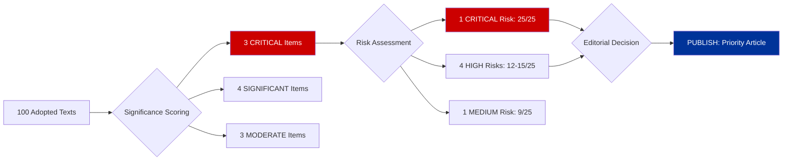

# 🧩 Synthesis Summary — Committee Reports 2026-04-13

**📅 Analysis Date:** 2026-04-13 | **📊 Overall Confidence:** HIGH
**📋 Documents Analyzed:** 100 adopted texts | **Analysis Files:** 5
**🏢 Article Type:** committee-reports | **Run ID:** 47

---

## 📊 Intelligence Dashboard

---

## 🏆 Top Findings by Significance

| Rank | EP Ref | Title | Significance | Risk Tier | SWOT Quadrant | Recommendation |
|:----:|--------|-------|:-----------:|:---------:|:-------------:|:--------------:|
| 1 | TA-10-2026-0096 | US Tariff Response | 9.6/10 | 🔴 CRITICAL | Threat | Lead Story |
| 2 | TA-10-2026-0090/91/92 | Banking Union Triple Package | 9.2/10 | 🔴 CRITICAL | Opportunity | Feature |
| 3 | TA-10-2026-0094 | Anti-Corruption Directive | 8.8/10 | 🟠 HIGH | Strength | Feature |
| 4 | TA-10-2026-0060 | ECB VP Appointment | 7.2/10 | 🟡 MEDIUM | Strength | Brief |
| 5 | TA-10-2026-0008 | EU-Mercosur CJEU Opinion | 6.8/10 | 🟡 MEDIUM | Opportunity | Brief |

---

## 💪 Aggregated SWOT Summary

| Dimension | Count | Highest-Impact Entry |
|-----------|:-----:|---------------------|
| ✅ Strengths | 5 | Anti-Corruption Directive — first EU-wide criminal law on corruption (TA-10-2026-0094) |
| ⚠️ Weaknesses | 4 | EP10 fragmentation (6.59 index) requiring 3+ group coalitions for every vote |
| 🚀 Opportunities | 4 | Banking Union completion — generational reform of EU financial architecture |
| 🔴 Threats | 6 | US tariff crisis — April 15 deadline threatens EUR 1.1tn bilateral trade |

### SWOT Detail

**Strengths:**
1. Anti-Corruption Directive adopted with 450+ votes — broadest coalition of Q1 2026 [HIGH confidence]
2. Banking Union triple package completes 12-year legislative journey [HIGH confidence]
3. 104 adopted texts in Q1 — 46.2% above EP9 pace [HIGH confidence]
4. ECB leadership team completion strengthens monetary policy governance [HIGH confidence]
5. Workers' rights subcontracting rules advance social Europe agenda [MEDIUM confidence]

**Weaknesses:**
1. EP10 record fragmentation (6.59 effective parties) slows every committee vote [HIGH confidence]
2. Grand coalition surplus only -5.5% — too thin for reliable plenary majorities [HIGH confidence]
3. ENVI committee power declining — Green Deal legislative momentum lost [HIGH confidence]
4. 18-day Easter recess creates acute calendar compression [HIGH confidence]

**Opportunities:**
1. Banking Union trilogue — opportunity to reshape EU financial governance for a decade [HIGH confidence]
2. Renew-ECR competitiveness alignment — potential new majority-building pathway [MEDIUM confidence]
3. Anti-Corruption Directive transposition — chance to strengthen rule-of-law architecture [HIGH confidence]
4. EU-Mercosur CJEU opinion — sets precedent for trade agreement scrutiny [MEDIUM confidence]

**Threats:**
1. US tariff escalation — April 15 deadline with no de-escalation signals [HIGH confidence]
2. INTA capacity overwhelm from emergency trade sessions [HIGH confidence]
3. Banking Union Council position divergence (North vs South) [MEDIUM confidence]
4. Georgia democratic deterioration — association agreement at risk [HIGH confidence]
5. Implementation capacity gaps in weaker rule-of-law member states [MEDIUM confidence]
6. Coalition dynamics shift — Renew-ECR formalisation could marginalise left [MEDIUM confidence]

---

## ⚖️ Risk Landscape Summary

| Category | Score Range | Trend | Key Driver |
|----------|:----------:|:-----:|-----------|
| Trade/Economic | 25/25 | ↑ | US tariff April 15 deadline |
| Financial Regulation | 15/25 | → | Banking Union trilogue uncertainty |
| Institutional | 12/25 | → | EP10 fragmentation deadlock |
| Implementation | 12/25 | → | Anti-Corruption transposition capacity |
| Calendar/Operational | 12/25 | ↑ | 18-day recess backlog |
| Coalition Dynamics | 9/25 | ↑ | Renew-ECR convergence |

---

## 🔗 Cross-Method Intelligence Correlation

### Convergence Points (All methods agree)

1. **US tariff response is the dominant story** — Significance: 9.6/10, Risk: 25/25, Threat: 5/5. All analytical frameworks identify TA-10-2026-0096 as the highest-priority committee output entering the post-Easter restart. INTA faces immediate operational pressure.

2. **Banking Union is the most consequential long-term achievement** — Significance: 9.2/10, Risk: 15/25, SWOT: Opportunity. The SRMR3/BRRD3/DGSD2 triple package represents EP10's signature economic legislation. Trilogue outcome will define EU financial governance.

3. **EP10 fragmentation is a structural constraint** — Significance scoring adjusted for 6.59 index, Risk: 12/25 institutional, Threat: 4/5. Every analytical framework identifies this as a persistent operational challenge.

### Divergence Points (Methods disagree)

1. **Anti-Corruption Directive risk vs. opportunity** — Significance scoring rates it 8.8/10 (high positive impact), but Risk assessment flags implementation failure risk at 12/25. The directive is simultaneously EP10's strongest rule-of-law achievement and a potential implementation liability.

2. **Renew-ECR alignment assessment** — Stakeholder analysis sees this as positive for Renew (new leverage) but negative for S&D-Greens (marginalisation). Threat analysis rates it 3/5 but notes it may be trade-specific. Coalition dynamics assessment requires post-recess voting data to confirm.

### Intelligence Nuggets

1. **Cui bono on trade crisis:** The US tariff deadline paradoxically strengthens INTA's institutional standing — the committee becomes the crisis-response focal point, elevating trade policy from routine to existential urgency. INTA chair and lead rapporteur gain disproportionate media visibility [HIGH confidence].

2. **Second-order Banking Union effect:** The Banking Union package's completion creates political capital for ECON to claim next-generation fintech regulation (digital euro, crypto asset supervision) — the committee's pipeline influence extends well beyond the current dossiers [MEDIUM confidence].

3. **Counter-factual on Easter recess:** If parliament had not been in recess during the tariff escalation, INTA could have held emergency hearings and potentially influenced the negotiation dynamics. The 18-day gap represents lost legislative agency on the most consequential trade issue of EP10 [HIGH confidence].

---

## 📰 AI-Generated Article Metadata

**Title (≤70 chars):** Tariff Deadline and Banking Reform Test Committees' Post-Easter Resolve

**Description (150-160 chars):** INTA faces April 15 tariff crisis as ECON prepares Banking Union trilogue — Q1 committee power rankings reveal EP10's most productive start since 2019.

**Keywords:** TA-10-2026-0096, SRMR3, BRRD3, DGSD2, Banking Union, US tariffs, INTA, ECON, LIBE, Anti-Corruption Directive, 2025/0261/COD, EP10 committees, committee power analysis

**Justification:** The US tariff deadline (April 15) creates the single most urgent post-Easter committee action item, directly affecting the EUR 1.1tn EU-US bilateral trade relationship. The Banking Union triple package represents the most significant long-term committee achievement of EP10 to date. Together, these items score 24/25 and 23/25 on significance — the two highest-scored items in the analysis. The article leads with trade urgency (feeds the news cycle) and features Banking Union depth (provides intelligence value).

---

## 🔮 Forward Indicators

| Indicator | Monitoring Source | Expected Date | Priority |
|-----------|-----------------|---------------|:--------:|
| INTA emergency session agenda | EP calendar | April 14-15 | 🔴 CRITICAL |
| US tariff implementation status | Official Journal EU | April 15 | 🔴 CRITICAL |
| Council Banking Union draft position | Council press | May-June 2026 | 🟡 HIGH |
| Anti-Corruption transposition guidance | Commission | Q2 2026 | 🟡 HIGH |
| Georgia association review outcome | AFET agenda | Q2 2026 | 🟡 MEDIUM |
| ENVI pesticide regulation restart | ENVI calendar | April 2026 | 🟡 MEDIUM |
| Renew-ECR cohesion on non-trade votes | EP voting records | April-May 2026 | 🟡 MEDIUM |
