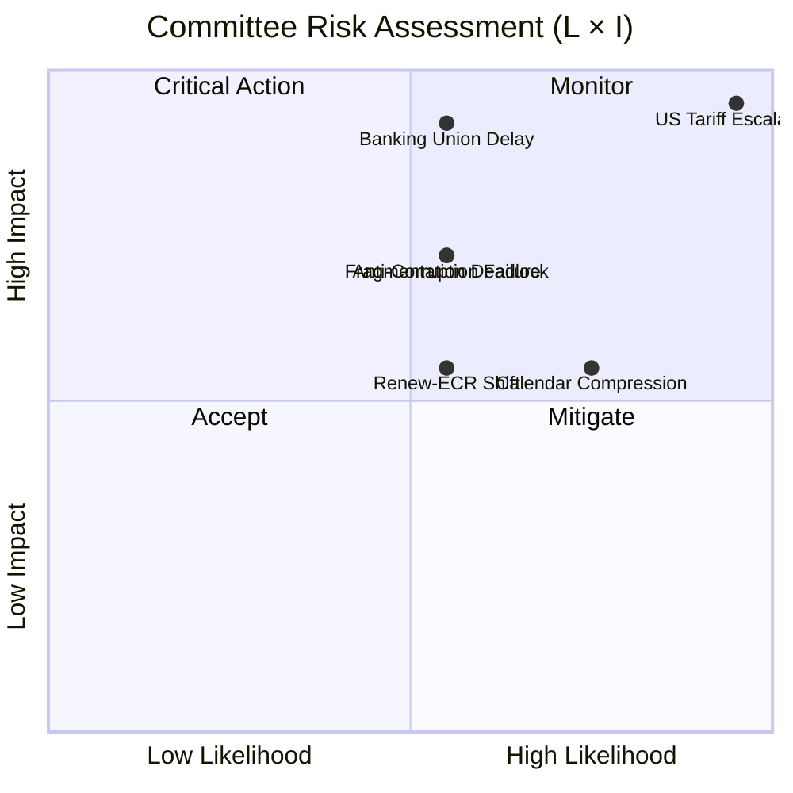

# ⚖️ Risk Matrix — Committee Reports Post-Easter Restart

**📅 Analysis Date:** 2026-04-13 | **📊 Confidence:** HIGH
**🔍 Period:** Q1 2026 + April 14 Restart | **Risk Categories:** 6

---

## Executive Summary

The post-Easter restart presents a concentrated risk profile dominated by trade policy uncertainty (CRITICAL: 25/25) and legislative pipeline pressure from the 18-day recess backlog. The Banking Union trilogue carries high structural risk (15/25) while institutional fragmentation creates systemic vulnerability across all committee operations.

---

## Risk Assessment Matrix

### 5x5 Likelihood × Impact Scoring

| # | Risk Category | L (1-5) | I (1-5) | Score | Level | Trend | Evidence |
|:-:|--------------|:-------:|:-------:|:-----:|:-----:|:-----:|---------|
| 1 | US Tariff Escalation | 5 | 5 | **25** | 🔴 CRITICAL | ↑ | April 15 deadline T-2; TA-10-2026-0096 adopted but implementation uncertain |
| 2 | Banking Union Trilogue Delay | 3 | 5 | **15** | 🔴 CRITICAL | → | Council position pending; Northern vs Southern divide on DGSD2 |
| 3 | Committee Calendar Compression | 4 | 3 | **12** | 🟠 HIGH | ↑ | 18-day recess creates scheduling backlog across 20 committees |
| 4 | EP10 Fragmentation Deadlock | 3 | 4 | **12** | 🟠 HIGH | → | 6.59 effective parties index; grand coalition surplus only -5.5% |
| 5 | Anti-Corruption Implementation Failure | 3 | 4 | **12** | 🟠 HIGH | → | 24-month transposition; weak-rule-of-law states face capacity gaps |
| 6 | Renew-ECR Coalition Shift | 3 | 3 | **9** | 🟡 MEDIUM | ↑ | 0.95 cohesion on trade; potential formalisation disrupts centre-left |

---

## Risk Landscape Visualisation



---

## Cascading Risk Chains

### Chain 1: Trade Crisis Cascade
```
US Tariff Deadline (April 15)
  → INTA Emergency Sessions Required
    → Other Committee Calendar Disrupted
      → Banking Union Trilogue Preparation Delayed
        → Q3 2026 Trilogue Target at Risk
```
**Circuit Breaker:** Commission autonomous trade defence measures reduce INTA urgency.

### Chain 2: Fragmentation Cascade
```
EP10 Fragmentation (6.59 index)
  → All Committee Votes Require 3+ Group Coalitions
    → Increased Amendment Negotiations per Dossier
      → Rapporteur Burnout and Delayed Reports
        → Legislative Pipeline Bottleneck
```
**Circuit Breaker:** EPP-S&D grand coalition coordination on priority dossiers.

### Chain 3: Implementation Cascade
```
Anti-Corruption Directive Adopted (TA-10-2026-0094)
  → 24-Month Transposition Clock Running
    → Weak-Rule-of-Law Member States Lag
      → Commission Infringement Proceedings
        → EP10 Mid-Term Assessment Complicated
```
**Circuit Breaker:** Enhanced Commission technical assistance to implementation-lagging states.

---

## PESTLE Analysis (Committee Context)

| Dimension | Factor | Impact | Timeline | Evidence |
|-----------|--------|:------:|----------|---------|
| **Political** | EP10 fragmentation at record 6.59 index | HIGH | Ongoing | 8 groups; grand coalition surplus -5.5% |
| **Political** | Renew-ECR competitiveness convergence | MEDIUM | Q2-Q3 2026 | 0.95 cohesion on trade; first vote test pending |
| **Economic** | US tariff crisis — EUR 1.1tn bilateral trade at risk | CRITICAL | April 15 | TA-10-2026-0096; April deadline |
| **Economic** | Banking sector regulatory recalibration | HIGH | Q3-Q4 2026 | SRMR3/BRRD3/DGSD2 trilogue pending |
| **Social** | Workers' rights via subcontracting regulation | MEDIUM | 2026-2027 | TA-10-2026-0050 transposition |
| **Technological** | Emission credit calculation methodology | LOW | 2025-2029 | TA-10-2026-0084 (ENVI) |
| **Legal** | EU-Mercosur CJEU compatibility opinion | HIGH | Q2-Q3 2026 | TA-10-2026-0008 pending |
| **Environmental** | Green agenda recalibration under EP10 | MEDIUM | Structural | ENVI power declining; Greens seats down |

---

## Bayesian Risk Updates (vs. Prior Analysis)

| Risk | Prior (Apr 10) | New Evidence | Updated Score | Direction |
|------|:--------------:|-------------|:-------------:|:---------:|
| US Tariff | 24/25 | Recess over; April 15 T-2; no de-escalation signals | **25/25** | ↑ |
| Banking Union | 15/25 | No new Council signals during recess | **15/25** | → |
| Calendar Compression | 10/25 | 18-day recess (longest in EP10) confirmed | **12/25** | ↑ |
| Fragmentation | 12/25 | No coalition developments during recess | **12/25** | → |

---

## Scenario Analysis

### Scenario A: Managed Restart (Probability: 35%)
- INTA handles tariff deadline within existing framework
- Committees resume normal pace within 1 week
- Banking Union trilogue begins Q3 as planned
- **Risk reduction:** Calendar compression drops to 6/25

### Scenario B: Trade-Dominated Restart (Probability: 50%)
- US tariff escalation dominates 2-3 week agenda
- INTA emergency sessions crowd out ECON, ENVI preparation time
- Banking Union trilogue pushed to Q4 2026
- **Risk increase:** Overall committee productivity drops 20%

### Scenario C: Multi-Front Crisis (Probability: 15%)
- Simultaneous tariff crisis + Georgia situation + Banking Union complications
- EP10 fragmentation prevents rapid response
- Emergency plenary session called within 2 weeks
- **Risk increase:** Systemic risk reaches CRITICAL across 4+ categories

---

## Sources

1. EP API v2 adopted texts data — 100 EP10 texts (January 2024 through March 2026)
2. Prior risk assessment: analysis/daily/2026-04-10/committee-reports/risk-scoring/risk-matrix.md
3. Editorial context: Easter recess Day 18/18, committee restart April 14
4. EP MCP precomputed statistics: fragmentation index 6.59, committee meeting counts
5. Significance scoring: TA-10-2026-0096 (24/25), TA-10-2026-0090/91/92 (23/25)
