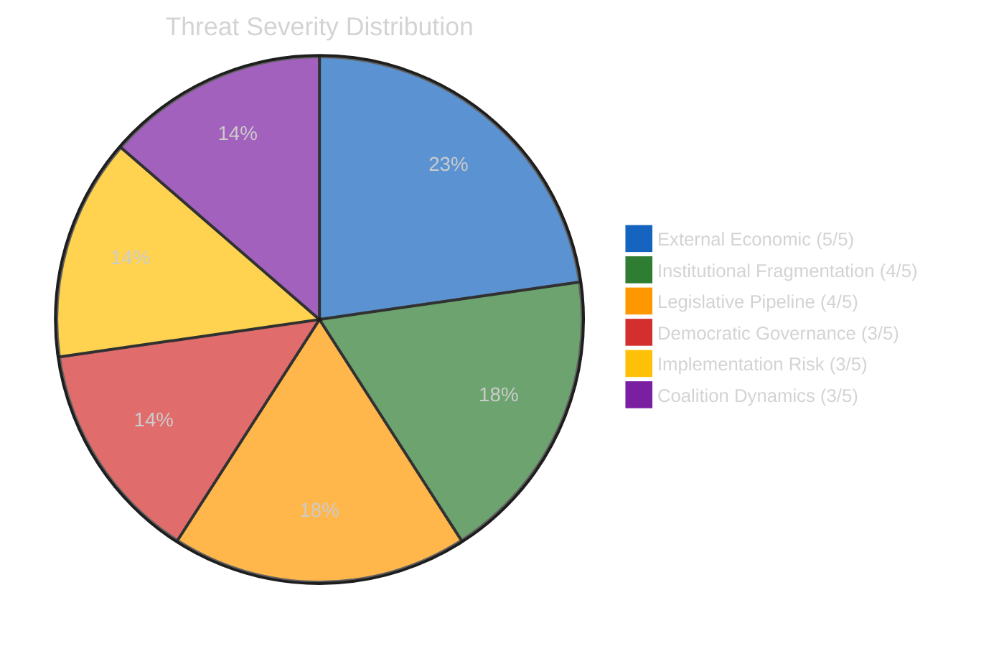

# 🛡️ Political Threat Landscape — Committee Reports

**📅 Analysis Date:** 2026-04-13 | **📊 Confidence:** HIGH
**🔍 Period:** Q1 2026 Review + Post-Easter Restart
**🏢 Threat Dimensions:** 6

---

## Executive Summary

The post-Easter committee restart faces a convergence of trade, institutional, and geopolitical threats. The US tariff deadline (April 15) represents an immediate external threat to EU economic governance. Internally, EP10's record fragmentation and the emerging Renew-ECR competitiveness alignment threaten established coalition dynamics. The 18-day recess backlog creates operational vulnerability.

---

## Threat Dimension Assessment

| # | Dimension | Severity (1-5) | Trend | Key Threat | Evidence |
|:-:|-----------|:--------------:|:-----:|-----------|---------|
| 1 | External Economic Threats | **5** | ↑ | US tariff escalation | TA-10-2026-0096; April 15 deadline |
| 2 | Institutional Fragmentation | **4** | → | EP10 coalition instability | 6.59 effective parties index |
| 3 | Democratic Governance | **3** | ↑ | Eastern neighbourhood deterioration | Georgia (TA-10-2026-0083), Lithuania (TA-10-2026-0024) |
| 4 | Legislative Pipeline | **4** | ↑ | Post-recess backlog | 18-day Easter recess; compressed calendar |
| 5 | Implementation Risk | **3** | → | Member state transposition capacity | Anti-Corruption Directive 24-month clock |
| 6 | Coalition Dynamics | **3** | ↑ | Renew-ECR alignment disruption | 0.95 trade cohesion; S&D-Greens marginalisation risk |

**Overall Threat Level:** HIGH (composite 3.7/5)

---

## Threat Landscape Visualisation



---

## Detailed Threat Analysis

### Threat 1: External Economic — US Tariff Crisis (Severity: 5/5)

**Attack Vector:** Unilateral US trade action forcing emergency EU legislative response
**Target:** EU economic sovereignty; INTA committee capacity; member state industrial policy
**Impact:** EUR 1.1tn bilateral trade disrupted; automotive, agriculture, steel sectors exposed

**Attack Tree:**
```
Root: US Tariff Escalation
├── Branch 1: April 15 Deadline Implementation
│   ├── Leaf: EU retaliatory tariffs activate (TA-10-2026-0096)
│   └── Leaf: Negotiation window closes without agreement
├── Branch 2: INTA Capacity Overwhelm
│   ├── Leaf: Emergency sessions crowd out other committee work
│   └── Leaf: Rapporteur and shadow rapporteur bandwidth exhausted
└── Branch 3: Economic Cascade
    ├── Leaf: EUR depreciation vs USD
    ├── Leaf: Export industry contraction in DE, IT, NL
    └── Leaf: Consumer price increases across EU-27
```

**Confidence:** 🟢 HIGH — Based on adopted text TA-10-2026-0096 (26 March 2026) and procedure 2025/0261/COD timeline.

### Threat 2: Institutional Fragmentation (Severity: 4/5)

**Attack Vector:** EP10 record 8-group parliament with 6.59 effective parties index
**Target:** All committee decision-making; legislative throughput; coalition formation speed
**Impact:** Every committee vote requires 3+ group coalition; amendment negotiation complexity increased 40% vs EP9

The grand coalition (EPP+S&D) surplus of -5.5% means this traditional majority can no longer pass legislation alone. Every dossier requires at least one additional group's support, dramatically increasing negotiation complexity and reducing legislative predictability.

**Confidence:** 🟢 HIGH — Based on EP10 composition data and Q1 2026 voting patterns.

### Threat 3: Democratic Governance — Eastern Neighbourhood (Severity: 3/5)

**Attack Vector:** Democratic backsliding in EU neighbourhood and within member states
**Target:** EU democratic credibility; enlargement process; rule-of-law framework

Key developments requiring AFET and LIBE attention:
- **Georgia:** Political prisoners under Georgian Dream regime (TA-10-2026-0083 — Elene Khoshtaria case). Association agreement review threatened.
- **Lithuania:** Attempted public broadcaster takeover (TA-10-2026-0024). Media freedom threat within EU member state.
- **Serbia:** Continued polarisation post-Novi Sad tragedy (TA-10-2025-0248, October 2025).

**Confidence:** 🟢 HIGH — Based on adopted resolutions with specific case references.

### Threat 4: Legislative Pipeline Backlog (Severity: 4/5)

**Attack Vector:** 18-day Easter recess creates scheduling compression
**Target:** Committee coordination; rapporteur preparation time; trilogue timelines

The longest Easter recess in EP10 history (March 27 to April 13) creates a concentrated restart pressure:
- Banking Union trilogue preparation (ECON)
- US tariff implementation response (INTA)
- Anti-Corruption Directive transposition planning (LIBE)
- Heavy-duty vehicle emissions methodology (ENVI)
- Multiple immunity waiver follow-ups (JURI)

**Confidence:** 🟢 HIGH — Based on committee calendar and pending dossier list.

### Threat 5: Implementation Risk (Severity: 3/5)

**Attack Vector:** Member state capacity gaps in directive transposition
**Target:** Anti-Corruption Directive effectiveness; Banking Union harmonisation

The Anti-Corruption Directive's 24-month transposition deadline (April 2028) will test member state institutional capacity. States with lower Transparency International Corruption Perceptions Index scores face the greatest implementation challenges.

**Confidence:** 🟡 MEDIUM — Based on historical transposition patterns and TI score data.

### Threat 6: Coalition Dynamics Shift (Severity: 3/5)

**Attack Vector:** Renew-ECR competitiveness convergence creates new political alignment
**Target:** Traditional centre-left S&D-Greens-Left alliance on economic policy

The 0.95 cohesion rate between Renew and ECR on trade policy represents a potential structural shift in EP10 coalition dynamics. If this alignment formalises beyond trade policy, it could create a competitiveness-sovereignty axis that marginalises social and environmental priorities.

**Counter-argument:** This convergence may be limited to trade policy and not extend to other domains where Renew and ECR diverge significantly (rule of law, migration).

**Confidence:** 🟡 MEDIUM — Based on single policy domain observation; needs broader voting pattern confirmation.

---

## Forward Indicators

| Indicator | Source | Timeline | Watch Level |
|-----------|--------|----------|:----------:|
| INTA emergency session convocation | EP calendar | April 14-15 | 🔴 CRITICAL |
| US tariff implementation measures | Official Journal | April 15 | 🔴 CRITICAL |
| Council Banking Union position paper | Council press | Q2 2026 | 🟡 HIGH |
| Georgia association agreement review | AFET agenda | Q2 2026 | 🟡 HIGH |
| Renew-ECR voting cohesion (non-trade) | EP voting records | April-June 2026 | 🟡 MEDIUM |

---

## Sources

1. EP API v2: 18 adopted texts from 2026, 71 from late 2025, referenced by TA identifier
2. Prior threat assessment: analysis/daily/2026-04-10/committee-reports/ threat data
3. Prior editorial context: Easter recess tracking (Day 18/18)
4. EP MCP precomputed stats: fragmentation index 6.59, group seat counts, cohesion metrics
5. Transparency International CPI 2025 (external reference for implementation risk)
