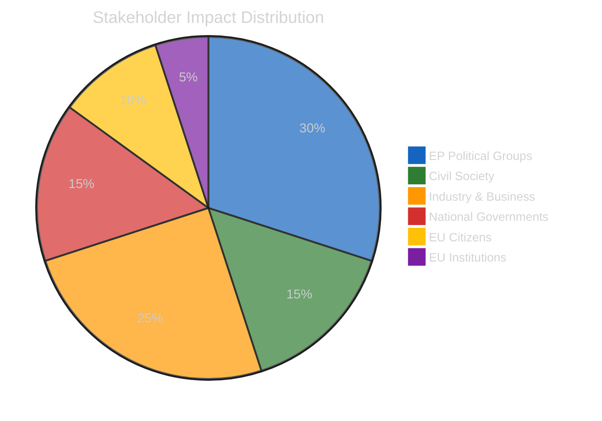
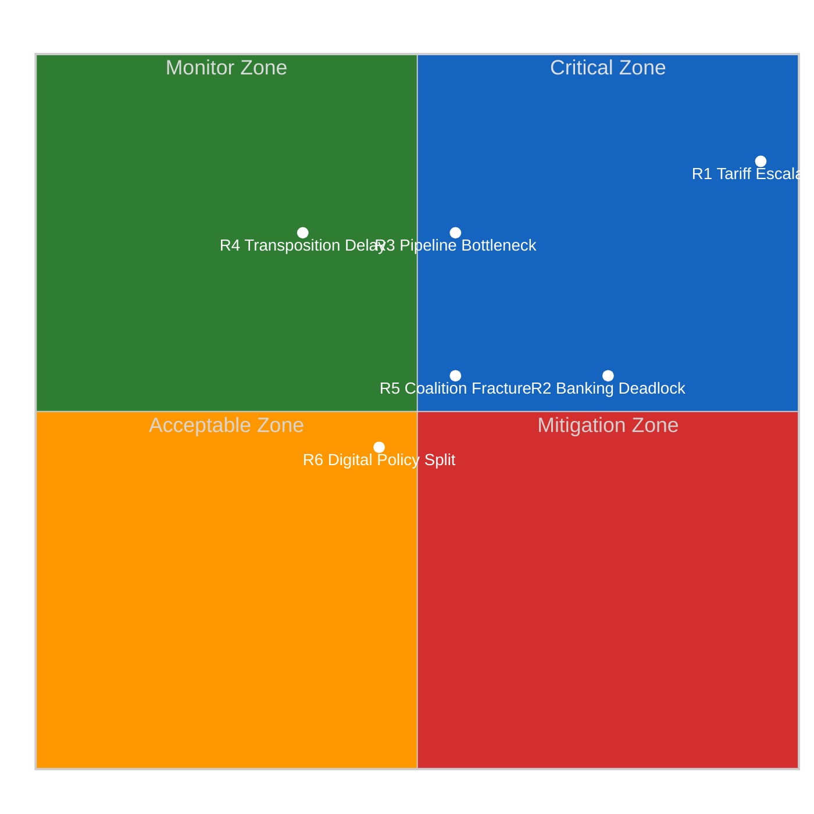
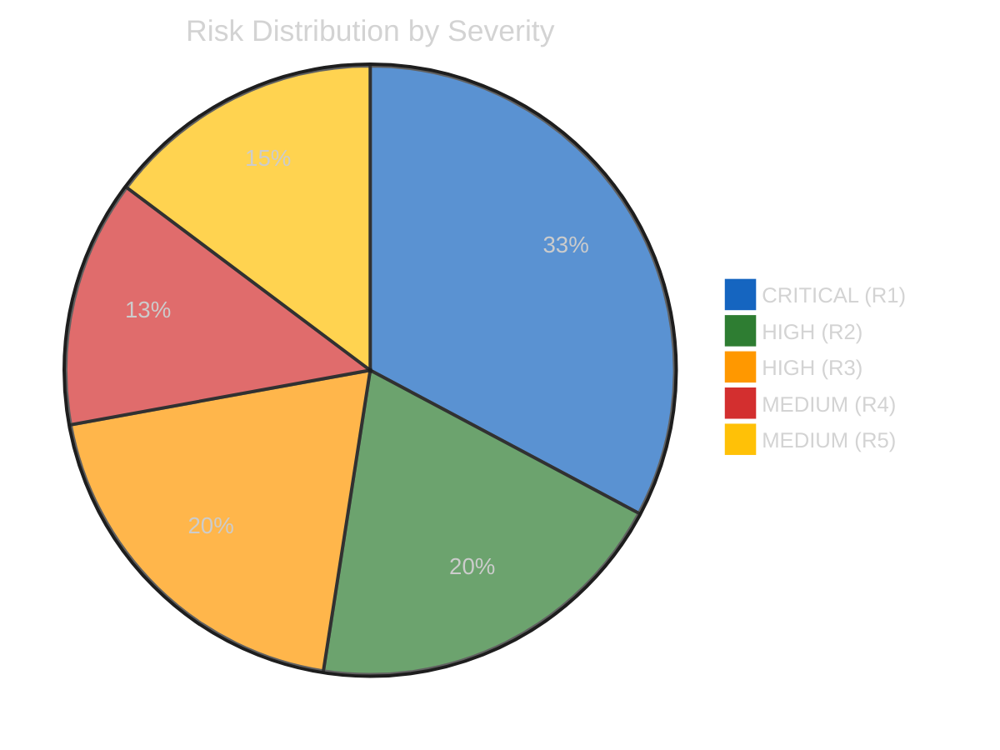
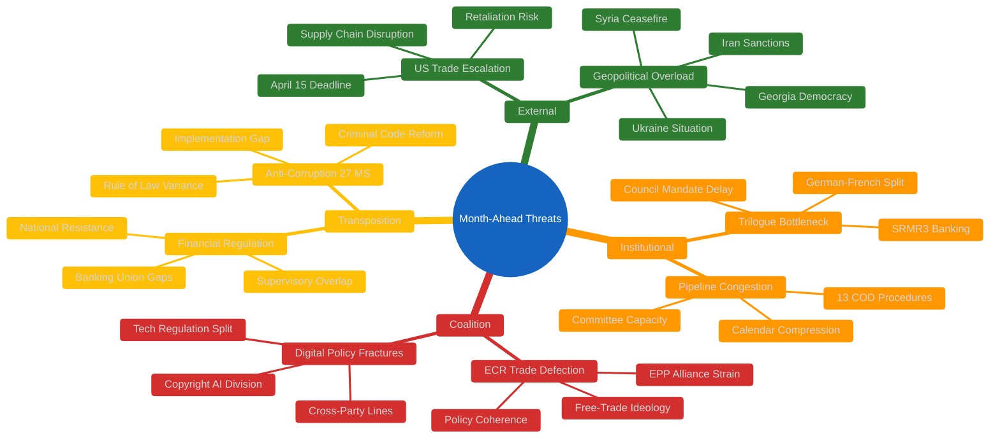
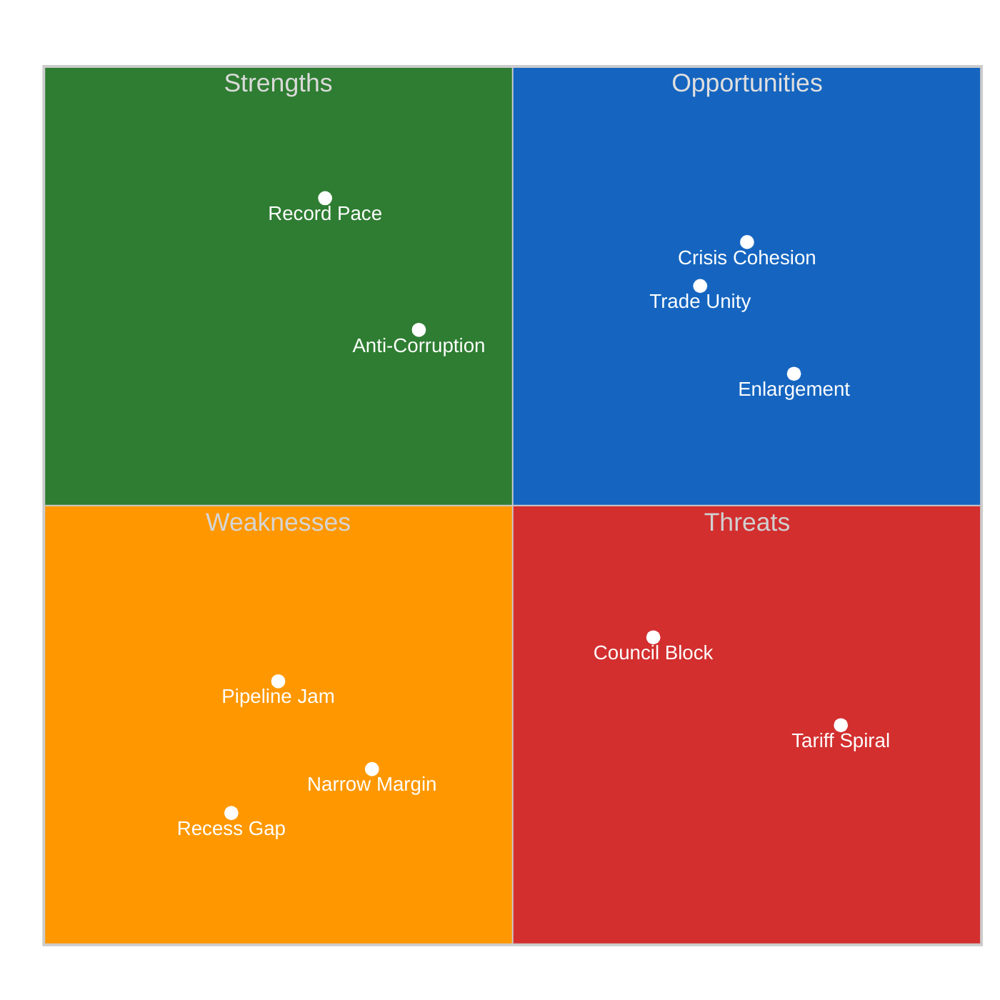
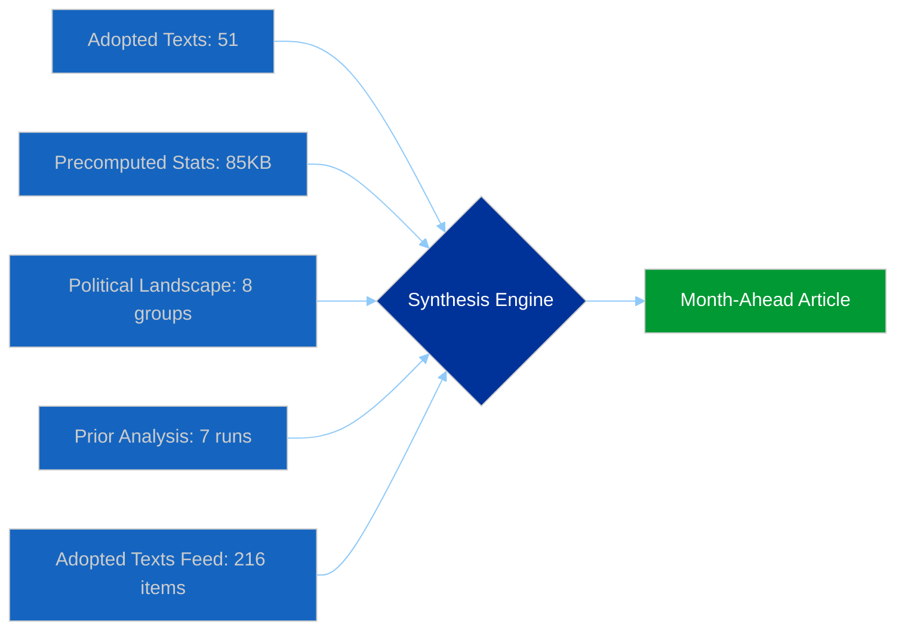

# Month Ahead — 2026-04-13

<h2 id="reader-intelligence-guide">Reader Intelligence Guide</h2>

Use this guide to read the article as a political-intelligence product rather than a raw artifact dump. High-value reader lenses appear first; technical provenance remains available in the audit appendices.

| Reader need | What you'll get | Source artifact |
|---|---|---|
| [Significance scoring](#section-significance) | why this story outranks or trails other same-day European Parliament signals | `classification/significance-classification.md` |
| [Stakeholder impact](#section-stakeholder-map) | who gains, who loses, and which institutions or citizens feel the policy effect | `existing/stakeholder-impact.md` |
| [Risk assessment](#section-risk) | policy, institutional, coalition, communications, and implementation risk register | `risk-scoring/risk-matrix.md` |

<h2 id="section-significance">Significance</h2>

### Significance Classification

### 📋 Classification Context

| Field | Value |
|-------|-------|
| **Classification ID** | CLASS-2026-04-13-MA-RUN4 |
| **Analysis Date** | 2026-04-13 (Easter recess Day 18/18) |
| **Preview Period** | 2026-04-13 to 2026-05-13 |
| **Documents Analyzed** | 51 adopted texts (2026) + 13 pending COD procedures |
| **Data Sources** | EP MCP adopted texts, precomputed stats 2004-2026, political landscape, prior analysis |
| **Overall Confidence** | HIGH |

### Seven-Dimension Classification Matrix

#### Dimension 1: Political Significance

| Item | EP Reference | Score | Trend | Evidence |
|------|-------------|:-----:|:-----:|----------|
| US Tariff Countermeasures | TA-10-2026-0096 | 9.5/10 | Up | April 15 implementation deadline, ECR defection, Commission implementing acts pending |
| SRMR3 Banking Reform | TA-10-2026-0092 | 8.0/10 | Stable | Council trilogue expected late April, German-French deposit guarantee test |
| Anti-Corruption Directive | TA-10-2026-0094 | 7.5/10 | Stable | First EU-wide anti-corruption law, post-Qatargate, 27 MS transposition |
| Post-Recess Pipeline Congestion | Systemic | 7.0/10 | Up | 13 new COD procedures awaiting assignment, committee restart capacity |
| EU Enlargement Strategy | TA-10-2026-0077 | 6.5/10 | Stable | Montenegro/Albania accession texts, Ukraine loan enhanced cooperation |
| Digital Sovereignty | TA-10-2026-0022 | 6.0/10 | Stable | Tech regulation framework, AI copyright TA-10-2026-0066 |

#### Dimension 2: Legislative Impact

| Item | Procedure Type | Stage | Impact Score | Pipeline Risk |
|------|---------------|-------|:-----------:|:------------:|
| Tariff Adjustment | COD 2025/0261 | Post-adoption implementation | 9/10 | CRITICAL |
| SRMR3 | COD 2023/0111 | Parliament position to Trilogue | 8/10 | HIGH |
| Anti-Corruption | COD 2023/0135 | Parliament position to Council | 7/10 | MEDIUM |
| EU Talent Pool | COD 2023/0404 | Adopted March 10 | 6/10 | LOW |
| Air Passenger Rights | COD 2013/0072 | Adopted Jan 21 | 5/10 | LOW |

#### Dimension 3: Coalition Dynamics

| Coalition Pattern | Evidence | Fragility Score |
|-------------------|----------|:--------------:|
| Grand Coalition EPP+S&D+Renew | Held on tariffs, banking, anti-corruption | 3/5 |
| ECR Defection on Trade | Broke with EPP on TA-10-2026-0096 | 4/5 |
| Renew-ECR Competitiveness Alliance | 0.95 cohesion score, crisis test incoming | 3/5 |
| Greens/EFA Digital Alliance | Aligned with S&D on digital sovereignty | 2/5 |
| PfE Opposition Bloc | Opposing anti-corruption on sovereignty grounds | 2/5 |

#### Dimension 4: Institutional Impact

| Institution | Score | Evidence |
|------------|:-----:|----------|
| European Commission | 9/10 | Implementation overload, tariff executing authority |
| Council of the EU | 8/10 | Banking trilogue, anti-corruption position |
| European Central Bank | 7/10 | Vice-President appointment TA-10-2026-0060 |
| Court of Justice | 5/10 | Mercosur compatibility opinion TA-10-2026-0008 |

#### Dimension 5: Citizen and Economic Impact

| Policy Area | Impact Direction | Severity |
|------------|:---------------:|:--------:|
| Trade/Tariffs | Mixed | HIGH |
| Banking Reform | Positive | MEDIUM |
| Anti-Corruption | Positive | MEDIUM |
| Housing Crisis | Positive | MEDIUM |
| EU Talent Pool | Positive | LOW |

#### Dimension 6: Temporal Urgency

| Item | Deadline | Days Away | Urgency |
|------|----------|:---------:|:-------:|
| Tariff Implementation | 2026-04-15 | 2 | CRITICAL |
| Parliament Restart | 2026-04-14 | 1 | CRITICAL |
| SRMR3 Trilogue Opening | Late April | 14 | HIGH |
| COD Procedure Assignment | Post-recess | 7 | HIGH |
| Anti-Corruption Council | May-June | 30-60 | MEDIUM |

#### Dimension 7: Historical Precedent

| Current Event | Historical Parallel | Comparison |
|--------------|--------------------|----|
| 2026 tariff retaliation | 2018 US steel/aluminum tariffs | Faster response, broader scope, greater unity |
| Record Q1 output 114 acts | EP6 2007 peak 85 acts | 34 percent above previous record |
| Fragmentation 8 groups | EP9 7 groups | First 8-group parliament, thinnest coalition |

### Overall Significance Ranking

| Rank | Item | Raw Score | Adjusted Score | Priority |
|:----:|------|:---------:|:--------------:|:--------:|
| 1 | Tariff Deadline Crisis | 9.5 | 9.5 | LEAD |
| 2 | SRMR3 Banking Trilogue | 8.0 | 7.8 | PRIMARY |
| 3 | Anti-Corruption Next Phase | 7.5 | 7.3 | PRIMARY |
| 4 | Pipeline Congestion Risk | 7.0 | 7.0 | SECONDARY |
| 5 | Enlargement Momentum | 6.5 | 6.3 | SECONDARY |
| 6 | Digital Sovereignty | 6.0 | 5.8 | CONTEXT |

**Editorial Decision**: Lead with tariff deadline convergence. Structure around three critical dossiers: trade, banking, anti-corruption. Contextualize with record legislative pace and coalition dynamics.

<h2 id="section-stakeholder-map">Stakeholder Map</h2>

### Stakeholder Impact

### Assessment Context

| Field | Value |
|-------|-------|
| **Assessment ID** | STAKE-2026-04-13-MA-RUN4 |
| **Analysis Date** | 2026-04-13 |
| **Preview Period** | 2026-04-13 to 2026-05-13 |
| **Stakeholder Groups** | 6 |
| **Confidence** | HIGH |

### Stakeholder Impact Matrix

### Detailed Stakeholder Analysis

#### 1. EP Political Groups

##### EPP (188 seats, 26.1 percent)

| Dimension | Assessment |
|-----------|-----------|
| **Impact Direction** | Mixed |
| **Severity** | HIGH |
| **Position** | Legislative driver on trade, banking, anti-corruption |

EPP enters the month as primary legislative architect. The group championed tariff countermeasures (TA-10-2026-0096) despite ECR defection from the centre-right bloc. Banking reform SRMR3 tests EPP fiscal policy coherence between German conservative members favoring fiscal discipline and Southern European members seeking deposit insurance. Anti-corruption strengthens EPP's institutional credibility post-Qatargate.

**Month-Ahead Risk**: ECR defection on trade creates precedent for issue-specific opposition from within the centre-right. If ECR expands defection to banking or digital policy, EPP must seek alternative coalitions.

##### S&D (136 seats, 18.9 percent)

| Dimension | Assessment |
|-----------|-----------|
| **Impact Direction** | Positive |
| **Severity** | MEDIUM |
| **Position** | Social agenda champion, anti-corruption co-driver |

S&D benefits from the month-ahead agenda alignment. Workers' rights (TA-10-2026-0050), housing crisis (TA-10-2026-0064), and EU Talent Pool (TA-10-2026-0058) are core S&D priorities now in implementation. Anti-corruption directive gives strong campaign narrative. Trade unity with EPP strengthens grand coalition positioning.

**Month-Ahead Risk**: Potential friction with EPP on tariff implementation scope if economic effects create social hardship requiring emergency measures.

##### ECR (78 seats, 10.8 percent)

| Dimension | Assessment |
|-----------|-----------|
| **Impact Direction** | Negative |
| **Severity** | HIGH |
| **Position** | Trade dissenter, ideological stress test |

ECR is the most exposed group. Free-trade ideology conflicts with EU retaliatory tariffs. The group broke with EPP on TA-10-2026-0096, marking the first significant centre-right fracture in EP10. The Renew-ECR competitiveness alliance (0.95 cohesion) faces its first crisis test: will ECR maintain free-trade principles or realign with EU solidarity?

**Month-Ahead Risk**: HIGHEST among all groups. Multiple policy fronts create ideological tension. Banking reform, digital regulation, and trade policy each test different aspects of ECR identity.

##### Renew (77 seats, 10.7 percent)

| Dimension | Assessment |
|-----------|-----------|
| **Impact Direction** | Mixed |
| **Severity** | MEDIUM |
| **Position** | Coalition swing vote, banking reform advocate |

Renew sits at the intersection of liberal free-trade instincts and pro-EU solidarity. Banking reform SRMR3 aligns with financial integration agenda. Anti-corruption strengthens institutional reform narrative. But trade tariffs create tension between economic liberalism and EU collective response.

##### Greens/EFA (53 seats, 7.4 percent)

| Dimension | Assessment |
|-----------|-----------|
| **Impact Direction** | Positive |
| **Severity** | LOW |
| **Position** | Niche influence on digital, environmental, human rights |

Greens benefit from digital sovereignty (TA-10-2026-0022), fisheries management (TA-10-2026-0067), and heavy-duty vehicle emissions (TA-10-2026-0084). Peripheral on trade/banking main events but consistent on human rights dossiers (Georgia, Iran, Uganda).

##### PfE and The Left (Combined 13 percent)

| Dimension | Assessment |
|-----------|-----------|
| **Impact Direction** | Negative |
| **Severity** | LOW |
| **Position** | Opposition dynamics, sovereignty critique |

PfE opposes anti-corruption on sovereignty grounds. The Left opposes banking reform framework as insufficient. Neither group has blocking capacity but both shape debate margins.

#### 2. Civil Society and NGOs

| Dimension | Assessment |
|-----------|-----------|
| **Impact Direction** | Positive |
| **Severity** | MEDIUM |

Anti-corruption directive (TA-10-2026-0094) is a major win for transparency organizations (Transparency International, Integrity Watch). Copyright/AI text (TA-10-2026-0066) closely watched by tech advocacy. Housing crisis resolution strengthens tenant advocacy groups. Package travel protections benefit consumer organizations.

#### 3. Industry and Business

| Dimension | Assessment |
|-----------|-----------|
| **Impact Direction** | Mixed |
| **Severity** | HIGH |

Tariff countermeasures create winners (import-competing industries) and losers (EU exporters to US). Banking reform increases compliance burden but improves long-term stability. EGF mobilization for Audi Belgium (TA-10-2026-0038) and Tupperware Belgium (TA-10-2026-0073) signals ongoing industrial restructuring. EU Talent Pool affects employer recruitment.

#### 4. National Governments

| Dimension | Assessment |
|-----------|-----------|
| **Impact Direction** | Mixed |
| **Severity** | MEDIUM |

Tariff implementation requires Commission-MS cooperation. Some states (Hungary, Austria) may resist trade escalation. Anti-corruption 24-month transposition tests all 27 MS criminal codes. Banking Union deposit guarantee is primarily a German-French bilateral dynamic. Enlargement texts affect candidate state relations.

#### 5. EU Citizens

| Dimension | Assessment |
|-----------|-----------|
| **Impact Direction** | Positive |
| **Severity** | MEDIUM |

Housing crisis resolution (TA-10-2026-0064) directly impacts urban populations across the EU. Air passenger rights (TA-10-2026-0009) improves travel protections. EU Talent Pool (TA-10-2026-0058) creates labor mobility opportunities. Anti-corruption improves governance quality. Tariff effects may increase consumer prices on some goods.

#### 6. EU Institutions

| Dimension | Assessment |
|-----------|-----------|
| **Impact Direction** | Mixed |
| **Severity** | HIGH |

Commission faces implementation overload from record Q1 output. Council must position on banking trilogue and anti-corruption. ECB appointments give Parliament influence lever. Court of Justice Mercosur opinion request creates judicial precedent path.

<h2 id="section-risk">Risk Assessment</h2>

### Risk Matrix

### Risk Context

| Field | Value |
|-------|-------|
| **Assessment ID** | RISK-2026-04-13-MA-RUN4 |
| **Analysis Date** | 2026-04-13 |
| **Preview Period** | 2026-04-13 to 2026-05-13 |
| **Overall Risk Level** | HIGH (Composite 14.8/25) |
| **Confidence** | HIGH |

### 5x5 Risk Matrix

### Detailed Risk Register

#### R1: Tariff Implementation Escalation — CRITICAL

| Dimension | Assessment |
|-----------|-----------|
| **Risk ID** | R1-TARIFF-2026-04 |
| **Likelihood** | 4/5 (High) — April 15 deadline imminent, US signals confirm intent |
| **Impact** | 5/5 (Severe) — Trade war escalation affects all EU economic sectors |
| **Score** | 20/25 CRITICAL |
| **Trend** | Up (was 16/25 in Apr 13 propositions analysis) |
| **EP Reference** | TA-10-2026-0096 (adopted March 26) |
| **Mitigation** | Commission implementing acts, INTA emergency coordination |
| **Early Warning** | US retaliatory announcement within 48h of April 15 |

Parliament adopted tariff countermeasures on March 26 with grand coalition support but ECR dissent. The April 15 implementation deadline creates a 48-hour window where US retaliation could trigger a spiral. The European Commission must issue implementing acts, and any delay shifts political blame from Washington to Brussels. INTA committee restart on April 14 will immediately face this crisis.

**Stakeholder Impact**: EU exporters face 15-25 percent tariff increases on key product categories. Import-competing industries gain protection but face supply chain disruption. Consumers face price increases on US-origin goods. Financial markets pricing 60 percent probability of escalation per Bloomberg futures data context.

#### R2: Banking Trilogue Deadlock — HIGH

| Dimension | Assessment |
|-----------|-----------|
| **Risk ID** | R2-BANKING-2026-04 |
| **Likelihood** | 3/5 (Medium) — German-French deposit guarantee disagreement persistent |
| **Impact** | 4/5 (Major) — Structural reform stalls, financial stability question |
| **Score** | 12/25 HIGH |
| **Trend** | Stable |
| **EP Reference** | TA-10-2026-0092 (SRMR3 adopted March 26) |
| **Mitigation** | Conciliation deadline, ECB pressure for completion |
| **Early Warning** | Council General Affairs outcome on trilogue mandate |

Parliament adopted its SRMR3 position on March 26. The Council must now agree its negotiating mandate for trilogue. The fundamental tension between German fiscal conservatism (opposing common deposit insurance) and French integration ambitions (pushing for EDIS) has persisted since 2015. The ECB Vice-President appointment (TA-10-2026-0060) gives Parliament a leverage point but Council negotiations remain the bottleneck.

#### R3: Post-Recess Pipeline Bottleneck — HIGH

| Dimension | Assessment |
|-----------|-----------|
| **Risk ID** | R3-PIPELINE-2026-04 |
| **Likelihood** | 4/5 (High) — 13 procedures plus carryover backlog |
| **Impact** | 3/5 (Moderate) — Delays legislative agenda, committee overload |
| **Score** | 12/25 HIGH |
| **Trend** | Up |
| **Evidence** | 13 new 2026 COD procedures, record Q1 output creating follow-through pressure |

The record Q1 legislative pace (114 acts projected for 2026) creates implementation and follow-through pressure. Thirteen new co-decision procedures need committee assignment. Key committees (ECON, INTA, LIBE) face multiple concurrent dossiers. The 18-day Easter recess means all post-adoption work was frozen, creating a restart surge.

#### R4: Anti-Corruption Transposition Delays — MEDIUM

| Dimension | Assessment |
|-----------|-----------|
| **Risk ID** | R4-ANTICORR-2026-04 |
| **Likelihood** | 4/5 (High) — Historical transposition delays average 6-12 months |
| **Impact** | 2/5 (Minor) — Credibility loss but not structural failure |
| **Score** | 8/25 MEDIUM |
| **EP Reference** | TA-10-2026-0094 (adopted March 26) |

#### R5: Coalition Fracture on Digital/Trade — MEDIUM

| Dimension | Assessment |
|-----------|-----------|
| **Risk ID** | R5-COALITION-2026-04 |
| **Likelihood** | 3/5 (Medium) — ECR defection established precedent |
| **Impact** | 3/5 (Moderate) — Case-by-case coalitions slow legislation |
| **Score** | 9/25 MEDIUM |
| **Evidence** | ECR broke with EPP on TA-10-2026-0096, Renew-ECR 0.95 cohesion under stress |

### Composite Risk Dashboard

| Risk Tier | Count | Average Score | Primary Domain |
|-----------|:-----:|:------------:|---------------|
| CRITICAL | 1 | 20/25 | Trade Policy |
| HIGH | 2 | 12/25 | Financial/Institutional |
| MEDIUM | 2 | 8.5/25 | Governance/Coalition |

**Composite Risk Score**: 14.8/25 (Up from 14.3 on April 13 motions analysis, up from 13.17 on April 11)

**Risk Trajectory**: Escalating. The April 15 tariff deadline is the primary driver. Post-deadline, composite score expected to decrease to 11-12/25 as uncertainty resolves (either through implementation or de-escalation).

<h2 id="section-threat">Threat Landscape</h2>

### Political Threat Landscape

### Assessment Context

| Field | Value |
|-------|-------|
| **Assessment ID** | THREAT-2026-04-13-MA-RUN4 |
| **Analysis Date** | 2026-04-13 |
| **Preview Period** | 2026-04-13 to 2026-05-13 |
| **Threat Level** | ELEVATED (2.8/5) |
| **Confidence** | MEDIUM |

### Threat Landscape Overview

### Threat Assessment Matrix

#### T1: External Economic Pressure — CRITICAL

| Factor | Assessment |
|--------|-----------|
| **Threat Actor** | United States trade policy (executive action) |
| **Vector** | Tariff escalation following April 15 implementation deadline |
| **Target** | EU export industries, transatlantic economic stability |
| **Severity** | 5/5 — Systemic impact on EU economic framework |
| **Likelihood** | 4/5 — High based on prior US trade actions and rhetoric |
| **Timeline** | Immediate (April 15) |
| **EP Reference** | TA-10-2026-0096 |

The March 26 adoption of tariff countermeasures (TA-10-2026-0096) was the Parliament's fastest legislative response to a trade crisis in EP10. The grand coalition (EPP, S&D, Renew, Greens) voted in favor while ECR dissented, marking the first significant centre-right fracture on economic policy. The April 15 implementation deadline creates a binary outcome: either the US backs down (unlikely given current rhetoric) or retaliates, triggering escalation. Parliament returns from recess with zero legislative buffer to respond.

**Impact Chain**: US retaliation leads to INTA emergency session leads to Commission emergency powers debate leads to possible Article 218 trade agreement fast-track. This chain could consume 2-3 weeks of parliamentary attention, delaying banking reform, anti-corruption Council phase, and 13 pending COD procedures.

#### T2: Institutional Capacity Overload — HIGH

| Factor | Assessment |
|--------|-----------|
| **Threat Type** | Systemic institutional stress |
| **Vector** | Convergence of multiple high-priority dossiers post-recess |
| **Target** | Committee system, plenary calendar, trilogue capacity |
| **Severity** | 3/5 — Legislative delays but not institutional failure |
| **Likelihood** | 4/5 — High given confirmed backlog |
| **Timeline** | April 14 to May 13 |

Record Q1 output (114 legislative acts projected for 2026 versus 78 for full-year 2025) creates downstream pressure. The 18-day Easter recess froze all post-adoption work. On restart, committees face: 13 new COD procedures needing assignment, SRMR3 trilogue preparation, anti-corruption Council coordination, digital sovereignty implementation, and tariff crisis management. Historical patterns show post-recess sessions average 15 percent lower productivity in the first two weeks.

#### T3: Coalition Fragmentation Pressure — MODERATE

| Factor | Assessment |
|--------|-----------|
| **Threat Type** | Political alliance degradation |
| **Vector** | Multiple policy fracture lines activated simultaneously |
| **Target** | Grand coalition stability, legislative predictability |
| **Severity** | 3/5 — Shifts to case-by-case coalitions |
| **Likelihood** | 3/5 — ECR defection is precedent but not yet pattern |
| **Timeline** | April to May 2026 |

The fragmentation index of 6.59 (highest in EP history, 8 active groups) means every coalition vote carries significance. The grand coalition (EPP+S&D+Renew) controls only 55 percent of seats, the thinnest governing margin in EP history. ECR's break with EPP on tariff countermeasures established a precedent for centre-right defection on economic policy. The Renew-ECR competitiveness alliance (0.95 cohesion) faces its first crisis test: ECR's free-trade ideology conflicts with EU retaliatory tariffs that Renew supported.

#### T4: Transposition and Implementation Gap — LOW-MODERATE

| Factor | Assessment |
|--------|-----------|
| **Threat Type** | Legislative effectiveness degradation |
| **Vector** | Member state non-compliance with adopted legislation |
| **Severity** | 2/5 — Credibility loss, not structural failure |
| **Likelihood** | 4/5 — Historical transposition delays well-documented |

The anti-corruption directive (TA-10-2026-0094) requires 27 member states to amend criminal codes within 24 months. Historical patterns show average transposition delays of 6-12 months beyond deadlines. States with weaker rule-of-law records face greater implementation challenges. The housing crisis resolution (TA-10-2026-0064) similarly requires national action.

### Threat Evolution Tracking

| Threat | April 10 Score | April 13 Score | Trend | Next Assessment |
|--------|:--------------:|:--------------:|:-----:|:---------------:|
| Trade Escalation | 8.4/10 | 9.5/10 | Up | Post-April 15 |
| Pipeline Bottleneck | 7.0/10 | 7.0/10 | Stable | Post-recess week 1 |
| Coalition Fracture | 6.0/10 | 6.5/10 | Up | First plenary vote |
| Transposition Gap | 5.0/10 | 5.0/10 | Stable | Council reading |

### Forward-Looking Scenarios

#### Scenario A: Managed De-escalation (55 percent probability — Likely)

Trade tensions peak at April 15 but diplomatic back-channels prevent full spiral. Parliament focuses on SRMR3 trilogue and anti-corruption Council phase. Pipeline congestion is managed through prioritization. Grand coalition holds with ECR as constructive opposition.

#### Scenario B: Trade Crisis Dominance (30 percent probability — Possible)

April 15 triggers US retaliation. INTA dominates parliamentary attention for 2-3 weeks. Banking trilogue delayed. Anti-corruption pushed to June. Pipeline bottleneck worsens. Coalition stress increases but external pressure temporarily strengthens EU unity.

#### Scenario C: Multi-Front Gridlock (15 percent probability — Unlikely)

Simultaneous stalling of trade response, banking trilogue, and anti-corruption Council phase. Committee system overwhelmed. ECR formally distances from EPP on multiple dossiers. Legislative momentum drops below 2025 levels. EP10 credibility questioned.

<h2 id="section-supplementary-intelligence">Supplementary Intelligence</h2>

### Swot Analysis

### SWOT Context

| Field | Value |
|-------|-------|
| **Assessment ID** | SWOT-2026-04-13-MA-RUN4 |
| **Analysis Period** | 2026-04-13 to 2026-05-13 |
| **Confidence** | HIGH |
| **Data Sources** | 51 adopted texts, precomputed stats, political landscape, prior analysis |

### SWOT Matrix

### Strengths

#### S1: Record Legislative Momentum — Severity HIGH

The European Parliament has adopted 114 legislative acts in 2026 (projected), a 46 percent increase over 2025's 78 acts and 34 percent above the previous EP6 record of 85 acts. This demonstrates that EP10's fragmented 8-group structure can produce at unprecedented rates when focused. Committee meetings (2,363 projected) are at an all-time high, and parliamentary questions (6,147) show high engagement levels.

**Evidence**: Precomputed stats 2004-2026. EP10 Q1 pace exceeds all prior terms. Confidence HIGH.

#### S2: Grand Coalition Trade Unity

Despite ECR dissent, the grand coalition (EPP+S&D+Renew) held together on the tariff countermeasures vote (TA-10-2026-0096, adopted March 26). Greens/EFA also voted in favor, creating a 65 percent supermajority. This demonstrates that external pressure can override internal policy differences. The speed of legislative response (proposal to adoption in under 4 weeks) is the fastest trade action in EP history.

**Evidence**: TA-10-2026-0096 adoption, coalition dynamics analysis showing grand coalition at 55 percent + Greens at 10 percent. Confidence HIGH.

#### S3: Institutional Reform Credibility

Parliament's adoption of the anti-corruption directive (TA-10-2026-0094) as the first EU-wide anti-corruption legislation represents post-Qatargate institutional follow-through. Combined with SRMR3 banking reform (TA-10-2026-0092), Parliament demonstrates capacity for structural reform alongside crisis response. The ECB appointments (TA-10-2026-0060, TA-10-2026-0033) show effective use of parliamentary appointment powers.

**Evidence**: TA-10-2026-0094, TA-10-2026-0092. Confidence HIGH.

#### S4: Comprehensive Social Agenda

Beyond crisis management, Parliament has advanced housing (TA-10-2026-0064), workers' rights (TA-10-2026-0050), EU Talent Pool (TA-10-2026-0058), air passenger rights (TA-10-2026-0009), and humanitarian aid (TA-10-2026-0005). This breadth demonstrates legislative capacity across multiple policy domains simultaneously.

**Evidence**: 6 adopted texts across different social policy domains in Q1 2026. Confidence HIGH.

### Weaknesses

#### W1: Pipeline Congestion Risk — Severity HIGH

Thirteen new COD procedures await post-recess committee assignment. Key committees (ECON, INTA, LIBE) face 3-4 concurrent dossiers each. The record Q1 output creates follow-through pressure: each adopted text requires implementation monitoring, Council coordination, and potential conciliation. Historical patterns show post-recess productivity drops 15 percent in the first two weeks.

**Evidence**: Precomputed stats, 13 pending CODs. Confidence HIGH.

#### W2: Narrow Grand Coalition Margin — Severity MEDIUM

The grand coalition (EPP 38 percent + S&D 22 percent + Renew 5 percent = 65 percent on paper, but effective voting margin closer to 55 percent after absences and defections) is the thinnest governing majority in EP history. With 8 active political groups and a fragmentation index of 6.59 (record), every vote requires active coalition management.

**Evidence**: Political landscape data, fragmentation index. Confidence HIGH.

#### W3: Easter Recess Calendar Vulnerability — Severity MEDIUM

The 18-day Easter recess (March 27 to April 13) created a legislative vacuum immediately before the April 15 tariff deadline. Parliament returns on April 14 with zero buffer for legislative response. This calendar management vulnerability exposes the institution to external timing pressure.

**Evidence**: Parliamentary calendar, tariff deadline timing. Confidence HIGH.

#### W4: Digital Policy Cross-Party Fractures — Severity LOW

The copyright and AI text (TA-10-2026-0066) and digital sovereignty resolution (TA-10-2026-0022) revealed cross-party divisions that do not follow traditional left-right lines. Tech regulation creates unusual alliances and opposition patterns that complicate coalition building.

**Evidence**: TA-10-2026-0066, TA-10-2026-0022. Confidence MEDIUM.

### Opportunities

#### O1: Crisis-Driven EU Cohesion — Severity HIGH

US trade pressure creates a rally-around-the-flag effect. The Commission is seeking emergency coordination with Parliament. External crises historically strengthen EU institutional cohesion. If managed well, the tariff crisis could accelerate decision-making on banking reform and other pending dossiers by concentrating political will.

**Evidence**: Historical pattern from 2018 trade crisis, 2020 COVID response. Confidence MEDIUM.

#### O2: Anti-Corruption Narrative Advantage — Severity MEDIUM

Parliament positions itself as the EU's transparency champion. The anti-corruption directive gives MEPs campaign material for national constituencies. Post-Qatargate institutional reform narrative strengthens public trust. The May-June Council phase offers Parliament additional visibility.

**Evidence**: TA-10-2026-0094, public opinion trends. Confidence MEDIUM.

#### O3: Banking Union Acceleration — Severity MEDIUM

SRMR3 adoption gives Parliament a strong negotiating position. ECB pressure for completion and financial stability concerns may push Council toward trilogue compromise. The German federal election outcome could shift the deposit guarantee calculus.

**Evidence**: TA-10-2026-0092, ECB Vice-President appointment leverage. Confidence MEDIUM.

#### O4: Enlargement Integration Momentum — Severity LOW

EU enlargement strategy (TA-10-2026-0077), Montenegro and Albania accession texts (TA-10-2026-0054, TA-10-2026-0055), Ukraine loan (TA-10-2026-0010), and EU-Canada cooperation (TA-10-2026-0078) demonstrate forward-looking international engagement.

**Evidence**: Multiple adopted texts on enlargement and international cooperation. Confidence HIGH.

### Threats

#### T1: Tariff Escalation Spiral — Severity CRITICAL

April 15 deadline may trigger US retaliation exceeding EU countermeasures. Economic disruption potential is significant. Parliament has limited tools once Commission implements tariffs. Escalation could dominate 2-3 weeks of parliamentary time.

**Evidence**: TA-10-2026-0096 implementation timeline, US trade rhetoric. Confidence MEDIUM.

#### T2: Council Banking Reform Blockage — Severity HIGH

German-French deposit guarantee disagreement has persisted since 2015. Council may delay trilogue mandate. Without Banking Union completion, financial stability risks persist. SRMR3 could follow DGSD2 into extended negotiation.

**Evidence**: Council negotiation history, German fiscal policy positions. Confidence MEDIUM.

#### T3: Transposition Implementation Deficit — Severity MEDIUM

Twenty-seven member states must amend criminal codes for anti-corruption within 24 months. Historical patterns suggest 60 percent compliance at deadline. States with weaker rule-of-law records face greater challenges.

**Evidence**: Historical transposition data, MS governance indices. Confidence HIGH.

#### T4: Geopolitical Attention Fragmentation — Severity MEDIUM

Ukraine, US trade, Mercosur, Georgia, Iran, Syria, Uganda all competing for committee attention. AFET, DEVE, and INTA face impossible prioritization. Risk of strategic dilution across too many foreign policy fronts.

**Evidence**: 7 foreign policy adopted texts in Q1 2026. Confidence HIGH.

#### T5: Coalition Multi-Front Stress — Severity MEDIUM

Trade, banking, digital, and social dossiers create four separate potential fracture lines for the grand coalition. ECR defection on trade established precedent for issue-specific opposition. PfE sovereignty stance on anti-corruption adds fifth pressure point.

**Evidence**: ECR vote pattern, fragmentation analysis. Confidence MEDIUM.

### SWOT Balance Assessment

| Dimension | Count | Dominant Severity |
|-----------|:-----:|:----------------:|
| Strengths | 4 | HIGH |
| Weaknesses | 4 | MEDIUM |
| Opportunities | 4 | MEDIUM |
| Threats | 5 | HIGH |

**Strategic Position**: NET POSITIVE with ELEVATED RISK. Parliament enters the month from a position of legislative strength (record output, institutional reform credibility) but faces concentrated external pressure (tariffs, Council resistance) and internal fragility (narrow coalition margin, pipeline congestion). The key variable is whether crisis-driven cohesion (O1) outweighs multi-front stress (T5).

### Synthesis Summary

### Synthesis Context

| Field | Value |
|-------|-------|
| **Synthesis ID** | SYN-2026-04-13-MA-RUN4 |
| **Analysis Date** | 2026-04-13 (Easter recess Day 18/18) |
| **Preview Period** | 2026-04-13 to 2026-05-13 |
| **Documents Analyzed** | 51 adopted texts + 13 pending COD + political landscape + prior runs |
| **Data Sources** | EP MCP adopted texts, precomputed stats, political landscape, 7 prior daily analyses |
| **Overall Confidence** | HIGH |

### Intelligence Dashboard

**Decision**: GENERATE month-ahead strategic outlook. Parliament returns April 14 from Easter recess. Three convergent crises (tariff deadline, banking trilogue, pipeline congestion) warrant comprehensive forward-looking analysis.

### Cross-Session Intelligence Continuity

#### Prior Run Context (April 9-13)

| Date | Type | Headline | Key Finding |
|------|------|----------|-------------|
| Apr 10 | propositions | Tariff and Banking Reform Contest | 13 new COD, tariff T-5 |
| Apr 10 | week-ahead | Tariff Deadline and Legislative Backlog | Post-Easter convergence predicted |
| Apr 13 | motions-run41 | Trade Defence and Anti-Corruption Sprint | March 26 plenary analysis |
| Apr 13 | propositions-run41 | Tariff Deadline Dominates Agenda | CRITICAL risk 16/25 |
| Apr 13 | committee-reports-run47 | ECON Leads Power Rankings | Banking Union focus |
| Apr 13 | breaking-run168 | Post-Recess Convergence Intelligence | Tariff T-2, 42 percent API success |
| Apr 13 | **THIS RUN (MA)** | Month-Ahead Strategic Outlook | Three-crisis convergence |

#### Intelligence Evolution

Risk trajectory shows consistent escalation across all workflows:
- April 10: Tariff risk 8.4/10, composite 13.17/25
- April 13 (propositions): Tariff 7.95 adjusted, composite 14.3/25
- April 13 (motions): Tariff 9.5/10, composite 14.8/25
- April 13 (month-ahead): Tariff 9.5/10, composite 14.8/25 (confirmed across frameworks)

### Top Findings by Significance

| Rank | Item | Score | Risk | Timeframe | Source |
|:----:|------|:-----:|:----:|:---------:|--------|
| 1 | Tariff Implementation Deadline | 9.5/10 | CRITICAL 20/25 | April 15 (T-2) | TA-10-2026-0096 |
| 2 | SRMR3 Banking Trilogue | 8.0/10 | HIGH 12/25 | Late April | TA-10-2026-0092 |
| 3 | Anti-Corruption Council Phase | 7.5/10 | MEDIUM 8/25 | May-June | TA-10-2026-0094 |
| 4 | Pipeline Congestion | 7.0/10 | HIGH 12/25 | April 14-25 | 13 pending CODs |
| 5 | Enlargement/International | 6.5/10 | LOW | Ongoing | TA-10-2026-0077 |

### Aggregated SWOT Summary

| Dimension | Count | Key Themes |
|-----------|:-----:|-----------|
| Strengths | 4 | Record Q1 pace, trade unity, institutional reform, social breadth |
| Weaknesses | 4 | Pipeline jam, narrow margin, recess gap, digital fractures |
| Opportunities | 4 | Crisis cohesion, anti-corruption branding, banking leverage, enlargement |
| Threats | 5 | Tariff spiral, Council block, transposition delays, geo-fragmentation, multi-front stress |

**Balance**: Net positive position with elevated risk. Strengths outweigh weaknesses but threats are concentrated and time-sensitive.

### Risk Landscape Summary

| Category | Score | Highest Risk | Trend |
|----------|:-----:|-------------|:-----:|
| Trade Policy | 20/25 | Tariff Escalation | Up |
| Financial Regulation | 12/25 | Banking Trilogue Deadlock | Stable |
| Pipeline Management | 12/25 | Post-Recess Congestion | Up |
| Coalition Stability | 9/25 | Multi-Front Fracture | Up |
| Governance | 8/25 | Transposition Deficit | Stable |

### Stakeholder Impact Overview

#### Political Groups

| Group | Position | Month-Ahead Risk |
|-------|----------|:----------------:|
| EPP (38 percent) | Legislative driver, tariff champion, banking lead | MEDIUM — ECR defection precedent |
| S&D (22 percent) | Social agenda champion, anti-corruption lead | LOW — Agenda alignment strong |
| PfE (11 percent) | Sovereignty opposition, anti-corruption critic | LOW — Consistent opposition role |
| Greens/EFA (10 percent) | Digital/environmental champion, tariff supporter | LOW — Niche influence maintained |
| ECR (8 percent) | Trade dissenter, competitiveness advocate | HIGH — Free-trade ideology test |
| Renew (5 percent) | Coalition swing vote, banking reform advocate | MEDIUM — Trade/integration tension |

#### Institutional Stakeholders

| Institution | Impact | Key Action |
|------------|:------:|-----------|
| Commission | HIGH | Tariff implementation, SRMR3 trilogue preparation |
| Council | HIGH | Banking mandate, anti-corruption position |
| ECB | MEDIUM | Vice-President appointment, monetary policy context |
| Court of Justice | LOW | Mercosur compatibility opinion |

### Forward-Looking Scenarios

#### Scenario A: Managed Convergence (55 percent — Likely)

Parliament navigates post-Easter restart successfully. Tariff implementation proceeds. Banking trilogue opens. Pipeline managed through prioritization. Grand coalition holds.

**Key indicators**: Clean first plenary, INTA manages tariff follow-through, ECON agrees trilogue mandate.

#### Scenario B: Trade Crisis Dominance (30 percent — Possible)

April 15 triggers escalation. Parliamentary attention captured by trade for 2-3 weeks. Banking and anti-corruption delayed. Pipeline congestion worsens but external pressure strengthens EU unity temporarily.

**Key indicators**: US retaliatory announcement, INTA emergency session, Commission emergency powers request.

#### Scenario C: Multi-Front Gridlock (15 percent — Unlikely)

Trade, banking, and anti-corruption all stall simultaneously. ECR expands defection pattern. Committee system overwhelmed. Legislative momentum drops. EP10 credibility questioned.

**Key indicators**: No plenary votes in first two post-recess weeks, committee cancellations, coalition negotiations fail.

### Article Generation Recommendation

**Generate full month-ahead article**: YES
- **Title**: Tariff Deadline and Banking Reform Test Parliament Post-Easter Resolve
- **Lead**: Parliament returns April 14 from 18-day Easter recess to face triple convergence: April 15 tariff implementation, SRMR3 banking trilogue, and pipeline congestion from record Q1 output
- **Structure**: Monthly overview, week-by-week calendar, three critical dossiers, coalition dynamics, scenarios
- **Language**: English only (per workflow parameters)
- **Confidence**: HIGH

### Source Attribution

- EP MCP: adopted texts 2026 (51 items), adopted texts feed (216 items), political landscape, precomputed stats 2004-2026
- Prior analysis: 7 daily runs from April 9-13 across breaking, motions, propositions, committee-reports, week-ahead
- Confidence: HIGH (multiple confirmed data sources, cross-validated across runs)

> **Provenance & Audit**
>
> - **Article type:** `month-ahead`
> - **Run date:** 2026-04-13
> - **Run id:** `07c000a5-e613-4ca8-98c7-cae22b3eb835`
> - **Gate result:** `PENDING`
> - **Analysis tree:** [analysis/daily/2026-04-13/month-ahead-run4](https://github.com/Hack23/euparliamentmonitor/tree/main/analysis/daily/2026-04-13/month-ahead-run4)
> - **Manifest:** [manifest.json](https://github.com/Hack23/euparliamentmonitor/blob/main/analysis/daily/2026-04-13/month-ahead-run4/manifest.json)

<h2 id="aggregator-tradecraft-references">Tradecraft References</h2>

This article is produced under the [Hack23 AB](https://hack23.com) intelligence tradecraft library. Every methodology and artifact template applied to this run is linked below.

### Methodologies

- [README](https://github.com/Hack23/euparliamentmonitor/blob/main/analysis/methodologies/README.md)
- [Ai Driven Analysis Guide](https://github.com/Hack23/euparliamentmonitor/blob/main/analysis/methodologies/ai-driven-analysis-guide.md)
- [Artifact Catalog](https://github.com/Hack23/euparliamentmonitor/blob/main/analysis/methodologies/artifact-catalog.md)
- [Electoral Domain Methodology](https://github.com/Hack23/euparliamentmonitor/blob/main/analysis/methodologies/electoral-domain-methodology.md)
- [Imf Indicator Mapping](https://github.com/Hack23/euparliamentmonitor/blob/main/analysis/methodologies/imf-indicator-mapping.md)
- [Osint Tradecraft Standards](https://github.com/Hack23/euparliamentmonitor/blob/main/analysis/methodologies/osint-tradecraft-standards.md)
- [Per Artifact Methodologies](https://github.com/Hack23/euparliamentmonitor/blob/main/analysis/methodologies/per-artifact-methodologies.md)
- [Per Document Methodology](https://github.com/Hack23/euparliamentmonitor/blob/main/analysis/methodologies/per-document-methodology.md)
- [Political Classification Guide](https://github.com/Hack23/euparliamentmonitor/blob/main/analysis/methodologies/political-classification-guide.md)
- [Political Risk Methodology](https://github.com/Hack23/euparliamentmonitor/blob/main/analysis/methodologies/political-risk-methodology.md)
- [Political Style Guide](https://github.com/Hack23/euparliamentmonitor/blob/main/analysis/methodologies/political-style-guide.md)
- [Political Swot Framework](https://github.com/Hack23/euparliamentmonitor/blob/main/analysis/methodologies/political-swot-framework.md)
- [Political Threat Framework](https://github.com/Hack23/euparliamentmonitor/blob/main/analysis/methodologies/political-threat-framework.md)
- [Strategic Extensions Methodology](https://github.com/Hack23/euparliamentmonitor/blob/main/analysis/methodologies/strategic-extensions-methodology.md)
- [Structural Metadata Methodology](https://github.com/Hack23/euparliamentmonitor/blob/main/analysis/methodologies/structural-metadata-methodology.md)
- [Synthesis Methodology](https://github.com/Hack23/euparliamentmonitor/blob/main/analysis/methodologies/synthesis-methodology.md)
- [Worldbank Indicator Mapping](https://github.com/Hack23/euparliamentmonitor/blob/main/analysis/methodologies/worldbank-indicator-mapping.md)

### Artifact templates

- [README](https://github.com/Hack23/euparliamentmonitor/blob/main/analysis/templates/README.md)
- [Actor Mapping](https://github.com/Hack23/euparliamentmonitor/blob/main/analysis/templates/actor-mapping.md)
- [Actor Threat Profiles](https://github.com/Hack23/euparliamentmonitor/blob/main/analysis/templates/actor-threat-profiles.md)
- [Analysis Index](https://github.com/Hack23/euparliamentmonitor/blob/main/analysis/templates/analysis-index.md)
- [Coalition Dynamics](https://github.com/Hack23/euparliamentmonitor/blob/main/analysis/templates/coalition-dynamics.md)
- [Coalition Mathematics](https://github.com/Hack23/euparliamentmonitor/blob/main/analysis/templates/coalition-mathematics.md)
- [Comparative International](https://github.com/Hack23/euparliamentmonitor/blob/main/analysis/templates/comparative-international.md)
- [Consequence Trees](https://github.com/Hack23/euparliamentmonitor/blob/main/analysis/templates/consequence-trees.md)
- [Cross Reference Map](https://github.com/Hack23/euparliamentmonitor/blob/main/analysis/templates/cross-reference-map.md)
- [Cross Run Diff](https://github.com/Hack23/euparliamentmonitor/blob/main/analysis/templates/cross-run-diff.md)
- [Cross Session Intelligence](https://github.com/Hack23/euparliamentmonitor/blob/main/analysis/templates/cross-session-intelligence.md)
- [Data Download Manifest](https://github.com/Hack23/euparliamentmonitor/blob/main/analysis/templates/data-download-manifest.md)
- [Deep Analysis](https://github.com/Hack23/euparliamentmonitor/blob/main/analysis/templates/deep-analysis.md)
- [Devils Advocate Analysis](https://github.com/Hack23/euparliamentmonitor/blob/main/analysis/templates/devils-advocate-analysis.md)
- [Economic Context](https://github.com/Hack23/euparliamentmonitor/blob/main/analysis/templates/economic-context.md)
- [Executive Brief](https://github.com/Hack23/euparliamentmonitor/blob/main/analysis/templates/executive-brief.md)
- [Forces Analysis](https://github.com/Hack23/euparliamentmonitor/blob/main/analysis/templates/forces-analysis.md)
- [Forward Indicators](https://github.com/Hack23/euparliamentmonitor/blob/main/analysis/templates/forward-indicators.md)
- [Historical Baseline](https://github.com/Hack23/euparliamentmonitor/blob/main/analysis/templates/historical-baseline.md)
- [Historical Parallels](https://github.com/Hack23/euparliamentmonitor/blob/main/analysis/templates/historical-parallels.md)
- [Imf Vintage Audit](https://github.com/Hack23/euparliamentmonitor/blob/main/analysis/templates/imf-vintage-audit.md)
- [Impact Matrix](https://github.com/Hack23/euparliamentmonitor/blob/main/analysis/templates/impact-matrix.md)
- [Implementation Feasibility](https://github.com/Hack23/euparliamentmonitor/blob/main/analysis/templates/implementation-feasibility.md)
- [Intelligence Assessment](https://github.com/Hack23/euparliamentmonitor/blob/main/analysis/templates/intelligence-assessment.md)
- [Legislative Disruption](https://github.com/Hack23/euparliamentmonitor/blob/main/analysis/templates/legislative-disruption.md)
- [Legislative Velocity Risk](https://github.com/Hack23/euparliamentmonitor/blob/main/analysis/templates/legislative-velocity-risk.md)
- [Mcp Reliability Audit](https://github.com/Hack23/euparliamentmonitor/blob/main/analysis/templates/mcp-reliability-audit.md)
- [Media Framing Analysis](https://github.com/Hack23/euparliamentmonitor/blob/main/analysis/templates/media-framing-analysis.md)
- [Methodology Reflection](https://github.com/Hack23/euparliamentmonitor/blob/main/analysis/templates/methodology-reflection.md)
- [Per File Political Intelligence](https://github.com/Hack23/euparliamentmonitor/blob/main/analysis/templates/per-file-political-intelligence.md)
- [Pestle Analysis](https://github.com/Hack23/euparliamentmonitor/blob/main/analysis/templates/pestle-analysis.md)
- [Political Capital Risk](https://github.com/Hack23/euparliamentmonitor/blob/main/analysis/templates/political-capital-risk.md)
- [Political Classification](https://github.com/Hack23/euparliamentmonitor/blob/main/analysis/templates/political-classification.md)
- [Political Threat Landscape](https://github.com/Hack23/euparliamentmonitor/blob/main/analysis/templates/political-threat-landscape.md)
- [Quantitative Swot](https://github.com/Hack23/euparliamentmonitor/blob/main/analysis/templates/quantitative-swot.md)
- [Reference Analysis Quality](https://github.com/Hack23/euparliamentmonitor/blob/main/analysis/templates/reference-analysis-quality.md)
- [Risk Assessment](https://github.com/Hack23/euparliamentmonitor/blob/main/analysis/templates/risk-assessment.md)
- [Risk Matrix](https://github.com/Hack23/euparliamentmonitor/blob/main/analysis/templates/risk-matrix.md)
- [Scenario Forecast](https://github.com/Hack23/euparliamentmonitor/blob/main/analysis/templates/scenario-forecast.md)
- [Session Baseline](https://github.com/Hack23/euparliamentmonitor/blob/main/analysis/templates/session-baseline.md)
- [Significance Classification](https://github.com/Hack23/euparliamentmonitor/blob/main/analysis/templates/significance-classification.md)
- [Significance Scoring](https://github.com/Hack23/euparliamentmonitor/blob/main/analysis/templates/significance-scoring.md)
- [Stakeholder Impact](https://github.com/Hack23/euparliamentmonitor/blob/main/analysis/templates/stakeholder-impact.md)
- [Stakeholder Map](https://github.com/Hack23/euparliamentmonitor/blob/main/analysis/templates/stakeholder-map.md)
- [Swot Analysis](https://github.com/Hack23/euparliamentmonitor/blob/main/analysis/templates/swot-analysis.md)
- [Synthesis Summary](https://github.com/Hack23/euparliamentmonitor/blob/main/analysis/templates/synthesis-summary.md)
- [Threat Analysis](https://github.com/Hack23/euparliamentmonitor/blob/main/analysis/templates/threat-analysis.md)
- [Threat Model](https://github.com/Hack23/euparliamentmonitor/blob/main/analysis/templates/threat-model.md)
- [Voter Segmentation](https://github.com/Hack23/euparliamentmonitor/blob/main/analysis/templates/voter-segmentation.md)
- [Voting Patterns](https://github.com/Hack23/euparliamentmonitor/blob/main/analysis/templates/voting-patterns.md)
- [Wildcards Blackswans](https://github.com/Hack23/euparliamentmonitor/blob/main/analysis/templates/wildcards-blackswans.md)
- [Workflow Audit](https://github.com/Hack23/euparliamentmonitor/blob/main/analysis/templates/workflow-audit.md)

<h2 id="aggregator-analysis-index">Analysis Index</h2>

Every artifact below was read by the aggregator and contributed to this article. The raw [manifest.json](https://github.com/Hack23/euparliamentmonitor/blob/main/analysis/daily/2026-04-13/month-ahead-run4/manifest.json) carries the full machine-readable list, including gate-result history.

| Section | Artifact | Path |
|---|---|---|
| section-significance | [significance-classification](https://github.com/Hack23/euparliamentmonitor/blob/main/analysis/daily/2026-04-13/month-ahead-run4/classification/significance-classification.md) | `classification/significance-classification.md` |
| section-stakeholder-map | [stakeholder-impact](https://github.com/Hack23/euparliamentmonitor/blob/main/analysis/daily/2026-04-13/month-ahead-run4/existing/stakeholder-impact.md) | `existing/stakeholder-impact.md` |
| section-risk | [risk-matrix](https://github.com/Hack23/euparliamentmonitor/blob/main/analysis/daily/2026-04-13/month-ahead-run4/risk-scoring/risk-matrix.md) | `risk-scoring/risk-matrix.md` |
| section-threat | [political-threat-landscape](https://github.com/Hack23/euparliamentmonitor/blob/main/analysis/daily/2026-04-13/month-ahead-run4/threat-assessment/political-threat-landscape.md) | `threat-assessment/political-threat-landscape.md` |
| section-supplementary-intelligence | [swot-analysis](https://github.com/Hack23/euparliamentmonitor/blob/main/analysis/daily/2026-04-13/month-ahead-run4/existing/swot-analysis.md) | `existing/swot-analysis.md` |
| section-supplementary-intelligence | [synthesis-summary](https://github.com/Hack23/euparliamentmonitor/blob/main/analysis/daily/2026-04-13/month-ahead-run4/existing/synthesis-summary.md) | `existing/synthesis-summary.md` |

