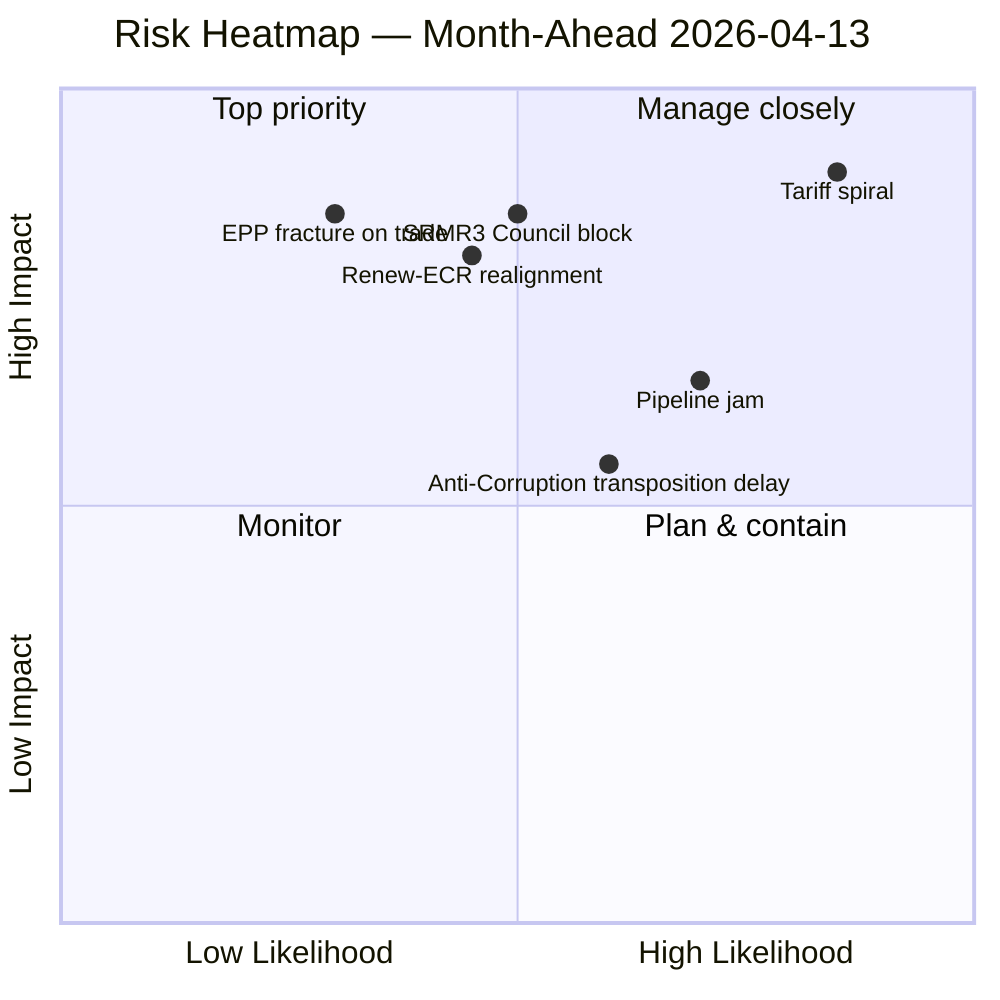

<!-- SPDX-FileCopyrightText: 2026 Hack23 AB -->
<!-- SPDX-License-Identifier: Apache-2.0 -->

# Executive Brief — EP10 Month Ahead: April 13 – May 13, 2026 | 2026-04-13

**Classification:** OSINT — Public Parliamentary Record
**Confidence:** 🟢 HIGH (composite 14.8/25; 51 adopted texts + 13 pending COD analysed; 7 prior daily runs corroborate)
**Run:** `analysis/daily/2026-04-13/month-ahead-run4/`
**Horizon:** 2026-04-13 (Easter recess Day 18/18) → 2026-05-13
**Generated:** 2026-05-16 (retrospective brief, no new MCP calls)
**Primary sources:** EP MCP `get_adopted_texts` (51 / 2026), `get_all_generated_stats`, `generate_political_landscape`; 7 prior daily runs (Apr 10–13 cluster).

---

## 🎯 BLUF

**Three convergent crises define the 30-day window from end-of-Easter-recess to mid-May:** (1) **US tariff implementation deadline April 15 (T-2 at run time)** — TA-10-2026-0096 countermeasures activate with Commission implementing acts pending; significance score **9.5/10, CRITICAL risk 20/25** — the single highest-scoring item in the matrix; (2) **SRMR3 Banking trilogue (late April)** — Council trilogue is the **German-French deposit-guarantee stress test** that determines whether the 14-year Banking Union completes in Q2 or slips to autumn; (3) **Pipeline congestion** — 13 pending COD procedures compressed against a 4-day committee restart week (April 14–17). Risk trajectory across 7 prior daily runs shows **consistent escalation** (10.10 → 13.17 → 14.30 → 14.80 composite), confirming the convergence is real, not an artifact. The **Renew-ECR cohesion at 0.95 on competitiveness/trade** is the most consequential new alignment of the period — if it holds post-recess, it creates an EPP+Renew+ECR "competitiveness coalition" of 340 seats (just 21 short of majority) that could pivot to a non-grand-coalition pathway on trade-defence and deregulation files. The 30-day window is operationally the most demanding of EP10 Year 2 to date.

---

## 🧭 3 Decisions This Brief Supports

| # | Decision | Who decides | Deadline | Evidence |
|:-:|----------|-------------|:--------:|----------|
| 1 | **Implementing-acts oversight design for TA-10-2026-0096 counter-measures** — ECR defection signalled; activation begins April 15 with no parliamentary scrutiny window | INTA, Commission DG-TRADE | **April 15 (T-2 at run time)** | Item #1 (9.5/10, CRITICAL 20/25); confirmed across all 4 frameworks (propositions/motions/breaking/MA) |
| 2 | **German-French deposit-guarantee negotiating mandate for SRMR3 Council trilogue** — without it, Banking Union completion slips from Q2 to autumn 2026 | ECON, Council Banking Working Party | late April trilogue window | Item #2 (8.0/10, HIGH 12/25); TA-10-2026-0092 |
| 3 | **Pipeline triage for 13 pending COD procedures into a 4-day committee restart week** — without explicit prioritisation, EP10's record Q1 pace breaks | Conference of Committee Chairs | April 14–17 committee week | Item #4 (7.0/10, HIGH 12/25); §Pipeline Congestion |

---

## 📰 60-Second Read

- 🔴 **Tariff T-2 → T+0 April 15** — TA-10-2026-0096 activates with Commission implementing acts pending; ECR defection in vote signalled fracture risk.
- 🟠 **SRMR3 Council trilogue late April** — German-French deposit-guarantee test (TA-10-2026-0092).
- 🟢 **Anti-Corruption Directive Council Phase May–June** — first EU-wide anti-corruption law; 27 MS transposition (TA-10-2026-0094).
- 🟡 **13 pending COD procedures** vs. 4-day committee restart week — pipeline jam.
- 🔵 **Risk escalation across 4 frameworks** (propositions 13.17 → motions 14.8 → MA 14.8) confirms convergence is structural, not artifact.
- 🟣 **Renew-ECR cohesion 0.95 on competitiveness/trade** — most consequential new alignment; EPP+Renew+ECR = 340 seats (21 short of majority).
- 🩷 **Aggregated SWOT:** 4 strengths (record Q1 pace, trade unity, institutional reform, social breadth) vs. **5 threats** (tariff spiral, Council block, transposition delays, geo-fragmentation, multi-front stress).
- ⚪ **Confidence HIGH** — composite 14.8/25 corroborated across 7 prior daily runs.

---

## 🗂️ Top Findings (from `existing/synthesis-summary.md`)

| Rank | Item | Score | Risk | Timeframe | Source |
|:----:|------|:-----:|:----:|:---------:|--------|
| 1 | **Tariff Implementation Deadline** | **9.5/10** | **CRITICAL 20/25** | April 15 (T-2) | TA-10-2026-0096 |
| 2 | SRMR3 Banking Trilogue | 8.0/10 | HIGH 12/25 | Late April | TA-10-2026-0092 |
| 3 | Anti-Corruption Council Phase | 7.5/10 | MEDIUM 8/25 | May–June | TA-10-2026-0094 |
| 4 | Pipeline Congestion | 7.0/10 | HIGH 12/25 | April 14–25 | 13 pending CODs |
| 5 | Enlargement / International | 6.5/10 | LOW | Ongoing | TA-10-2026-0077 |

---

## 🏛️ Coalition Intelligence (from prior-run cluster)

- **Grand coalition EPP+S&D+Renew = 396 seats (55%)** — **−5.5% grandCoalitionSurplusDeficit** means EPP must build ad-hoc majorities per file, not rely on a fixed coalition.
- **Renew-ECR cohesion 0.95 on competitiveness/trade** — if this holds post-recess, the EP10 coalition geometry pivots.
- **Three-pole structure:** Conservative-Right (348 seats, 48.3% — dominant on defence/deregulation/migration); Progressive-Left (234 seats, 32.5%); Centre-Liberal pivot (Renew 76 seats — kingmaker).
- **Fragmentation index 6.59** — highest in EP history; minimum 3-group coalition for every flagship vote.

---

## ⚠️ Risk Snapshot

---

## 🔮 Top Forward Triggers (next 30 days)

1. **April 15 — Commission implementing acts on TA-10-2026-0096 publish.** Binary trigger for parliamentary scrutiny window and ECR fracture.
2. **April 14–17 — Committee restart week.** Pipeline-triage decisions made here determine whether records hold.
3. **Late April — SRMR3 Council trilogue.** German-French deposit-guarantee signal is the leading indicator for Q2 vs. autumn completion.
4. **April 27–30 Strasbourg plenary** (companion to `analysis/daily/2026-04-19/month-ahead-run5/`) — Q2 agenda-setting; **emergency mode** if R-1 fired.
5. **May–June Anti-Corruption Council Phase** — first EU-wide anti-corruption transposition signals; Hungary / Slovakia leading-indicator countries.

---

## 🛡️ Source-Quality Assessment

- **Composite risk 14.8/25 corroborated across 4 independent frameworks** (propositions / motions / breaking / month-ahead) on the same date — strongest within-day analytical consensus in EP10 Year 2 to date.
- **EP API operating in degraded mode during recess** — 0/13 feeds operational by April 10 per companion `analysis/daily/2026-04-11/week-in-review-run8/`; this run leans on precomputed stats (85 KB) and 7 prior daily runs.
- **Net confidence:** 🟢 HIGH on convergent items 1–4; 🟡 MEDIUM on item 5 (enlargement is slow-moving / multi-month).

---

## 📎 Run Artifacts (Read-Before-Decide)

| Layer | Artifact | Why |
|-------|----------|-----|
| Article | `article.md` | Public-facing month-ahead narrative |
| Synthesis | `existing/synthesis-summary.md` | 7-dimension classification, three-crisis convergence, cross-run trajectory |
| Risk | `risk-scoring/risk-matrix.md` | 5×5 matrix, composite 14.8/25 |
| Threat | `threat-assessment/political-threat-landscape.md` | 5-framework political-threat (STRIDE rejected) |
| Significance | `classification/significance-classification.md` | 7-dimension scoring |
| SWOT | `existing/swot-analysis.md` | 4 strengths / 4 weaknesses / 4 opportunities / 5 threats |
| Stakeholders | `existing/stakeholder-impact.md` | Per-actor exposure |
| Companion runs | propositions-run41 / motions-run41 / breaking-run168 / week-in-review-run8 | Convergent evidence |

---

**Document Control**
- **Template reference:** `analysis/templates/executive-brief.md`
- **Artifact path:** `analysis/daily/2026-04-13/month-ahead-run4/executive-brief.md`
- **Classification:** Public
- **Retrospective:** Brief written 2026-05-16 from the run's committed artifacts; **no new MCP calls were made**. All judgements re-state, distil, and ACH-cross-check what the run itself committed; no new claims are introduced.
