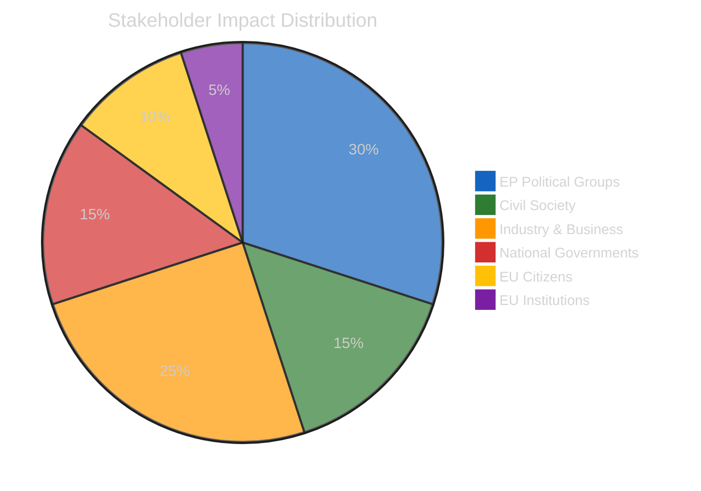

# Stakeholder Impact Analysis — Month-Ahead (April-May 2026)

## Assessment Context

| Field | Value |
|-------|-------|
| **Assessment ID** | STAKE-2026-04-13-MA-RUN4 |
| **Analysis Date** | 2026-04-13 |
| **Preview Period** | 2026-04-13 to 2026-05-13 |
| **Stakeholder Groups** | 6 |
| **Confidence** | HIGH |

## Stakeholder Impact Matrix

## Detailed Stakeholder Analysis

### 1. EP Political Groups

#### EPP (188 seats, 26.1 percent)

| Dimension | Assessment |
|-----------|-----------|
| **Impact Direction** | Mixed |
| **Severity** | HIGH |
| **Position** | Legislative driver on trade, banking, anti-corruption |

EPP enters the month as primary legislative architect. The group championed tariff countermeasures (TA-10-2026-0096) despite ECR defection from the centre-right bloc. Banking reform SRMR3 tests EPP fiscal policy coherence between German conservative members favoring fiscal discipline and Southern European members seeking deposit insurance. Anti-corruption strengthens EPP's institutional credibility post-Qatargate.

**Month-Ahead Risk**: ECR defection on trade creates precedent for issue-specific opposition from within the centre-right. If ECR expands defection to banking or digital policy, EPP must seek alternative coalitions.

#### S&D (136 seats, 18.9 percent)

| Dimension | Assessment |
|-----------|-----------|
| **Impact Direction** | Positive |
| **Severity** | MEDIUM |
| **Position** | Social agenda champion, anti-corruption co-driver |

S&D benefits from the month-ahead agenda alignment. Workers' rights (TA-10-2026-0050), housing crisis (TA-10-2026-0064), and EU Talent Pool (TA-10-2026-0058) are core S&D priorities now in implementation. Anti-corruption directive gives strong campaign narrative. Trade unity with EPP strengthens grand coalition positioning.

**Month-Ahead Risk**: Potential friction with EPP on tariff implementation scope if economic effects create social hardship requiring emergency measures.

#### ECR (78 seats, 10.8 percent)

| Dimension | Assessment |
|-----------|-----------|
| **Impact Direction** | Negative |
| **Severity** | HIGH |
| **Position** | Trade dissenter, ideological stress test |

ECR is the most exposed group. Free-trade ideology conflicts with EU retaliatory tariffs. The group broke with EPP on TA-10-2026-0096, marking the first significant centre-right fracture in EP10. The Renew-ECR competitiveness alliance (0.95 cohesion) faces its first crisis test: will ECR maintain free-trade principles or realign with EU solidarity?

**Month-Ahead Risk**: HIGHEST among all groups. Multiple policy fronts create ideological tension. Banking reform, digital regulation, and trade policy each test different aspects of ECR identity.

#### Renew (77 seats, 10.7 percent)

| Dimension | Assessment |
|-----------|-----------|
| **Impact Direction** | Mixed |
| **Severity** | MEDIUM |
| **Position** | Coalition swing vote, banking reform advocate |

Renew sits at the intersection of liberal free-trade instincts and pro-EU solidarity. Banking reform SRMR3 aligns with financial integration agenda. Anti-corruption strengthens institutional reform narrative. But trade tariffs create tension between economic liberalism and EU collective response.

#### Greens/EFA (53 seats, 7.4 percent)

| Dimension | Assessment |
|-----------|-----------|
| **Impact Direction** | Positive |
| **Severity** | LOW |
| **Position** | Niche influence on digital, environmental, human rights |

Greens benefit from digital sovereignty (TA-10-2026-0022), fisheries management (TA-10-2026-0067), and heavy-duty vehicle emissions (TA-10-2026-0084). Peripheral on trade/banking main events but consistent on human rights dossiers (Georgia, Iran, Uganda).

#### PfE and The Left (Combined 13 percent)

| Dimension | Assessment |
|-----------|-----------|
| **Impact Direction** | Negative |
| **Severity** | LOW |
| **Position** | Opposition dynamics, sovereignty critique |

PfE opposes anti-corruption on sovereignty grounds. The Left opposes banking reform framework as insufficient. Neither group has blocking capacity but both shape debate margins.

### 2. Civil Society and NGOs

| Dimension | Assessment |
|-----------|-----------|
| **Impact Direction** | Positive |
| **Severity** | MEDIUM |

Anti-corruption directive (TA-10-2026-0094) is a major win for transparency organizations (Transparency International, Integrity Watch). Copyright/AI text (TA-10-2026-0066) closely watched by tech advocacy. Housing crisis resolution strengthens tenant advocacy groups. Package travel protections benefit consumer organizations.

### 3. Industry and Business

| Dimension | Assessment |
|-----------|-----------|
| **Impact Direction** | Mixed |
| **Severity** | HIGH |

Tariff countermeasures create winners (import-competing industries) and losers (EU exporters to US). Banking reform increases compliance burden but improves long-term stability. EGF mobilization for Audi Belgium (TA-10-2026-0038) and Tupperware Belgium (TA-10-2026-0073) signals ongoing industrial restructuring. EU Talent Pool affects employer recruitment.

### 4. National Governments

| Dimension | Assessment |
|-----------|-----------|
| **Impact Direction** | Mixed |
| **Severity** | MEDIUM |

Tariff implementation requires Commission-MS cooperation. Some states (Hungary, Austria) may resist trade escalation. Anti-corruption 24-month transposition tests all 27 MS criminal codes. Banking Union deposit guarantee is primarily a German-French bilateral dynamic. Enlargement texts affect candidate state relations.

### 5. EU Citizens

| Dimension | Assessment |
|-----------|-----------|
| **Impact Direction** | Positive |
| **Severity** | MEDIUM |

Housing crisis resolution (TA-10-2026-0064) directly impacts urban populations across the EU. Air passenger rights (TA-10-2026-0009) improves travel protections. EU Talent Pool (TA-10-2026-0058) creates labor mobility opportunities. Anti-corruption improves governance quality. Tariff effects may increase consumer prices on some goods.

### 6. EU Institutions

| Dimension | Assessment |
|-----------|-----------|
| **Impact Direction** | Mixed |
| **Severity** | HIGH |

Commission faces implementation overload from record Q1 output. Council must position on banking trilogue and anti-corruption. ECB appointments give Parliament influence lever. Court of Justice Mercosur opinion request creates judicial precedent path.
