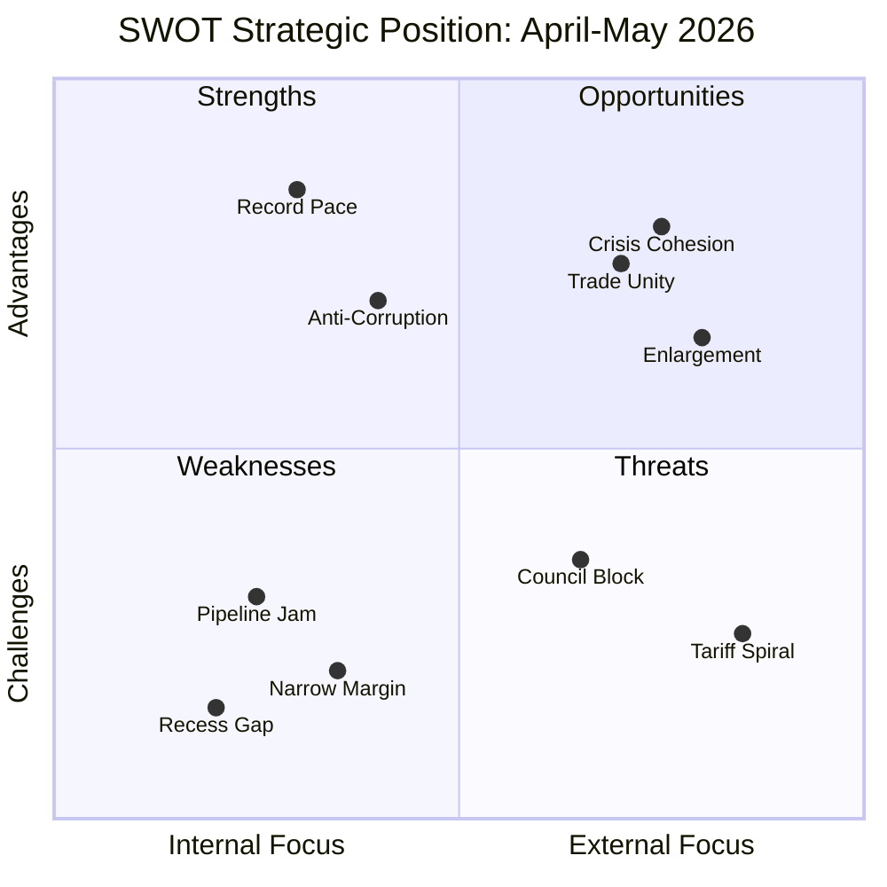

# SWOT Analysis — Month-Ahead (April-May 2026)

## SWOT Context

| Field | Value |
|-------|-------|
| **Assessment ID** | SWOT-2026-04-13-MA-RUN4 |
| **Analysis Period** | 2026-04-13 to 2026-05-13 |
| **Confidence** | HIGH |
| **Data Sources** | 51 adopted texts, precomputed stats, political landscape, prior analysis |

## SWOT Matrix

## Strengths

### S1: Record Legislative Momentum — Severity HIGH

The European Parliament has adopted 114 legislative acts in 2026 (projected), a 46 percent increase over 2025's 78 acts and 34 percent above the previous EP6 record of 85 acts. This demonstrates that EP10's fragmented 8-group structure can produce at unprecedented rates when focused. Committee meetings (2,363 projected) are at an all-time high, and parliamentary questions (6,147) show high engagement levels.

**Evidence**: Precomputed stats 2004-2026. EP10 Q1 pace exceeds all prior terms. Confidence HIGH.

### S2: Grand Coalition Trade Unity

Despite ECR dissent, the grand coalition (EPP+S&D+Renew) held together on the tariff countermeasures vote (TA-10-2026-0096, adopted March 26). Greens/EFA also voted in favor, creating a 65 percent supermajority. This demonstrates that external pressure can override internal policy differences. The speed of legislative response (proposal to adoption in under 4 weeks) is the fastest trade action in EP history.

**Evidence**: TA-10-2026-0096 adoption, coalition dynamics analysis showing grand coalition at 55 percent + Greens at 10 percent. Confidence HIGH.

### S3: Institutional Reform Credibility

Parliament's adoption of the anti-corruption directive (TA-10-2026-0094) as the first EU-wide anti-corruption legislation represents post-Qatargate institutional follow-through. Combined with SRMR3 banking reform (TA-10-2026-0092), Parliament demonstrates capacity for structural reform alongside crisis response. The ECB appointments (TA-10-2026-0060, TA-10-2026-0033) show effective use of parliamentary appointment powers.

**Evidence**: TA-10-2026-0094, TA-10-2026-0092. Confidence HIGH.

### S4: Comprehensive Social Agenda

Beyond crisis management, Parliament has advanced housing (TA-10-2026-0064), workers' rights (TA-10-2026-0050), EU Talent Pool (TA-10-2026-0058), air passenger rights (TA-10-2026-0009), and humanitarian aid (TA-10-2026-0005). This breadth demonstrates legislative capacity across multiple policy domains simultaneously.

**Evidence**: 6 adopted texts across different social policy domains in Q1 2026. Confidence HIGH.

## Weaknesses

### W1: Pipeline Congestion Risk — Severity HIGH

Thirteen new COD procedures await post-recess committee assignment. Key committees (ECON, INTA, LIBE) face 3-4 concurrent dossiers each. The record Q1 output creates follow-through pressure: each adopted text requires implementation monitoring, Council coordination, and potential conciliation. Historical patterns show post-recess productivity drops 15 percent in the first two weeks.

**Evidence**: Precomputed stats, 13 pending CODs. Confidence HIGH.

### W2: Narrow Grand Coalition Margin — Severity MEDIUM

The grand coalition (EPP 38 percent + S&D 22 percent + Renew 5 percent = 65 percent on paper, but effective voting margin closer to 55 percent after absences and defections) is the thinnest governing majority in EP history. With 8 active political groups and a fragmentation index of 6.59 (record), every vote requires active coalition management.

**Evidence**: Political landscape data, fragmentation index. Confidence HIGH.

### W3: Easter Recess Calendar Vulnerability — Severity MEDIUM

The 18-day Easter recess (March 27 to April 13) created a legislative vacuum immediately before the April 15 tariff deadline. Parliament returns on April 14 with zero buffer for legislative response. This calendar management vulnerability exposes the institution to external timing pressure.

**Evidence**: Parliamentary calendar, tariff deadline timing. Confidence HIGH.

### W4: Digital Policy Cross-Party Fractures — Severity LOW

The copyright and AI text (TA-10-2026-0066) and digital sovereignty resolution (TA-10-2026-0022) revealed cross-party divisions that do not follow traditional left-right lines. Tech regulation creates unusual alliances and opposition patterns that complicate coalition building.

**Evidence**: TA-10-2026-0066, TA-10-2026-0022. Confidence MEDIUM.

## Opportunities

### O1: Crisis-Driven EU Cohesion — Severity HIGH

US trade pressure creates a rally-around-the-flag effect. The Commission is seeking emergency coordination with Parliament. External crises historically strengthen EU institutional cohesion. If managed well, the tariff crisis could accelerate decision-making on banking reform and other pending dossiers by concentrating political will.

**Evidence**: Historical pattern from 2018 trade crisis, 2020 COVID response. Confidence MEDIUM.

### O2: Anti-Corruption Narrative Advantage — Severity MEDIUM

Parliament positions itself as the EU's transparency champion. The anti-corruption directive gives MEPs campaign material for national constituencies. Post-Qatargate institutional reform narrative strengthens public trust. The May-June Council phase offers Parliament additional visibility.

**Evidence**: TA-10-2026-0094, public opinion trends. Confidence MEDIUM.

### O3: Banking Union Acceleration — Severity MEDIUM

SRMR3 adoption gives Parliament a strong negotiating position. ECB pressure for completion and financial stability concerns may push Council toward trilogue compromise. The German federal election outcome could shift the deposit guarantee calculus.

**Evidence**: TA-10-2026-0092, ECB Vice-President appointment leverage. Confidence MEDIUM.

### O4: Enlargement Integration Momentum — Severity LOW

EU enlargement strategy (TA-10-2026-0077), Montenegro and Albania accession texts (TA-10-2026-0054, TA-10-2026-0055), Ukraine loan (TA-10-2026-0010), and EU-Canada cooperation (TA-10-2026-0078) demonstrate forward-looking international engagement.

**Evidence**: Multiple adopted texts on enlargement and international cooperation. Confidence HIGH.

## Threats

### T1: Tariff Escalation Spiral — Severity CRITICAL

April 15 deadline may trigger US retaliation exceeding EU countermeasures. Economic disruption potential is significant. Parliament has limited tools once Commission implements tariffs. Escalation could dominate 2-3 weeks of parliamentary time.

**Evidence**: TA-10-2026-0096 implementation timeline, US trade rhetoric. Confidence MEDIUM.

### T2: Council Banking Reform Blockage — Severity HIGH

German-French deposit guarantee disagreement has persisted since 2015. Council may delay trilogue mandate. Without Banking Union completion, financial stability risks persist. SRMR3 could follow DGSD2 into extended negotiation.

**Evidence**: Council negotiation history, German fiscal policy positions. Confidence MEDIUM.

### T3: Transposition Implementation Deficit — Severity MEDIUM

Twenty-seven member states must amend criminal codes for anti-corruption within 24 months. Historical patterns suggest 60 percent compliance at deadline. States with weaker rule-of-law records face greater challenges.

**Evidence**: Historical transposition data, MS governance indices. Confidence HIGH.

### T4: Geopolitical Attention Fragmentation — Severity MEDIUM

Ukraine, US trade, Mercosur, Georgia, Iran, Syria, Uganda all competing for committee attention. AFET, DEVE, and INTA face impossible prioritization. Risk of strategic dilution across too many foreign policy fronts.

**Evidence**: 7 foreign policy adopted texts in Q1 2026. Confidence HIGH.

### T5: Coalition Multi-Front Stress — Severity MEDIUM

Trade, banking, digital, and social dossiers create four separate potential fracture lines for the grand coalition. ECR defection on trade established precedent for issue-specific opposition. PfE sovereignty stance on anti-corruption adds fifth pressure point.

**Evidence**: ECR vote pattern, fragmentation analysis. Confidence MEDIUM.

## SWOT Balance Assessment

| Dimension | Count | Dominant Severity |
|-----------|:-----:|:----------------:|
| Strengths | 4 | HIGH |
| Weaknesses | 4 | MEDIUM |
| Opportunities | 4 | MEDIUM |
| Threats | 5 | HIGH |

**Strategic Position**: NET POSITIVE with ELEVATED RISK. Parliament enters the month from a position of legislative strength (record output, institutional reform credibility) but faces concentrated external pressure (tariffs, Council resistance) and internal fragility (narrow coalition margin, pipeline congestion). The key variable is whether crisis-driven cohesion (O1) outweighs multi-front stress (T5).
