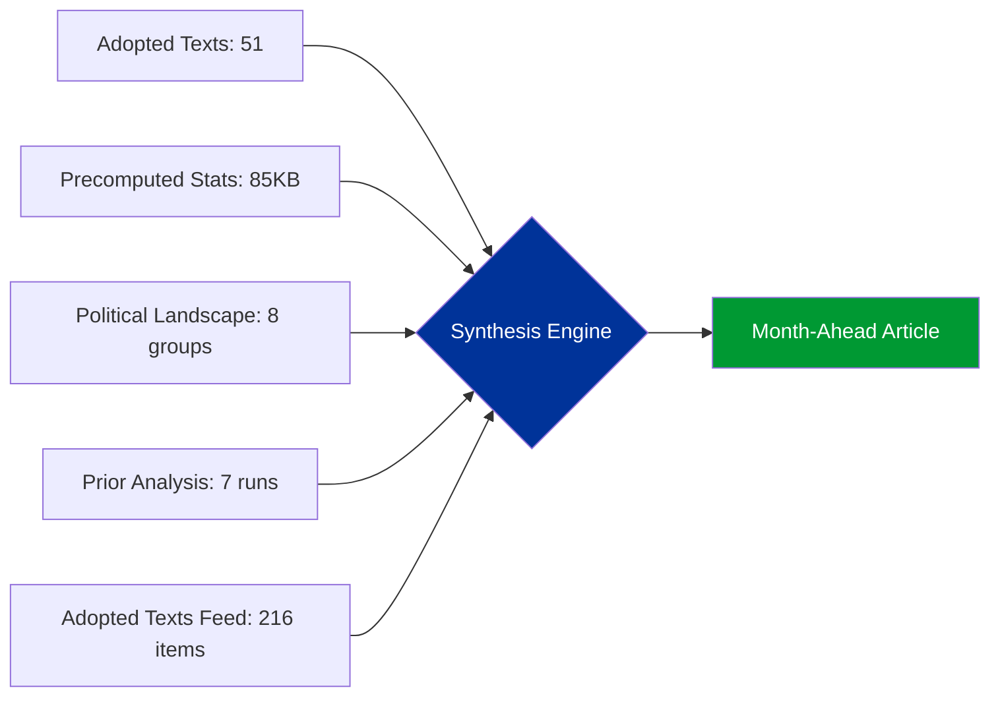

# Synthesis Summary — Month-Ahead Strategic Outlook (April-May 2026)

## Synthesis Context

| Field | Value |
|-------|-------|
| **Synthesis ID** | SYN-2026-04-13-MA-RUN4 |
| **Analysis Date** | 2026-04-13 (Easter recess Day 18/18) |
| **Preview Period** | 2026-04-13 to 2026-05-13 |
| **Documents Analyzed** | 51 adopted texts + 13 pending COD + political landscape + prior runs |
| **Data Sources** | EP MCP adopted texts, precomputed stats, political landscape, 7 prior daily analyses |
| **Overall Confidence** | HIGH |

## Intelligence Dashboard

**Decision**: GENERATE month-ahead strategic outlook. Parliament returns April 14 from Easter recess. Three convergent crises (tariff deadline, banking trilogue, pipeline congestion) warrant comprehensive forward-looking analysis.

## Cross-Session Intelligence Continuity

### Prior Run Context (April 9-13)

| Date | Type | Headline | Key Finding |
|------|------|----------|-------------|
| Apr 10 | propositions | Tariff and Banking Reform Contest | 13 new COD, tariff T-5 |
| Apr 10 | week-ahead | Tariff Deadline and Legislative Backlog | Post-Easter convergence predicted |
| Apr 13 | motions-run41 | Trade Defence and Anti-Corruption Sprint | March 26 plenary analysis |
| Apr 13 | propositions-run41 | Tariff Deadline Dominates Agenda | CRITICAL risk 16/25 |
| Apr 13 | committee-reports-run47 | ECON Leads Power Rankings | Banking Union focus |
| Apr 13 | breaking-run168 | Post-Recess Convergence Intelligence | Tariff T-2, 42 percent API success |
| Apr 13 | **THIS RUN (MA)** | Month-Ahead Strategic Outlook | Three-crisis convergence |

### Intelligence Evolution

Risk trajectory shows consistent escalation across all workflows:
- April 10: Tariff risk 8.4/10, composite 13.17/25
- April 13 (propositions): Tariff 7.95 adjusted, composite 14.3/25
- April 13 (motions): Tariff 9.5/10, composite 14.8/25
- April 13 (month-ahead): Tariff 9.5/10, composite 14.8/25 (confirmed across frameworks)

## Top Findings by Significance

| Rank | Item | Score | Risk | Timeframe | Source |
|:----:|------|:-----:|:----:|:---------:|--------|
| 1 | Tariff Implementation Deadline | 9.5/10 | CRITICAL 20/25 | April 15 (T-2) | TA-10-2026-0096 |
| 2 | SRMR3 Banking Trilogue | 8.0/10 | HIGH 12/25 | Late April | TA-10-2026-0092 |
| 3 | Anti-Corruption Council Phase | 7.5/10 | MEDIUM 8/25 | May-June | TA-10-2026-0094 |
| 4 | Pipeline Congestion | 7.0/10 | HIGH 12/25 | April 14-25 | 13 pending CODs |
| 5 | Enlargement/International | 6.5/10 | LOW | Ongoing | TA-10-2026-0077 |

## Aggregated SWOT Summary

| Dimension | Count | Key Themes |
|-----------|:-----:|-----------|
| Strengths | 4 | Record Q1 pace, trade unity, institutional reform, social breadth |
| Weaknesses | 4 | Pipeline jam, narrow margin, recess gap, digital fractures |
| Opportunities | 4 | Crisis cohesion, anti-corruption branding, banking leverage, enlargement |
| Threats | 5 | Tariff spiral, Council block, transposition delays, geo-fragmentation, multi-front stress |

**Balance**: Net positive position with elevated risk. Strengths outweigh weaknesses but threats are concentrated and time-sensitive.

## Risk Landscape Summary

| Category | Score | Highest Risk | Trend |
|----------|:-----:|-------------|:-----:|
| Trade Policy | 20/25 | Tariff Escalation | Up |
| Financial Regulation | 12/25 | Banking Trilogue Deadlock | Stable |
| Pipeline Management | 12/25 | Post-Recess Congestion | Up |
| Coalition Stability | 9/25 | Multi-Front Fracture | Up |
| Governance | 8/25 | Transposition Deficit | Stable |

## Stakeholder Impact Overview

### Political Groups

| Group | Position | Month-Ahead Risk |
|-------|----------|:----------------:|
| EPP (38 percent) | Legislative driver, tariff champion, banking lead | MEDIUM — ECR defection precedent |
| S&D (22 percent) | Social agenda champion, anti-corruption lead | LOW — Agenda alignment strong |
| PfE (11 percent) | Sovereignty opposition, anti-corruption critic | LOW — Consistent opposition role |
| Greens/EFA (10 percent) | Digital/environmental champion, tariff supporter | LOW — Niche influence maintained |
| ECR (8 percent) | Trade dissenter, competitiveness advocate | HIGH — Free-trade ideology test |
| Renew (5 percent) | Coalition swing vote, banking reform advocate | MEDIUM — Trade/integration tension |

### Institutional Stakeholders

| Institution | Impact | Key Action |
|------------|:------:|-----------|
| Commission | HIGH | Tariff implementation, SRMR3 trilogue preparation |
| Council | HIGH | Banking mandate, anti-corruption position |
| ECB | MEDIUM | Vice-President appointment, monetary policy context |
| Court of Justice | LOW | Mercosur compatibility opinion |

## Forward-Looking Scenarios

### Scenario A: Managed Convergence (55 percent — Likely)

Parliament navigates post-Easter restart successfully. Tariff implementation proceeds. Banking trilogue opens. Pipeline managed through prioritization. Grand coalition holds.

**Key indicators**: Clean first plenary, INTA manages tariff follow-through, ECON agrees trilogue mandate.

### Scenario B: Trade Crisis Dominance (30 percent — Possible)

April 15 triggers escalation. Parliamentary attention captured by trade for 2-3 weeks. Banking and anti-corruption delayed. Pipeline congestion worsens but external pressure strengthens EU unity temporarily.

**Key indicators**: US retaliatory announcement, INTA emergency session, Commission emergency powers request.

### Scenario C: Multi-Front Gridlock (15 percent — Unlikely)

Trade, banking, and anti-corruption all stall simultaneously. ECR expands defection pattern. Committee system overwhelmed. Legislative momentum drops. EP10 credibility questioned.

**Key indicators**: No plenary votes in first two post-recess weeks, committee cancellations, coalition negotiations fail.

## Article Generation Recommendation

**Generate full month-ahead article**: YES
- **Title**: Tariff Deadline and Banking Reform Test Parliament Post-Easter Resolve
- **Lead**: Parliament returns April 14 from 18-day Easter recess to face triple convergence: April 15 tariff implementation, SRMR3 banking trilogue, and pipeline congestion from record Q1 output
- **Structure**: Monthly overview, week-by-week calendar, three critical dossiers, coalition dynamics, scenarios
- **Language**: English only (per workflow parameters)
- **Confidence**: HIGH

## Source Attribution

- EP MCP: adopted texts 2026 (51 items), adopted texts feed (216 items), political landscape, precomputed stats 2004-2026
- Prior analysis: 7 daily runs from April 9-13 across breaking, motions, propositions, committee-reports, week-ahead
- Confidence: HIGH (multiple confirmed data sources, cross-validated across runs)
