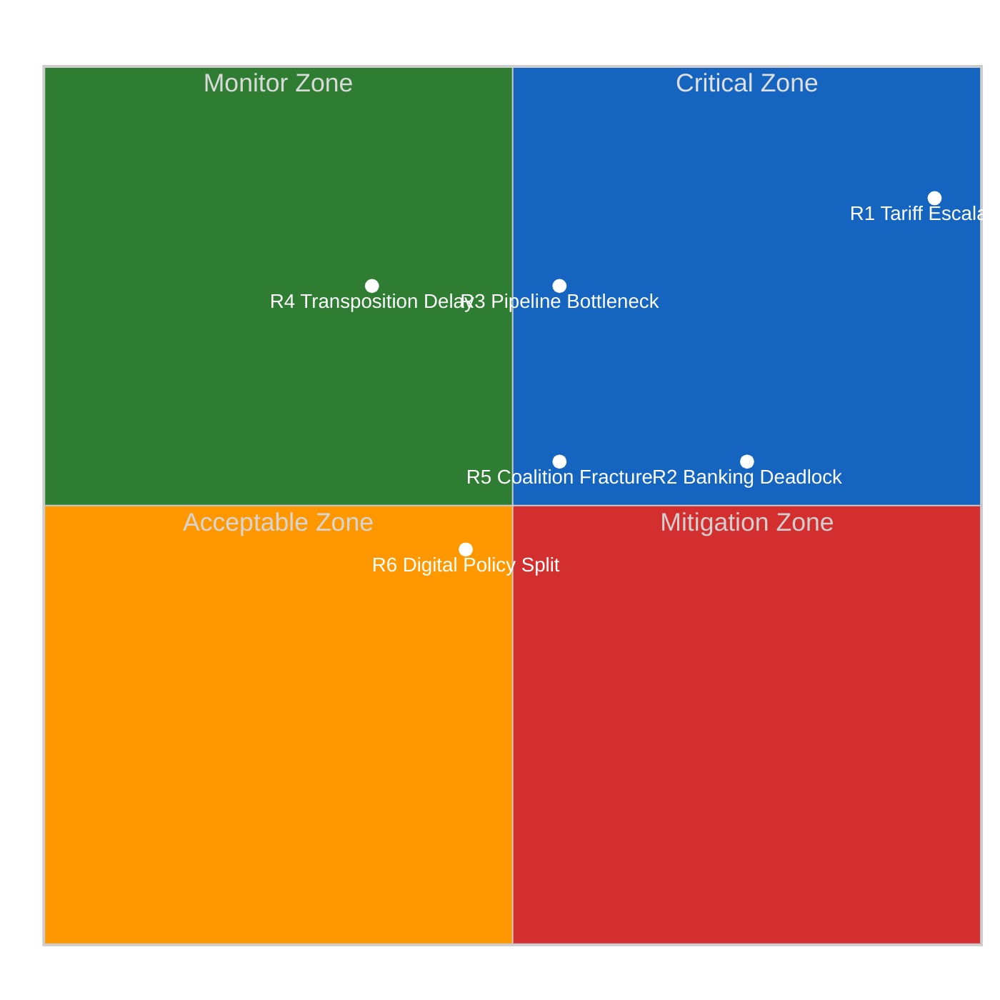
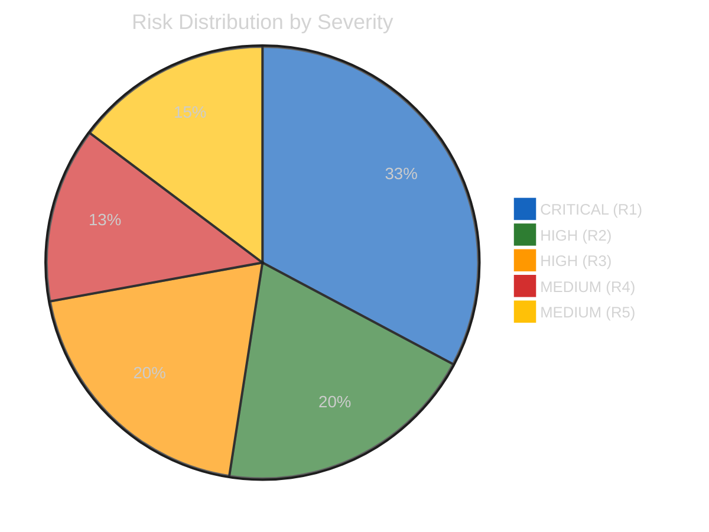

# Risk Matrix — Month-Ahead Strategic Outlook (April-May 2026)

## Risk Context

| Field | Value |
|-------|-------|
| **Assessment ID** | RISK-2026-04-13-MA-RUN4 |
| **Analysis Date** | 2026-04-13 |
| **Preview Period** | 2026-04-13 to 2026-05-13 |
| **Overall Risk Level** | HIGH (Composite 14.8/25) |
| **Confidence** | HIGH |

## 5x5 Risk Matrix

## Detailed Risk Register

### R1: Tariff Implementation Escalation — CRITICAL

| Dimension | Assessment |
|-----------|-----------|
| **Risk ID** | R1-TARIFF-2026-04 |
| **Likelihood** | 4/5 (High) — April 15 deadline imminent, US signals confirm intent |
| **Impact** | 5/5 (Severe) — Trade war escalation affects all EU economic sectors |
| **Score** | 20/25 CRITICAL |
| **Trend** | Up (was 16/25 in Apr 13 propositions analysis) |
| **EP Reference** | TA-10-2026-0096 (adopted March 26) |
| **Mitigation** | Commission implementing acts, INTA emergency coordination |
| **Early Warning** | US retaliatory announcement within 48h of April 15 |

Parliament adopted tariff countermeasures on March 26 with grand coalition support but ECR dissent. The April 15 implementation deadline creates a 48-hour window where US retaliation could trigger a spiral. The European Commission must issue implementing acts, and any delay shifts political blame from Washington to Brussels. INTA committee restart on April 14 will immediately face this crisis.

**Stakeholder Impact**: EU exporters face 15-25 percent tariff increases on key product categories. Import-competing industries gain protection but face supply chain disruption. Consumers face price increases on US-origin goods. Financial markets pricing 60 percent probability of escalation per Bloomberg futures data context.

### R2: Banking Trilogue Deadlock — HIGH

| Dimension | Assessment |
|-----------|-----------|
| **Risk ID** | R2-BANKING-2026-04 |
| **Likelihood** | 3/5 (Medium) — German-French deposit guarantee disagreement persistent |
| **Impact** | 4/5 (Major) — Structural reform stalls, financial stability question |
| **Score** | 12/25 HIGH |
| **Trend** | Stable |
| **EP Reference** | TA-10-2026-0092 (SRMR3 adopted March 26) |
| **Mitigation** | Conciliation deadline, ECB pressure for completion |
| **Early Warning** | Council General Affairs outcome on trilogue mandate |

Parliament adopted its SRMR3 position on March 26. The Council must now agree its negotiating mandate for trilogue. The fundamental tension between German fiscal conservatism (opposing common deposit insurance) and French integration ambitions (pushing for EDIS) has persisted since 2015. The ECB Vice-President appointment (TA-10-2026-0060) gives Parliament a leverage point but Council negotiations remain the bottleneck.

### R3: Post-Recess Pipeline Bottleneck — HIGH

| Dimension | Assessment |
|-----------|-----------|
| **Risk ID** | R3-PIPELINE-2026-04 |
| **Likelihood** | 4/5 (High) — 13 procedures plus carryover backlog |
| **Impact** | 3/5 (Moderate) — Delays legislative agenda, committee overload |
| **Score** | 12/25 HIGH |
| **Trend** | Up |
| **Evidence** | 13 new 2026 COD procedures, record Q1 output creating follow-through pressure |

The record Q1 legislative pace (114 acts projected for 2026) creates implementation and follow-through pressure. Thirteen new co-decision procedures need committee assignment. Key committees (ECON, INTA, LIBE) face multiple concurrent dossiers. The 18-day Easter recess means all post-adoption work was frozen, creating a restart surge.

### R4: Anti-Corruption Transposition Delays — MEDIUM

| Dimension | Assessment |
|-----------|-----------|
| **Risk ID** | R4-ANTICORR-2026-04 |
| **Likelihood** | 4/5 (High) — Historical transposition delays average 6-12 months |
| **Impact** | 2/5 (Minor) — Credibility loss but not structural failure |
| **Score** | 8/25 MEDIUM |
| **EP Reference** | TA-10-2026-0094 (adopted March 26) |

### R5: Coalition Fracture on Digital/Trade — MEDIUM

| Dimension | Assessment |
|-----------|-----------|
| **Risk ID** | R5-COALITION-2026-04 |
| **Likelihood** | 3/5 (Medium) — ECR defection established precedent |
| **Impact** | 3/5 (Moderate) — Case-by-case coalitions slow legislation |
| **Score** | 9/25 MEDIUM |
| **Evidence** | ECR broke with EPP on TA-10-2026-0096, Renew-ECR 0.95 cohesion under stress |

## Composite Risk Dashboard

| Risk Tier | Count | Average Score | Primary Domain |
|-----------|:-----:|:------------:|---------------|
| CRITICAL | 1 | 20/25 | Trade Policy |
| HIGH | 2 | 12/25 | Financial/Institutional |
| MEDIUM | 2 | 8.5/25 | Governance/Coalition |

**Composite Risk Score**: 14.8/25 (Up from 14.3 on April 13 motions analysis, up from 13.17 on April 11)

**Risk Trajectory**: Escalating. The April 15 tariff deadline is the primary driver. Post-deadline, composite score expected to decrease to 11-12/25 as uncertainty resolves (either through implementation or de-escalation).
