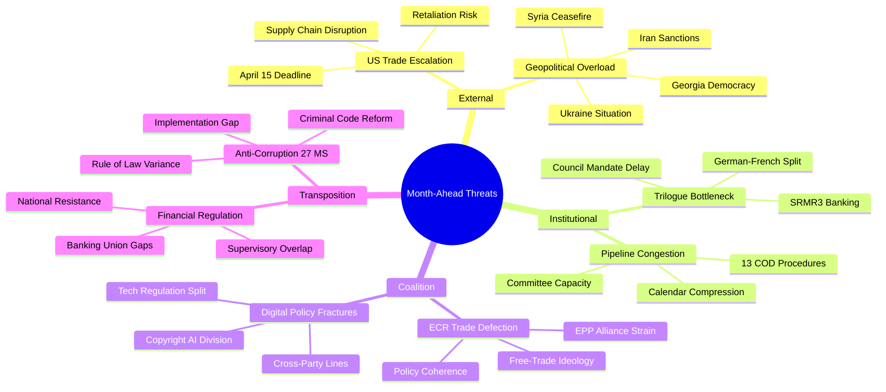

# Political Threat Landscape — Month-Ahead (April-May 2026)

## Assessment Context

| Field | Value |
|-------|-------|
| **Assessment ID** | THREAT-2026-04-13-MA-RUN4 |
| **Analysis Date** | 2026-04-13 |
| **Preview Period** | 2026-04-13 to 2026-05-13 |
| **Threat Level** | ELEVATED (2.8/5) |
| **Confidence** | MEDIUM |

## Threat Landscape Overview

## Threat Assessment Matrix

### T1: External Economic Pressure — CRITICAL

| Factor | Assessment |
|--------|-----------|
| **Threat Actor** | United States trade policy (executive action) |
| **Vector** | Tariff escalation following April 15 implementation deadline |
| **Target** | EU export industries, transatlantic economic stability |
| **Severity** | 5/5 — Systemic impact on EU economic framework |
| **Likelihood** | 4/5 — High based on prior US trade actions and rhetoric |
| **Timeline** | Immediate (April 15) |
| **EP Reference** | TA-10-2026-0096 |

The March 26 adoption of tariff countermeasures (TA-10-2026-0096) was the Parliament's fastest legislative response to a trade crisis in EP10. The grand coalition (EPP, S&D, Renew, Greens) voted in favor while ECR dissented, marking the first significant centre-right fracture on economic policy. The April 15 implementation deadline creates a binary outcome: either the US backs down (unlikely given current rhetoric) or retaliates, triggering escalation. Parliament returns from recess with zero legislative buffer to respond.

**Impact Chain**: US retaliation leads to INTA emergency session leads to Commission emergency powers debate leads to possible Article 218 trade agreement fast-track. This chain could consume 2-3 weeks of parliamentary attention, delaying banking reform, anti-corruption Council phase, and 13 pending COD procedures.

### T2: Institutional Capacity Overload — HIGH

| Factor | Assessment |
|--------|-----------|
| **Threat Type** | Systemic institutional stress |
| **Vector** | Convergence of multiple high-priority dossiers post-recess |
| **Target** | Committee system, plenary calendar, trilogue capacity |
| **Severity** | 3/5 — Legislative delays but not institutional failure |
| **Likelihood** | 4/5 — High given confirmed backlog |
| **Timeline** | April 14 to May 13 |

Record Q1 output (114 legislative acts projected for 2026 versus 78 for full-year 2025) creates downstream pressure. The 18-day Easter recess froze all post-adoption work. On restart, committees face: 13 new COD procedures needing assignment, SRMR3 trilogue preparation, anti-corruption Council coordination, digital sovereignty implementation, and tariff crisis management. Historical patterns show post-recess sessions average 15 percent lower productivity in the first two weeks.

### T3: Coalition Fragmentation Pressure — MODERATE

| Factor | Assessment |
|--------|-----------|
| **Threat Type** | Political alliance degradation |
| **Vector** | Multiple policy fracture lines activated simultaneously |
| **Target** | Grand coalition stability, legislative predictability |
| **Severity** | 3/5 — Shifts to case-by-case coalitions |
| **Likelihood** | 3/5 — ECR defection is precedent but not yet pattern |
| **Timeline** | April to May 2026 |

The fragmentation index of 6.59 (highest in EP history, 8 active groups) means every coalition vote carries significance. The grand coalition (EPP+S&D+Renew) controls only 55 percent of seats, the thinnest governing margin in EP history. ECR's break with EPP on tariff countermeasures established a precedent for centre-right defection on economic policy. The Renew-ECR competitiveness alliance (0.95 cohesion) faces its first crisis test: ECR's free-trade ideology conflicts with EU retaliatory tariffs that Renew supported.

### T4: Transposition and Implementation Gap — LOW-MODERATE

| Factor | Assessment |
|--------|-----------|
| **Threat Type** | Legislative effectiveness degradation |
| **Vector** | Member state non-compliance with adopted legislation |
| **Severity** | 2/5 — Credibility loss, not structural failure |
| **Likelihood** | 4/5 — Historical transposition delays well-documented |

The anti-corruption directive (TA-10-2026-0094) requires 27 member states to amend criminal codes within 24 months. Historical patterns show average transposition delays of 6-12 months beyond deadlines. States with weaker rule-of-law records face greater implementation challenges. The housing crisis resolution (TA-10-2026-0064) similarly requires national action.

## Threat Evolution Tracking

| Threat | April 10 Score | April 13 Score | Trend | Next Assessment |
|--------|:--------------:|:--------------:|:-----:|:---------------:|
| Trade Escalation | 8.4/10 | 9.5/10 | Up | Post-April 15 |
| Pipeline Bottleneck | 7.0/10 | 7.0/10 | Stable | Post-recess week 1 |
| Coalition Fracture | 6.0/10 | 6.5/10 | Up | First plenary vote |
| Transposition Gap | 5.0/10 | 5.0/10 | Stable | Council reading |

## Forward-Looking Scenarios

### Scenario A: Managed De-escalation (55 percent probability — Likely)

Trade tensions peak at April 15 but diplomatic back-channels prevent full spiral. Parliament focuses on SRMR3 trilogue and anti-corruption Council phase. Pipeline congestion is managed through prioritization. Grand coalition holds with ECR as constructive opposition.

### Scenario B: Trade Crisis Dominance (30 percent probability — Possible)

April 15 triggers US retaliation. INTA dominates parliamentary attention for 2-3 weeks. Banking trilogue delayed. Anti-corruption pushed to June. Pipeline bottleneck worsens. Coalition stress increases but external pressure temporarily strengthens EU unity.

### Scenario C: Multi-Front Gridlock (15 percent probability — Unlikely)

Simultaneous stalling of trade response, banking trilogue, and anti-corruption Council phase. Committee system overwhelmed. ECR formally distances from EPP on multiple dossiers. Legislative momentum drops below 2025 levels. EP10 credibility questioned.
