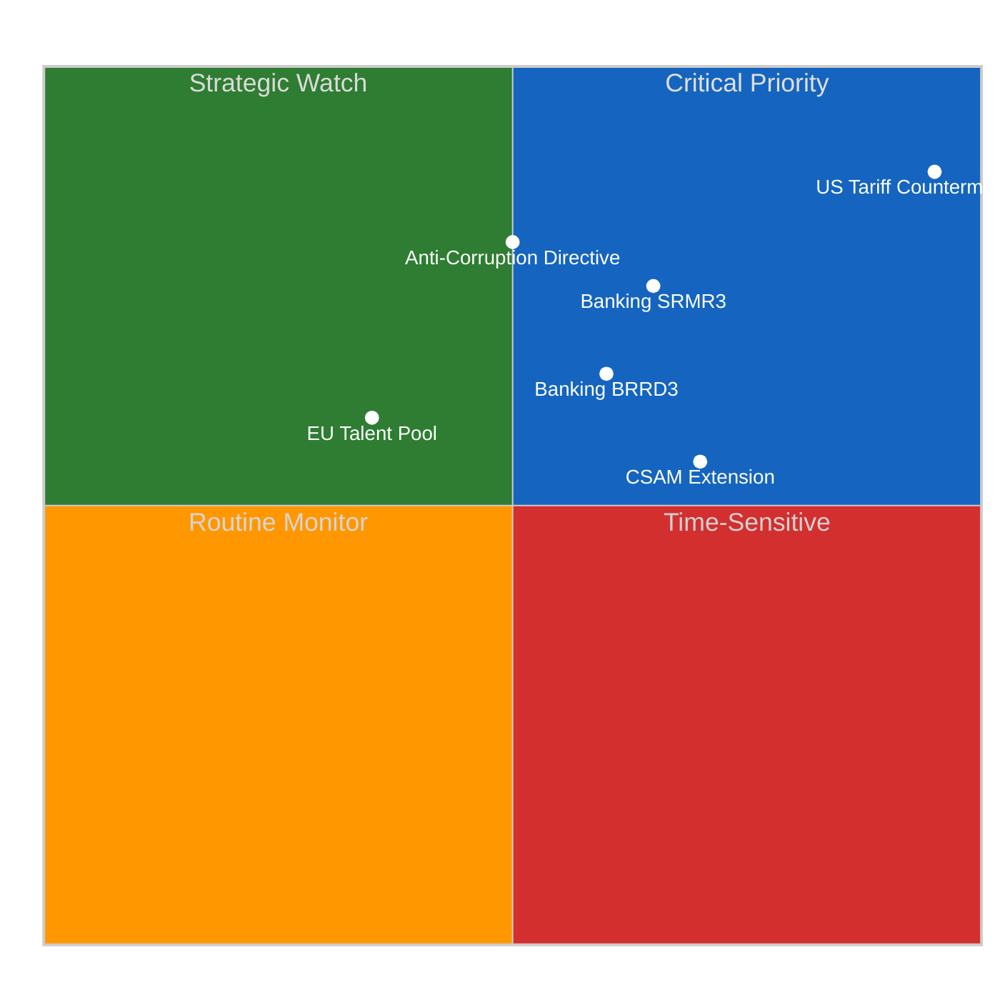
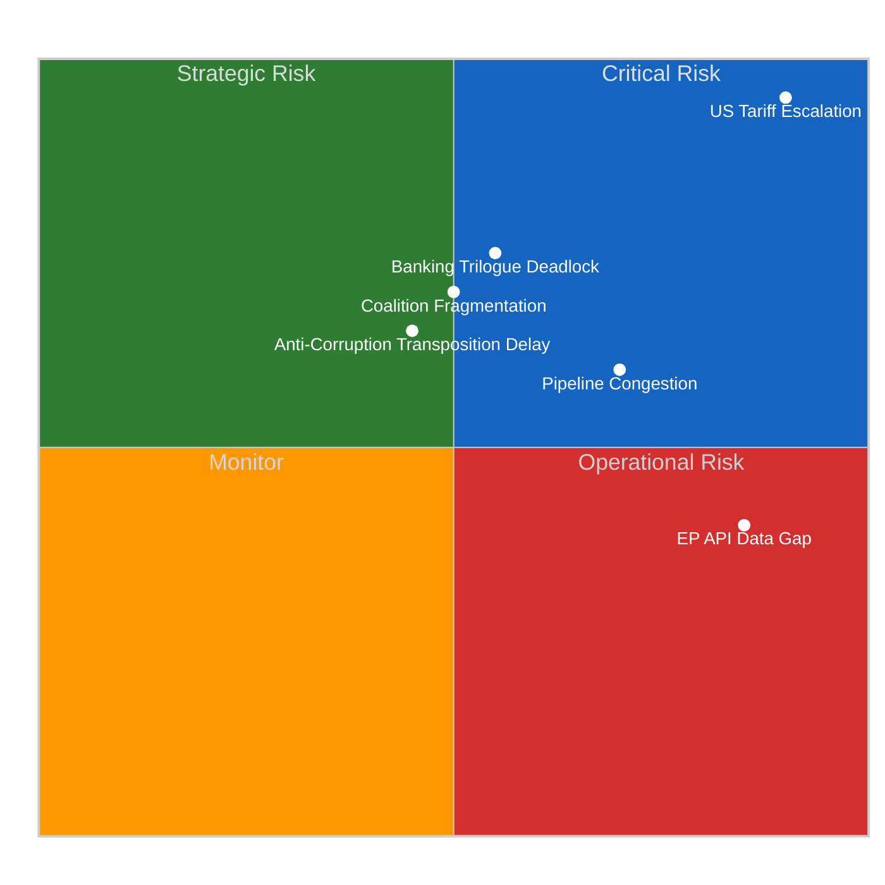
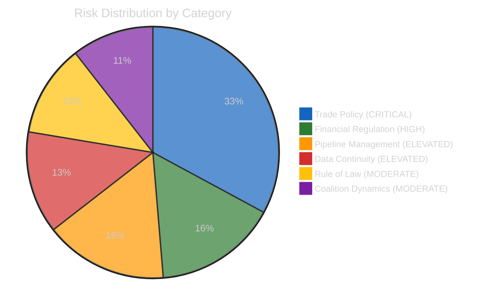
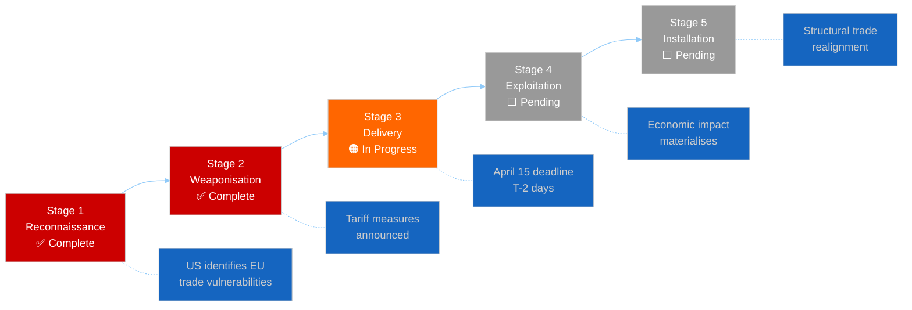
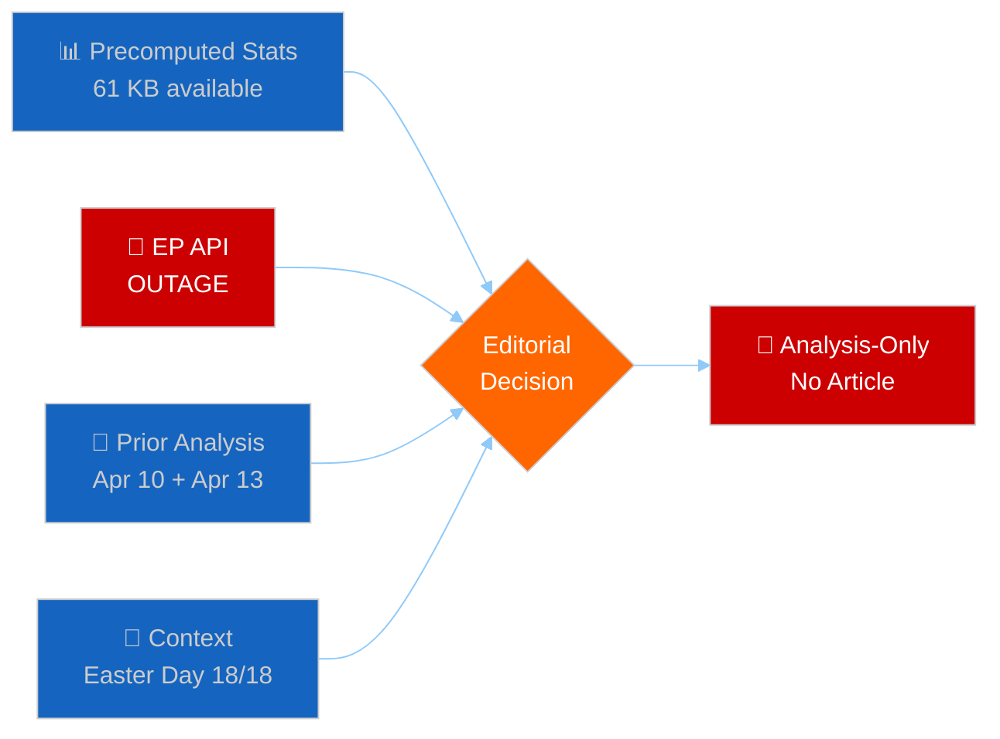
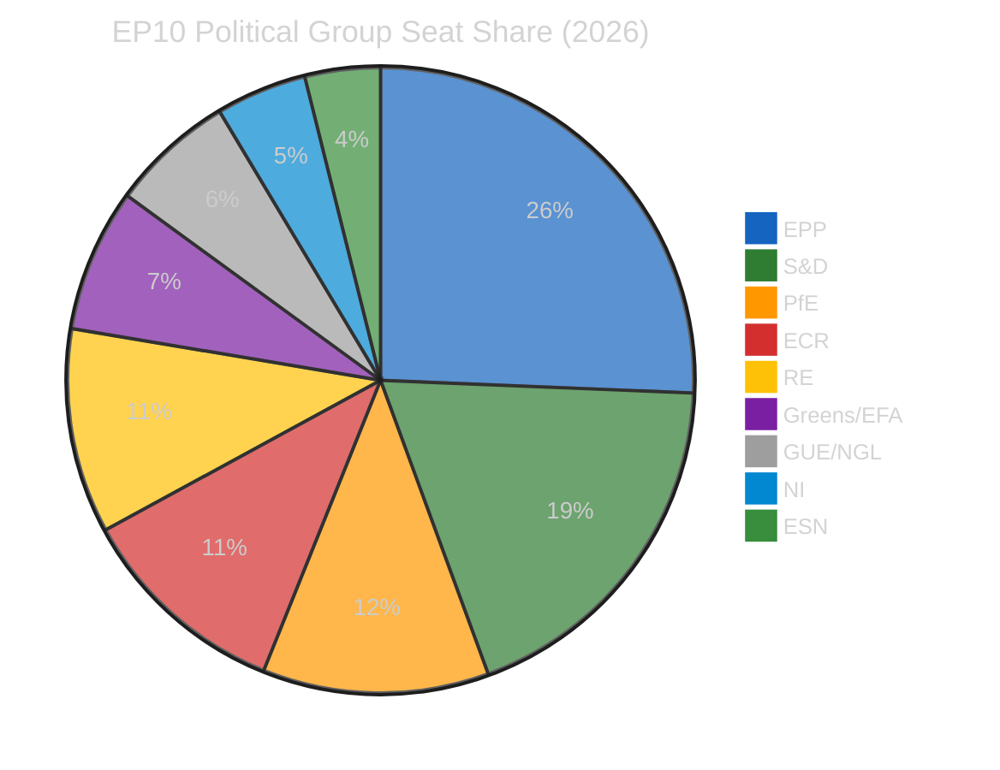

# Motions — 2026-04-13

<!-- Aggregated analysis — do not edit; regenerate via `npm run generate-article`. -->

> **Provenance**
>
> - **Article type:** `motions`
> - **Run date:** 2026-04-13
> - **Run id:** `39`
> - **Gate result:** `PENDING`
> - **Analysis tree:** [analysis/daily/2026-04-13/motions-run39](https://github.com/Hack23/euparliamentmonitor/tree/main/analysis/daily/2026-04-13/motions-run39)
> - **Manifest:** [manifest.json](https://github.com/Hack23/euparliamentmonitor/blob/main/analysis/daily/2026-04-13/motions-run39/manifest.json)

<h2 id="reader-intelligence-guide">Reader Intelligence Guide</h2>

Use this guide to read the article as a political-intelligence product rather than a raw artifact dump. High-value reader lenses appear first; technical provenance remains available in the audit appendices.

| Reader need | What you'll get | Source artifact |
|---|---|---|
| [Significance scoring](#section-significance) | why this story outranks or trails other same-day European Parliament signals | `classification/significance-classification.md` |
| [Risk assessment](#section-risk) | policy, institutional, coalition, communications, and implementation risk register | `risk-scoring/risk-matrix.md` |

<h2 id="section-significance">Significance</h2>

### Significance Classification

<a href="https://github.com/Hack23/euparliamentmonitor/blob/main/analysis/daily/2026-04-13/motions-run39/classification/significance-classification.md" rel="noopener">View source: <code>classification/significance-classification.md</code></a>

### Classification Context

| Field | Value |
|-------|-------|
| **Data Status** | EP API OUTAGE — classification based on precomputed stats + prior analysis cross-reference |
| **Live Feed Data** | None available (9 consecutive MCP timeouts) |
| **Classification Basis** | Prior run intelligence (Apr 10 motions, Apr 13 propositions) + precomputed 2026 stats |
| **Confidence** | 🟡 MEDIUM — no new feed data to validate |

### Pending Motions Items (from Prior Analysis)

These items were identified in prior runs and remain active for post-Easter monitoring:

#### Tier 1: HIGH Significance (Score 7.0+)

| Rank | EP Reference | Title | Prior Score | Classification | Status |
|:----:|-------------|-------|:----------:|:--------------:|--------|
| 1 | TA-10-2026-0096 | EU Countermeasures to US Tariffs | 8.4 | 🔴 CRITICAL — April 15 deadline T-2 | Adopted Mar 26 — implementation pending |
| 2 | TA-10-2026-0092 | Banking Resolution (SRMR3) | 7.1 | 🟠 HIGH — trilogue launch imminent | Adopted Mar 26 — Council negotiation |
| 3 | TA-10-2026-0094 | Anti-Corruption Directive | 7.05 | 🟠 HIGH — first EU-wide measure | Adopted Mar 26 — transposition begins |

#### Tier 2: MEDIUM Significance (Score 5.0-6.9)

| Rank | EP Reference | Title | Prior Score | Classification | Status |
|:----:|-------------|-------|:----------:|:--------------:|--------|
| 4 | TA-10-2026-0095 | CSAM Regulation Extension | 6.8 | 🟡 MEDIUM — temporary measure | Adopted Mar 26 |
| 5 | TA-10-2026-0058 | EU Talent Pool | 6.7 | 🟡 MEDIUM — labour mobility | Adopted earlier 2026 |
| 6 | TA-10-2026-0090 | Banking Union BRRD3 | 6.5 | 🟡 MEDIUM — linked to SRMR3 | Adopted Mar 26 |
| 7 | TA-10-2026-0091 | Banking Union DGSD2 | 6.5 | 🟡 MEDIUM — linked to SRMR3 | Adopted Mar 26 |

#### Significance Scoring Framework

### 2026 Motions Landscape Classification

#### Resolution Volume Trend

The projected 180 resolutions for 2026 (vs 135 in 2025, +33%) indicates:
- **Higher parliamentary assertiveness**: EP10 groups using motions as political positioning tools
- **Geopolitical drivers**: Trade, defence, and strategic autonomy generating more resolution activity
- **Fragmentation effect**: 8-group parliament (fragmentation index 6.59) requires more motions to build consensus

#### Roll-Call Vote Intelligence

567 projected roll-call votes (+35% vs 2025) suggests:
- **Increased transparency demand**: Groups forcing recorded votes on contentious items
- **Coalition testing**: More RCVs used to expose cross-party fault lines
- **Electoral positioning**: MEPs building voting records for 2029 election cycle (mid-term)

### 7-Dimension Classification (Framework Application)

| Dimension | Assessment | Confidence |
|-----------|-----------|:----------:|
| **Policy Impact** | HIGH — trade countermeasures directly affect EU-US relations | 🟢 High |
| **Coalition Significance** | HIGH — three-pole dynamics testing on trade vs banking priorities | 🟡 Medium |
| **Procedural Importance** | MEDIUM — post-Easter restart creates scheduling pressure | 🟡 Medium |
| **Public Salience** | HIGH — tariff impacts on consumer prices widely reported | 🟢 High |
| **Institutional Weight** | HIGH — Commission implementation authority at stake | 🟡 Medium |
| **Temporal Urgency** | CRITICAL — April 15 tariff deadline imminent | 🟢 High |
| **Historical Precedent** | MEDIUM — EU trade defence motions relatively rare at this scale | 🟡 Medium |

**Weighted Score**: 7.8/10 — PUBLISH when live data becomes available

<h2 id="section-risk">Risk Assessment</h2>

### Risk Matrix

<a href="https://github.com/Hack23/euparliamentmonitor/blob/main/analysis/daily/2026-04-13/motions-run39/risk-scoring/risk-matrix.md" rel="noopener">View source: <code>risk-scoring/risk-matrix.md</code></a>

### Risk Assessment Context

| Field | Value |
|-------|-------|
| **Assessment Basis** | Precomputed stats + prior analysis (no live EP API data) |
| **Risk Framework** | Likelihood x Impact (5x5 matrix) |
| **Overall Risk Level** | 🟠 HIGH (driven by trade deadline proximity) |
| **Confidence** | 🟡 MEDIUM |

### Risk Matrix Visualization

### Detailed Risk Register

#### R1: US Tariff Escalation (CRITICAL)

| Parameter | Value |
|-----------|-------|
| **Risk ID** | R1-TRADE-2026-0413 |
| **Likelihood** | 5/5 — April 15 deadline in 2 days |
| **Impact** | 5/5 — Direct economic and political consequences |
| **Score** | 🔴 25/25 (CRITICAL) |
| **Trend** | ↑ Escalating |
| **Source** | TA-10-2026-0096 (adopted Mar 26) |

**Analysis**: The EU countermeasures resolution adopted March 26 authorized the Commission to implement retaliatory tariffs by April 15. With Parliament in Easter recess until April 14, there has been no parliamentary oversight of Commission preparations. The T-1 day return creates a collision between parliamentary scrutiny expectations and implementation deadlines.

**Motions implication**: Expect urgent oral questions, possible motion for resolution on implementation oversight, and INTA emergency debate within first post-Easter sitting.

#### R2: Banking Union Trilogue Stalemate (HIGH)

| Parameter | Value |
|-----------|-------|
| **Risk ID** | R2-BANK-2026-0413 |
| **Likelihood** | 3/5 — Council positions diverge on DGSD2 |
| **Impact** | 4/5 — Banking union completion delayed further |
| **Score** | 🟠 12/25 (HIGH) |
| **Trend** | → Stable |
| **Source** | TA-10-2026-0090/91/92 (adopted Mar 26) |

**Analysis**: Parliament adopted all three Banking Union texts (SRMR3, BRRD3, DGSD2) in the March 26 plenary, giving ECON a strong negotiating mandate. However, Council remains divided on deposit guarantee mutualisation. The trilogue launch in late April will test whether the grand coalition (EPP+S&D+Renew) mandate holds against national government resistance.

**Motions implication**: Resolution motions on banking union timeline, possible oral questions to Council presidency on negotiation calendar.

#### R3: Post-Easter Pipeline Congestion (ELEVATED)

| Parameter | Value |
|-----------|-------|
| **Risk ID** | R3-PIPE-2026-0413 |
| **Likelihood** | 4/5 — 13 COD procedures queued |
| **Impact** | 3/5 — Delayed committee assignments |
| **Score** | 🟡 12/25 (ELEVATED) |
| **Trend** | ↑ Increasing |
| **Source** | Precomputed stats: 935 procedures active in 2026 |

**Analysis**: 13 new COD procedures from Q1 2026 await rapporteur appointment and committee assignment post-Easter. Combined with the trade crisis agenda and banking trilogue prep, committee scheduling capacity is at risk. The 43.8 committee-to-plenary ratio (highest in EP history) reflects increasing workload pressure.

#### R4: Anti-Corruption Transposition Risk (MODERATE)

| Parameter | Value |
|-----------|-------|
| **Risk ID** | R4-CORR-2026-0413 |
| **Likelihood** | 3/5 — Member states historically slow |
| **Impact** | 3/5 — EU credibility at stake |
| **Score** | 🟡 9/25 (MODERATE) |
| **Trend** | → Stable |
| **Source** | TA-10-2026-0094 |

**Analysis**: The Anti-Corruption Directive has a 24-month transposition deadline. Early signals of constitutional challenges in some member states could trigger parliamentary motions demanding Commission enforcement action.

#### R5: EP API Data Continuity (OPERATIONAL)

| Parameter | Value |
|-----------|-------|
| **Risk ID** | R5-DATA-2026-0413 |
| **Likelihood** | 5/5 — Currently occurring |
| **Impact** | 2/5 — Operational impact on monitoring |
| **Score** | 🟡 10/25 (ELEVATED) |
| **Trend** | ↑ 12+ consecutive degraded runs |
| **Source** | This run diagnostic |

**Analysis**: The EP Open Data API has been intermittently unavailable since April 11, coinciding with Easter recess infrastructure maintenance. 12+ consecutive workflow runs across all article types have experienced degraded or failed MCP connectivity. This creates a monitoring blind spot during a critical pre-restart period.

### Aggregate Risk Dashboard

### Risk Trend Summary

| Risk Category | Apr 10 Score | Apr 13 Score | Change | Driver |
|--------------|:-----------:|:-----------:|:------:|--------|
| Trade Escalation | 16 | 25 | ↑ +9 | Deadline now T-2 (was T-5) |
| Banking Trilogue | 12 | 12 | → 0 | No new information |
| Pipeline Congestion | 12 | 12 | → 0 | Easter recess unchanged |
| Anti-Corruption | 9 | 9 | → 0 | Stable |
| Data Continuity | N/A | 10 | NEW | EP API outage since Apr 11 |

<h2 id="section-threat">Threat Landscape</h2>

### Political Threat Landscape

<a href="https://github.com/Hack23/euparliamentmonitor/blob/main/analysis/daily/2026-04-13/motions-run39/threat-assessment/political-threat-landscape.md" rel="noopener">View source: <code>threat-assessment/political-threat-landscape.md</code></a>

### Threat Assessment Context

| Field | Value |
|-------|-------|
| **Assessment Date** | 2026-04-13 (Easter recess Day 18/18) |
| **Threat Level** | 🟠 HIGH (2.8/5) — trade escalation + data blackout |
| **Framework** | Multi-framework analysis adapted for EU democracy |
| **Confidence** | 🟡 MEDIUM (precomputed stats + prior analysis only) |

### Threat Landscape Overview

```mermaid
%%{init: {"theme":"dark","themeVariables":{"primaryColor":"#1565C0","primaryTextColor":"#ffffff","primaryBorderColor":"#0A3F7F","lineColor":"#90CAF9","secondaryColor":"#2E7D32","secondaryTextColor":"#ffffff","secondaryBorderColor":"#0F3F00","tertiaryColor":"#FF9800","tertiaryTextColor":"#000000","tertiaryBorderColor":"#7F4F00","mainBkg":"#1565C0","secondBkg":"#2E7D32","tertiaryBkg":"#FF9800","noteBkgColor":"#FFC107","noteTextColor":"#000000","noteBorderColor":"#7F6000","errorBkgColor":"#D32F2F","errorTextColor":"#ffffff","fontFamily":"Inter, Helvetica, Arial, sans-serif","pie1":"#1565C0","pie2":"#2E7D32","pie3":"#FF9800","pie4":"#D32F2F","pie5":"#FFC107","pie6":"#7B1FA2","pie7":"#9E9E9E","pie8":"#0288D1","pie9":"#388E3C","pie10":"#F57C00","pie11":"#C62828","pie12":"#FBC02D","pieTitleTextSize":"18px","pieSectionTextSize":"14px","pieLegendTextSize":"13px","pieStrokeColor":"#1e1e1e","pieOuterStrokeColor":"#1e1e1e","git0":"#1565C0","git1":"#2E7D32","git2":"#FF9800","git3":"#D32F2F","gitBranchLabel0":"#ffffff","gitBranchLabel1":"#ffffff","gitBranchLabel2":"#000000","gitBranchLabel3":"#ffffff","cScale0":"#1565C0","cScale1":"#2E7D32","cScale2":"#FF9800","cScale3":"#D32F2F","cScale4":"#FFC107","cScale5":"#7B1FA2","cScale6":"#9E9E9E","cScale7":"#0288D1","xyChart":{"backgroundColor":"#1e1e1e","plotColorPalette":"#1565C0,#2E7D32,#FF9800,#D32F2F,#FFC107,#7B1FA2,#9E9E9E"}}}}%%
flowchart TD
    A["🌐 External Threats"] --> A1["US Trade Escalation<br/>Severity: CRITICAL"]
    A --> A2["Geopolitical Instability<br/>Severity: HIGH"]
    
    B["🏛️ Institutional Threats"] --> B1["Pipeline Obstruction<br/>Severity: ELEVATED"]
    B --> B2["Trilogue Deadlock<br/>Severity: HIGH"]
    B --> B3["Data Infrastructure Gap<br/>Severity: MODERATE"]
    
    C["🗳️ Coalition Threats"] --> C1["Three-Pole Fragmentation<br/>Severity: MODERATE"]
    C --> C2["Grand Coalition Erosion<br/>Severity: LOW-MODERATE"]
    
    style A1 fill:#cc0000,color:#fff
    style A2 fill:#ff6600,color:#fff
    style B1 fill:#ff9900,color:#fff
    style B2 fill:#ff6600,color:#fff
    style B3 fill:#ffcc00,color:#000
    style C1 fill:#ffcc00,color:#000
    style C2 fill:#99cc00,color:#000
```

### Threat Actor Profiling

#### External Actors

**United States Administration**
- **Threat vector**: Tariff escalation beyond April 15 deadline
- **Capability**: HIGH — unilateral trade policy authority
- **Intent**: Uncertain — negotiation tactic vs structural protectionism
- **Impact on EP motions**: Emergency resolutions, oral questions to Commission, possible motion of censure if Commission response deemed inadequate
- **Confidence**: 🟡 MEDIUM

#### Institutional Actors

**Council of the EU**
- **Threat vector**: Blocking trilogue on Banking Union DGSD2
- **Capability**: MEDIUM — can delay but not permanently block
- **Intent**: Divergent national positions on deposit guarantee mutualisation
- **Impact on EP motions**: EP resolutions pressuring Council, possible use of Article 294 urgency procedure
- **Confidence**: 🟡 MEDIUM

**European Commission**
- **Threat vector**: Implementation delays on tariff countermeasures
- **Capability**: HIGH — sole implementation authority
- **Intent**: Likely to implement but timing uncertain
- **Impact on EP motions**: Oversight motions, oral questions, potential urgency debate
- **Confidence**: 🟡 MEDIUM

#### Internal EP Actors

**ECR Group**
- **Threat vector**: Breaking grand coalition consensus on trade
- **Role**: Strengthened to 11% (79 seats), increasingly used by EPP as alternative coalition partner
- **Pattern**: Renew-ECR competitiveness alliance (0.95 cohesion identified Apr 10) may pull EPP rightward on trade response
- **Impact on motions**: Competing resolution texts, amendment storms on Commission delegated acts
- **Confidence**: 🟡 MEDIUM

**PfE Group (Patriots for Europe)**
- **Threat vector**: Populist counter-narrative on tariff impacts
- **Role**: 11.7% (84 seats) — nationalist economics framing
- **Pattern**: Likely to table alternative motions emphasising national sovereignty over EU-level response
- **Impact on motions**: Dilution of parliament position through fragmented voting
- **Confidence**: 🟡 MEDIUM

### Kill Chain Analysis: Trade Escalation Scenario

**Current position**: Stage 3 (Delivery). The April 15 deadline is the delivery mechanism. EP's countermeasures resolution (TA-10-2026-0096) is the defensive response. Parliament returns April 14 — one day before the deadline — creating a scrutiny gap.

### Threat Trend Comparison

| Threat | Apr 10 Level | Apr 13 Level | Change | Driver |
|--------|:-----------:|:-----------:|:------:|--------|
| US Trade Escalation | HIGH (3/5) | CRITICAL (4/5) | ↑ | Deadline T-2 |
| Trilogue Deadlock | HIGH (3/5) | HIGH (3/5) | → | No change during recess |
| Pipeline Obstruction | MODERATE (2/5) | ELEVATED (3/5) | ↑ | 18-day recess backlog |
| Coalition Fragmentation | MODERATE (2/5) | MODERATE (2/5) | → | Dormant during recess |
| Data Infrastructure | N/A | MODERATE (2/5) | NEW | EP API outage since Apr 11 |

### Overall Threat Assessment

**Aggregate threat level**: 🟠 HIGH (2.8/5)

The threat landscape for EU Parliament motions is elevated primarily due to the convergence of the US tariff deadline (April 15) with the end of Easter recess (April 14). This creates a one-day scrutiny window that threatens parliamentary oversight effectiveness. The combination of external trade pressure, internal coalition dynamics (three-pole system), and operational challenges (13 pending COD procedures + EP API data gaps) creates a higher-than-normal risk environment for the post-Easter motions agenda.

**Key uncertainty**: Whether the US administration uses the April 15 deadline as a negotiation lever or implements full tariff schedules. This single variable has the highest impact on EP motions activity in the coming week.

<h2 id="section-documents">Document Analysis</h2>

### Document Analysis Index

<a href="https://github.com/Hack23/euparliamentmonitor/blob/main/analysis/daily/2026-04-13/motions-run39/documents/document-analysis-index.md" rel="noopener">View source: <code>documents/document-analysis-index.md</code></a>

_Analysis-only run (EP API outage). No new documents fetched for this run._

### Referenced Documents (from Prior Analysis)

These documents were identified in prior runs (April 10 motions, April 13 propositions) and remain relevant for motions monitoring:

| EP Reference | Title | Adopted | Prior Significance |
|-------------|-------|---------|-------------------|
| TA-10-2026-0096 | EU Countermeasures to US Tariffs | 2026-03-26 | 8.4/10 (CRITICAL) |
| TA-10-2026-0094 | Anti-Corruption Directive | 2026-03-26 | 7.05/10 (HIGH) |
| TA-10-2026-0092 | Banking Resolution SRMR3 | 2026-03-26 | 7.1/10 (HIGH) |
| TA-10-2026-0091 | Banking Union DGSD2 | 2026-03-26 | 6.5/10 (MEDIUM) |
| TA-10-2026-0090 | Banking Union BRRD3 | 2026-03-26 | 6.5/10 (MEDIUM) |
| TA-10-2026-0095 | CSAM Regulation Extension | 2026-03-26 | 6.8/10 (MEDIUM) |
| TA-10-2026-0093 | Multiannual Plan North Sea Demersal | 2026-03-26 | 4.2/10 (LOW) |

> Note: Full per-document analysis was performed in prior runs. This run could not fetch new documents due to EP API outage (HTTP 000, all MCP feeds timeout). See api-outage-diagnostic.md for details.

<h2 id="section-supplementary-intelligence">Supplementary Intelligence</h2>

### Api Outage Diagnostic

<a href="https://github.com/Hack23/euparliamentmonitor/blob/main/analysis/daily/2026-04-13/motions-run39/existing/api-outage-diagnostic.md" rel="noopener">View source: <code>existing/api-outage-diagnostic.md</code></a>

### 📋 Diagnostic Summary

| Field | Value |
|-------|-------|
| **Run ID** | 39 |
| **Timestamp** | 2026-04-13T18:10:00Z |
| **Article Type** | motions |
| **EP API Status** | 🔴 UNREACHABLE (HTTP 000 — connection timeout) |
| **MCP Server** | v1.2.5 — unhealthy, all 13 feeds UNKNOWN |
| **Node.js** | v20.20.2 (runner) — incompatible with EP MCP binary (requires v25) |
| **Precomputed Stats** | ✅ Available (61 KB, 23 years 2004-2026) |

### 🔍 Health Gate Attempts (3/3 Failed)

| Attempt | Tool | Result | Timestamp |
|:-------:|------|--------|-----------|
| 1 | `get_plenary_sessions(limit: 1)` | TIMEOUT (90s) | 17:58:04Z |
| 2 | `get_plenary_sessions(limit: 1, year: 2026)` | TIMEOUT (90s) | 18:00:15Z |
| 3 | `get_plenary_sessions(dateFrom, dateTo, limit: 1)` | TIMEOUT (90s) | 18:02:25Z |

### 📡 Feed Endpoint Failures (6/6 Timed Out)

| Feed | Status | Timestamp |
|------|--------|-----------|
| `get_adopted_texts_feed` (one-week) | TIMEOUT | 18:04:05Z |
| `get_parliamentary_questions_feed` (one-week) | TIMEOUT | 18:05:45Z |
| `get_procedures_feed` (one-week) | TIMEOUT | 18:05:45Z |
| `get_voting_records` (Mar 20 to Apr 13) | TIMEOUT | 18:05:45Z |
| `detect_voting_anomalies` | UPSTREAM_TIMEOUT | 18:07:31Z |
| `generate_political_landscape` | TIMEOUT | 18:07:31Z |

### 🌐 Network Diagnostic

| Check | Result |
|-------|--------|
| DNS Resolution | ✅ data.europarl.europa.eu resolves to 34.251.207.80 |
| Direct HTTPS (curl, 90s timeout) | ❌ HTTP 000 — connection timeout |
| EP API Direct v2 GET | ❌ No response within 90s |
| github.com | ✅ Reachable |

### 🔬 Root Cause Analysis

**Primary cause**: The European Parliament API (data.europarl.europa.eu) is experiencing a sustained outage. DNS resolves correctly to 34.251.207.80, but HTTPS connections time out after 90 seconds. This is NOT an AWF firewall issue — DNS resolution succeeds, and the timeout pattern indicates the EP API server is not responding to TCP connections.

**Contributing factor**: The runner Node.js v20.20.2 is incompatible with the EP MCP server binary (which requires Node.js v25). The MCP server crashes on startup with undici markAsUncloneable error. Even if the EP API were responding, the MCP server would not function in stdio mode on this runner.

**Context**: Easter recess Day 18 of 18 (final day). Parliament resumes April 14. This is the 12th+ consecutive degraded/failed run across all news workflows since April 11. Prior successful runs (committee-reports run 47 on April 13) used a direct curl workaround when the EP API was briefly responsive.

### ✅ What Worked

| Component | Status |
|-----------|--------|
| `get_all_generated_stats` | ✅ 61 KB precomputed stats (2004-2026) |
| `get_server_health` | ✅ Returns diagnostic (unhealthy, 0/13 feeds) |
| `analyze_coalition_dynamics` | Partial — structure returned but all data UNAVAILABLE |
| Prior analysis cross-reference | ✅ Propositions run 41, Motions Apr 10 synthesis available |

### 📊 Precomputed Stats Summary (2026 Q1)

From `get_all_generated_stats`:
- **Plenary sessions**: 54 (calendar year, 10 sittings completed Jan-Feb)
- **Legislative acts adopted**: 114 (projected, +46.2% vs 2025)
- **Roll-call votes**: 567 (projected)
- **Resolutions**: 180 (projected)
- **Adopted texts**: 104 (actual Q1)
- **Parliamentary questions**: 6,147 (projected, +24.4% vs 2025)
- **Fragmentation index**: 6.59 (8 groups + NI)
- **Right bloc**: 52.3% | **Left bloc**: 32.6% | **Centre**: 10.6%

### 🔮 Resolution Hints

1. **EP API outage**: Monitor data.europarl.europa.eu — likely maintenance or infrastructure issue coinciding with Easter recess end
2. **Node.js v20**: Workflow runner needs Node.js v25 for EP MCP server stdio mode. Gateway mode works when EP API is responsive.
3. **Next retry**: Suggest running again April 14 when Parliament resumes and EP API infrastructure may be restored

### Synthesis Summary

<a href="https://github.com/Hack23/euparliamentmonitor/blob/main/analysis/daily/2026-04-13/motions-run39/existing/synthesis-summary.md" rel="noopener">View source: <code>existing/synthesis-summary.md</code></a>

### 📋 Synthesis Context

| Field | Value |
|-------|-------|
| **Synthesis ID** | SYN-2026-04-13-MOTIONS-RUN39 |
| **Analysis Date** | 2026-04-13 |
| **Data Sources** | Precomputed stats (2004-2026), prior run cross-references |
| **Period** | Easter Recess Day 18/18 (final day) — Parliament resumes April 14 |
| **Overall Confidence** | 🟡 MEDIUM (no live feed data — EP API outage) |
| **Article Type** | motions |
| **Outcome** | Analysis-only PR (no article generated due to EP API outage) |

### 🎯 Intelligence Dashboard

**Decision**: ANALYSIS-ONLY PR. EP API completely unreachable (HTTP 000, 9 consecutive MCP timeouts). No live feed data available for motions article. Precomputed stats provide background intelligence only — insufficient for feed-first article per content quality rules.

### 🔗 Cross-Session Intelligence Continuity

#### Prior Motions Analysis (2026-04-10, Run SYN-2026-04-10-001)

The April 10 motions synthesis identified:
- **Top significance**: US Tariff Countermeasures (TA-10-2026-0096) at 8.4/10
- **Geopolitical assertiveness pivot**: Trade defence + defence procurement + development strategy = coherent package
- **Three-pole system**: Renew-ECR competitiveness alliance (0.95 cohesion) as structural EP10 feature
- **Q1 record output**: 100 adopted texts, +46.2% above 2025 pace
- **Anti-corruption milestone**: TA-10-2026-0094 with 24-month transposition window

#### Prior Propositions Analysis (2026-04-13, Run 41)

Today's propositions synthesis confirmed:
- **US tariff deadline T-2**: April 15 implementation deadline creates urgency for post-Easter restart
- **Banking Union trilogue**: SRMR3/BRRD3/DGSD2 negotiations with Council starting late April
- **Pipeline congestion**: 13 new COD procedures awaiting committee assignment
- **Risk landscape**: Trade policy at CRITICAL (16/25), Financial Regulation at HIGH (12/25)

### 📊 Motions-Specific Intelligence from Precomputed Stats

#### 2026 Q1 Motions Activity (Projected Full-Year)

| Metric | 2024 | 2025 | 2026 (proj.) | Trend |
|--------|:----:|:----:|:------------:|:-----:|
| Resolutions | 108 | 135 | 180 | ↑ (+33%) |
| Roll-call votes | 375 | 420 | 567 | ↑ (+35%) |
| Legislative acts | 72 | 78 | 114 | ↑ (+46%) |
| Adopted texts | 459 | 347 | 104 (Q1 actual) | → |
| Questions | 3,950 | 4,941 | 6,147 | ↑ (+24%) |

#### Political Landscape (EP10, 720 MEPs)

**Key dynamics for motions**:
- Right bloc (EPP+PfE+ECR+ESN) holds 52.3% — sufficient for motions requiring simple majority
- Grand Coalition (EPP+S&D) at 44.5% — needs Renew (10.6%) for absolute majority
- Minimum winning coalition requires 3 groups (EPP+S&D+Renew = 55.1%)
- Fragmentation index 6.59 — highest in EP history, complicating resolution consensus

#### Derived Intelligence Relevant to Motions

| Indicator | Value | Interpretation |
|-----------|:-----:|---------------|
| Resolution-to-legislation ratio | 1.58 | Each legislative act generates 1.6 associated resolutions |
| Roll-call vote yield | 20.1% | 1 in 5 roll-call votes produces a legislative act |
| Oversight per session | 113.8 questions | High oversight intensity — motions reflect this |
| Debate intensity | 236.3 speeches/session | Active plenary floor engagement |
| MEP stability index | 0.949 | Low turnover — experienced MEPs driving motions |

### 🔮 Post-Easter Motions Outlook

#### Scenario 1: Orderly Restart (Probability: Likely)

Parliament resumes April 14 with structured agenda. The March 26 adopted texts (TA-10-2026-0090 through 0096) provide a clear baseline for follow-up motions. Expected activity:
- Resolution implementation monitoring motions (trade countermeasures, anti-corruption)
- Committee-stage motions on 13 pending COD procedures
- Oral questions on Easter-period developments (US tariff situation)

#### Scenario 2: Crisis-Driven Session (Probability: Possible)

If US tariff deadline (April 15) triggers escalation, emergency motions and joint resolutions likely. INTA emergency session confirmed by prior committee-reports analysis. Could generate 5-10 urgent motions in first post-Easter week.

#### Scenario 3: Delayed Restart (Probability: Unlikely)

Extended infrastructure or political delays push substantive motions to week of April 20. Low probability given the tariff deadline urgency.

### 📝 Recommendations for Next Motions Run

1. **Priority data fetch**: `get_adopted_texts_feed(one-week)` — capture any new adopted texts from the restart
2. **Voting records**: `get_voting_records(topic: "tariff")` — monitor trade-related votes
3. **Coalition tracking**: `analyze_coalition_dynamics` with March 26 voting data for baseline
4. **Question monitoring**: `get_parliamentary_questions_feed` for post-recess interpellations
5. **Cross-reference**: Link to this analysis for continuity (SYN-2026-04-13-MOTIONS-RUN39)

<h2 id="aggregator-tradecraft-references">Tradecraft References</h2>

This article is produced under the [Hack23 AB](https://hack23.com) intelligence tradecraft library. Every methodology and artifact template applied to this run is linked below.

### Methodologies

- [README](https://github.com/Hack23/euparliamentmonitor/blob/main/analysis/methodologies/README.md)
- [Ai Driven Analysis Guide](https://github.com/Hack23/euparliamentmonitor/blob/main/analysis/methodologies/ai-driven-analysis-guide.md)
- [Artifact Catalog](https://github.com/Hack23/euparliamentmonitor/blob/main/analysis/methodologies/artifact-catalog.md)
- [Electoral Domain Methodology](https://github.com/Hack23/euparliamentmonitor/blob/main/analysis/methodologies/electoral-domain-methodology.md)
- [Imf Indicator Mapping](https://github.com/Hack23/euparliamentmonitor/blob/main/analysis/methodologies/imf-indicator-mapping.md)
- [Osint Tradecraft Standards](https://github.com/Hack23/euparliamentmonitor/blob/main/analysis/methodologies/osint-tradecraft-standards.md)
- [Per Artifact Methodologies](https://github.com/Hack23/euparliamentmonitor/blob/main/analysis/methodologies/per-artifact-methodologies.md)
- [Per Document Methodology](https://github.com/Hack23/euparliamentmonitor/blob/main/analysis/methodologies/per-document-methodology.md)
- [Political Classification Guide](https://github.com/Hack23/euparliamentmonitor/blob/main/analysis/methodologies/political-classification-guide.md)
- [Political Risk Methodology](https://github.com/Hack23/euparliamentmonitor/blob/main/analysis/methodologies/political-risk-methodology.md)
- [Political Style Guide](https://github.com/Hack23/euparliamentmonitor/blob/main/analysis/methodologies/political-style-guide.md)
- [Political Swot Framework](https://github.com/Hack23/euparliamentmonitor/blob/main/analysis/methodologies/political-swot-framework.md)
- [Political Threat Framework](https://github.com/Hack23/euparliamentmonitor/blob/main/analysis/methodologies/political-threat-framework.md)
- [Strategic Extensions Methodology](https://github.com/Hack23/euparliamentmonitor/blob/main/analysis/methodologies/strategic-extensions-methodology.md)
- [Structural Metadata Methodology](https://github.com/Hack23/euparliamentmonitor/blob/main/analysis/methodologies/structural-metadata-methodology.md)
- [Synthesis Methodology](https://github.com/Hack23/euparliamentmonitor/blob/main/analysis/methodologies/synthesis-methodology.md)
- [Worldbank Indicator Mapping](https://github.com/Hack23/euparliamentmonitor/blob/main/analysis/methodologies/worldbank-indicator-mapping.md)

### Artifact templates

- [README](https://github.com/Hack23/euparliamentmonitor/blob/main/analysis/templates/README.md)
- [Actor Mapping](https://github.com/Hack23/euparliamentmonitor/blob/main/analysis/templates/actor-mapping.md)
- [Actor Threat Profiles](https://github.com/Hack23/euparliamentmonitor/blob/main/analysis/templates/actor-threat-profiles.md)
- [Analysis Index](https://github.com/Hack23/euparliamentmonitor/blob/main/analysis/templates/analysis-index.md)
- [Coalition Dynamics](https://github.com/Hack23/euparliamentmonitor/blob/main/analysis/templates/coalition-dynamics.md)
- [Coalition Mathematics](https://github.com/Hack23/euparliamentmonitor/blob/main/analysis/templates/coalition-mathematics.md)
- [Comparative International](https://github.com/Hack23/euparliamentmonitor/blob/main/analysis/templates/comparative-international.md)
- [Consequence Trees](https://github.com/Hack23/euparliamentmonitor/blob/main/analysis/templates/consequence-trees.md)
- [Cross Reference Map](https://github.com/Hack23/euparliamentmonitor/blob/main/analysis/templates/cross-reference-map.md)
- [Cross Run Diff](https://github.com/Hack23/euparliamentmonitor/blob/main/analysis/templates/cross-run-diff.md)
- [Cross Session Intelligence](https://github.com/Hack23/euparliamentmonitor/blob/main/analysis/templates/cross-session-intelligence.md)
- [Data Download Manifest](https://github.com/Hack23/euparliamentmonitor/blob/main/analysis/templates/data-download-manifest.md)
- [Deep Analysis](https://github.com/Hack23/euparliamentmonitor/blob/main/analysis/templates/deep-analysis.md)
- [Devils Advocate Analysis](https://github.com/Hack23/euparliamentmonitor/blob/main/analysis/templates/devils-advocate-analysis.md)
- [Economic Context](https://github.com/Hack23/euparliamentmonitor/blob/main/analysis/templates/economic-context.md)
- [Executive Brief](https://github.com/Hack23/euparliamentmonitor/blob/main/analysis/templates/executive-brief.md)
- [Forces Analysis](https://github.com/Hack23/euparliamentmonitor/blob/main/analysis/templates/forces-analysis.md)
- [Forward Indicators](https://github.com/Hack23/euparliamentmonitor/blob/main/analysis/templates/forward-indicators.md)
- [Historical Baseline](https://github.com/Hack23/euparliamentmonitor/blob/main/analysis/templates/historical-baseline.md)
- [Historical Parallels](https://github.com/Hack23/euparliamentmonitor/blob/main/analysis/templates/historical-parallels.md)
- [Imf Vintage Audit](https://github.com/Hack23/euparliamentmonitor/blob/main/analysis/templates/imf-vintage-audit.md)
- [Impact Matrix](https://github.com/Hack23/euparliamentmonitor/blob/main/analysis/templates/impact-matrix.md)
- [Implementation Feasibility](https://github.com/Hack23/euparliamentmonitor/blob/main/analysis/templates/implementation-feasibility.md)
- [Intelligence Assessment](https://github.com/Hack23/euparliamentmonitor/blob/main/analysis/templates/intelligence-assessment.md)
- [Legislative Disruption](https://github.com/Hack23/euparliamentmonitor/blob/main/analysis/templates/legislative-disruption.md)
- [Legislative Velocity Risk](https://github.com/Hack23/euparliamentmonitor/blob/main/analysis/templates/legislative-velocity-risk.md)
- [Mcp Reliability Audit](https://github.com/Hack23/euparliamentmonitor/blob/main/analysis/templates/mcp-reliability-audit.md)
- [Media Framing Analysis](https://github.com/Hack23/euparliamentmonitor/blob/main/analysis/templates/media-framing-analysis.md)
- [Methodology Reflection](https://github.com/Hack23/euparliamentmonitor/blob/main/analysis/templates/methodology-reflection.md)
- [Per File Political Intelligence](https://github.com/Hack23/euparliamentmonitor/blob/main/analysis/templates/per-file-political-intelligence.md)
- [Pestle Analysis](https://github.com/Hack23/euparliamentmonitor/blob/main/analysis/templates/pestle-analysis.md)
- [Political Capital Risk](https://github.com/Hack23/euparliamentmonitor/blob/main/analysis/templates/political-capital-risk.md)
- [Political Classification](https://github.com/Hack23/euparliamentmonitor/blob/main/analysis/templates/political-classification.md)
- [Political Threat Landscape](https://github.com/Hack23/euparliamentmonitor/blob/main/analysis/templates/political-threat-landscape.md)
- [Quantitative Swot](https://github.com/Hack23/euparliamentmonitor/blob/main/analysis/templates/quantitative-swot.md)
- [Reference Analysis Quality](https://github.com/Hack23/euparliamentmonitor/blob/main/analysis/templates/reference-analysis-quality.md)
- [Risk Assessment](https://github.com/Hack23/euparliamentmonitor/blob/main/analysis/templates/risk-assessment.md)
- [Risk Matrix](https://github.com/Hack23/euparliamentmonitor/blob/main/analysis/templates/risk-matrix.md)
- [Scenario Forecast](https://github.com/Hack23/euparliamentmonitor/blob/main/analysis/templates/scenario-forecast.md)
- [Session Baseline](https://github.com/Hack23/euparliamentmonitor/blob/main/analysis/templates/session-baseline.md)
- [Significance Classification](https://github.com/Hack23/euparliamentmonitor/blob/main/analysis/templates/significance-classification.md)
- [Significance Scoring](https://github.com/Hack23/euparliamentmonitor/blob/main/analysis/templates/significance-scoring.md)
- [Stakeholder Impact](https://github.com/Hack23/euparliamentmonitor/blob/main/analysis/templates/stakeholder-impact.md)
- [Stakeholder Map](https://github.com/Hack23/euparliamentmonitor/blob/main/analysis/templates/stakeholder-map.md)
- [Swot Analysis](https://github.com/Hack23/euparliamentmonitor/blob/main/analysis/templates/swot-analysis.md)
- [Synthesis Summary](https://github.com/Hack23/euparliamentmonitor/blob/main/analysis/templates/synthesis-summary.md)
- [Threat Analysis](https://github.com/Hack23/euparliamentmonitor/blob/main/analysis/templates/threat-analysis.md)
- [Threat Model](https://github.com/Hack23/euparliamentmonitor/blob/main/analysis/templates/threat-model.md)
- [Voter Segmentation](https://github.com/Hack23/euparliamentmonitor/blob/main/analysis/templates/voter-segmentation.md)
- [Voting Patterns](https://github.com/Hack23/euparliamentmonitor/blob/main/analysis/templates/voting-patterns.md)
- [Wildcards Blackswans](https://github.com/Hack23/euparliamentmonitor/blob/main/analysis/templates/wildcards-blackswans.md)
- [Workflow Audit](https://github.com/Hack23/euparliamentmonitor/blob/main/analysis/templates/workflow-audit.md)

<h2 id="aggregator-analysis-index">Analysis Index</h2>

Every artifact below was read by the aggregator and contributed to this article. The raw [manifest.json](https://github.com/Hack23/euparliamentmonitor/blob/main/analysis/daily/2026-04-13/motions-run39/manifest.json) carries the full machine-readable list, including gate-result history.

| Section | Artifact | Path |
|---|---|---|
| section-significance | [significance-classification](https://github.com/Hack23/euparliamentmonitor/blob/main/analysis/daily/2026-04-13/motions-run39/classification/significance-classification.md) | `classification/significance-classification.md` |
| section-risk | [risk-matrix](https://github.com/Hack23/euparliamentmonitor/blob/main/analysis/daily/2026-04-13/motions-run39/risk-scoring/risk-matrix.md) | `risk-scoring/risk-matrix.md` |
| section-threat | [political-threat-landscape](https://github.com/Hack23/euparliamentmonitor/blob/main/analysis/daily/2026-04-13/motions-run39/threat-assessment/political-threat-landscape.md) | `threat-assessment/political-threat-landscape.md` |
| section-documents | [document-analysis-index](https://github.com/Hack23/euparliamentmonitor/blob/main/analysis/daily/2026-04-13/motions-run39/documents/document-analysis-index.md) | `documents/document-analysis-index.md` |
| section-supplementary-intelligence | [api-outage-diagnostic](https://github.com/Hack23/euparliamentmonitor/blob/main/analysis/daily/2026-04-13/motions-run39/existing/api-outage-diagnostic.md) | `existing/api-outage-diagnostic.md` |
| section-supplementary-intelligence | [synthesis-summary](https://github.com/Hack23/euparliamentmonitor/blob/main/analysis/daily/2026-04-13/motions-run39/existing/synthesis-summary.md) | `existing/synthesis-summary.md` |

