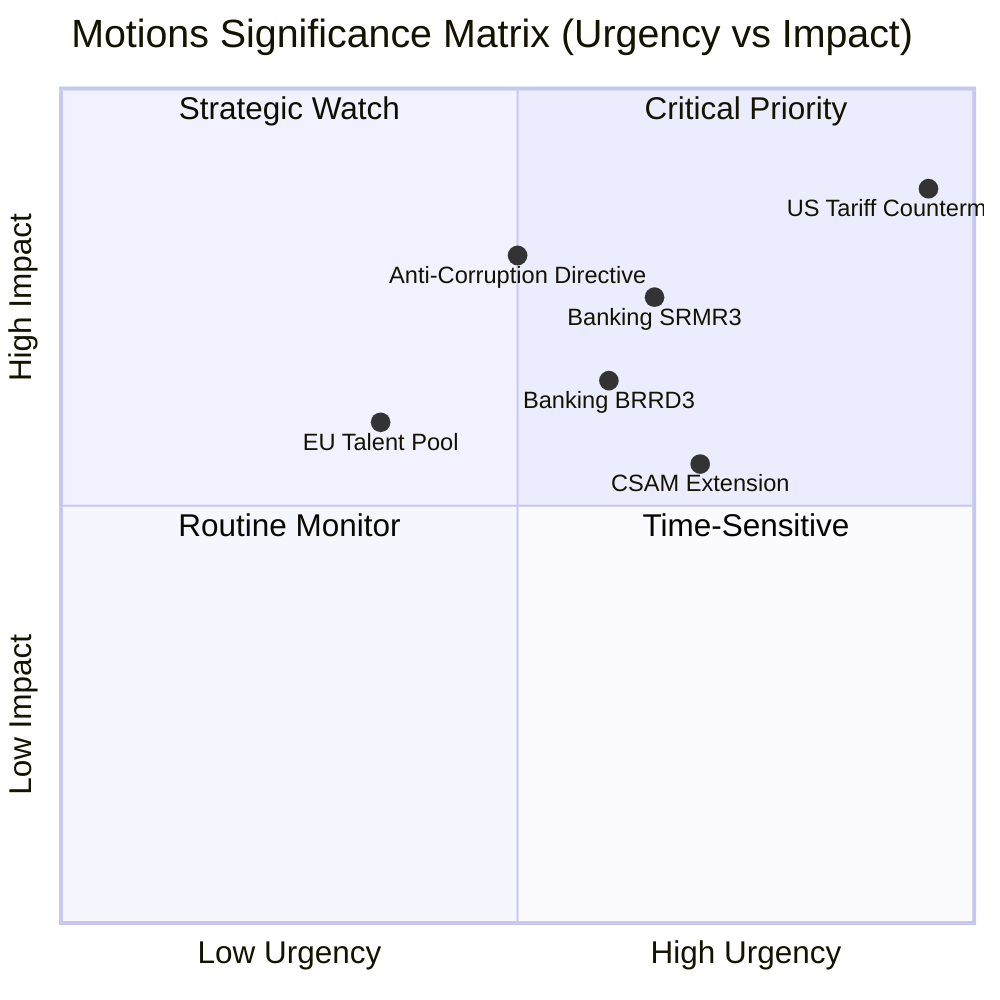

# 📊 Significance Classification — Motions (2026-04-13, Run 39)

## Classification Context

| Field | Value |
|-------|-------|
| **Data Status** | EP API OUTAGE — classification based on precomputed stats + prior analysis cross-reference |
| **Live Feed Data** | None available (9 consecutive MCP timeouts) |
| **Classification Basis** | Prior run intelligence (Apr 10 motions, Apr 13 propositions) + precomputed 2026 stats |
| **Confidence** | 🟡 MEDIUM — no new feed data to validate |

## Pending Motions Items (from Prior Analysis)

These items were identified in prior runs and remain active for post-Easter monitoring:

### Tier 1: HIGH Significance (Score 7.0+)

| Rank | EP Reference | Title | Prior Score | Classification | Status |
|:----:|-------------|-------|:----------:|:--------------:|--------|
| 1 | TA-10-2026-0096 | EU Countermeasures to US Tariffs | 8.4 | 🔴 CRITICAL — April 15 deadline T-2 | Adopted Mar 26 — implementation pending |
| 2 | TA-10-2026-0092 | Banking Resolution (SRMR3) | 7.1 | 🟠 HIGH — trilogue launch imminent | Adopted Mar 26 — Council negotiation |
| 3 | TA-10-2026-0094 | Anti-Corruption Directive | 7.05 | 🟠 HIGH — first EU-wide measure | Adopted Mar 26 — transposition begins |

### Tier 2: MEDIUM Significance (Score 5.0-6.9)

| Rank | EP Reference | Title | Prior Score | Classification | Status |
|:----:|-------------|-------|:----------:|:--------------:|--------|
| 4 | TA-10-2026-0095 | CSAM Regulation Extension | 6.8 | 🟡 MEDIUM — temporary measure | Adopted Mar 26 |
| 5 | TA-10-2026-0058 | EU Talent Pool | 6.7 | 🟡 MEDIUM — labour mobility | Adopted earlier 2026 |
| 6 | TA-10-2026-0090 | Banking Union BRRD3 | 6.5 | 🟡 MEDIUM — linked to SRMR3 | Adopted Mar 26 |
| 7 | TA-10-2026-0091 | Banking Union DGSD2 | 6.5 | 🟡 MEDIUM — linked to SRMR3 | Adopted Mar 26 |

### Significance Scoring Framework

## 2026 Motions Landscape Classification

### Resolution Volume Trend

The projected 180 resolutions for 2026 (vs 135 in 2025, +33%) indicates:
- **Higher parliamentary assertiveness**: EP10 groups using motions as political positioning tools
- **Geopolitical drivers**: Trade, defence, and strategic autonomy generating more resolution activity
- **Fragmentation effect**: 8-group parliament (fragmentation index 6.59) requires more motions to build consensus

### Roll-Call Vote Intelligence

567 projected roll-call votes (+35% vs 2025) suggests:
- **Increased transparency demand**: Groups forcing recorded votes on contentious items
- **Coalition testing**: More RCVs used to expose cross-party fault lines
- **Electoral positioning**: MEPs building voting records for 2029 election cycle (mid-term)

## 7-Dimension Classification (Framework Application)

| Dimension | Assessment | Confidence |
|-----------|-----------|:----------:|
| **Policy Impact** | HIGH — trade countermeasures directly affect EU-US relations | 🟢 High |
| **Coalition Significance** | HIGH — three-pole dynamics testing on trade vs banking priorities | 🟡 Medium |
| **Procedural Importance** | MEDIUM — post-Easter restart creates scheduling pressure | 🟡 Medium |
| **Public Salience** | HIGH — tariff impacts on consumer prices widely reported | 🟢 High |
| **Institutional Weight** | HIGH — Commission implementation authority at stake | 🟡 Medium |
| **Temporal Urgency** | CRITICAL — April 15 tariff deadline imminent | 🟢 High |
| **Historical Precedent** | MEDIUM — EU trade defence motions relatively rare at this scale | 🟡 Medium |

**Weighted Score**: 7.8/10 — PUBLISH when live data becomes available
